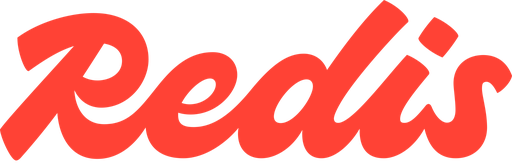
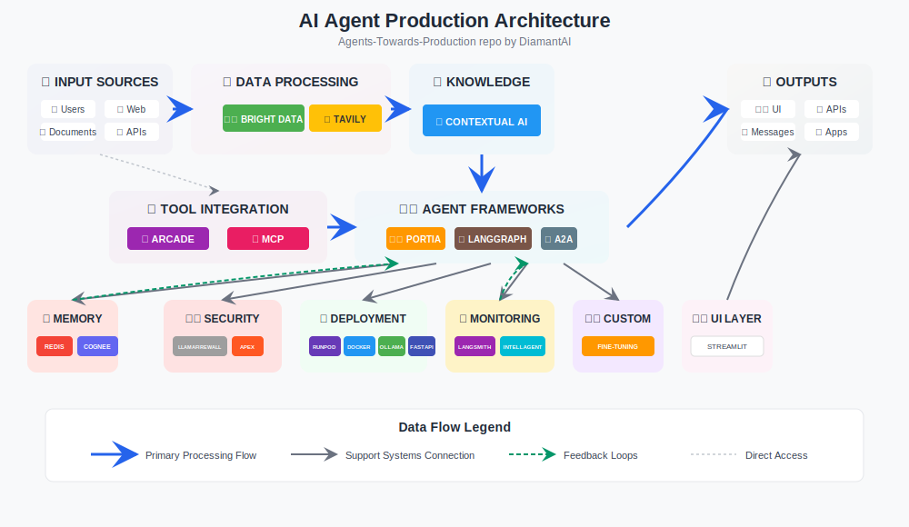

<div align="center">

# Agents Towards Production

### _The open-source playbook for turning AI agents into real-world products._

**Agents Towards Production is your go‑to resource for building production‑ready GenAI agents that scale from prototype to enterprise.** Tutorials cover stateful workflows, vector memory, real‑time web search APIs, Docker deployment, FastAPI endpoints, security guardrails, GPU scaling, browser automation, fine‑tuning, multi‑agent coordination, observability, evaluation, and UI development.

### ⭐ **If you find value in this project, PLEASE STAR IT to help others discover these tutorials!** 

<!-- SEO Keywords: generative ai agents, production deployment, langgraph, langchain, rag, retrieval augmented generation, memory, observability, guardrails, gpu deployment, orchestration, multi agent, prompt engineering, tutorials, guide -->

[](https://www.linkedin.com/in/nir-diamant-759323134/)
[](https://twitter.com/NirDiamantAI)
[](https://discord.gg/cA6Aa4uyDX)
[](https://github.com/sponsors/NirDiamant)

</div>

---

<div align="center">

## 💎 Tutorial Sponsors

<p align="center"><em>
Companies that have contributed step-by-step tutorials to this repository.<br>
Click a logo to open the tutorial. Use Ctrl‑/⌘‑click to keep this page open.
</em></p>

<!-- ─────────── 1st row – 4 sponsors ─────────── -->
<table align="center" cellpadding="20"
       style="table-layout:fixed; width:100%; border-collapse:collapse;">
<tr align="center" valign="top">

  <!-- LangChain -->
  <td width="200" valign="bottom">
    <a href="tutorials/LangGraph-agent" title="Open LangChain tutorial">
      
    </a><br>
    <sub><span style="white-space:nowrap;">Agent Framework &amp; Workflows</span><br>
      <a href="https://langchain.com">
        
      </a>
    </sub>
  </td>

  <!-- Redis -->
  <td width="200" valign="bottom">
    <a href="tutorials/agent-memory-with-redis" title="Open Redis tutorial">
      
    </a><br>
    <sub><span style="white-space:nowrap;">Memory &amp; Vector Database</span><br>
      <a href="https://redis.io/try-free/?utm_source=nir&utm_medium=cpa&utm_campaign=2025-05-ai_in_production-influencer-nir&utm_content=sd-software_download-7013z000001WaRY">
        
      </a>
    </sub>
  </td>

  <!-- Contextual AI -->
  <td width="200" valign="bottom">
    <a href="tutorials/agent-RAG-with-Contextual" title="Open Contextual AI tutorial">
      <picture>
        <source media="(prefers-color-scheme: dark)"
                srcset="assets/repos_images/sponsors_logos/trimmed_padded/trimmed_padded_contextual_white.png">
        
      </picture>
    </a><br>
    <sub><span style="white-space:nowrap;">RAG &amp; Knowledge Management</span><br>
      <a href="https://app.contextual.ai/?utm_campaign=agents-towards-production&utm_source=diamantai&utm_medium=github&utm_content=notebook">
        
      </a>
    </sub>
  </td>

  <!-- Bright Data -->
  <td width="200" valign="bottom">
    <a href="tutorials/agent-with-brightdata" title="Open Bright Data tutorial">
      
    </a><br>
    <sub><span style="white-space:nowrap;">Web Data Platform</span><br>
      <a href="https://brightdata.com/ai?utm_source=brand&utm_campaign=brnd-mkt_github_nirdiamant_logo">
        
      </a>
    </sub>
  </td>
  
  
</tr>
</table>

<!-- ─────────── 2nd row – 4 sponsors ─────────── -->
<table align="center" cellpadding="20"
       style="table-layout:fixed; width:100%; margin-top:16px; border-collapse:collapse;">
<tr align="center" valign="top">

  <!-- Tavily -->
  <td width="200" valign="bottom">
    <a href="tutorials/agent-with-tavily-web-access" title="Open Tavily tutorial">
      
    </a><br>
    <sub><span style="white-space:nowrap;">Real‑time Web Search API</span><br>
      <a href="https://app.tavily.com/home/?utm_source=github&utm_medium=referral&utm_campaign=nir_diamant">
        
      </a>
    </sub>
  </td>

  <!-- Arcade -->
  <td width="200" valign="bottom">
    <a href="tutorials/arcade-secure-tool-calling" title="Open Arcade tutorial">
      <picture>
        <source media="(prefers-color-scheme: dark)"
                srcset="assets/repos_images/sponsors_logos/trimmed_padded/trimmed_padded_arcade_white_tight.png">
        
      </picture>
    </a><br>
    <sub><span style="white-space:nowrap;">Secure Tool Calling</span><br>
      <a href="https://api.arcade.dev/signup?utm_source=github&utm_medium=notebook&utm_campaign=nir_diamant&utm_content=tutorial">
        
      </a>
    </sub>
  </td>

</tr>
</table>

<!-- ─────────── 3rd row – 3 sponsors ─────────── -->
<table align="center" cellpadding="20"
       style="table-layout:fixed; width:100%; margin-top:16px; border-collapse:collapse;">
<tr align="center" valign="top">

  <!-- Mem0 -->
  <td width="200" valign="bottom">
    <a href="tutorials/agent-memory-with-mem0" title="Open Mem0 tutorial">
      <picture>
        <source media="(prefers-color-scheme: dark)"
                srcset="assets/repos_images/sponsors_logos/trimmed_padded/Mem0 Word Logo.png">
        
      </picture>
    </a><br>
    <sub><span style="white-space:nowrap;">Self-Improving AI Memory</span><br>
      <a href="https://mem0.dev/github/nir">
        
      </a>
    </sub>
  </td>

  <!-- RunPod -->
  <td width="200" valign="bottom">
    <a href="tutorials/runpod-gpu-deploy" title="Open RunPod tutorial">
      
    </a><br>
    <sub><span style="white-space:nowrap;">GPU Cloud Computing</span><br>
      <a href="https://get.runpod.io/nirdiamant">
        
      </a>
    </sub>
  </td>

</tr>
</table>

## 💎 General Sponsors

<p align="center"><em>
Companies that support this project through partnerships and resources.<br>
Click a logo to visit their website.
</em></p>

<!-- ─────────── General sponsors ─────────── -->
<table align="center" cellpadding="20"
       style="table-layout:fixed; width:100%; border-collapse:collapse;">
<tr align="center" valign="top">

  <!-- CodeRabbit -->
  <td width="200" valign="bottom">
    <a href="https://coderabbit.link/nir" title="Visit CodeRabbit">
      <picture>
        <source media="(prefers-color-scheme: dark)"
                srcset="assets/repos_images/sponsors_logos/trimmed_padded/coderabbit_Dark_Type_Mark.png">
        
      </picture>
    </a><br>
    <sub><span style="white-space:nowrap;">AI Code Review</span><br>
      <a href="https://coderabbit.link/nir">
        
      </a>
    </sub>
  </td>

</table>

<div align="center">

### 💎 Become a Sponsor

**Get in touch:**

[](https://www.diamant-ai.com/)
[](https://www.linkedin.com/in/nir-diamant-759323134/)

</div>

</div>


---

<div align="center">

## 📫 Stay Updated!

<table>
<tr>
<td align="center" style="padding:15px;background-color:#f8f9fa;border-right:1px solid #eaecef">🚀<br/><b>Cutting-edge<br/>Updates</b></td>
<td align="center" style="padding:15px;background-color:#f8f9fa;border-right:1px solid #eaecef">💡<br/><b>Expert<br/>Insights</b></td>
<td align="center" style="padding:15px;background-color:#f8f9fa">🎯<br/><b>Top 0.1%<b>Content</b></td>
</tr>
</table>

[](https://diamantai.substack.com/?r=336pe4&utm_campaign=pub-share-checklist)

_Join over 25,000 of AI enthusiasts getting unique cutting-edge insights and free tutorials!_  
**_Plus, subscribers get exclusive early access and special 33% discounts to my book and upcoming courses!_**

[](https://diamantai.substack.com/?r=336pe4&utm_campaign=pub-share-checklist)

</div>

---

<div align="center">

## 💬 Join Our Community

Stay connected with the latest in GenAI and agent development:

### r/EducationalAI

[](https://www.reddit.com/r/EducationalAI/)

_Join our growing community discussing cutting-edge AI research, agent development, and production insights!_

</div>

---

## ✨ Introduction
**Agents Towards Production** is your hands-on guide to every building block of a GenAI agent stack.  
All knowledge is delivered through runnable tutorials covering orchestration, memory, observability, deployment, security, and more. Each tutorial lives in its own folder with ready-to-run notebooks or code files, so you can move from concept to working agent in minutes.

---

## 🏗️ AI Agent Architecture

<div align="center">



*This diagram shows the flow of building a production-level agent. The tutorials in this repository cover each of these components step-by-step.*

</div>

---

## 📚 Tutorials

### 🔌 Tool Integration

<table width="100%">
  <tr style="background-color:#f8f9fa">
    <th width="30%">Tutorial</th>
    <th width="50%">Description</th>
    <th width="20%">View</th>
  </tr>
  <tr>
    <td>Secure Tool Calling (Arcade) </td>
    <td>Enable agents to securely call external tools (Gmail, Slack, Notion) with OAuth2 authentication and human-in-the-loop safety controls. Learn production-ready tool integration with user isolation and approval workflows.</td>
    <td align="center">
      <a href="tutorials/arcade-secure-tool-calling"></a>
    </td>
  </tr>
</table>

### 📊 Data Processing

<table width="100%">
  <tr style="background-color:#f8f9fa">
    <th width="30%">Tutorial</th>
    <th width="50%">Description</th>
    <th width="20%">View</th>
  </tr>
  <tr>
    <td>Web Data Collection for AI Agents (Bright Data) </td>
    <td>Build agents that collect and process web data at scale using enterprise-grade scraping infrastructure. Learn to integrate proxy networks, handle CAPTCHAs, and extract structured data from complex websites.</td>
    <td align="center">
      <a href="https://github.com/NirDiamant/agents-towards-production/tree/main/tutorials/agent-with-brightdata"></a>
    </td>
  </tr>
  <tr>
    <td>Real-Time Web Data Integration for Agents (Tavily)</td>
    <td>Enable agents to access, search, and extract real-time web data. Build workflows that combine live web information with private knowledge for research, monitoring, and up-to-date recommendations.</td>
    <td align="center">
      <a href="https://github.com/NirDiamant/agents-towards-production/tree/main/tutorials/agent-with-tavily-web-access"></a>
    </td>
  </tr>
</table>

### 🔍 RAG & Knowledge Management

<table width="100%">
  <tr style="background-color:#f8f9fa">
    <th width="30%">Tutorial</th>
    <th width="50%">Description</th>
    <th width="20%">View</th>
  </tr>
  <tr>
    <td>Production-Ready RAG Agents with Contextual AI (Contextual AI)</td>
    <td>Build enterprise-grade RAG systems in 15 minutes using Contextual AI's managed platform. Learn document processing, intelligent indexing, agent deployment, and automated evaluation with LMUnit testing framework for financial document analysis.</td>
    <td align="center">
      <a href="tutorials/agent-RAG-with-Contextual"></a>
    </td>
  </tr>
</table>

### 🧠 Memory

<table width="100%">
  <tr style="background-color:#f8f9fa">
    <th width="30%">Tutorial</th>
    <th width="50%">Description</th>
    <th width="20%">View</th>
  </tr>
  <tr>
    <td>Agent Memory: Dual-Memory & Semantic Search (Redis)</td>
    <td>Implement dual-memory (short-term and long-term), semantic search, and persistent state for agents that remember user preferences and learn from conversations.</td>
    <td align="center">
      <a href="https://github.com/NirDiamant/agents-towards-production/tree/main/tutorials/agent-memory-with-redis"></a>
    </td>
  </tr>
  <tr>
    <td>Self-Improving Memory with Mem0: Hybrid Vector & Graph Storage </td>
    <td>Build intelligent agents with self-improving memory that automatically extracts insights, resolves conflicts, and evolves with each interaction. Learn hybrid memory architecture combining vector search for semantic recall and graph databases for relationship mapping.</td>
    <td align="center">
      <a href="https://github.com/NirDiamant/agents-towards-production/tree/main/tutorials/agent-memory-with-mem0"></a>
    </td>
  </tr>
  <tr>
    <td>AI Memory with Cognee</td>
    <td>Build intelligent AI memory systems that learn from Python's creator and improve your development workflow. Transform scattered development data into unified knowledge graphs with contextual insights.</td>
    <td align="center">
      <a href="https://github.com/NirDiamant/agents-towards-production/tree/main/tutorials/ai-memory-with-cognee"></a>
    </td>
  </tr>
</table>

### 🚀 Deployment

<table width="100%">
  <tr style="background-color:#f8f9fa">
    <th width="30%">Tutorial</th>
    <th width="50%">Description</th>
    <th width="20%">View</th>
  </tr>
  <tr>
    <td>AWS Bedrock AgentCore: Managed Agent Deployment </td>
    <td>Deploy and manage AI agents on AWS Bedrock AgentCore Runtime. Learn to transform local agents into production-ready managed services with automatic infrastructure, request tracking, and standardized communication patterns.</td>
    <td align="center">
      <a href="https://github.com/NirDiamant/agents-towards-production/tree/main/tutorials/aws_agentcore"></a>
    </td>
  </tr>
  <tr>
    <td>Containerizing Agents with Docker</td>
    <td>Containerize agents for portability and scalability. Learn foundational patterns for running agents in containers across environments.</td>
    <td align="center">
      <a href="https://github.com/NirDiamant/agents-towards-production/tree/main/tutorials/docker-intro"></a>
    </td>
  </tr>
  <tr>
    <td>On-Prem LLM Deployment with Ollama</td>
    <td>Run and interact with large language models locally. Replace cloud APIs with on-prem models for privacy, cost control, and low-latency agent workflows.</td>
    <td align="center">
      <a href="https://github.com/NirDiamant/agents-towards-production/tree/main/tutorials/on-prem-llm-ollama"></a>
    </td>
  </tr>
</table>

### 👥 Multi-agent Coordination

<table width="100%">
  <tr style="background-color:#f8f9fa">
    <th width="30%">Tutorial</th>
    <th width="50%">Description</th>
    <th width="20%">View</th>
  </tr>

  <tr>
    <td>Multi-Agent Communication with A2A Protocol</td>
    <td>Simulate collaborative agent workflows and message exchange using open communication protocols for interoperability.</td>
    <td align="center">
      <a href="https://github.com/NirDiamant/agents-towards-production/tree/main/tutorials/a2a"></a>
    </td>
  </tr>
</table>

### 🚀 GPU Deployment

<table width="100%">
  <tr style="background-color:#f8f9fa">
    <th width="30%">Tutorial</th>
    <th width="50%">Description</th>
    <th width="20%">View</th>
  </tr>
  <tr>
    <td>Scalable GPU Deployment for AI Agents (Runpod)</td>
    <td>Deploy AI agents on scalable GPU infrastructure. Learn to set up cost-effective, high-performance environments for demanding agent workloads.</td>
    <td align="center">
      <a href="https://github.com/NirDiamant/agents-towards-production/tree/main/tutorials/runpod-gpu-deploy"></a>
    </td>
  </tr>
</table>

### 🔒 Security

<table width="100%">
  <tr style="background-color:#f8f9fa">
    <th width="30%">Tutorial</th>
    <th width="50%">Description</th>
    <th width="20%">View</th>
  </tr>
  <tr>
    <td>Comprehensive Agent Security (LlamaFirewall)</td>
    <td>Apply comprehensive input, output, and tool security guardrails for agents. Covers prompt injection, behavior alignment, and tool access control.</td>
    <td align="center">
      <a href="https://github.com/NirDiamant/agents-towards-production/tree/main/tutorials/agent-security-with-llamafirewall"></a>
    </td>
  </tr>
  <tr>
    <td>Hands-On Agent Security Evaluation (Apex)</td>
    <td>Hands-on prompt injection attacks, defenses, and automated security testing for AI agents.</td>
    <td align="center">
      <a href="tutorials/agent-security-apex"></a>
    </td>
  </tr>
</table>

### 👥 Multi-agent Coordination

<table width="100%">
  <tr style="background-color:#f8f9fa">
    <th width="30%">Tutorial</th>
    <th width="50%">Description</th>
    <th width="20%">View</th>
  </tr>

  <tr>
    <td>Multi-Agent Communication with A2A Protocol</td>
    <td>Simulate collaborative agent workflows and message exchange using open communication protocols for interoperability.</td>
    <td align="center">
      <a href="https://github.com/NirDiamant/agents-towards-production/tree/main/tutorials/a2a"></a>
    </td>
  </tr>
</table>

### 🧩 Agent Frameworks

<table width="100%">
  <tr style="background-color:#f8f9fa">
    <th width="30%">Tutorial</th>
    <th width="50%">Description</th>
    <th width="20%">View</th>
  </tr>
  <tr>
    <td>Tool & API Integration via Model Context Protocol (MCP)</td>
    <td>Integrate agents with external tools and APIs using a standardized protocol. Example: Seamless tool and API integration for advanced agent workflows.</td>
    <td align="center">
      <a href="https://github.com/NirDiamant/agents-towards-production/tree/main/tutorials/agent-with-mcp"></a>
    </td>
  </tr>
  <tr>
    <td>Stateful Agent Workflows with LangGraph</td>
    <td>Design complex, stateful agent workflows using a directed graph architecture. Example: Multi-step text analysis pipeline with classification, entity extraction, and summarization.</td>
    <td align="center">
      <a href="https://github.com/NirDiamant/agents-towards-production/tree/main/tutorials/LangGraph-agent"></a>
    </td>
  </tr>
  <tr>
    <td>Deploying Agents as APIs with FastAPI</td>
    <td>Create and deploy agents as performant APIs, supporting both synchronous and streaming endpoints.</td>
    <td align="center">
      <a href="https://github.com/NirDiamant/agents-towards-production/tree/main/tutorials/fastapi-agent"></a>
    </td>
  </tr>
</table>

### 🛠️ Model Customization

<table width="100%">
  <tr style="background-color:#f8f9fa">
    <th width="30%">Tutorial</th>
    <th width="50%">Description</th>
    <th width="20%">View</th>
  </tr>
  <tr>
    <td>Fine-Tuning AI Agents for Domain Expertise & Efficiency</td>
    <td>Learn how to fine-tune language models for specialized agent behavior, domain expertise, and efficient, cost-effective responses. Covers data preparation, training, evaluation, and integration into agent workflows.</td>
    <td align="center">
      <a href="https://github.com/NirDiamant/agents-towards-production/tree/main/tutorials/fine-tuning-agents"></a>
    </td>
  </tr>
</table>

### 🔍 Tracing & Debugging

<table width="100%">
  <tr style="background-color:#f8f9fa">
    <th width="30%">Tutorial</th>
    <th width="50%">Description</th>
    <th width="20%">View</th>
  </tr>
  <tr>
    <td>Agent Tracing & Debugging with LangSmith</td>
    <td>Add comprehensive observability to AI systems. Capture detailed traces, decision points, and timing data to debug, monitor, and systematically improve agent performance.</td>
    <td align="center">
      <a href="https://github.com/NirDiamant/agents-towards-production/tree/main/tutorials/tracing-with-langsmith"></a>
    </td>
  </tr>
</table>

### 📊 Evaluation

<table width="100%">
  <tr style="background-color:#f8f9fa">
    <th width="30%">Tutorial</th>
    <th width="50%">Description</th>
    <th width="20%">View</th>
  </tr>
  <tr>
    <td>Automated Agent Evaluation & Behavioral Analysis (IntellAgent)</td>
    <td>Automate agent evaluation with behavioral analysis, performance metrics, and actionable insights for improving agent quality.</td>
    <td align="center">
      <a href="https://github.com/NirDiamant/agents-towards-production/tree/main/tutorials/agent-evaluation-intellagent"></a>
    </td>
  </tr>
</table>

### 🖥️ UI & Frontend

<table width="100%">
  <tr style="background-color:#f8f9fa">
    <th width="30%">Tutorial</th>
    <th width="50%">Description</th>
    <th width="20%">View</th>
  </tr>
  <tr>
    <td>Building a Chatbot UI with Streamlit</td>
    <td>Build a beginner-friendly chatbot web app with a chat interface, file upload, and session state for interactive agent demos.</td>
    <td align="center">
      <a href="https://github.com/NirDiamant/agents-towards-production/tree/main/tutorials/agent-with-streamlit-ui"></a>
    </td>
  </tr>
</table>

---

## 🚀 Getting Started

Transform your AI agent ideas into production-ready systems using our battle-tested patterns and implementations.

### 📖 Browse Online
Explore tutorials directly on GitHub to understand production-grade implementations, architectural decisions, and integration patterns. Each tutorial includes comprehensive documentation and code that you can study and adapt to your specific requirements without any local setup.

### 🛠️ Clone and Build
Download the repository to run tutorials locally, experiment with configurations, customize implementations, and integrate proven patterns directly into your agent development workflow.

<div align="left">

#### Quick Setup

**1. Get the Code**

```bash
git clone https://github.com/NirDiamant/agents-towards-production.git
cd agents-towards-production
```

**2. Install Dependencies**
Navigate to your target tutorial and set up the environment:

```bash
# Example: Multi-tool agent orchestration
cd tutorials/agentic-applications-by-xpander.ai
pip install -r meeting-recorder-agent/requirements.txt
```

**3. Deploy and Test**
Launch tutorials through their preferred interface:

```bash
# Run interactive notebooks for experimentation
jupyter notebook tutorial.ipynb

# Execute production scripts for integration testing
python app.py
```

</div>

---

## 🤝 Contributing

We welcome contributions of tools, infrastructure, and frameworks that support agent development. This includes monitoring, deployment platforms, security tools, databases, APIs, and other horizontal services that enable production agent systems.

Please see our [Contributing Guidelines](CONTRIBUTING.md) for more details.

---

## ⚠️ Disclaimer

**Educational use only.** Authors disclaim all responsibility for use, misuse, or consequences. We do not endorse, verify, or guarantee third-party companies, tools, or services referenced herein. Not liable for damages, losses, security breaches, or fraudulent activities by referenced parties.

**Your responsibility:** Conduct due diligence, verify legitimacy, test in isolation, ensure legal compliance. Security tools require ethical use with proper authorization.

By using this repository, you agree to this disclaimer.

---

## 📜 License

This project is licensed under a custom non-commercial license - see the [LICENSE](LICENSE) file for details.

---

<div align="center">

### ⭐️ If you find this repository helpful, please consider giving it a star!

<br>


<p><i>Keywords: AI Agents, Production Deployment, LLM, Orchestration, Multi-agent Systems, Memory Systems, Monitoring, Security, Observability, Agent Frameworks, Infrastructure, Serverless, Enterprise AI, Tool Integration</i></p>

</div>
