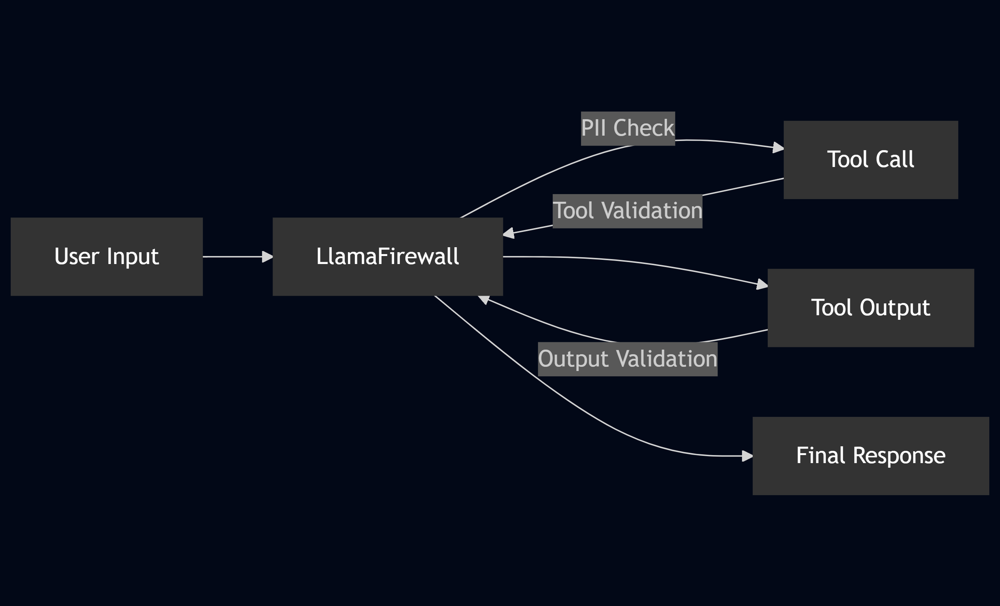

# LlamaFirewall For AI Agents Security Tutorial

## Overview

Protect your AI agents from security threats using **LlamaFirewall** - an open-source security framework that provides comprehensive guardrails for production AI systems. Learn to implement input validation, output monitoring, and tool security to build secure, production-ready agents.

## What You'll Learn

- **Input Security**: Protect against prompt injection and harmful content
- **Output Validation**: Ensure agent responses align with intended behavior
- **Tool Security**: Prevent unauthorized tool usage and resource abuse
- **Real-Time Monitoring**: Track security events with comprehensive logging
- **Production Deployment**: Implement security measures in real-world applications

## Tutorials

### **[Hello Llama: hello-llama.ipynb](./hello-llama.ipynb)**
Basic message scanning to detect and block potentially harmful content.

### **[Input Guardrail: input-guardrail.ipynb](./input-guardrail.ipynb)**
Validate user inputs to protect against malicious prompts and injection attacks.

### **[Output Guardrail: output-guardrail.ipynb](./output-guardrail.ipynb)**
Validate AI agent responses to ensure they align with intended behavior.

### **[Tools Security: tools-security.ipynb](./tools-security.ipynb)**
Comprehensive security for AI agent tools with input validation and access control.

## Quick Start

1. **Install dependencies**: `pip install -r requirements.txt`
2. **Get API keys**: OpenAI API key + Together AI key for alignment checks
3. **Set up HuggingFace**: Request access to Llama Prompt Guard 2 model
4. **Configure**: Run `llamafirewall configure` to set up models and API keys

## Authors
Created by [Matan Kotick](https://www.linkedin.com/in/matan-kotick-664735252) and [Amit Ziv](https://www.linkedin.com/in/amit-ziv-49690b120).