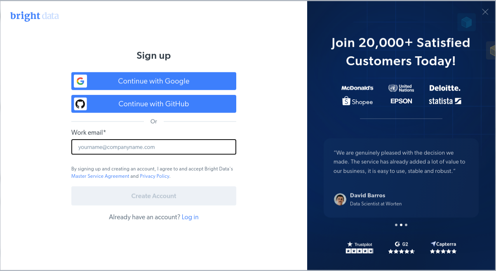

# Build Powerful Web Scraping Agents with LangGraph & Bright Data 🕷️

## Overview

Build intelligent web scraping agents that can search, extract, and analyze data from any website. Combine LangGraph's ReAct framework with Bright Data's industry-leading web scraping capabilities to create production-ready systems for data collection, market research, and competitive analysis.

## What You'll Learn

- **ReAct Agent Architecture**: Build reasoning and acting agents for complex web tasks
- **Intelligent Web Search**: Create agents that choose optimal search strategies
- **Structured Data Extraction**: Extract data from major platforms (Amazon, LinkedIn, social media)
- **Universal Web Scraping**: Handle any website with advanced bot detection bypass
- **Production Optimization**: Error handling, rate limiting, and performance tuning

## Tutorials

### **[MCP Integration: web_scraping_agent.ipynb](./web_scraping_agent.ipynb)**
Build sophisticated web scraping agents using Bright Data's MCP server with 60+ specialized tools including browser automation and platform-specific extractors.

### **[LangChain Integration: langgraph_integration.ipynb](./langgraph_integration.ipynb)**
Create streamlined web scraping agents using Bright Data's native LangChain tools for rapid development and easy integration.

## Quick Start

1. **Sign up for Bright Data** - Get 5k free requests monthly
2. **Get LLM API Access** - OpenRouter for MCP or Google AI Studio for LangChain
3. **Choose your path** - Start with LangChain for quick setup, use MCP for advanced capabilities
