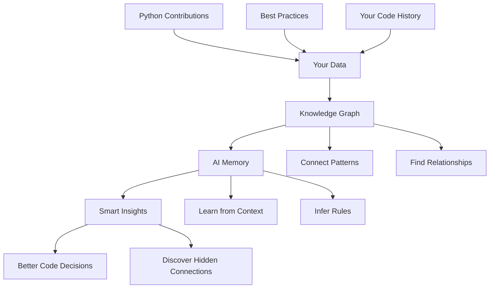

# AI Memory with Cognee

Build an intelligent AI memory system that learns from Python's creator and improves your development workflow.

## Overview

Transform scattered development data into a unified knowledge graph using Cognee. Connect Guido van Rossum's Python contributions with coding best practices and your personal development history to create an AI assistant that provides contextually relevant, explainable answers.

## What You'll Learn

- **Connect disparate data sources** - Unite Guido's CPython contributions, PEP guidelines, Zen principles, and your coding conversations
- **Build intelligent memory** - Create a knowledge graph that understands Python design philosophy and best practices  
- **Enable smart search** - Query your knowledge base with natural language to get insights combining multiple perspectives
- **Discover hidden patterns** - Find non-obvious connections between different data sources using AI-powered analysis

## Tutorial

**[Complete Tutorial: cognee-ai-memory.ipynb](./cognee-ai-memory.ipynb)**

This tutorial showcases the power of knowledge graphs and retrieval-augmented generation (RAG) for software development, demonstrating how AI memory can learn from authoritative sources and enhance your coding practice.
