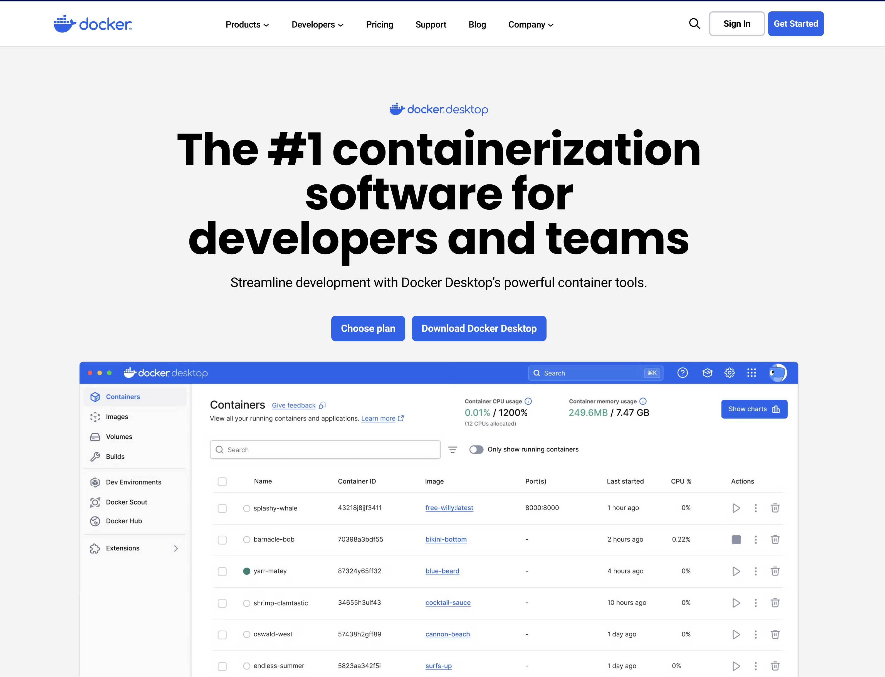
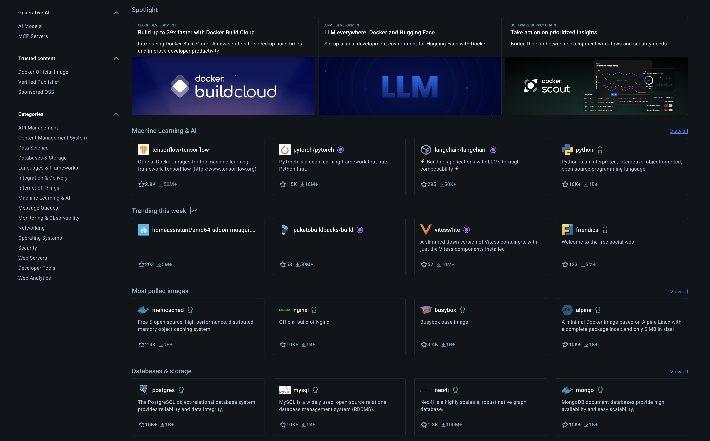

# Introduction to Docker
## Overview

Docker is a core CI/CD tool and industry standard for containerization. It is widely used across DevOps, MLOps, and developers who deploy code and applications in production. Docker has a steep learning curve, and this tutorial aims to help you understand what Docker is and its benefits in using it in your development workflow. In this tutorial, we will dive into the foundation of Docker. We will start with an overview of Docker and then dive into basic concepts and operations, such as building an image and running it as a container.


## Why Docker Matters for AI Agent Development

If you're building AI agents for production, Docker isn't just a nice-to-have - it's essential. Modern AI agents rely on complex ecosystems of dependencies: specific Python versions, machine learning libraries, vector databases, API clients, and often GPU drivers. Without containerization, what works perfectly in your development environment can break spectacularly in production due to version conflicts, missing dependencies, or environmental differences. Docker ensures your AI agent runs consistently whether it's on your laptop, a cloud server, or a Kubernetes cluster. More importantly, as your agents scale from prototype to production, Docker enables seamless deployment, automatic scaling, and reliable updates - turning your experimental AI code into robust, production-ready applications that enterprises can depend on.


> They say that a picture is worth a thousand words, and the following image from [reddit](https://www.reddit.com/r/ProgrammerHumor/comments/cw58z7/it_works_on_my_machine/) is self explanatory about the motivation behind Docker: 


<br>
<br /><figure>
 </a>
<figcaption> Docker meme (source: reddit)</figcaption>
</figure>

<br>
<br />


## Scope

This tutorial will cover the following topics:
- What is Docker?
- The Dockerfile
- Building an image
- Running a container
- Mounting volumes
- Dockerize AI Agent 

## Prerequisites

This is a beginner level tutorial, and it does not require any prior knowledge. However, it is recommended that you have some basic understanding of command line commands. 

To run the examples in this tutorial you will need:
- Docker Desktop (or equivalent) installed on your computer
- Docker Hub account

### Installing Docker Desktop
 
Docker was built to run on Linux OS, and therefore, it cannot run natively on other OSs such as macOS and Windows. The Docker Desktop provides the necessary virtual environment on which you can run Docker containers outside of Linux OS. In addition, it provides a GUI interface for managing the alocated resources and containers.

To install Docker Desktop, go to [Docker website](https://www.docker.com/products/docker-desktop) and follow the instructions for your operating system: 

<br>
<br /><figure>
 </a>
<figcaption> Docker Desktop</figcaption>
</figure>

<br>
<br />

After you have installed Docker Desktop, it should launch it automatically. If it does not launch automatically, click on the icon in the top right corner of the screen (on macOS).

You can validate from the terminal if Docker is running by typing `docker --version`:
```shell
>docker --version                                                          
Docker version 28.0.4, build b8034c0
```


### Setting Up Docker Hub Account

Docker Hub is a public repository that allows you to store, share, and run your containers (as GitHub enables you to store and maintain code). To set up your Docker Hub account, go to [Docker Hub](https://hub.docker.com/) and follow the instructions.


<br>
<br /><figure>
 </a>
<figcaption> Docker Hub</figcaption>
</figure>

<br>
<br />


## What is Docker?

Docker is a CI/CD tool that enables seamless code development and deployment into different environments (i.e., local to remote, etc.). By creating OS-level virtualization, an application and its dependencies can be packaged in a virtual container and shipped between different environments.

The main advantages of using Docker within your development environment are:

- **Reproducibility** - Docker enables you to seamlessly package your code and its dependencies into a single container and execute, test, share, and deploy code with a high level of consistency
- **Collaboration** - Docker solves the dependencies madness when a team of developers works together on a specific project. Having a unified environment saves a ton of time during the development step. For example, if one developer gets some error, it is easy for other developers to reproduce the error and help debug it
- **Deployment** - Docker simplifies the code shipment from the development environment to the production


## The Reproducibility Problem

Docker was built to solve a common DevOps problem - the lack of reproducibility when shifting code between different environments (e.g., the developer's local and production environments). Reproducibility is not limited to DevOps, and it plays a critical role in data science and AI.

>We can define reproducibility as the ability to generate the exact outcome when running the same code regardless of the user or machine on which the code is running.

The first time I heard the term reproducibility was during my bachelor's degree, where I learned that reproducibility starts and ends by setting a seed number to lock down random numbers. My favorite seed number is 12345. When I started to work as a data scientist, I realized that reproducibility goes beyond setting a seed number. Here are the main elements that can impact code reproducibility:

- **Version control** — First and foremost, reproducing the same results starts with the ability to track changes in your code 
- **Randomization** — Controlling the random generation of numbers by setting the seed number
- **Software version** — The versions of your Python or R (or any other programming language) and its dependencies (e.g., libraries) impact the outcome of your code. For example, code that was built with pandas v1.0 may not run on v2.0 due to deprecation of functions
- **Operating System (OS)** — Most programming languages, particularly R and Python, use different compilers (e.g., C, C++, etc.) and other built-in OS components. The type of OS and its version could impact the outcome of your code
- **Hardware** — Last but not, the type of hardware (or infrastructure) could impact your results (ARM/Intel/Apple processor, etc)

In a regular data science workflow, reproducibility is dependent on several factors. One of the most basic and trivial elements of reproducibility is code versioning. Using unversioned code makes it impossible to track changes in your code or verify that the same code runs on different environments, and that was the reason that Git was born.

Another critical factor is package versioning. Over time, packages and their dependencies tend to change and evolve, get new features, bug fixes, replace and deprecate old functions. In some cases, running your code using a specific package version may not work or yield the same results as older or newer versions of the package. For example, code written with Pandas 1.x may not work with Pandas 2.x, and vice versa.

Similarly, programming languages tend to change over time, and using code built with older versions may not work or be supported with recent ones. Moreover, different operating systems use different software architectures or run different types of compilers (c, c++, etc.) on the backend. This difference may impact the reproducibility of your code.

Lastly, the type of CPU architecture (ARM, Intel, Apple Silocon, etc.) may impact the underlying software. Some packages or software may require a separate build or may not be supported, which can ultimately affect the reproducibility of your code.

Below is Figure 1, which illustrates the factors affecting code reproducibility when transferring between different environments


<br>
<br /><figure>
 </a>
<figcaption> Figure 1: Reproducibility without Docker (and Git)</figcaption>
</figure>

<br>
<br />

Git provides a solution for versioning and monitoring code, ensuring that it can be reproduced correctly regardless of the user or machine it runs on, as long as it is used properly. Docker and similar solutions address the problem of environment mismatches by creating an isolated environment within a container that can be shipped along with the code to any remote machine, such as a desktop, laptop, or server, allowing for seamless reproduction of the process.

While developing software on different hardware architectures, such as Apple Silicon and Intel-based machines, there may be potential differences in the environment. Docker can partially address this issue by creating a dedicated image for each CPU architecture. However, this approach can be time-consuming and expensive since additional tests are required to ensure that all containers have the exact same characteristics.

Figure 2 demonstrates a general workflow with Docker and Git. We use Git and GitHub/Gitlab/Bitbucket (or any similar service) to code version control. Docker is used to set up a containerized environment, which will be used for code development and testing. We then shift our code with the container to any remote environment that supports containers (i.e., GitHub Actions, AWS, GCP, etc.).

<br>
<br /><figure>
 </a>
<figcaption> Figure 2: Reproducibility with Docker and Git</figcaption>
</figure>

<br>
<br />

While this workflow provides a high level of reproducibility, it does not cover reproducibility issues you may encounter due to different hardware settings. There are different methods to address this issue, such as building a dedicated environment for each hardware architecture (more details are available [here](https://docs.docker.com/build/building/multi-platform/)).

Note: Using a virtual environment is not an alternative to Docker. It actually works well together. While VE is not part of this tutorial, you can read more about the differences between VE and Docker in the following [article](https://medium.com/@rami.krispin/running-python-r-with-docker-vs-virtual-environment-4a62ed36900f).


## Docker Workflow

This section focuses on the essential Docker workflow and requirements that will enable you to build your image and run it inside a container. The basic Docker workflow includes the following steps:
- Defining the environment requirements using Dockerfile
- Building the image from the Dockerfile
- Running the image as a container from the image
- Developing and testing code in the container
- Shipping the code in a container

> People often confuse the terms "image" and "container". An image refers to the artifact that is created by a build process, which contains the environment specifications. A container refers to the process of running the image as an instance.

 
Figure 3 illustrates the process of building and running an image as a container.

<br>
<br /><figure>
 </a>
<figcaption> Figure 3: Docker workflow</figcaption>
</figure>

<br>
<br />


The main components of this workflow are:

- **Dockerfile** - the image recipe or blueprint allows us to add components and customize the dependencies according to the development environment requirements
- **Docker CLI** - core commands to build the image and run it as a containerized environment


In the following sections, we will break down each step of the process in more detail.

## The Dockerfile

The `Dockerfile` provides instructions for the Docker engine on how to build the image. You can think about it as the image's recipe. It has its own unique and intuitive syntax using the following structure:

``` Dockerfile
COMMAND some instructions
```

For example, the following `Dockerfile` imports the official Python (version 3.10) image as the base image and then uses the `apt-get update` and `apt-get install` to install the `curl` library :


`./examples/ex1/Dockerfile`
``` Dockerfile
FROM python:3.10

LABEL example=1

ENV PYTHON_VER=3.10

RUN apt-get update && apt-get install -y --no-install-recommends curl
```

In a nutshell, we used the `FROM` command to specify the image we want to import from the Docker registry (don't forget to log in to the Docker registry service you are using before building the image!). The `LABEL` command is used to set labels or comments, and the `ENV` command is used to set environment variables. Last but not least, the `RUN` command is used to run a command on the command line, in this case, to install the `curl` library.

Let's now review the Dockerfile core commands:
- `FROM` - Defines the base image to use for the image's build. In most cases, unless you are building the image from scratch, you will use some base image with some pre-installed OS and some dependencies. For example, in this tutorial, we will import as our base image the official [Python image](https://hub.docker.com/_/python)
- `LABEL` - Enables to add information about the image to the image's metadata, such as authors, maintainers, license, etc.
- `ENV` - Uses to set environment variables
- `ARG` - Enables to set parameters during the build time
- `RUN` -  Allows executing CLI commands (e.g., `pip install ...`, `apt-get ...`, `apt-install...`, `wget...`, etc.) during the build time to add additional components to the base image
- `COPY` - Enables to copy objects (e.g., files and folders) from your local system to the image 
- `WORKDIR` - Sets the working directory inside the image
- `EXPOSE` - Defines the port number to expose the image during the run time
- `CMD` - Sets a default command to execute during the run time of the image
- `ENDPOINT` - Allows configuring a container that will run as an executable

Do not worry if, at this point, you do not fully understand the use cases of some of those commands. It will make more sense when we start to build images in the next section.

## Docker Build

Once the `Dockerfile` is ready, the next step is to build the image using the  `docker build` command from the command line. For example, let's build the above `Dockerfile` using the `build` command from this repo root folder:

``` shell
docker build . -f ./examples/ex-1/Dockerfile -t rkrispin/vscode-python:ex1 
```

Here are the arguments we used with the `build` command:
- The `-f` tag defines the `Dockerfile` path. This argument is optional and should be used if you are calling the `build` function from a different folder than one of the `Dockerfile`
- The `.` symbol defines the context folder of the files system as the one of the `Dockerfile`. Although we did not use the file system in this case, this enables us in other cases to call and copy files from our local folder to the image during the build time
- The `-t` is used to set the image's name and tag (e.g., version). In this case, the image name is `rkrispin/vscode-python` and the tag is `ex1`. 


You should expect the following output:

``` shell
[+] Building 94.2s (6/6) FINISHED                                                                                                                                                                                                  
 => [internal] load build definition from Dockerfile                                                                                                                                                                          0.0s
 => => transferring dockerfile: 162B                                                                                                                                                                                          0.0s
 => [internal] load .dockerignore                                                                                                                                                                                             0.0s
 => => transferring context: 2B                                                                                                                                                                                               0.0s
 => [internal] load metadata for docker.io/library/python:3.10                                                                                                                                                                6.0s
 => [1/2] FROM docker.io/library/python:3.10@sha256:a8462db480ec3a74499a297b1f8e074944283407b7a417f22f20d8e2e1619782                                                                                                         82.1s
 => => resolve docker.io/library/python:3.10@sha256:a8462db480ec3a74499a297b1f8e074944283407b7a417f22f20d8e2e1619782                                                                                                          0.0s
 => => sha256:a8462db480ec3a74499a297b1f8e074944283407b7a417f22f20d8e2e1619782 1.65kB / 1.65kB                                                                                                                                0.0s
 => => sha256:4a1aacea636cab6af8f99f037d1e56a4de97de6025da8eff90b3315591ae3617 2.01kB / 2.01kB                                                                                                                                0.0s
 => => sha256:23e11cf6844c334b2970fd265fb09cfe88ec250e1e80db7db973d69d757bdac4 7.53kB / 7.53kB                                                                                                                                0.0s
 => => sha256:bba7bb10d5baebcaad1d68ab3cbfd37390c646b2a688529b1d118a47991116f4 49.55MB / 49.55MB                                                                                                                             26.1s
 => => sha256:ec2b820b8e87758dde67c29b25d4cbf88377601a4355cc5d556a9beebc80da00 24.03MB / 24.03MB                                                                                                                             11.0s
 => => sha256:284f2345db055020282f6e80a646f1111fb2d5dfc6f7ee871f89bc50919a51bf 64.11MB / 64.11MB                                                                                                                             26.4s
 => => sha256:fea23129f080a6e28ebff8124f9dc585b412b1a358bba566802e5441d2667639 211.00MB / 211.00MB                                                                                                                           74.5s
 => => sha256:7c62c924b8a6474ab5462996f6663e07a515fab7f3fcdd605cae690a64aa01c7 6.39MB / 6.39MB                                                                                                                               28.2s
 => => extracting sha256:bba7bb10d5baebcaad1d68ab3cbfd37390c646b2a688529b1d118a47991116f4                                                                                                                                     1.6s
 => => sha256:c48db0ed1df2d2df2dccd680323097bafb5decd0b8a08f02684b1a81b339f39b 17.15MB / 17.15MB                                                                                                                             31.9s
 => => extracting sha256:ec2b820b8e87758dde67c29b25d4cbf88377601a4355cc5d556a9beebc80da00                                                                                                                                     0.6s
 => => sha256:f614a567a40341ac461c855d309737ebccf10a342d9643e94a2cf0e5ff29b6cd 243B / 243B                                                                                                                                   28.4s
 => => sha256:00c5a00c6bc24a1c23f2127a05cfddd90865628124100404f9bf56d68caf17f4 3.08MB / 3.08MB                                                                                                                               29.4s
 => => extracting sha256:284f2345db055020282f6e80a646f1111fb2d5dfc6f7ee871f89bc50919a51bf                                                                                                                                     2.5s
 => => extracting sha256:fea23129f080a6e28ebff8124f9dc585b412b1a358bba566802e5441d2667639                                                                                                                                     6.2s
 => => extracting sha256:7c62c924b8a6474ab5462996f6663e07a515fab7f3fcdd605cae690a64aa01c7                                                                                                                                     0.3s
 => => extracting sha256:c48db0ed1df2d2df2dccd680323097bafb5decd0b8a08f02684b1a81b339f39b                                                                                                                                     0.5s
 => => extracting sha256:f614a567a40341ac461c855d309737ebccf10a342d9643e94a2cf0e5ff29b6cd                                                                                                                                     0.0s
 => => extracting sha256:00c5a00c6bc24a1c23f2127a05cfddd90865628124100404f9bf56d68caf17f4                                                                                                                                     0.2s
 => [2/2] RUN apt-get update && apt-get install -y --no-install-recommends curl                                                                                                                                               5.9s
 => exporting to image                                                                                                                                                                                                        0.1s
 => => exporting layers                                                                                                                                                                                                       0.1s
 => => writing image sha256:a8e4c6d06c97e9a331a10128d1ea1fa83f3a525e67c7040c2410940312e946f5                                                                                                                                  0.0s
 => => naming to docker.io/rkrispin/vscode-python:ex1  

 ```

**Note:** The above output of the build describes the different layers of the image. Don't worry if, at this point, it looks and sounds like gibberish. Reading this output type will be easier after reading the next section, which focuses on the image layers.


You can use the `docker images` command to validate that the image was created successfully:

``` shell
>docker images
REPOSITORY                             TAG       IMAGE ID       CREATED        SIZE
rkrispin/vscode-python                 ex1       a8e4c6d06c97   43 hours ago   1.02GB
```

The next section will focus on the image layers and caching process.


### The image layers

The build process of Docker's images is based on layers. Depending on the context, the docker engine takes each one of the `Dockerfile` commands during the build time and translates it either into layer or metadata. `Dockerfile` commands, such as `FROM` and `RUN` are translated into a layer, and commands, such as `LABEL`, `ARG`, `ENV`, and `CMD` are translated into metadata. For example, we can observe in the output of the build of `rkrispin/vscode-python` image above that there are two layers:
- The first layer started with `[1/2] FROM...`, corresponding to the `FROM python:3.10` line on the `Dockerfile`, which imports the Python 3.10 official image
- The second layer started with `[2/2] RUN apt-get...`, corresponding  to the `RUN` command on the `Dockerfile`
<br>
<br /><figure>
</a>
<figcaption> Figure 4 - Example of a build output with respect to the Dockerfile</figcaption>
</figure>

<br>
<br />

The `docker inspect` command returns the image metadata details in a JSON format. That includes the environment variables, labels, layers and general metadata. In the following example, we will use [jq](https://jqlang.github.io/jq/) to extract the layers' information from the metadata JSON file:

``` shell
> docker inspect rkrispin/vscode-python:ex1 | jq '.[] | .RootFS'
{
  "Type": "layers",
  "Layers": [
    "sha256:332b199f36eb054386cd2931c0824c97c6603903ca252835cc296bacde2913e1",
    "sha256:2f98f42985b15cbe098d2979fa9273e562e79177b652f1208ae39f97ff0424d3",
    "sha256:964529c819bb33d3368962458c1603ca45b933487b03b4fb2754aa55cc467010",
    "sha256:e67fb4bad8f42cca08769ee21bbe15aca61ab97d4a46b181e05fefe3a03ee06d",
    "sha256:037f26f869124174b0d6b6d97b95a5f8bdff983131d5a1da6bc28ddbc73531a5",
    "sha256:737cec5220379f795b727e6c164e36e8e79a51ac66a85b3e91c3f25394d99224",
    "sha256:65f4e45c2715f03ed2547e1a5bdfac7baaa41883450d87d96f877fbe634f41a9",
    "sha256:baef981f26963b264913e79bd0a1472bae389441022d71f559e9d186600d2629",
    "sha256:88e1d36ff4812423afc93d5f6208f2783df314d5ecf6f961325c65e1dbf891da"
  ]
}

```

As you can see from the image's layers output above, the `rkrispin/vscode-python:ex1` image has nine layers. Each layer is represented by its hash key (e.g., `sha256:...`), and it is cached on the backend. While we saw on the build output that the docker engine triggered two processes from the `FROM` and `RUN` commands, we ended up with nine layers as opposed to two. The main reason for that is related to the fact that when importing the baseline image, we inherited the imported image characteristics, including the layers. In this case, we used the `FROM` to import the official Python image, which included eight layers and then added the 9th layer by executing the `RUN` commands. You can test it by pulling the baseline image and using the inspect command to review its layers:

``` shell
> docker pull python:3.10
3.10: Pulling from library/python
bba7bb10d5ba: Already exists 
ec2b820b8e87: Already exists 
284f2345db05: Already exists 
fea23129f080: Already exists 
7c62c924b8a6: Already exists 
c48db0ed1df2: Already exists 
f614a567a403: Already exists 
00c5a00c6bc2: Already exists 
Digest: sha256:a8462db480ec3a74499a297b1f8e074944283407b7a417f22f20d8e2e1619782
Status: Downloaded newer image for python:3.10
docker.io/library/python:3.10

> docker inspect python:3.10 | jq '.[] | .RootFS'
{
  "Type": "layers",
  "Layers": [
    "sha256:332b199f36eb054386cd2931c0824c97c6603903ca252835cc296bacde2913e1",
    "sha256:2f98f42985b15cbe098d2979fa9273e562e79177b652f1208ae39f97ff0424d3",
    "sha256:964529c819bb33d3368962458c1603ca45b933487b03b4fb2754aa55cc467010",
    "sha256:e67fb4bad8f42cca08769ee21bbe15aca61ab97d4a46b181e05fefe3a03ee06d",
    "sha256:037f26f869124174b0d6b6d97b95a5f8bdff983131d5a1da6bc28ddbc73531a5",
    "sha256:737cec5220379f795b727e6c164e36e8e79a51ac66a85b3e91c3f25394d99224",
    "sha256:65f4e45c2715f03ed2547e1a5bdfac7baaa41883450d87d96f877fbe634f41a9",
    "sha256:baef981f26963b264913e79bd0a1472bae389441022d71f559e9d186600d2629"
  ]
}
```

### Layers caching

One of the cons of Docker is the image build time. As the level of complexity of the Dockerfile is higher (e.g., a large number of dependencies), the build time is longer. Sometimes, your build won't execute as expected on the first try. Either some requirements are missing, or something breaks during the build time. This is where the use of caching helps in reducing the image rebuild time. Docker has smart mechanization that identifies if each layer should be built from scratch or can leverage a cached layer and save time. For example, let's add another command to the previous example to install the `vim` editor.  Generally, we can (and should) add it to the same apt-get we are using to install the `curl` package, but for the purpose of showing the layers caching functionality, we will run it separately:


`./examples/ex2/Dockerfile`
``` Dockerfile
FROM python:3.10

LABEL example=1

ENV PYTHON_VER=3.10

RUN apt-get update && apt-get install -y --no-install-recommends curl

RUN apt-get update && apt-get install -y --no-install-recommends vim
```

We will use the below command to build this image and tag it as `rkrispin/vscode-python:ex2`:

``` shell
docker build . -f ./examples/ex-2/Dockerfile -t rkrispin/vscode-python:ex2 --progress=plain
```
You should expect the following output (if ran the previous build):

``` shell
 => [internal] load build definition from Dockerfile                                                                                                                                     0.0s
 => => transferring dockerfile: 234B                                                                                                                                                     0.0s
 => [internal] load .dockerignore                                                                                                                                                        0.0s
 => => transferring context: 2B                                                                                                                                                          0.0s
 => [internal] load metadata for docker.io/library/python:3.10                                                                                                                           0.0s
 => [1/3] FROM docker.io/library/python:3.10                                                                                                                                             0.0s
 => CACHED [2/3] RUN apt-get update && apt-get install -y --no-install-recommends curl                                                                                                   0.0s
 => [3/3] RUN apt-get update && apt-get install -y --no-install-recommends vim                                                                                                          34.3s
 => exporting to image                                                                                                                                                                   0.4s 
 => => exporting layers                                                                                                                                                                  0.4s 
 => => writing image sha256:be39eb0eb986f083a02974c2315258377321a683d8472bac15e8d5694008df35                                                                                             0.0s 
 => => naming to docker.io/rkrispin/vscode-python:ex2   
 ```


As can be noticed from the above build output, the first and second layers already exist from the previous build. Therefore, the docker engine adds their cached layers to the image (as opposed to building them from scratch), and just builds the 3rd layer and installs the vim editor.

**Note:** By default, the build output is concise and short. You can get more detailed output during the build time by adding the `progress` argument and setting it to `plain`:

``` shell
> docker build . -f ./examples/ex-2/Dockerfile -t rkrispin/vscode-python:ex2 --progress=plain
#1 [internal] load .dockerignore
#1 transferring context: 2B done
#1 DONE 0.0s

#2 [internal] load build definition from Dockerfile
#2 transferring dockerfile: 234B done
#2 DONE 0.0s

#3 [internal] load metadata for docker.io/library/python:3.10
#3 DONE 0.0s

#4 [1/3] FROM docker.io/library/python:3.10
#4 DONE 0.0s

#5 [2/3] RUN apt-get update && apt-get install -y --no-install-recommends curl
#5 CACHED

#6 [3/3] RUN apt-get update && apt-get install -y --no-install-recommends vim
#6 CACHED

#7 exporting to image
#7 exporting layers done
#7 writing image sha256:be39eb0eb986f083a02974c2315258377321a683d8472bac15e8d5694008df35 0.0s done
#7 naming to docker.io/rkrispin/vscode-python:ex2 done
#7 DONE 0.0s
```

Since we already cached the 3rd layer on the previous build, all the layers in the above output are cached, and the run time is less than 1 second.

When setting up your Dockerfile, you should be mindful of and strategic about the layers caching process. The order of the layers does matter! The following images demonstrate when the docker engine will use cached layers and when to rebuild them. The first image illustrates the initial build: 

<br>
<br /><figure>
</a>
<figcaption> Figure 5 - Illustration of initial build of image. The left side represents the Dockerfile's commands and the right one the corresponding layers</figcaption>
</figure>

<br>
<br />

In this case, we have a Dockerfile with four commands that are translated during the build time into four layers. What will happen if we add a fifth command and place it right after the third one? The docker engine will identify that the first and second commands in the Dockerfile did not change and, therefore, will use the corresponding cached layers (one and two), and rebuild the rest of the layers from scratch:

<br>
<br /><figure>
</a>
<figcaption> Figure 6 - Illustration of the caching process during the rebuild of an image</figcaption>
</figure>
<br>
<br />

When planning your Dockerfile, if applicable,  a good practice is to place the commands that will most likely stay the same and keep new updates to the end of the file if possible.

That was just the tip of the iceberg, and there is much more to learn about Docker. The next section will explore different methods to run Python inside a container.

## Docker Run

In the previous sections, we saw how to define the image requirements with the `Dockerfile` and build it with the `build` command. This section focuses on running Python inside a container using the `docker run` command.

The `docker run` or `run` command enables us to create and run a new container from an image. Typically, the `run` command is used to launch a dockerized application or server or to execute a code following the below syntax:

``` shell
docker run [OPTIONS] IMAGE [COMMAND] [ARG...]
```

For example, we can use the `run` command with the official Python 3.10 image:

``` shell
docker run python:3.10 
```

Surprisingly (or not), nothing happened. To understand that better, we need to go back to the `Dockerfile`. Generally, images can be used to run:
- Server
- Application

In both cases, we use the `Dockerfile` to set and enable launching them during the run time. In the case of a server, we use the `PORT` and `CMD` commands on the `Dockerfile` to set the server's port on the image and launch the server, respectively. We then use the `run` command and add the `-p` (or `--publish list`) option to map the server's port with a local port. Similarly, to launch an application, we use the `CMD` command on the `Dockerfile` to define the launch command during the run time and use the `--interactive` and  `--tty` options to launch the container in interactive mode, which enables us to access the application.

Let's now go back to the `python:3.10` image and use the `inspect` command to check if the `CMD` command was defined:

``` shell
> docker inspect python:3.10 | jq '.[] | .Config.Cmd'
[
  "python3"
]
```

**Note:** We used the `jq` library again  to parse out from the JSON output the CMD metadata

As you can see, the `CMD` on the `python:3.10` image is set to run the default Python launch command - `python3`, which launches Python during the run time. Let's now add the `--interactive` and  `--tty` options to run the container in an interactive mode:

```shell
 docker run --interactive --tty python:3.10 
 ```
This launches the default Python version on the image. We can then test it by using the `print` command to print `Hello World!`:

```python
Python 3.10.12 (main, Jun 14 2023, 18:40:54) [GCC 12.2.0] on linux
Type "help", "copyright", "credits" or "license" for more information.
>>> print("Hello World!")
Hello World!
>>> 
```

## Volume Mounting

As you can notice in the above output, the `docker run` command launched the container inside the bash terminal. By default, the container runs in an ephemeral environment, which means that any code we create inside the image is not exportable and will be lost after we stop the container from running. 


A simple solution is to mount a volume with the volume argument. For simplicity, we will go ahead and mount the local folder - `ex3`, where we have the following Python script:
`hello-world.py`
``` python
print("Hello World!")
```

Before launching the container, let's rebuild the image and add the `CMD` instruction to launch the bash terminal inside the container instead of Python. We will use the below `Dockerfile`:

`./examples/ex3/Dockerfile`
``` Dockerfile
FROM python:3.10

LABEL example=3

ENV PYTHON_VER=3.10

RUN apt-get update && apt-get install -y --no-install-recommends curl

RUN apt-get update && apt-get install -y --no-install-recommends vim

CMD ["/bin/sh", "-c", "bash"]
```

This will enable us to access the file system and run scripts from the bash terminal.

Let's build the image again, but this time, we will use the Dockerfile we just created:

```shell
docker build . -f ./examples/ex3/Dockerfile -t rkrispin/vscode-python:ex3
```

And then, launch it with the following command:

```
docker run -v .:/ex3  --interactive --tty rkrispin/vscode-python:ex3
```


We will run the command and use the volume argument to map the local folder ex3 as a volume in our container. We can do this by running the following command:

``` shell
docker run -v ./examples/ex3:/ex3  --interactive --tty python:3.10 
```
Where the `-v` argument maps the local folder `./examples/ex3` to `/my_python_scipts` in our container. This will launch the container and open the bash terminal inside the container. As you can see below, the output of the `ls` command, returns the files and folders to the root folder. This includes the local folder we mounted with the `-v` argument -`my_python_scripts`:

```shell
root@8c94db531eb4:/# ls
bin  boot  dev	etc  home  lib	media  mnt  my_python_scipts  opt  proc  root  run  sbin  srv  sys  tmp  usr  var
root@8c94db531eb4:/# cd my_python_scipts/
root@8c94db531eb4:/my_python_scipts# ls
Dockerfile  hello-world.py
root@8c94db531eb4:/my_python_scipts# python hello-world.py
Hello World!
root@8c94db531eb4:/my_python_scipts#
```

Using this technique, we can maintain our code locally while running it inside the container. 

## Dockerize AI Agent 

So far, we have reviewed how to set up a Dockerfile, build the image, and run it as a container. In this section, we will connect the dots and demonstrate how you can dockerize a simple AI agent and run it inside a container.

Let's start by defining a simple Python script that sends a request to the OpenAI API and prints the results:

`./examples/ex4/simple_agent.py`
``` python
from openai import OpenAI

client = OpenAI()

response = client.chat.completions.create(
    model="gpt-4o-mini",
    messages=[{"role": "user", "content": "What is the capital of France?"}],
)

print(response.choices[0].message.content)
```

We will wrap this Python script with the following Dockerfile:
`./examples/ex4/Dockerfile`

``` Dockerfile
FROM python:3.10-slim

RUN pip install --no-cache-dir openai

COPY ./examples/ex4/simple_agent.py /app/simple_agent.py

CMD ["python", "/app/simple_agent.py"]
```
We use the `FROM` command to pull the official Python image - version 3.10 slim version (light size). Next, we use the `RUN` command to install the `openai` Python library and then use the `COPY` command to copy the Python script from the local folder to the image file system. Last but not least, we will use the `CMD` command to execute the Python script during the run time of the container. 

Next, we will build the image using the following command:

``` shell
docker build . -f ./examples/ex4/Dockerfile -t rkrispin/simple_agent:ex4
```

During the run time of the image, we will have to provide the OpenAI API key. As a best practice, you should NEVER store credentials or secrets on the image during the build time. Instead, we will set the API key as an environment variable using the `--env` (or `-e`) argument:

``` shell
docker run --env OPENAI_API_KEY=$OPENAI_API_KEY rkrispin/simple_agent:ex4
```
**Note:** You should replace the `OPENAI_API_KEY` with the name of the environment variable that holds your API key.

And you should expect the following output:

``` shell
The capital of France is Paris.
```

### Functionalize the Container 

The previous example is limited and not that useful, as it can only answer one question. You can, with small tweaks, make it dynamic, enabling the users to ask questions. Let's start with the Python script:

`./examples/ex5/dynamic_agent.py`
```python
import os
from openai import OpenAI

client = OpenAI()

question = os.getenv("QUESTION", "What is the capital of France?")

response = client.chat.completions.create(
    model="gpt-4o-mini",
    messages=[{"role": "user",  "content": question}],
)

print(f"Question: {question}")
print(f"Answer: {response.choices[0].message.content}")
```

As you can see, we added an environment variable called `QUESTION`, which will be used as input for our agent. The script will print the question and the answer.

Likewise, we will modify the Dockerfile:
``` Dockerfile
FROM python:3.10-slim

RUN pip install --no-cache-dir openai

COPY ./examples/ex5/dynamic_agent.py /app/dynamic_agent.py

ENV QUESTION="What is the capital of France?"

CMD ["python", "/app/dynamic_agent.py"]

```

**None:** While it is not a must, it is a good practice to set a default value for the environment variable QUESTION. This way if the user does not provide a value for this variable, it will use the default value. 

Let's build the container:

``` shell
docker build . -f ./examples/ex5/Dockerfile -t rkrispin/dynamic_agent:ex5
```

And run the container and set the question as environment variable:
```shell
docker run --env OPENAI_API_KEY=$OPENAI_API_KEY --env QUESTION="What is the capital of United Kingdom"  rkrispin/dynamic_agent:ex5
```

This will return the following output:

```shell
Question: What is the capital of United Kingdom
Answer: The capital of the United Kingdom is London.
```

## Conclusions

In this tutorial, we reviewed the foundation of Docker. Docker solves a core program of software development - reproducibility. We dived into the process of building images using the `Dockerfile` and saw a simple example of how we can run our code inside a container. Last but not least, we demonstrate how to containerize a simple AI agent inside a container and call the OpenAI API during the runtime.

This is the tip of the iceberg of what Docker does, and hopefully, it gives you an idea of what you can do with Docker and how to start with it.

---
This tutorial was written by [Rami Krispin](https://www.linkedin.com/in/rami-krispin/)
