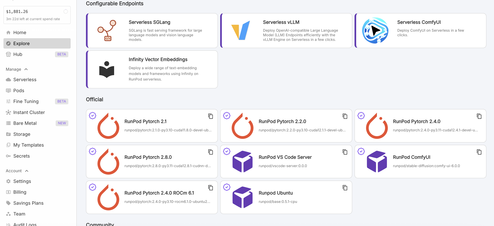
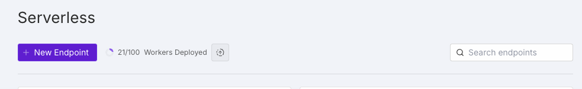
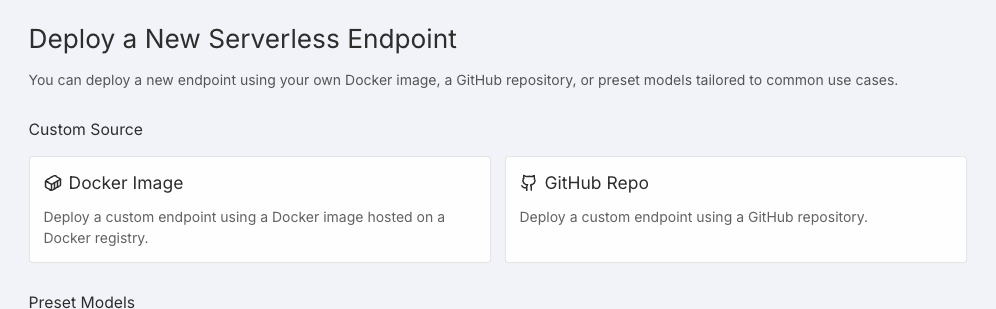
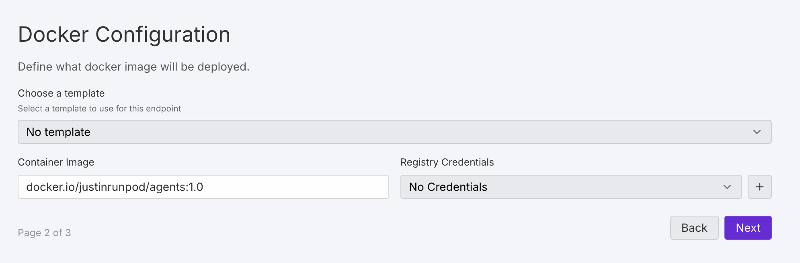
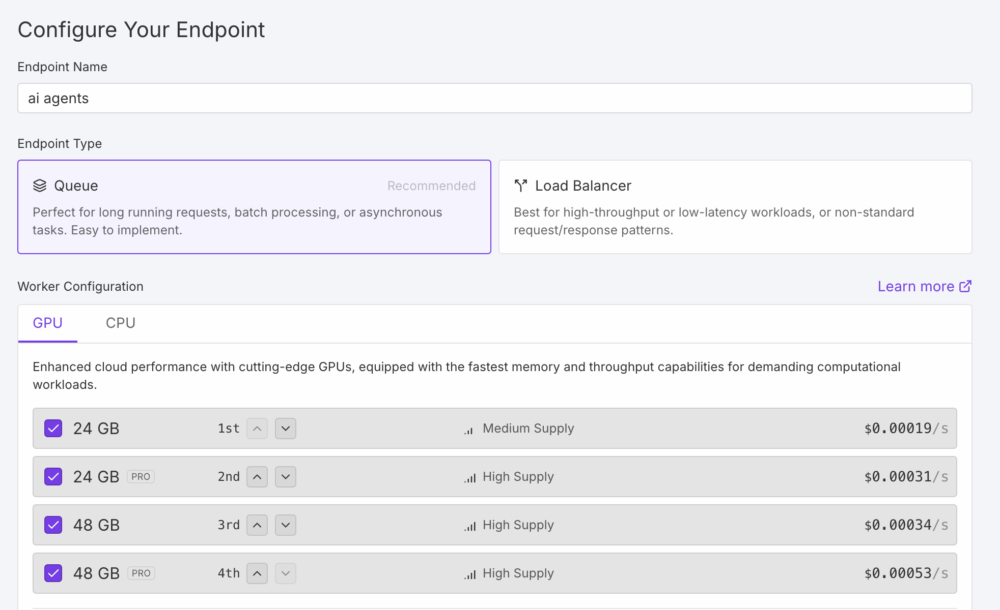
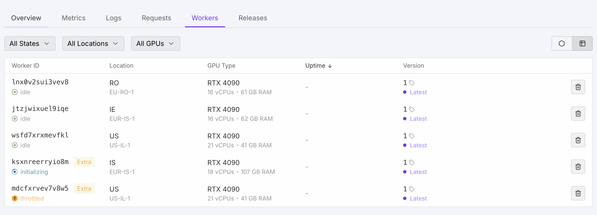
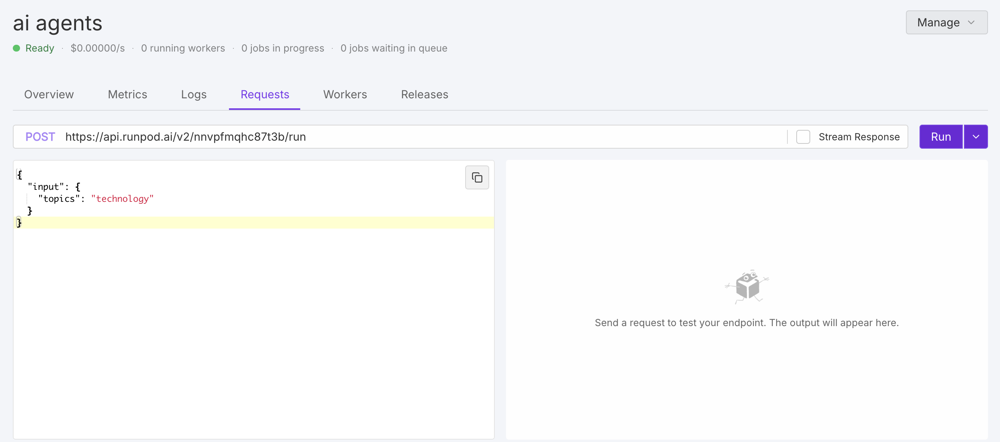
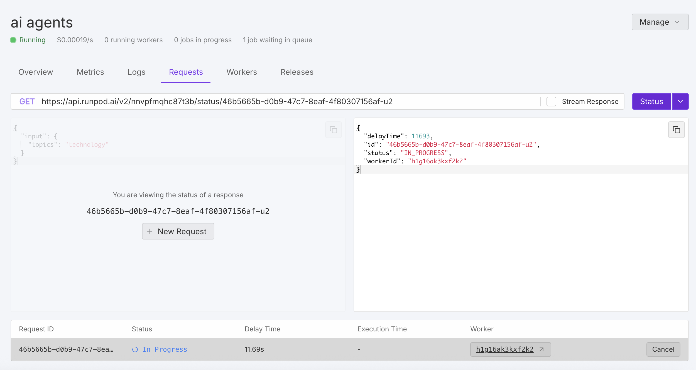
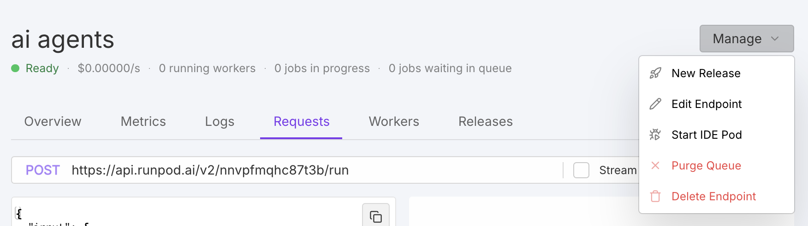
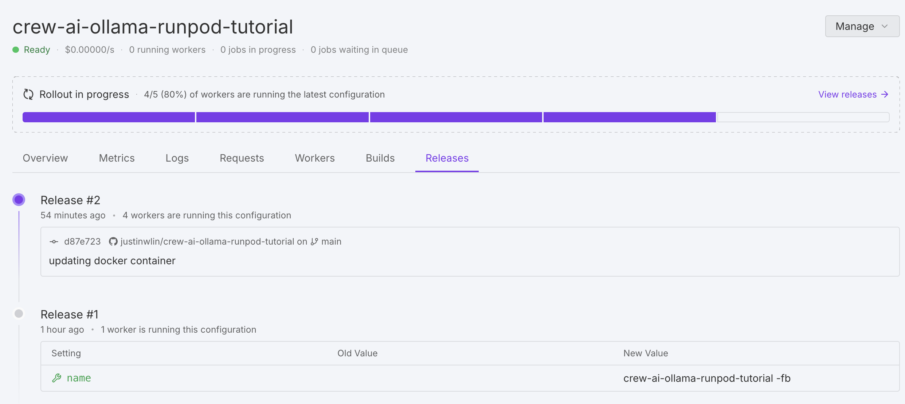

# Deploying AI Agents with RunPod Serverless

## Overview

This tutorial demonstrates how to deploy AI agents using RunPod's Serverless infrastructure. We'll build and deploy a CrewAI writing agent that uses Ollama models, creating a scalable API endpoint that generates articles based on user topics. You'll learn containerization, serverless deployment, and how to handle dynamic scaling without managing infrastructure.

## Detailed Explanation

### Motivation

Deploying AI agents traditionally requires significant infrastructure management - setting up servers, configuring auto-scaling, managing load balancers, and handling cost optimization. This creates barriers for developers who want to focus on building intelligent agents rather than managing infrastructure.

**Serverless deployment fundamentally changes this paradigm** by removing infrastructure concerns entirely. Instead of managing servers, developers simply package their code into containers that automatically execute when requests arrive. RunPod handles all scaling, load balancing, and resource allocation automatically.

This approach is particularly valuable for AI agents because of unpredictable usage patterns and resource-intensive operations. With RunPod's serverless endpoints, you only pay for the compute time your agent actually uses.

### What is RunPod

RunPod is a cloud computing platform built for AI, ML, and general computing needs. RunPod makes it easy to spin up a remote GPU/CPU server, and provides a seamless way to deploy and scale your workloads.

### Application We Will Be Deploying

[Refer to the files in this repository](./crew-ai-ollama-runpod-tutorial/README.md) for files referenced in this tutorial.

The objective is to create an API endpoint where a user can ping it a topic, an agent does some research (a pseudoresearch tool has been provided to the agent), and returns a short article based off the agent research.

### Key Components

Our deployment architecture consists of three essential components working together:

**CrewAI Framework**: A multi-agent system that coordinates AI workers to complete complex tasks. In our case, it manages a research agent and writing agent that collaborate to produce blog content.

**Ollama Runtime**: A local language model server that runs models like OpenHermes directly in our container. This eliminates external API dependencies and provides faster, more reliable inference.

**RunPod Serverless**: A GPU-optimized serverless platform that automatically manages container lifecycle, scaling, and resource allocation for AI workloads.

### Method Overview

Our deployment method follows this workflow:

1. **Containerization**: Package the CrewAI application, Ollama runtime, and language model into a Docker container
2. **Handler Definition**: Create a Python function that processes incoming requests and coordinates the AI agents
3. **Serverless Deployment**: Deploy the container to RunPod's serverless infrastructure with automatic scaling configuration
4. **API Integration**: Expose the agent through a REST API endpoint that accepts topics and returns generated content

This approach transforms a complex multi-component AI system into a simple API call, with all infrastructure concerns handled automatically.

### Key Benefits

The serverless approach offers several advantages:
- **Automatic Scaling**: Containers spin up and down based on request volume
- **Cost Efficiency**: Pay only for actual compute time, not idle resources
- **Zero Infrastructure Management**: No need to configure servers or handle scaling logic
- **Built-in Load Balancing**: RunPod distributes requests across available workers

## Signing up for RunPod

### Sign Up Page
Visit the [RunPod Sign Up Page](https://get.runpod.io/nirdiamant) to create your account.

## Preparing Application for RunPod

### Understanding Serverless endpoints

RunPod provides a cloud-compute platform for dockerized applications, where you can bind a python function, using RunPod's `runpod SDK`, to execute when your RunPod endpoint gets hit.

So the steps we need to take are:
- Defining the Handler
- Containerizing Our Application
- Deploying our application to RunPod
- Testing our application
- Understanding future maintenance

### Defining the Handler

Binding a python function to execute is simple. Using the SDK we simply bind a python function using the following line: `runpod.serverless.start({"handler": handler})`. This allows us to define an entry-point for your agent to execute based off the request sent to your RunPod endpoint.

The entry point function is expected to be able to take in a JSON request structured such as:

```python
{
    "input": {
        ...
    }
}
```

So referencing our `handler.py` [in our example code](./crew-ai-ollama-runpod-tutorial/handler.py) we can see the most important section where we define such a handler to take in a topic from the user's request and run our researching function.

```python
import runpod
...

def create_blog_post(topic):
    """Creates a blog post on the given topic using CrewAI"""
    # Create the task for our topic
    blog_task = Task(
        description=f"""
        Write a blog post about {topic}.
        
        Your blog should:
        1. Have an attention-grabbing title
        2. Include a brief introduction that hooks the reader
        3. Present 3-4 main points supported by research
        4. End with a conclusion and potentially a call to action
        ...

def handler(job):
    """Handler function that will be used to process jobs."""
    job_input = job["input"]
    
    # Extract the topic from job input, default to "technology" if not provided
    topic = job_input.get("topic", "technology")
    
    try:
        # Generate blog post using CrewAI
        blog_post = create_blog_post(topic)
        
        # Return successful response
        return {
            "status": "success",
            "blog_post": blog_post
        }
    except Exception as e:
        # Return error response if something goes wrong
        return {
            "status": "error",
            "message": str(e)
        }


runpod.serverless.start({"handler": handler})
```

### Containerizing Our Application

Using Docker, we can "containerize" our application by packaging all dependencies, code, and runtime environment into a portable container. This ensures our AI agent runs consistently across different environments - from your local machine to RunPod's servers. The container includes everything needed: the base operating system, Python packages, the Ollama model, and our application code, eliminating "it works on my machine" issues.

#### Important Highlights of Our Dockerfile

FROM runpod/pytorch:2.0.1-py3.10-cuda11.8.0-devel-ubuntu22.04

...

# Install Python dependencies
COPY requirements.txt /requirements.txt
RUN pip install --upgrade pip && \
    pip install uv && \
    uv pip install --upgrade -r /requirements.txt --no-cache-dir && \
    uv pip install "langchain-community>=0.0.34" --no-cache-dir && \
    python -c "import crewai; print(f'\nCrewAI version: {crewai.__version__}')" && \
    python -c "import crewai_tools; print('CrewAI Tools import successful')"

...

# Download model during build with better handling
RUN ollama serve > /dev/null 2>&1 & \
    sleep 25 && \
    ollama pull openhermes && \
    sleep 10 && \
    pkill ollama

...

# Startup script
CMD ["/start.sh"]

#### Main Points

When containerizing our application, we're just looking to create a replicable environment that we can start off in. RunPod actually provides a variety of Docker images and templates.



##### Base template
In this case, `runpod/pytorch:2.0.1-py3.10-cuda11.8.0-devel-ubuntu22.04` is serving as our base template as it has a variety of packages already installed and provides an easy base to add more packages on top.

##### Installing Python dependencies

In the next step, we simply just download our required Python packages, mainly crewAI.

```dockerfile
COPY requirements.txt /requirements.txt
RUN pip install --upgrade pip && \
    pip install uv && \
    uv pip install --upgrade -r /requirements.txt --no-cache-dir && \
    uv pip install "langchain-community>=0.0.34" --no-cache-dir && \
    python -c "import crewai; print(f'\nCrewAI version: {crewai.__version__}')" && \
    python -c "import crewai_tools; print('CrewAI Tools import successful')"
```

##### Installing Ollama
Finally, the Ollama model is downloaded to have it baked into the image.
```dockerfile
RUN ollama serve > /dev/null 2>&1 & \
    sleep 25 && \
    ollama pull openhermes && \
    sleep 10 && \
    pkill ollama
```

#### Considerations
When building this Dockerfile, the way that Serverless works is that RunPod downloads, caches, and initializes a Docker container when a request is made. This means that if possible, it is better to download models into the image itself so that when a container gets spun up, it already has the necessary resources.

If on execution, additional resources need to be downloaded such as an Ollama model, then this can add delay to the response. Thus, why it is better to try to bake in a model to the Docker image.

## Deploying Our Application

When you go to the Serverless tab, you have two options when deploying a "New Endpoint": Docker Image or Github Repo.




### Github Integration

By connecting your Github Repo, RunPod will automatically build and deploy the image for you. The image will get pushed directly to RunPod.

### Docker Image

You can also build your own docker image. So in this case, for the github repository, it can be built and pushed to Dockerhub using the following command:

```bash
docker build -t justinrunpod/agents:1.0 . --push --platform linux/amd64
```



### Selecting Hardware

After selecting to use a Docker Image or a Github Repo, you will be asked to select the hardware you want to dynamically allocate.

There are a pool of GPUs that RunPod provides, and RunPod will automatically rotate through your priority selection of GPUs based on availability. 




### Min and Max Workers

Workers are the container instances that get initialized when your endpoint receives a request. You'll see the workers in usually an `idle` state, meaning they are on standby for when a request comes in.

You only pay for when the worker has actual compute time in spinning up and executing upon a request - you do not pay for an `idle` state.

#### Note:


When you create the workers, even though you might have defined `3` max workers, RunPod will try to allocate an extra couple of workers to help swap out any workers that are `throttled` (being used), if necessary. This way your application will optimally always have the `max workers` you defined on `idle` and ready to respond.

### FlashBoot

If your application has high volume, FlashBoot is a RunPod feature that reduces cold-starts, the initial loading time to turn on a machine and load resources into memory. Cold-starts are the delay users experience when a serverless function needs to initialize from scratch - this can include spinning up containers, loading models into memory, and establishing connections. FlashBoot enables this startup time to be minimal, especially for applications that have higher traffic demand.

## Testing our Application

### Endpoint
In the dashboard, you can see that there is an endpoint you can make a request to. You can either run a test request directly in the dashboard or make a request programatically.

### Built-in Dashboard
Using the request tab inside of RunPod you can actually run a test request directly in browser.




### cURL / Python / Javascript
After you make an API Key, you can make a request programatically to your endpoint.

```bash
curl --request POST \
     --url https://api.runpod.ai/v2/[ENDPOINT_ID]/run \
     --header "accept: application/json" \
     --header "authorization: [YOUR_API_KEY]" \
     --header "content-type: application/json" \
     --data '
{
  "input": {
    "topic": "Technology"
  }
}
'
```

## Future Maintenance

### Docker Image New Releases
If you ever have a new release, you can provide an updated Docker image. When doing so, it will do a rolling update where once ready will seamlessly swap in your workers to the new image.



### Github Integration
If you ever make a new commit to Github, you'll see a new release automatically deployed and rolled-out for you.



## Conclusion

In this tutorial, we've walked through the entire process of deploying AI agents using RunPod's serverless infrastructure. Here's a summary of what we've accomplished:

1. **Set up a RunPod account** and explored the platform
2. **Prepared our application** by defining a handler function that responds to API requests
3. **Containerized our application** using Docker, including baking in the Ollama model for faster response times
4. **Deployed our application** to RunPod using their serverless infrastructure
5. **Tested our application** through both the dashboard interface and programmatic API calls
6. **Learned about maintaining** our application through Docker image updates and GitHub integration

This serverless approach allows you to deploy AI agents that can scale automatically based on demand without requiring you to manage the underlying infrastructure. You only pay for the compute time you actually use, making it cost-effective for both low and high-volume applications.

The foundations covered in this tutorial enable you to deploy complex AI workflows that can scale from prototype to production without requiring extensive DevOps expertise or infrastructure investment.