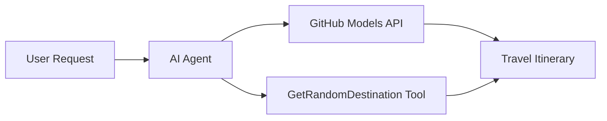

# 🌍 AI Travel Agent with Microsoft Agent Framework (.NET)

## 📋 Scenario Overview

This example demonstrates how to build an intelligent travel planning agent using the Microsoft Agent Framework for .NET. The agent can automatically generate personalized day-trip itineraries for random destinations around the world.

### Key Capabilities:

- 🎲 **Random Destination Selection**: Uses a custom tool to pick vacation spots
- 🗺️ **Intelligent Trip Planning**: Creates detailed day-by-day itineraries
- 🔄 **Real-time Streaming**: Supports both immediate and streaming responses
- 🛠️ **Custom Tool Integration**: Demonstrates how to extend agent capabilities

## 🔧 Technical Architecture

### Core Technologies

- **Microsoft Agent Framework**: Latest .NET implementation for AI agent development
- **GitHub Models Integration**: Uses GitHub's AI model inference service
- **OpenAI API Compatibility**: Leverages OpenAI client libraries with custom endpoints
- **Secure Configuration**: Environment-based API key management

### Key Components

1. **AIAgent**: The main agent orchestrator that handles conversation flow
2. **Custom Tools**: `GetRandomDestination()` function available to the agent
3. **Chat Client**: GitHub Models-backed conversation interface
4. **Streaming Support**: Real-time response generation capabilities

### Integration Pattern



## 🚀 Getting Started

### Prerequisites

- [.NET 10 SDK](https://dotnet.microsoft.com/download/dotnet/10.0) or higher
- [GitHub Models API access token](https://docs.github.com/github-models/github-models-at-scale/using-your-own-api-keys-in-github-models)

### Required Environment Variables

```bash
# zsh/bash
export GH_TOKEN=<your_github_token>
export GH_ENDPOINT=https://models.github.ai/inference
export GH_MODEL_ID=openai/gpt-5-mini
```

```powershell
# PowerShell
$env:GH_TOKEN = "<your_github_token>"
$env:GH_ENDPOINT = "https://models.github.ai/inference"
$env:GH_MODEL_ID = "openai/gpt-5-mini"
```

### Sample Code

To run the code example,

```bash
# zsh/bash
chmod +x ./01-dotnet-agent-framework.cs
./01-dotnet-agent-framework.cs
```

Or using the dotnet CLI:

```bash
dotnet run ./01-dotnet-agent-framework.cs
```

See [`01-dotnet-agent-framework.cs`](./01-dotnet-agent-framework.cs) for the complete code.

```csharp
#!/usr/bin/dotnet run

#:package Microsoft.Extensions.AI@9.*
#:package Microsoft.Agents.AI.OpenAI@1.*-*

using System.ClientModel;
using System.ComponentModel;

using Microsoft.Agents.AI;
using Microsoft.Extensions.AI;

using OpenAI;

// Tool Function: Random Destination Generator
// This static method will be available to the agent as a callable tool
// The [Description] attribute helps the AI understand when to use this function
// This demonstrates how to create custom tools for AI agents
[Description("Provides a random vacation destination.")]
static string GetRandomDestination()
{
    // List of popular vacation destinations around the world
    // The agent will randomly select from these options
    var destinations = new List<string>
    {
        "Paris, France",
        "Tokyo, Japan",
        "New York City, USA",
        "Sydney, Australia",
        "Rome, Italy",
        "Barcelona, Spain",
        "Cape Town, South Africa",
        "Rio de Janeiro, Brazil",
        "Bangkok, Thailand",
        "Vancouver, Canada"
    };

    // Generate random index and return selected destination
    // Uses System.Random for simple random selection
    var random = new Random();
    int index = random.Next(destinations.Count);
    return destinations[index];
}

// Extract configuration from environment variables
// Retrieve the GitHub Models API endpoint, defaults to https://models.github.ai/inference if not specified
// Retrieve the model ID, defaults to openai/gpt-5-mini if not specified
// Retrieve the GitHub token for authentication, throws exception if not specified
var github_endpoint = Environment.GetEnvironmentVariable("GH_ENDPOINT") ?? "https://models.github.ai/inference";
var github_model_id = Environment.GetEnvironmentVariable("GH_MODEL_ID") ?? "openai/gpt-5-mini";
var github_token = Environment.GetEnvironmentVariable("GH_TOKEN") ?? throw new InvalidOperationException("GH_TOKEN is not set.");

// Configure OpenAI Client Options
// Create configuration options to point to GitHub Models endpoint
// This redirects OpenAI client calls to GitHub's model inference service
var openAIOptions = new OpenAIClientOptions()
{
    Endpoint = new Uri(github_endpoint)
};

// Initialize OpenAI Client with GitHub Models Configuration
// Create OpenAI client using GitHub token for authentication
// Configure it to use GitHub Models endpoint instead of OpenAI directly
var openAIClient = new OpenAIClient(new ApiKeyCredential(github_token), openAIOptions);

// Create AI Agent with Travel Planning Capabilities
// Initialize OpenAI client, get chat client for specified model, and create AI agent
// Configure agent with travel planning instructions and random destination tool
// The agent can now plan trips using the GetRandomDestination function
AIAgent agent = openAIClient
    .GetChatClient(github_model_id)
    .CreateAIAgent(
        instructions: "You are a helpful AI Agent that can help plan vacations for customers at random destinations",
        tools: [AIFunctionFactory.Create(GetRandomDestination)]
    );

// Execute Agent: Plan a Day Trip
// Run the agent with streaming enabled for real-time response display
// Shows the agent's thinking and response as it generates the content
// Provides better user experience with immediate feedback
await foreach (var update in agent.RunStreamingAsync("Plan me a day trip"))
{
    await Task.Delay(10);
    Console.Write(update);
}
```

## 🎓 Key Takeaways

1. **Agent Architecture**: The Microsoft Agent Framework provides a clean, type-safe approach to building AI agents in .NET
2. **Tool Integration**: Functions decorated with `[Description]` attributes become available tools for the agent
3. **Configuration Management**: Environment variables and secure credential handling follow .NET best practices
4. **OpenAI Compatibility**: GitHub Models integration works seamlessly through OpenAI-compatible APIs

## 🔗 Additional Resources

- [Microsoft Agent Framework Documentation](https://learn.microsoft.com/agent-framework)
- [GitHub Models Marketplace](https://github.com/marketplace?type=models)
- [Microsoft.Extensions.AI](https://learn.microsoft.com/dotnet/ai/microsoft-extensions-ai)
- [.NET Single File Apps](https://devblogs.microsoft.com/dotnet/announcing-dotnet-run-app)
