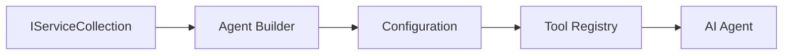

# 🎨 Agentic Design Patterns with GitHub Models (.NET)

## 📋 Learning Objectives

This example demonstrates enterprise-grade design patterns for building intelligent agents using the Microsoft Agent Framework in .NET with GitHub Models integration. You'll learn professional patterns and architectural approaches that make agents production-ready, maintainable, and scalable.

### Enterprise Design Patterns

- 🏭 **Factory Pattern**: Standardized agent creation with dependency injection
- 🔧 **Builder Pattern**: Fluent agent configuration and setup
- 🧵 **Thread-Safe Patterns**: Concurrent conversation management
- 📋 **Repository Pattern**: Organized tool and capability management

## 🎯 .NET-Specific Architectural Benefits

### Enterprise Features

- **Strong Typing**: Compile-time validation and IntelliSense support
- **Dependency Injection**: Built-in DI container integration
- **Configuration Management**: IConfiguration and Options patterns
- **Async/Await**: First-class asynchronous programming support

### Production-Ready Patterns

- **Logging Integration**: ILogger and structured logging support
- **Health Checks**: Built-in monitoring and diagnostics
- **Configuration Validation**: Strong typing with data annotations
- **Error Handling**: Structured exception management

## 🔧 Technical Architecture

### Core .NET Components

- **Microsoft.Extensions.AI**: Unified AI service abstractions
- **Microsoft.Agents.AI**: Enterprise agent orchestration framework
- **GitHub Models Integration**: High-performance API client patterns
- **Configuration System**: appsettings.json and environment integration

### Design Pattern Implementation



## 🏗️ Enterprise Patterns Demonstrated

### 1. **Creational Patterns**

- **Agent Factory**: Centralized agent creation with consistent configuration
- **Builder Pattern**: Fluent API for complex agent configuration
- **Singleton Pattern**: Shared resources and configuration management
- **Dependency Injection**: Loose coupling and testability

### 2. **Behavioral Patterns**

- **Strategy Pattern**: Interchangeable tool execution strategies
- **Command Pattern**: Encapsulated agent operations with undo/redo
- **Observer Pattern**: Event-driven agent lifecycle management
- **Template Method**: Standardized agent execution workflows

### 3. **Structural Patterns**

- **Adapter Pattern**: GitHub Models API integration layer
- **Decorator Pattern**: Agent capability enhancement
- **Facade Pattern**: Simplified agent interaction interfaces
- **Proxy Pattern**: Lazy loading and caching for performance

## 📚 .NET Design Principles

### SOLID Principles

- **Single Responsibility**: Each component has one clear purpose
- **Open/Closed**: Extensible without modification
- **Liskov Substitution**: Interface-based tool implementations
- **Interface Segregation**: Focused, cohesive interfaces
- **Dependency Inversion**: Depend on abstractions, not concretions

### Clean Architecture

- **Domain Layer**: Core agent and tool abstractions
- **Application Layer**: Agent orchestration and workflows
- **Infrastructure Layer**: GitHub Models integration and external services
- **Presentation Layer**: User interaction and response formatting

## 🔒 Enterprise Considerations

### Security

- **Credential Management**: Secure API key handling with IConfiguration
- **Input Validation**: Strong typing and data annotation validation
- **Output Sanitization**: Secure response processing and filtering
- **Audit Logging**: Comprehensive operation tracking

### Performance

- **Async Patterns**: Non-blocking I/O operations
- **Connection Pooling**: Efficient HTTP client management
- **Caching**: Response caching for improved performance
- **Resource Management**: Proper disposal and cleanup patterns

### Scalability

- **Thread Safety**: Concurrent agent execution support
- **Resource Pooling**: Efficient resource utilization
- **Load Management**: Rate limiting and backpressure handling
- **Monitoring**: Performance metrics and health checks

## 🚀 Production Deployment

- **Configuration Management**: Environment-specific settings
- **Logging Strategy**: Structured logging with correlation IDs
- **Error Handling**: Global exception handling with proper recovery
- **Monitoring**: Application insights and performance counters
- **Testing**: Unit tests, integration tests, and load testing patterns

Ready to build enterprise-grade intelligent agents with .NET? Let's architect something robust! 🏢✨

## 🚀 Getting Started

### Prerequisites

- [.NET 10 SDK](https://dotnet.microsoft.com/download/dotnet/10.0) or higher
- [GitHub Models API access token](https://docs.github.com/github-models/github-models-at-scale/using-your-own-api-keys-in-github-models)

### Required Environment Variables

```bash
# zsh/bash
export GH_TOKEN=<your_github_token>
export GH_ENDPOINT=https://models.github.ai/inference
export GH_MODEL_ID=openai/gpt-5-mini
```

```powershell
# PowerShell
$env:GH_TOKEN = "<your_github_token>"
$env:GH_ENDPOINT = "https://models.github.ai/inference"
$env:GH_MODEL_ID = "openai/gpt-5-mini"
```

### Sample Code

To run the code example,

```bash
# zsh/bash
chmod +x ./03-dotnet-agent-framework.cs
./03-dotnet-agent-framework.cs
```

Or using the dotnet CLI:

```bash
dotnet run ./03-dotnet-agent-framework.cs
```

See [`03-dotnet-agent-framework.cs`](./03-dotnet-agent-framework.cs) for the complete code.

```csharp
#!/usr/bin/dotnet run

#:package Microsoft.Extensions.AI@10.*
#:package Microsoft.Agents.AI.OpenAI@1.*-*

using System.ClientModel;
using System.ComponentModel;

using Microsoft.Agents.AI;
using Microsoft.Extensions.AI;

using OpenAI;

// Tool Function: Random Destination Generator
// This static method will be available to the agent as a callable tool
// The [Description] attribute helps the AI understand when to use this function
// This demonstrates how to create custom tools for AI agents
[Description("Provides a random vacation destination.")]
static string GetRandomDestination()
{
    // List of popular vacation destinations around the world
    // The agent will randomly select from these options
    var destinations = new List<string>
    {
        "Paris, France",
        "Tokyo, Japan",
        "New York City, USA",
        "Sydney, Australia",
        "Rome, Italy",
        "Barcelona, Spain",
        "Cape Town, South Africa",
        "Rio de Janeiro, Brazil",
        "Bangkok, Thailand",
        "Vancouver, Canada"
    };

    // Generate random index and return selected destination
    // Uses System.Random for simple random selection
    var random = new Random();
    int index = random.Next(destinations.Count);
    return destinations[index];
}

// Extract configuration from environment variables
// Retrieve the GitHub Models API endpoint, defaults to https://models.github.ai/inference if not specified
// Retrieve the model ID, defaults to openai/gpt-5-mini if not specified
// Retrieve the GitHub token for authentication, throws exception if not specified
var github_endpoint = Environment.GetEnvironmentVariable("GH_ENDPOINT") ?? "https://models.github.ai/inference";
var github_model_id = Environment.GetEnvironmentVariable("GH_MODEL_ID") ?? "openai/gpt-5-mini";
var github_token = Environment.GetEnvironmentVariable("GH_TOKEN") ?? throw new InvalidOperationException("GH_TOKEN is not set.");

// Configure OpenAI Client Options
// Create configuration options to point to GitHub Models endpoint
// This redirects OpenAI client calls to GitHub's model inference service
var openAIOptions = new OpenAIClientOptions()
{
    Endpoint = new Uri(github_endpoint)
};

// Initialize OpenAI Client with GitHub Models Configuration
// Create OpenAI client using GitHub token for authentication
// Configure it to use GitHub Models endpoint instead of OpenAI directly
var openAIClient = new OpenAIClient(new ApiKeyCredential(github_token), openAIOptions);

// Define Agent Identity and Comprehensive Instructions
// Agent name for identification and logging purposes
var AGENT_NAME = "TravelAgent";

// Detailed instructions that define the agent's personality, capabilities, and behavior
// This system prompt shapes how the agent responds and interacts with users
var AGENT_INSTRUCTIONS = """
You are a helpful AI Agent that can help plan vacations for customers.

Important: When users specify a destination, always plan for that location. Only suggest random destinations when the user hasn't specified a preference.

When the conversation begins, introduce yourself with this message:
"Hello! I'm your TravelAgent assistant. I can help plan vacations and suggest interesting destinations for you. Here are some things you can ask me:
1. Plan a day trip to a specific location
2. Suggest a random vacation destination
3. Find destinations with specific features (beaches, mountains, historical sites, etc.)
4. Plan an alternative trip if you don't like my first suggestion

What kind of trip would you like me to help you plan today?"

Always prioritize user preferences. If they mention a specific destination like "Bali" or "Paris," focus your planning on that location rather than suggesting alternatives.
""";

// Create AI Agent with Advanced Travel Planning Capabilities
// Initialize complete agent pipeline: OpenAI client → Chat client → AI agent
// Configure agent with name, detailed instructions, and available tools
// This demonstrates the .NET agent creation pattern with full configuration
AIAgent agent = openAIClient
    .GetChatClient(github_model_id)
    .CreateAIAgent(
        name: AGENT_NAME,
        instructions: AGENT_INSTRUCTIONS,
        tools: [AIFunctionFactory.Create(GetRandomDestination)]
    );

// Create New Conversation Thread for Context Management
// Initialize a new conversation thread to maintain context across multiple interactions
// Threads enable the agent to remember previous exchanges and maintain conversational state
// This is essential for multi-turn conversations and contextual understanding
AgentThread thread = agent.GetNewThread();

// Execute Agent: First Travel Planning Request
// Run the agent with an initial request that will likely trigger the random destination tool
// The agent will analyze the request, use the GetRandomDestination tool, and create an itinerary
// Using the thread parameter maintains conversation context for subsequent interactions
await foreach (var update in agent.RunStreamingAsync("Plan me a day trip", thread))
{
    await Task.Delay(10);
    Console.Write(update);
}

Console.WriteLine();

// Execute Agent: Follow-up Request with Context Awareness
// Demonstrate contextual conversation by referencing the previous response
// The agent remembers the previous destination suggestion and will provide an alternative
// This showcases the power of conversation threads and contextual understanding in .NET agents
await foreach (var update in agent.RunStreamingAsync("I don't like that destination. Plan me another vacation.", thread))
{
    await Task.Delay(10);
    Console.Write(update);
}
```