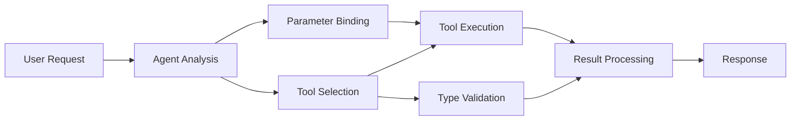

# 🛠️ Advanced Tool Use with GitHub Models (.NET)

## 📋 Learning Objectives

This notebook demonstrates enterprise-grade tool integration patterns using the Microsoft Agent Framework in .NET with GitHub Models. You'll learn to build sophisticated agents with multiple specialized tools, leveraging C#'s strong typing and .NET's enterprise features.

### Advanced Tool Capabilities You'll Master

- 🔧 **Multi-Tool Architecture**: Building agents with multiple specialized capabilities
- 🎯 **Type-Safe Tool Execution**: Leveraging C#'s compile-time validation
- 📊 **Enterprise Tool Patterns**: Production-ready tool design and error handling
- 🔗 **Tool Composition**: Combining tools for complex business workflows

## 🎯 .NET Tool Architecture Benefits

### Enterprise Tool Features

- **Compile-Time Validation**: Strong typing ensures tool parameter correctness
- **Dependency Injection**: IoC container integration for tool management
- **Async/Await Patterns**: Non-blocking tool execution with proper resource management
- **Structured Logging**: Built-in logging integration for tool execution monitoring

### Production-Ready Patterns

- **Exception Handling**: Comprehensive error management with typed exceptions
- **Resource Management**: Proper disposal patterns and memory management
- **Performance Monitoring**: Built-in metrics and performance counters
- **Configuration Management**: Type-safe configuration with validation

## 🔧 Technical Architecture

### Core .NET Tool Components

- **Microsoft.Extensions.AI**: Unified tool abstraction layer
- **Microsoft.Agents.AI**: Enterprise-grade tool orchestration
- **GitHub Models Integration**: High-performance API client with connection pooling

### Tool Execution Pipeline



## 🛠️ Tool Categories & Patterns

### 1. **Data Processing Tools**

- **Input Validation**: Strong typing with data annotations
- **Transform Operations**: Type-safe data conversion and formatting
- **Business Logic**: Domain-specific calculation and analysis tools
- **Output Formatting**: Structured response generation

### 2. **Integration Tools** 

- **API Connectors**: RESTful service integration with HttpClient
- **Database Tools**: Entity Framework integration for data access
- **File Operations**: Secure file system operations with validation
- **External Services**: Third-party service integration patterns

### 3. **Utility Tools**

- **Text Processing**: String manipulation and formatting utilities
- **Date/Time Operations**: Culture-aware date/time calculations
- **Mathematical Tools**: Precision calculations and statistical operations
- **Validation Tools**: Business rule validation and data verification

Ready to build enterprise-grade agents with powerful, type-safe tool capabilities in .NET? Let's architect some professional-grade solutions! 🏢⚡

## 🚀 Getting Started

### Prerequisites

- [.NET 10 SDK](https://dotnet.microsoft.com/download/dotnet/10.0) or higher
- [GitHub Models API access token](https://docs.github.com/github-models/github-models-at-scale/using-your-own-api-keys-in-github-models)

### Required Environment Variables

```bash
# zsh/bash
export GH_TOKEN=<your_github_token>
export GH_ENDPOINT=https://models.github.ai/inference
export GH_MODEL_ID=openai/gpt-5-mini
```

```powershell
# PowerShell
$env:GH_TOKEN = "<your_github_token>"
$env:GH_ENDPOINT = "https://models.github.ai/inference"
$env:GH_MODEL_ID = "openai/gpt-5-mini"
```

### Sample Code

To run the code example,

```bash
# zsh/bash
chmod +x ./04-dotnet-agent-framework.cs
./04-dotnet-agent-framework.cs
```

Or using the dotnet CLI:

```bash
dotnet run ./04-dotnet-agent-framework.cs
```

See [`04-dotnet-agent-framework.cs`](./04-dotnet-agent-framework.cs) for the complete code.

```csharp
#!/usr/bin/dotnet run

#:package Microsoft.Extensions.AI@10.*
#:package Microsoft.Agents.AI.OpenAI@1.*-*

using System.ClientModel;
using System.ComponentModel;

using Microsoft.Agents.AI;
using Microsoft.Extensions.AI;

using OpenAI;

// Tool Function: Random Destination Generator
// This static method will be available to the agent as a callable tool
// The [Description] attribute helps the AI understand when to use this function
// This demonstrates how to create custom tools for AI agents
[Description("Provides a random vacation destination.")]
static string GetRandomDestination()
{
    // List of popular vacation destinations around the world
    // The agent will randomly select from these options
    var destinations = new List<string>
    {
        "Paris, France",
        "Tokyo, Japan",
        "New York City, USA",
        "Sydney, Australia",
        "Rome, Italy",
        "Barcelona, Spain",
        "Cape Town, South Africa",
        "Rio de Janeiro, Brazil",
        "Bangkok, Thailand",
        "Vancouver, Canada"
    };

    // Generate random index and return selected destination
    // Uses System.Random for simple random selection
    var random = new Random();
    int index = random.Next(destinations.Count);
    return destinations[index];
}

// Extract configuration from environment variables
// Retrieve the GitHub Models API endpoint, defaults to https://models.github.ai/inference if not specified
// Retrieve the model ID, defaults to openai/gpt-5-mini if not specified
// Retrieve the GitHub token for authentication, throws exception if not specified
var github_endpoint = Environment.GetEnvironmentVariable("GH_ENDPOINT") ?? "https://models.github.ai/inference";
var github_model_id = Environment.GetEnvironmentVariable("GH_MODEL_ID") ?? "openai/gpt-5-mini";
var github_token = Environment.GetEnvironmentVariable("GH_TOKEN") ?? throw new InvalidOperationException("GH_TOKEN is not set.");

// Configure OpenAI Client Options
// Create configuration options to point to GitHub Models endpoint
// This redirects OpenAI client calls to GitHub's model inference service
var openAIOptions = new OpenAIClientOptions()
{
    Endpoint = new Uri(github_endpoint)
};

// Initialize OpenAI Client with GitHub Models Configuration
// Create OpenAI client using GitHub token for authentication
// Configure it to use GitHub Models endpoint instead of OpenAI directly
var openAIClient = new OpenAIClient(new ApiKeyCredential(github_token), openAIOptions);

// Define Agent Identity and Comprehensive Instructions
// Agent name for identification and logging purposes
var AGENT_NAME = "TravelAgent";

// Detailed instructions that define the agent's personality, capabilities, and behavior
// This system prompt shapes how the agent responds and interacts with users
var AGENT_INSTRUCTIONS = """
You are a helpful AI Agent that can help plan vacations for customers.

Important: When users specify a destination, always plan for that location. Only suggest random destinations when the user hasn't specified a preference.

When the conversation begins, introduce yourself with this message:
"Hello! I'm your TravelAgent assistant. I can help plan vacations and suggest interesting destinations for you. Here are some things you can ask me:
1. Plan a day trip to a specific location
2. Suggest a random vacation destination
3. Find destinations with specific features (beaches, mountains, historical sites, etc.)
4. Plan an alternative trip if you don't like my first suggestion

What kind of trip would you like me to help you plan today?"

Always prioritize user preferences. If they mention a specific destination like "Bali" or "Paris," focus your planning on that location rather than suggesting alternatives.
""";

// Create AI Agent with Advanced Travel Planning Capabilities
// Initialize complete agent pipeline: OpenAI client → Chat client → AI agent
// Configure agent with name, detailed instructions, and available tools
// This demonstrates the .NET agent creation pattern with full configuration
AIAgent agent = openAIClient
    .GetChatClient(github_model_id)
    .CreateAIAgent(
        name: AGENT_NAME,
        instructions: AGENT_INSTRUCTIONS,
        tools: [AIFunctionFactory.Create(GetRandomDestination)]
    );

// Create New Conversation Thread for Context Management
// Initialize a new conversation thread to maintain context across multiple interactions
// Threads enable the agent to remember previous exchanges and maintain conversational state
// This is essential for multi-turn conversations and contextual understanding
AgentThread thread = agent.GetNewThread();

// Execute Agent: First Travel Planning Request
// Run the agent with an initial request that will likely trigger the random destination tool
// The agent will analyze the request, use the GetRandomDestination tool, and create an itinerary
// Using the thread parameter maintains conversation context for subsequent interactions
await foreach (var update in agent.RunStreamingAsync("Plan me a day trip", thread))
{
    await Task.Delay(10);
    Console.Write(update);
}

Console.WriteLine();

// Execute Agent: Follow-up Request with Context Awareness
// Demonstrate contextual conversation by referencing the previous response
// The agent remembers the previous destination suggestion and will provide an alternative
// This showcases the power of conversation threads and contextual understanding in .NET agents
await foreach (var update in agent.RunStreamingAsync("I don't like that destination. Plan me another vacation.", thread))
{
    await Task.Delay(10);
    Console.Write(update);
}
```