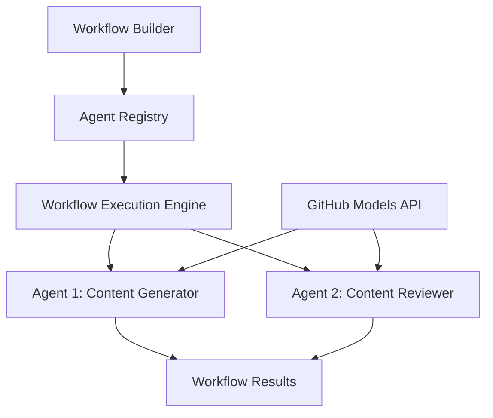

# 🔄 Basic Agent Workflows with GitHub Models (.NET)

## 📋 Workflow Orchestration Tutorial

This notebook demonstrates how to build sophisticated **agent workflows** using the Microsoft Agent Framework for .NET and GitHub Models. You'll learn to create multi-step business processes where AI agents collaborate to accomplish complex tasks through structured orchestration patterns.

## 🎯 Learning Objectives

### 🏗️ **Workflow Architecture Fundamentals**
- **Workflow Builder**: Design and orchestrate complex multi-step AI processes
- **Agent Coordination**: Coordinate multiple specialized agents within workflows
- **GitHub Models Integration**: Leverage GitHub's AI model inference service in workflows
- **Visual Workflow Design**: Create and visualize workflow structures for better understanding

### 🔄 **Process Orchestration Patterns**
- **Sequential Processing**: Chain multiple agent tasks in logical order
- **State Management**: Maintain context and data flow across workflow stages
- **Error Handling**: Implement robust error recovery and workflow resilience
- **Performance Optimization**: Design efficient workflows for enterprise-scale operations

### 🏢 **Enterprise Workflow Applications**
- **Business Process Automation**: Automate complex organizational workflows
- **Content Production Pipeline**: Editorial workflows with review and approval stages
- **Customer Service Automation**: Multi-step customer inquiry resolution
- **Data Processing Workflows**: ETL workflows with AI-powered transformation

## ⚙️ Prerequisites & Setup

### 📦 **Required NuGet Packages**

This workflow demonstration uses several key .NET packages:

```xml
<!-- Core AI Framework -->
<PackageReference Include="Microsoft.Extensions.AI" Version="9.9.0" />

<!-- Agent Framework (Local Development) -->
<!-- Microsoft.Agents.AI.dll - Core agent abstractions -->
<!-- Microsoft.Agents.AI.OpenAI.dll - OpenAI/GitHub Models integration -->

<!-- Configuration and Environment -->
<PackageReference Include="DotNetEnv" Version="3.1.1" />
```

### 🔑 **GitHub Models Configuration**

**Environment Setup (.env file):**
```env
GITHUB_TOKEN=your_github_personal_access_token
GITHUB_ENDPOINT=https://models.inference.ai.azure.com
GITHUB_MODEL_ID=gpt-4o-mini
```

**GitHub Models Access:**
1. Sign up for GitHub Models (currently in preview)
2. Generate a personal access token with model access permissions
3. Configure environment variables as shown above

### 🏗️ **Workflow Architecture Overview**



**Key Components:**
- **WorkflowBuilder**: Main orchestration engine for designing workflows
- **AIAgent**: Individual specialized agents with specific capabilities
- **GitHub Models Client**: AI model inference service integration
- **Execution Context**: Manages state and data flow between workflow stages

## 🎨 **Enterprise Workflow Design Patterns**

### 📝 **Content Production Workflow**
```
User Request → Content Generation → Quality Review → Final Output
```

### 🔍 **Document Processing Pipeline**
```
Document Input → Analysis → Extraction → Validation → Structured Output
```

### 💼 **Business Intelligence Workflow**
```
Data Collection → Processing → Analysis → Report Generation → Distribution
```

### 🤝 **Customer Service Automation**
```
Customer Inquiry → Classification → Processing → Response Generation → Follow-up
```

## 🏢 **Enterprise Benefits**

### 🎯 **Reliability & Scalability**
- **Deterministic Execution**: Consistent, repeatable workflow outcomes
- **Error Recovery**: Graceful handling of failures at any workflow stage
- **Performance Monitoring**: Track execution metrics and optimization opportunities
- **Resource Management**: Efficient allocation and utilization of AI model resources

### 🔒 **Security & Compliance**
- **Secure Authentication**: GitHub token-based authentication for API access
- **Audit Trails**: Complete logging of workflow execution and decision points
- **Access Control**: Granular permissions for workflow execution and monitoring
- **Data Privacy**: Secure handling of sensitive information throughout workflows

### 📊 **Observability & Management**
- **Visual Workflow Design**: Clear representation of process flows and dependencies
- **Execution Monitoring**: Real-time tracking of workflow progress and performance
- **Error Reporting**: Detailed error analysis and debugging capabilities
- **Performance Analytics**: Metrics for optimization and capacity planning

Let's build your first enterprise-ready AI workflow! 🚀

## 💻 Running the Code

The complete implementation is available in `01.dotnet-agent-framework-workflow-ghmodel-basic.cs`. This file demonstrates:

1. **Environment Configuration** - Loading GitHub Models credentials from `.env` file
2. **OpenAI Client Setup** - Configuring the client to use GitHub Models endpoint
3. **Agent Creation** - Defining specialized agents (Front Desk and Concierge)
4. **Workflow Builder** - Creating a multi-agent workflow with sequential processing
5. **Workflow Execution** - Running the workflow with streaming results

### 🚀 Running the Example

```bash
# Make the script executable (Unix/Linux/macOS)
chmod +x 01.dotnet-agent-framework-workflow-ghmodel-basic.cs

# Run the workflow
./01.dotnet-agent-framework-workflow-ghmodel-basic.cs
```

Or on Windows:
```powershell
dotnet run 01.dotnet-agent-framework-workflow-ghmodel-basic.cs
```

### 📝 Expected Output

The workflow will:
1. Accept your travel destination request ("I would like to go to Paris")
2. The Front Desk agent provides an initial recommendation
3. The Concierge agent reviews and refines the recommendation
4. Final output displays the complete conversation stream

### 🔧 Customization

You can customize the workflow by:
- Modifying agent instructions to change their behavior
- Adding more agents to create complex multi-step workflows
- Changing the user message to test different scenarios
- Adjusting the workflow edges to create different execution patterns
