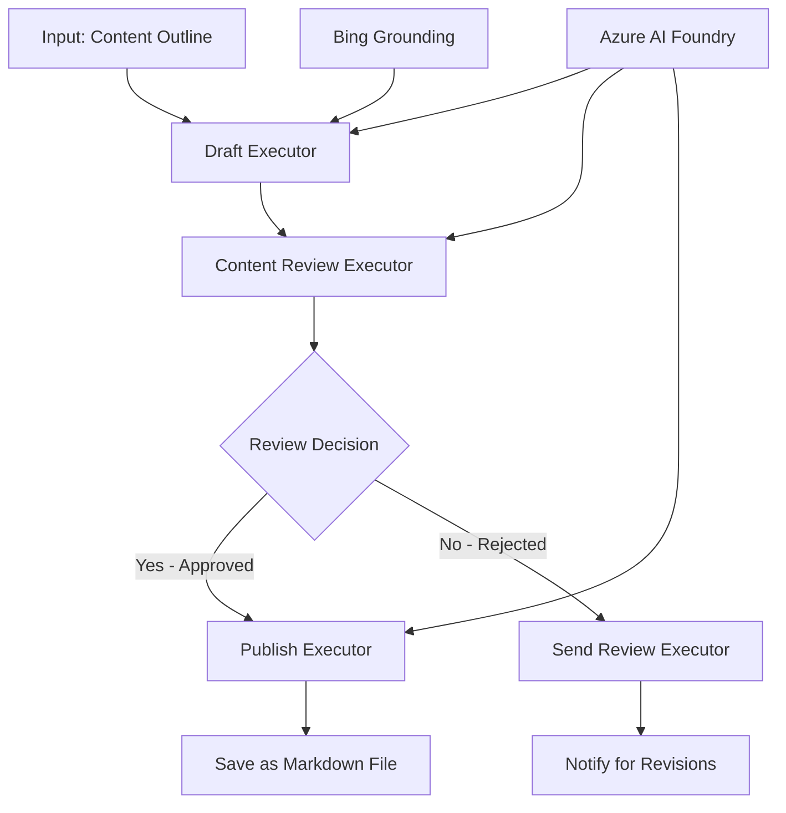

# 🔀 Conditional Agent Workflows with Azure AI Foundry (.NET)

## 📋 Intelligent Decision-Based Workflow Tutorial

This notebook demonstrates **conditional workflow patterns** using Azure AI Foundry and the Microsoft Agent Framework for .NET. You'll learn how to build sophisticated, decision-driven workflows that intelligently route processing based on AI analysis, business rules, and dynamic conditions for enterprise-grade automation.

## 🎯 Learning Objectives

### 🧠 **Intelligent Decision Architecture**
- **Conditional Logic Implementation**: Build complex decision trees with multiple branching points
- **AI-Powered Routing**: Use Azure AI Foundry models to make intelligent routing decisions
- **Dynamic Workflow Adaptation**: Modify workflow behavior based on runtime analysis and conditions
- **Enterprise Rule Integration**: Incorporate business logic and compliance requirements into workflows

### 🔀 **Advanced Conditional Patterns**
- **Multi-Criteria Decision Making**: Evaluate multiple factors for routing decisions
- **Context-Aware Processing**: Make decisions based on accumulated workflow context and history
- **Adaptive Workflow Modification**: Dynamically adjust processing paths based on real-time conditions
- **Rule Engine Integration**: Implement sophisticated business rule engines within workflows

### 🏢 **Enterprise Conditional Applications**
- **Document Classification & Routing**: Automatically classify and route documents to appropriate workflows
- **Customer Service Triage**: Intelligent routing of customer inquiries to specialized handling teams
- **Compliance & Risk Processing**: Apply different validation and review processes based on risk assessment
- **Quality Assurance Workflows**: Route content through appropriate review processes based on quality metrics

## ⚙️ Prerequisites & Setup

### 📦 **Required NuGet Packages**

Advanced packages for conditional workflow processing:

```xml
<!-- Core AI Framework -->
<PackageReference Include="Microsoft.Extensions.AI" Version="9.9.0" />

<!-- Azure AI Agents with Persistent State -->
<PackageReference Include="Azure.AI.Agents.Persistent" Version="1.2.0-beta.5" />

<!-- Azure Identity and Utilities -->
<PackageReference Include="Azure.Identity" Version="1.15.0" />
<PackageReference Include="System.Linq.Async" Version="6.0.3" />
<PackageReference Include="DotNetEnv" Version="3.1.1" />

<!-- Local Workflow Framework References -->
<!-- Microsoft.Agents.Workflows.dll - Advanced workflow orchestration -->
<!-- Microsoft.Agents.AI.AzureAI.dll - Azure AI Foundry integration -->
<!-- Microsoft.Agents.AI.dll - Core agent abstractions -->
```

### 🔑 **Azure AI Foundry Configuration**

**Required Azure Resources:**
- Azure AI Foundry workspace with conditional processing models
- Azure subscription with appropriate compute quotas and permissions
- Deployed AI models for decision making and content analysis
- (Optional) Bing Search API connection for grounding capabilities

**Environment Configuration (.env file):**
```env
# Azure AI Foundry Configuration
AZURE_AI_PROJECT_ENDPOINT=https://your-project.cognitiveservices.azure.com/
BING_CONNECTION_ID=your-bing-connection-id
```

**Authentication Setup:**
```csharp
// Azure CLI or Managed Identity authentication
using Azure.Identity;
var credential = new AzureCliCredential();

// Load environment configuration
DotNetEnv.Env.Load("../../../.env");
```

### 🏗️ **Conditional Workflow Architecture**



**Key Components:**
- **Draft Executor**: AI agent that creates initial content drafts from outlines
- **Content Review Executor**: AI agent that evaluates draft quality and compliance
- **Conditional Routing**: Decision logic that routes based on review results
- **Publish/Review Paths**: Separate processing paths for approved vs rejected content
- **State Management**: Maintains content and review context throughout workflow

## 🎨 **Conditional Workflow Design Patterns**

### 📋 **Content Production with Quality Gates**
```
Outline → Draft Creation → Quality Review → {Approve: Publish | Reject: Revise}
```

### 🎯 **Risk-Based Document Processing**
```
Document → Risk Assessment → {Low: Standard | High: Enhanced Review}
```

### 🔍 **Intelligent Customer Service Routing**
```
Customer Query → Analysis → {Simple: FAQ Bot | Complex: Human Agent}
```

### 💼 **Compliance-Driven Workflows**
```
Content → Compliance Check → {Pass: Publish | Fail: Legal Review}
```

## 🏢 **Enterprise Conditional Benefits**

### 🎯 **Intelligent Automation**
- **Smart Decision Making**: AI-powered routing decisions based on content analysis and context
- **Adaptive Processing**: Workflows that automatically adjust based on changing conditions
- **Business Rule Enforcement**: Automatic application of complex business logic and policies
- **Context-Aware Routing**: Decisions based on full workflow history and accumulated context

### 📈 **Operational Excellence**
- **Optimized Resource Allocation**: Route work to most appropriate specialists and processes
- **Reduced Manual Intervention**: Automated decision making minimizes need for human routing
- **Faster Resolution Times**: Direct routing to appropriate expertise and processing capabilities
- **Consistent Application**: Uniform application of business rules and decision criteria

### 🛡️ **Risk Management & Compliance**
- **Automated Risk Assessment**: AI-powered evaluation of content and situation risk levels
- **Compliance Enforcement**: Automatic routing through required regulatory processes
- **Security Protocol Application**: Enhanced security measures applied based on risk assessment
- **Audit Trail Maintenance**: Complete documentation of routing decisions and rationale

### 📊 **Analytics & Continuous Improvement**
- **Decision Analytics**: Track effectiveness and accuracy of routing decisions
- **Pattern Recognition**: Identify trends and patterns in routing decisions over time
- **Performance Optimization**: Continuous improvement of decision criteria and routing efficiency
- **Business Intelligence**: Insights into content characteristics and processing requirements

### 🔧 **Technical Excellence**
- **Persistent State Management**: Maintain complex state across workflow execution
- **Scalable Architecture**: Handle high-volume conditional processing requirements
- **Integration Capabilities**: Seamless integration with existing business systems and processes
- **Monitoring & Observability**: Comprehensive tracking of workflow performance and decisions

Let's build intelligent, decision-driven enterprise workflows with .NET! 🚀

## 💻 Running the Code

The complete implementation is available in `04.dotnet-agent-framework-workflow-aifoundry-condition.cs`. This demonstrates a **content production workflow with quality gates**:

### 🏗️ **Workflow Architecture**

```
Content Outline → Draft Creation → Quality Review → Conditional Routing:
                                                      ├─ Approved (>200 words) → Publish
                                                      └─ Rejected (<200 words) → Review Notification
```

**Agents in the Workflow:**
1. **Evangelist Agent**: Creates tutorial drafts from outlines with Bing grounding
2. **Content Reviewer Agent**: Evaluates draft quality (word count, completeness)
3. **Publisher Agent**: Saves approved content as timestamped Markdown files

**Custom Executors:**
1. **DraftExecutor**: Orchestrates draft creation
2. **ContentReviewExecutor**: Performs quality assessment
3. **PublishExecutor**: Handles approved content publication
4. **SendReviewExecutor**: Manages rejected content notifications

### 🚀 Running the Example

**Prerequisites:**
- Azure AI Foundry workspace configured
- Azure CLI authentication (`az login`)
- (Optional) Bing Search connection for grounding

```bash
# Make the script executable (Unix/Linux/macOS)
chmod +x 04.dotnet-agent-framework-workflow-aifoundry-condition.cs

# Run the conditional workflow
./04.dotnet-agent-framework-workflow-aifoundry-condition.cs
```

Or on Windows:
```powershell
dotnet run 04.dotnet-agent-framework-workflow-aifoundry-condition.cs
```

### 📝 Expected Output

The workflow will:
1. **Create Agents**: Initialize three specialized Azure AI Foundry agents
2. **Generate Draft**: Evangelist agent creates tutorial draft from outline
3. **Review Content**: Content Reviewer evaluates draft quality
4. **Conditional Routing**:
   - **If approved (>200 words)**: Publish executor saves as Markdown file
   - **If rejected (<200 words)**: Send review notification
5. **Display Results**: Show final workflow outcome

### 🔧 Customization Options

**Modify Review Criteria:**
```csharp
const string ContentReviewerInstructions = @"
You are a content reviewer...
1. Check if content is more than 500 words (instead of 200)
2. Verify technical accuracy
3. Ensure proper formatting
...";
```

**Add More Conditional Paths:**
```csharp
var workflow = new WorkflowBuilder(draftExecutor)
    .AddEdge(draftExecutor, contentReviewerExecutor)
    .AddEdge(contentReviewerExecutor, publishExecutor, condition: GetCondition("Excellent"))
    .AddEdge(contentReviewerExecutor, editExecutor, condition: GetCondition("Good"))
    .AddEdge(contentReviewerExecutor, sendReviewerExecutor, condition: GetCondition("Poor"))
    .Build();
```

**Change Content Requirements:**
```csharp
string OUTLINE_Content = @"
# Your Custom Topic
## Section 1
https://your-reference-url
## Section 2
...
";
```

### 🎯 Real-World Applications

This conditional workflow pattern is ideal for:
- **Content Management Systems**: Automated editorial workflows with quality gates
- **Document Processing**: Route documents based on classification and compliance
- **Customer Support**: Intelligent ticket routing based on complexity and urgency
- **Legal Review**: Route contracts based on risk assessment and value
- **HR Processes**: Route applications through appropriate screening workflows

### 🔍 Understanding Conditional Logic

**Condition Function:**
```csharp
public Func<object?, bool> GetCondition(string expectedResult) =>
    reviewResult => reviewResult is ReviewResult review && review.Result == expectedResult;
```

This function creates a predicate that:
1. Checks if the result is of type `ReviewResult`
2. Compares the `Result` property to the expected value
3. Returns true/false to determine routing

**Workflow Edges with Conditions:**
```csharp
.AddEdge(contentReviewerExecutor, publishExecutor, condition: GetCondition("Yes"))
.AddEdge(contentReviewerExecutor, sendReviewerExecutor, condition: GetCondition("No"))
```

### 📊 Advanced Features

**JSON Schema Validation:**
The workflow uses JSON schemas to ensure structured responses:

```csharp
// Define response structure
public class ReviewResult
{
    [JsonPropertyName("review_result")]
    public string Result { get; set; } = string.Empty;
    
    [JsonPropertyName("reason")]
    public string Reason { get; set; } = string.Empty;
    
    [JsonPropertyName("draft_content")]
    public string DraftContent { get; set; } = string.Empty;
}

// Apply to agent
ResponseFormat = ChatResponseFormat.ForJsonSchema(
    AIJsonUtilities.CreateJsonSchema(typeof(ReviewResult)), 
    "ReviewResult", 
    "Review Result From DraftContent"
)
```

**Bing Grounding Integration:**
The Evangelist agent uses Bing grounding to access real-time information:

```csharp
var bingGroundingConfig = new BingGroundingSearchConfiguration(bing_conn_id);
BingGroundingToolDefinition bingGroundingTool = new(
    new BingGroundingSearchToolParameters([bingGroundingConfig])
);
```

This enables the agent to follow URLs in the outline and extract current information.

### 🛡️ Error Handling

The workflow includes robust error handling for rejected content:
- Review failures trigger the alternative path
- Notifications provide clear rejection reasons
- Content is preserved for revision

### 🔄 Extending the Workflow

**Add a Revision Loop:**
Create a feedback loop that re-drafts content automatically:

```csharp
.AddEdge(contentReviewerExecutor, publishExecutor, condition: GetCondition("Yes"))
.AddEdge(contentReviewerExecutor, draftExecutor, condition: GetCondition("No")) // Loop back
```

**Implement Multi-Level Review:**
Add multiple review stages with different criteria:

```csharp
.AddEdge(draftExecutor, technicalReviewer)
.AddEdge(technicalReviewer, editorialReviewer, condition: GetCondition("TechPass"))
.AddEdge(editorialReviewer, publishExecutor, condition: GetCondition("EditPass"))
```

This conditional workflow pattern provides the foundation for building sophisticated, intelligent enterprise automation systems! 🚀
