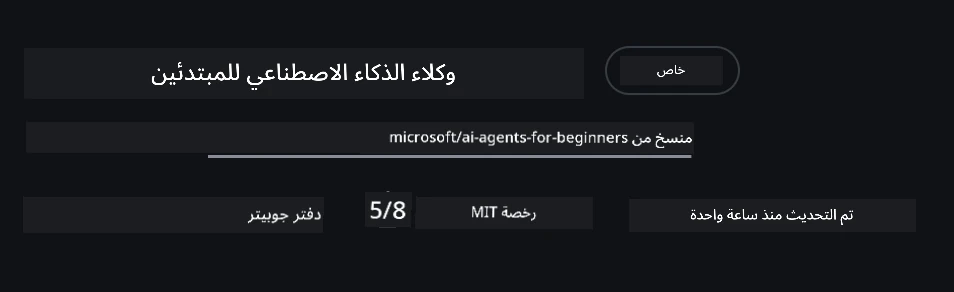
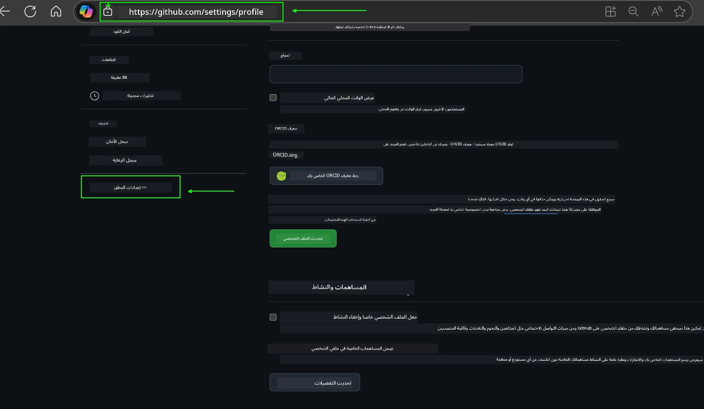
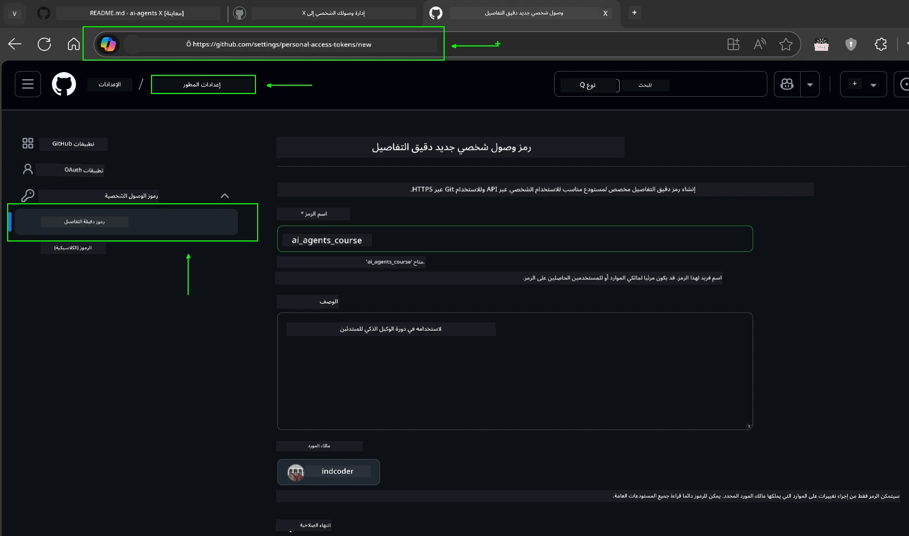
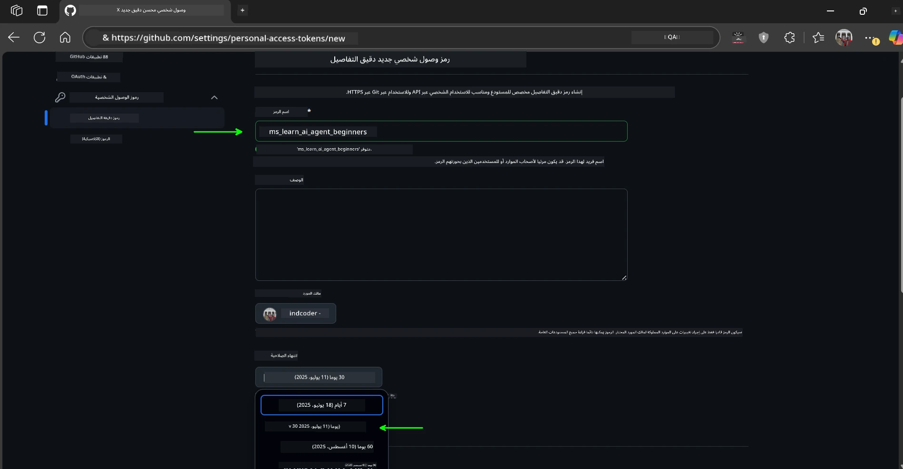
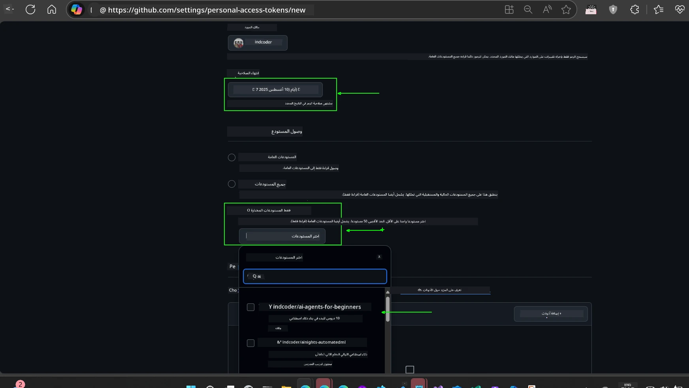
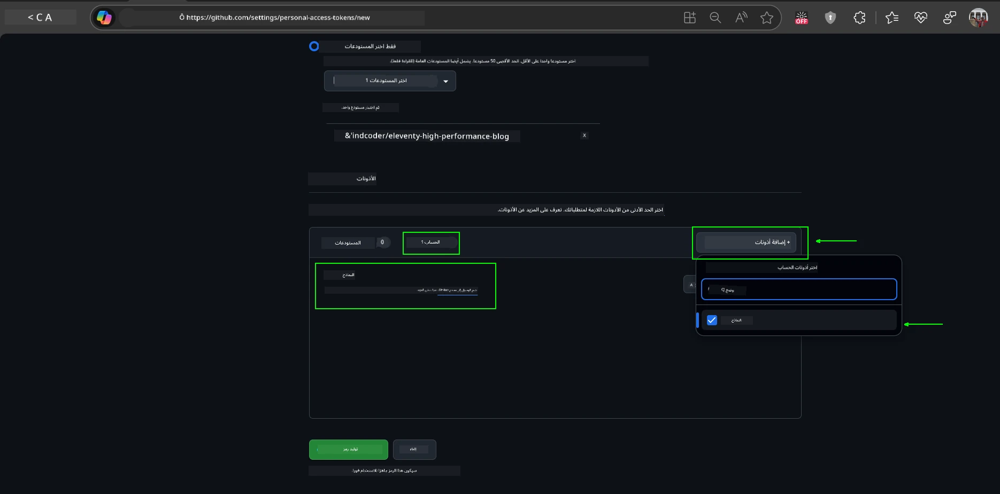
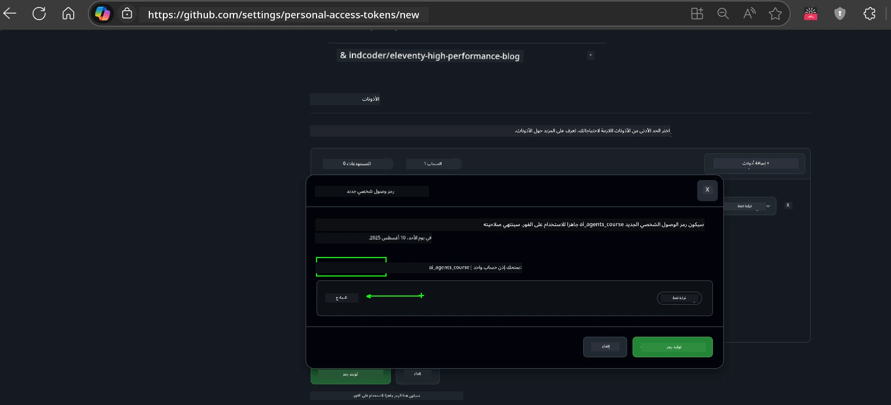
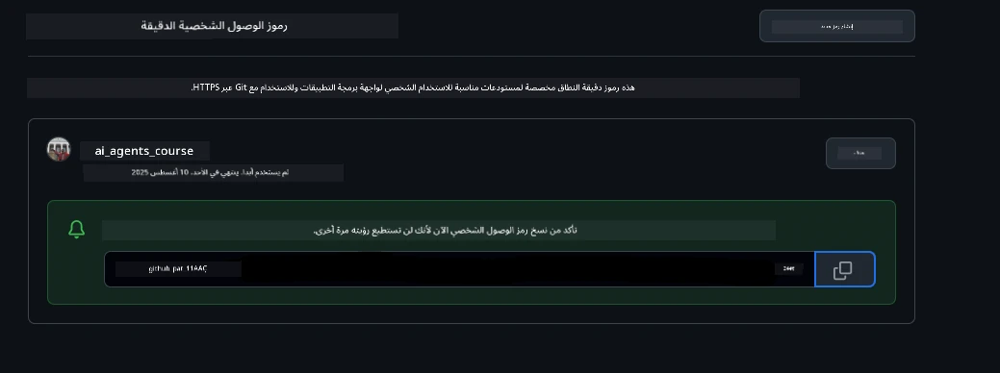
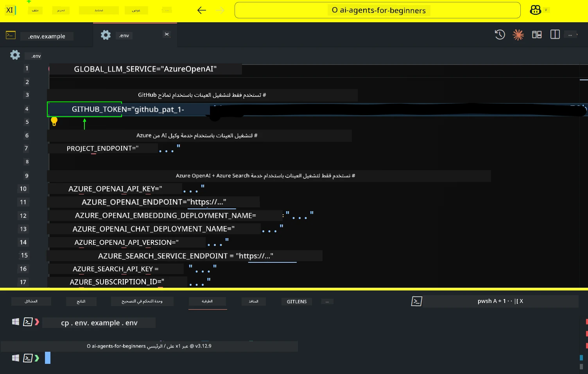

<!--
CO_OP_TRANSLATOR_METADATA:
{
  "original_hash": "63b1a8f6e840df15934935b728e569f0",
  "translation_date": "2025-12-03T13:48:10+00:00",
  "source_file": "00-course-setup/README.md",
  "language_code": "ar"
}
-->
# إعداد الدورة

## المقدمة

ستتناول هذه الدرس كيفية تشغيل أمثلة الكود الخاصة بهذه الدورة.

## انضم إلى متعلمين آخرين واحصل على المساعدة

قبل أن تبدأ في استنساخ المستودع الخاص بك، انضم إلى [قناة Discord للمبتدئين في وكلاء الذكاء الاصطناعي](https://aka.ms/ai-agents/discord) للحصول على أي مساعدة في الإعداد، أو للإجابة على أي أسئلة حول الدورة، أو للتواصل مع متعلمين آخرين.

## استنساخ أو تفريع هذا المستودع

لبدء العمل، يرجى استنساخ أو تفريع مستودع GitHub. سيتيح لك ذلك إنشاء نسختك الخاصة من مواد الدورة لتتمكن من تشغيل واختبار وتعديل الكود!

يمكنك القيام بذلك بالنقر على الرابط <a href="https://github.com/microsoft/ai-agents-for-beginners/fork" target="_blank">لتفريع المستودع</a>.

يجب أن يكون لديك الآن نسختك المفروعة من هذه الدورة في الرابط التالي:



### استنساخ سطحي (موصى به للورش / Codespaces)

  >قد يكون المستودع الكامل كبيرًا (~3 جيجابايت) عند تنزيل السجل الكامل وجميع الملفات. إذا كنت تحضر الورشة فقط أو تحتاج فقط إلى بعض مجلدات الدروس، فإن الاستنساخ السطحي (أو الاستنساخ الجزئي) يتجنب معظم هذا التنزيل عن طريق تقليص السجل و/أو تخطي الكتل.

#### استنساخ سطحي سريع — سجل تاريخي محدود، جميع الملفات

استبدل `<your-username>` في الأوامر أدناه بعنوان URL الخاص بالتفريع الخاص بك (أو عنوان URL الرئيسي إذا كنت تفضل ذلك).

لاستنساخ السجل التاريخي الأخير فقط (تنزيل صغير):

```bash|powershell
git clone --depth 1 https://github.com/<your-username>/ai-agents-for-beginners.git
```

لاستنساخ فرع معين:

```bash|powershell
git clone --depth 1 --branch <branch-name> https://github.com/<your-username>/ai-agents-for-beginners.git
```

#### استنساخ جزئي (Sparse) — كتل محدودة + مجلدات مختارة فقط

يستخدم هذا الاستنساخ الجزئي وsparse-checkout (يتطلب Git 2.25+ ويوصى باستخدام Git الحديث مع دعم الاستنساخ الجزئي):

```bash|powershell
git clone --depth 1 --filter=blob:none --sparse https://github.com/<your-username>/ai-agents-for-beginners.git
```

انتقل إلى مجلد المستودع:

```bash|powershell
cd ai-agents-for-beginners
```

ثم حدد المجلدات التي تريدها (المثال أدناه يظهر مجلدين):

```bash|powershell
git sparse-checkout set 00-course-setup 01-intro-to-ai-agents
```

بعد الاستنساخ والتحقق من الملفات، إذا كنت تحتاج فقط إلى الملفات وتريد تحرير المساحة (بدون سجل Git)، يرجى حذف بيانات المستودع (💀لا رجعة فيه — ستفقد جميع وظائف Git: لا التزامات، لا سحب، لا دفع، أو الوصول إلى السجل).

```bash
# زد ش/باش
rm -rf .git
```

```powershell
# باور شيل
Remove-Item -Recurse -Force .git
```

#### استخدام GitHub Codespaces (موصى به لتجنب التنزيلات المحلية الكبيرة)

- أنشئ Codespace جديدًا لهذا المستودع عبر [واجهة GitHub](https://github.com/codespaces).  

- في الطرفية الخاصة بـ Codespace الجديد، قم بتشغيل أحد أوامر الاستنساخ السطحي/الجزئي أعلاه لجلب فقط مجلدات الدروس التي تحتاجها إلى مساحة عمل Codespace.
- اختياري: بعد الاستنساخ داخل Codespaces، قم بإزالة .git لاستعادة مساحة إضافية (راجع أوامر الإزالة أعلاه).
- ملاحظة: إذا كنت تفضل فتح المستودع مباشرة في Codespaces (بدون استنساخ إضافي)، كن على علم بأن Codespaces سيقوم بإنشاء بيئة devcontainer وقد يوفر أكثر مما تحتاج. استنساخ نسخة سطحية داخل Codespace جديد يمنحك مزيدًا من التحكم في استخدام القرص.

#### نصائح

- استبدل دائمًا عنوان URL للاستنساخ بالتفريع الخاص بك إذا كنت تريد التعديل/الالتزام.
- إذا احتجت لاحقًا إلى مزيد من السجل أو الملفات، يمكنك جلبها أو تعديل sparse-checkout لتضمين مجلدات إضافية.

## تشغيل الكود

تقدم هذه الدورة سلسلة من دفاتر Jupyter التي يمكنك تشغيلها للحصول على تجربة عملية في بناء وكلاء الذكاء الاصطناعي.

تستخدم أمثلة الكود إما:

**يتطلب حساب GitHub - مجاني**:

1) إطار عمل Semantic Kernel Agent + سوق النماذج في GitHub. معنون بـ (semantic-kernel.ipynb)
2) إطار عمل AutoGen + سوق النماذج في GitHub. معنون بـ (autogen.ipynb)

**يتطلب اشتراك Azure**:

3) Azure AI Foundry + خدمة Azure AI Agent. معنون بـ (azureaiagent.ipynb)

نشجعك على تجربة الأنواع الثلاثة من الأمثلة لمعرفة أيها يناسبك أكثر.

أيًا كان الخيار الذي تختاره، سيحدد الخطوات التي تحتاج إلى اتباعها أدناه:

## المتطلبات

- Python 3.12+
  - **ملاحظة**: إذا لم يكن لديك Python3.12 مثبتًا، تأكد من تثبيته. ثم قم بإنشاء venv باستخدام python3.12 لضمان تثبيت الإصدارات الصحيحة من ملف requirements.txt.
  
    >مثال

    إنشاء دليل Python venv:

    ```bash|powershell
    python -m venv venv
    ```

    ثم قم بتفعيل بيئة venv لـ:

    ```bash
    # زد ش/باش
    source venv/bin/activate
    ```
  
    ```dos
    # Command Prompt for Windows
    venv\Scripts\activate
    ```

- .NET 10+: بالنسبة لأكواد العينة التي تستخدم .NET، تأكد من تثبيت [مجموعة أدوات .NET 10](https://dotnet.microsoft.com/download/dotnet/10.0) أو أحدث. ثم تحقق من إصدار .NET SDK المثبت لديك:

    ```bash|powershell
    dotnet --list-sdks
    ```

- حساب GitHub - للوصول إلى سوق النماذج في GitHub
- اشتراك Azure - للوصول إلى Azure AI Foundry
- حساب Azure AI Foundry - للوصول إلى خدمة Azure AI Agent

قمنا بتضمين ملف `requirements.txt` في جذر هذا المستودع يحتوي على جميع حزم Python المطلوبة لتشغيل أمثلة الكود.

يمكنك تثبيتها عن طريق تشغيل الأمر التالي في الطرفية في جذر المستودع:

```bash|powershell
pip install -r requirements.txt
```

نوصي بإنشاء بيئة Python افتراضية لتجنب أي تعارضات أو مشاكل.

## إعداد VSCode

تأكد من أنك تستخدم الإصدار الصحيح من Python في VSCode.


## الإعداد للأمثلة باستخدام نماذج GitHub 

### الخطوة 1: استرداد رمز الوصول الشخصي (PAT) الخاص بك من GitHub

تعتمد هذه الدورة على سوق النماذج في GitHub، مما يوفر وصولًا مجانيًا إلى نماذج اللغة الكبيرة (LLMs) التي ستستخدمها لبناء وكلاء الذكاء الاصطناعي.

لاستخدام نماذج GitHub، ستحتاج إلى إنشاء [رمز الوصول الشخصي من GitHub](https://docs.github.com/en/authentication/keeping-your-account-and-data-secure/managing-your-personal-access-tokens).

يمكنك القيام بذلك عن طريق الذهاب إلى <a href="https://github.com/settings/personal-access-tokens" target="_blank">إعدادات رموز الوصول الشخصي</a> في حساب GitHub الخاص بك.

يرجى اتباع [مبدأ أقل الامتيازات](https://docs.github.com/en/get-started/learning-to-code/storing-your-secrets-safely) عند إنشاء الرمز الخاص بك. يعني هذا أنه يجب عليك منح الرمز فقط الأذونات التي يحتاجها لتشغيل أمثلة الكود في هذه الدورة.

1. حدد خيار `Fine-grained tokens` على الجانب الأيسر من شاشتك بالانتقال إلى **إعدادات المطور**.

   

   ثم حدد `Generate new token`.

   

2. أدخل اسمًا وصفيًا للرمز الخاص بك يعكس الغرض منه، مما يسهل التعرف عليه لاحقًا.

    🔐 توصية بمدة الرمز

    المدة الموصى بها: 30 يومًا
    للحصول على وضع أمني أكثر أمانًا، يمكنك اختيار فترة أقصر — مثل 7 أيام 🛡️
    إنها طريقة رائعة لتحديد هدف شخصي وإكمال الدورة بينما تكون في ذروة حماسك 🚀.

    

3. قم بتقييد نطاق الرمز إلى التفريع الخاص بك لهذا المستودع.

    

4. قيد أذونات الرمز: ضمن **الأذونات**، انقر فوق علامة التبويب **الحساب**، ثم انقر فوق زر "+ Add permissions". ستظهر قائمة منسدلة. يرجى البحث عن **Models** وتحديد المربع الخاص بها.

    

5. تحقق من الأذونات المطلوبة قبل إنشاء الرمز. 

6. قبل إنشاء الرمز، تأكد من أنك مستعد لتخزين الرمز في مكان آمن مثل مدير كلمات المرور، حيث لن يتم عرضه مرة أخرى بعد إنشائه. 

انسخ الرمز الجديد الذي أنشأته للتو. ستضيفه الآن إلى ملف `.env` المضمن في هذه الدورة.

### الخطوة 2: إنشاء ملف `.env` الخاص بك

لإنشاء ملف `.env` الخاص بك، قم بتشغيل الأمر التالي في الطرفية.

```bash
# zsh/bash
cp .env.example .env
```

```powershell
# باور شيل
Copy-Item .env.example .env
```

سيقوم هذا بنسخ ملف المثال وإنشاء `.env` في دليلك حيث تملأ القيم للمتغيرات البيئية.

مع نسخ الرمز الخاص بك، افتح ملف `.env` في محرر النصوص المفضل لديك والصق الرمز في حقل `GITHUB_TOKEN`.



يجب أن تكون الآن قادرًا على تشغيل أمثلة الكود في هذه الدورة.

## الإعداد للأمثلة باستخدام Azure AI Foundry وخدمة Azure AI Agent

### الخطوة 1: استرداد نقطة النهاية الخاصة بمشروع Azure الخاص بك

اتبع الخطوات لإنشاء مركز ومشروع في Azure AI Foundry الموجودة هنا: [نظرة عامة على موارد المركز](https://learn.microsoft.com/azure/ai-foundry/concepts/ai-resources)

بمجرد إنشاء مشروعك، ستحتاج إلى استرداد سلسلة الاتصال الخاصة بمشروعك.

يمكنك القيام بذلك عن طريق الذهاب إلى صفحة **نظرة عامة** على مشروعك في بوابة Azure AI Foundry.


### الخطوة 2: إنشاء ملف `.env` الخاص بك

لإنشاء ملف `.env` الخاص بك، قم بتشغيل الأمر التالي في الطرفية.

```bash
# زد ش/باش
cp .env.example .env
```

```powershell
# باورشيل
Copy-Item .env.example .env
```

سيقوم هذا بنسخ ملف المثال وإنشاء `.env` في دليلك حيث تملأ القيم للمتغيرات البيئية.

مع نسخ الرمز الخاص بك، افتح ملف `.env` في محرر النصوص المفضل لديك والصق الرمز في حقل `PROJECT_ENDPOINT`.

### الخطوة 3: تسجيل الدخول إلى Azure

كأفضل ممارسة أمان، سنستخدم [المصادقة بدون مفاتيح](https://learn.microsoft.com/azure/developer/ai/keyless-connections?tabs=csharp%2Cazure-cli?WT.mc_id=academic-105485-koreyst) للمصادقة على Azure OpenAI باستخدام Microsoft Entra ID. 

بعد ذلك، افتح الطرفية وقم بتشغيل `az login --use-device-code` لتسجيل الدخول إلى حساب Azure الخاص بك.

بمجرد تسجيل الدخول، اختر اشتراكك في الطرفية.

## متغيرات البيئة الإضافية - Azure Search وAzure OpenAI 

بالنسبة لدرس Agentic RAG - الدرس 5 - هناك أمثلة تستخدم Azure Search وAzure OpenAI.

إذا كنت ترغب في تشغيل هذه الأمثلة، ستحتاج إلى إضافة متغيرات البيئة التالية إلى ملف `.env` الخاص بك:

### صفحة النظرة العامة (المشروع)

- `AZURE_SUBSCRIPTION_ID` - تحقق من **تفاصيل المشروع** في صفحة **النظرة العامة** لمشروعك.

- `AZURE_AI_PROJECT_NAME` - انظر إلى أعلى صفحة **النظرة العامة** لمشروعك.

- `AZURE_OPENAI_SERVICE` - ابحث عن هذا في علامة التبويب **القدرات المضمنة** لخدمة **Azure OpenAI** في صفحة **النظرة العامة**.

### مركز الإدارة

- `AZURE_OPENAI_RESOURCE_GROUP` - انتقل إلى **خصائص المشروع** في صفحة **النظرة العامة** لمركز الإدارة.

- `GLOBAL_LLM_SERVICE` - ضمن **الموارد المتصلة**، ابحث عن اسم اتصال **خدمات Azure AI**. إذا لم يكن مدرجًا، تحقق من **بوابة Azure** ضمن مجموعة الموارد الخاصة بك للحصول على اسم مورد خدمات AI.

### صفحة النماذج + نقاط النهاية

- `AZURE_OPENAI_EMBEDDING_DEPLOYMENT_NAME` - اختر نموذج التضمين الخاص بك (مثل `text-embedding-ada-002`) ولاحظ **اسم النشر** من تفاصيل النموذج.

- `AZURE_OPENAI_CHAT_DEPLOYMENT_NAME` - اختر نموذج الدردشة الخاص بك (مثل `gpt-4o-mini`) ولاحظ **اسم النشر** من تفاصيل النموذج.

### بوابة Azure

- `AZURE_OPENAI_ENDPOINT` - ابحث عن **خدمات Azure AI**، انقر عليها، ثم انتقل إلى **إدارة الموارد**، **المفاتيح ونقطة النهاية**، مرر لأسفل إلى "نقاط النهاية الخاصة بـ Azure OpenAI"، وانسخ النقطة التي تقول "واجهات برمجة التطبيقات اللغوية".

- `AZURE_OPENAI_API_KEY` - من نفس الشاشة، انسخ المفتاح 1 أو المفتاح 2.

- `AZURE_SEARCH_SERVICE_ENDPOINT` - ابحث عن مورد **Azure AI Search** الخاص بك، انقر عليه، وشاهد **النظرة العامة**.

- `AZURE_SEARCH_API_KEY` - ثم انتقل إلى **الإعدادات** ثم **المفاتيح** لنسخ المفتاح الإداري الأساسي أو الثانوي.

### صفحة ويب خارجية

- `AZURE_OPENAI_API_VERSION` - قم بزيارة صفحة [دورة حياة إصدار API](https://learn.microsoft.com/azure/ai-services/openai/api-version-deprecation#latest-ga-api-release) ضمن **أحدث إصدار API معتمد**.

### إعداد المصادقة بدون مفاتيح

بدلاً من ترميز بيانات الاعتماد الخاصة بك، سنستخدم اتصالًا بدون مفاتيح مع Azure OpenAI. للقيام بذلك، سنستورد `DefaultAzureCredential` ثم نستدعي وظيفة `DefaultAzureCredential` للحصول على بيانات الاعتماد.

```python
# بايثون
from azure.identity import DefaultAzureCredential, InteractiveBrowserCredential
```

## هل واجهت مشكلة؟
إذا واجهت أي مشاكل أثناء تشغيل هذا الإعداد، انضم إلى <a href="https://discord.gg/kzRShWzttr" target="_blank">مجتمع Azure AI على Discord</a> أو <a href="https://github.com/microsoft/ai-agents-for-beginners/issues?WT.mc_id=academic-105485-koreyst" target="_blank">قم بإنشاء مشكلة</a>.

## الدرس التالي

أنت الآن جاهز لتشغيل الكود الخاص بهذه الدورة. نتمنى لك تعلمًا ممتعًا عن عالم وكلاء الذكاء الاصطناعي!

[مقدمة إلى وكلاء الذكاء الاصطناعي وحالات استخدامهم](../01-intro-to-ai-agents/README.md)

---

<!-- CO-OP TRANSLATOR DISCLAIMER START -->
**إخلاء المسؤولية**:  
تمت ترجمة هذا المستند باستخدام خدمة الترجمة بالذكاء الاصطناعي [Co-op Translator](https://github.com/Azure/co-op-translator). بينما نسعى لتحقيق الدقة، يرجى العلم أن الترجمات الآلية قد تحتوي على أخطاء أو عدم دقة. يجب اعتبار المستند الأصلي بلغته الأصلية المصدر الموثوق. للحصول على معلومات حاسمة، يُوصى بالترجمة البشرية الاحترافية. نحن غير مسؤولين عن أي سوء فهم أو تفسيرات خاطئة ناتجة عن استخدام هذه الترجمة.
<!-- CO-OP TRANSLATOR DISCLAIMER END -->