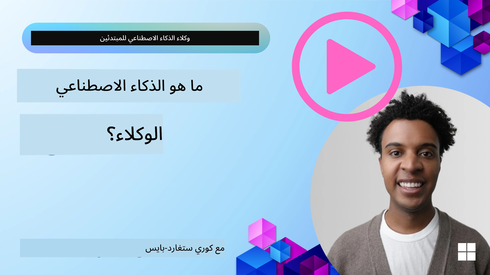
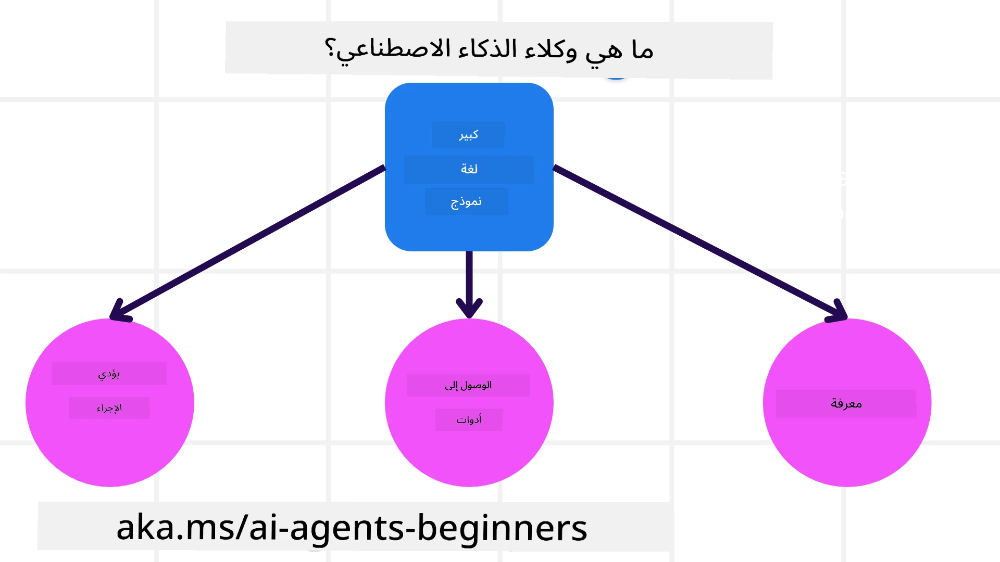
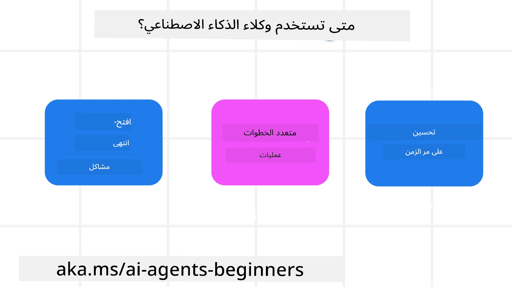

<!--
CO_OP_TRANSLATOR_METADATA:
{
  "original_hash": "cdd28bc00816d2773bb2b5968d782abc",
  "translation_date": "2025-11-11T10:51:21+00:00",
  "source_file": "01-intro-to-ai-agents/README.md",
  "language_code": "ar"
}
-->

> _(اضغط على الصورة أعلاه لمشاهدة فيديو الدرس)_

# مقدمة عن وكلاء الذكاء الاصطناعي وحالات الاستخدام

مرحبًا بكم في دورة "وكلاء الذكاء الاصطناعي للمبتدئين"! تقدم هذه الدورة المعرفة الأساسية وأمثلة عملية لبناء وكلاء الذكاء الاصطناعي.

انضم إلى <a href="https://discord.gg/kzRShWzttr" target="_blank">مجتمع Azure AI على Discord</a> للتواصل مع متعلمين آخرين ومطوري وكلاء الذكاء الاصطناعي وطرح أي أسئلة لديك حول هذه الدورة.

لبدء هذه الدورة، سنبدأ بفهم أفضل لماهية وكلاء الذكاء الاصطناعي وكيف يمكننا استخدامهم في التطبيقات وسير العمل الذي نقوم ببنائه.

## المقدمة

يغطي هذا الدرس:

- ما هي وكلاء الذكاء الاصطناعي وما هي الأنواع المختلفة من الوكلاء؟
- ما هي حالات الاستخدام الأفضل لوكلاء الذكاء الاصطناعي وكيف يمكنهم مساعدتنا؟
- ما هي بعض اللبنات الأساسية عند تصميم الحلول الوكالية؟

## أهداف التعلم
بعد إكمال هذا الدرس، يجب أن تكون قادرًا على:

- فهم مفاهيم وكلاء الذكاء الاصطناعي وكيف تختلف عن حلول الذكاء الاصطناعي الأخرى.
- تطبيق وكلاء الذكاء الاصطناعي بكفاءة.
- تصميم حلول وكالية بشكل منتج للمستخدمين والعملاء.

## تعريف وكلاء الذكاء الاصطناعي وأنواعهم

### ما هي وكلاء الذكاء الاصطناعي؟

وكلاء الذكاء الاصطناعي هي **أنظمة** تمكن **نماذج اللغة الكبيرة (LLMs)** من **تنفيذ الإجراءات** من خلال توسيع قدراتها عبر منحها **الوصول إلى الأدوات** و**المعرفة**.

لنقم بتقسيم هذا التعريف إلى أجزاء أصغر:

- **النظام** - من المهم التفكير في الوكلاء ليس كعنصر واحد فقط بل كنظام يتكون من العديد من العناصر. على المستوى الأساسي، تتكون عناصر وكيل الذكاء الاصطناعي من:
  - **البيئة** - المساحة المحددة التي يعمل فيها وكيل الذكاء الاصطناعي. على سبيل المثال، إذا كان لدينا وكيل حجز سفر، يمكن أن تكون البيئة هي نظام حجز السفر الذي يستخدمه الوكيل لإكمال المهام.
  - **المستشعرات** - تحتوي البيئة على معلومات وتوفر ردود فعل. يستخدم وكلاء الذكاء الاصطناعي المستشعرات لجمع وتفسير هذه المعلومات حول الحالة الحالية للبيئة. في مثال وكيل حجز السفر، يمكن لنظام الحجز توفير معلومات مثل توفر الفنادق أو أسعار الرحلات.
  - **المشغلات** - بمجرد أن يتلقى وكيل الذكاء الاصطناعي الحالة الحالية للبيئة، يحدد الوكيل الإجراء الذي يجب تنفيذه لتغيير البيئة بناءً على المهمة الحالية. بالنسبة لوكيل حجز السفر، قد يكون الإجراء هو حجز غرفة متاحة للمستخدم.

**نماذج اللغة الكبيرة** - مفهوم الوكلاء موجود قبل إنشاء نماذج اللغة الكبيرة. ميزة بناء وكلاء الذكاء الاصطناعي باستخدام نماذج اللغة الكبيرة هي قدرتها على تفسير اللغة البشرية والبيانات. هذه القدرة تمكن نماذج اللغة الكبيرة من تفسير معلومات البيئة ووضع خطة لتغيير البيئة.

**تنفيذ الإجراءات** - خارج أنظمة وكلاء الذكاء الاصطناعي، تكون نماذج اللغة الكبيرة محدودة في الحالات التي يكون فيها الإجراء هو إنشاء محتوى أو معلومات بناءً على طلب المستخدم. داخل أنظمة وكلاء الذكاء الاصطناعي، يمكن لنماذج اللغة الكبيرة إنجاز المهام من خلال تفسير طلب المستخدم واستخدام الأدوات المتاحة في بيئتها.

**الوصول إلى الأدوات** - يتم تحديد الأدوات التي يمكن لنموذج اللغة الكبير الوصول إليها بواسطة 1) البيئة التي يعمل فيها و2) مطور وكيل الذكاء الاصطناعي. في مثال وكيل السفر، تكون أدوات الوكيل محدودة بالعمليات المتاحة في نظام الحجز، ويمكن للمطور أيضًا تقييد وصول الوكيل إلى أدوات معينة مثل الرحلات الجوية.

**الذاكرة + المعرفة** - يمكن أن تكون الذاكرة قصيرة المدى في سياق المحادثة بين المستخدم والوكيل. على المدى الطويل، خارج المعلومات المقدمة من البيئة، يمكن لوكلاء الذكاء الاصطناعي أيضًا استرجاع المعرفة من أنظمة أخرى، خدمات، أدوات، وحتى وكلاء آخرين. في مثال وكيل السفر، يمكن أن تكون هذه المعرفة هي معلومات حول تفضيلات السفر الخاصة بالمستخدم الموجودة في قاعدة بيانات العملاء.

### الأنواع المختلفة من الوكلاء

الآن بعد أن لدينا تعريف عام لوكلاء الذكاء الاصطناعي، دعونا نلقي نظرة على بعض أنواع الوكلاء المحددة وكيف يمكن تطبيقها على وكيل حجز السفر.

| **نوع الوكيل**                | **الوصف**                                                                                                                       | **المثال**                                                                                                                                                                                                                   |
| ----------------------------- | ------------------------------------------------------------------------------------------------------------------------------------- | ----------------------------------------------------------------------------------------------------------------------------------------------------------------------------------------------------------------------------- |
| **الوكلاء الانعكاسيون البسيطون**      | تنفيذ إجراءات فورية بناءً على قواعد محددة مسبقًا.                                                                                  | وكيل السفر يفسر سياق البريد الإلكتروني ويحول شكاوى السفر إلى خدمة العملاء.                                                                                                                          |
| **الوكلاء الانعكاسيون القائمون على النموذج** | تنفيذ إجراءات بناءً على نموذج للعالم وتغييرات في هذا النموذج.                                                              | وكيل السفر يعطي الأولوية للطرق ذات التغيرات الكبيرة في الأسعار بناءً على الوصول إلى بيانات التسعير التاريخية.                                                                                                             |
| **الوكلاء القائمون على الهدف**         | إنشاء خطط لتحقيق أهداف محددة من خلال تفسير الهدف وتحديد الإجراءات اللازمة للوصول إليه.                                  | وكيل السفر يحجز رحلة من خلال تحديد الترتيبات اللازمة للسفر (سيارة، وسائل النقل العامة، رحلات جوية) من الموقع الحالي إلى الوجهة.                                                                                |
| **الوكلاء القائمون على المنفعة**      | أخذ التفضيلات في الاعتبار وموازنة التنازلات رقميًا لتحديد كيفية تحقيق الأهداف.                                               | وكيل السفر يزيد المنفعة من خلال موازنة الراحة مقابل التكلفة عند حجز السفر.                                                                                                                                          |
| **الوكلاء المتعلمون**           | التحسن بمرور الوقت من خلال الاستجابة للتغذية الراجعة وتعديل الإجراءات وفقًا لذلك.                                                        | وكيل السفر يتحسن باستخدام تغذية راجعة العملاء من استطلاعات ما بعد الرحلة لإجراء تعديلات على الحجوزات المستقبلية.                                                                                                               |
| **الوكلاء الهرميون**       | يتميزون بوجود عدة وكلاء في نظام متدرج، حيث يقوم الوكلاء على المستوى الأعلى بتقسيم المهام إلى مهام فرعية ليكملها الوكلاء على المستوى الأدنى. | وكيل السفر يلغي رحلة من خلال تقسيم المهمة إلى مهام فرعية (على سبيل المثال، إلغاء حجوزات محددة) وجعل الوكلاء على المستوى الأدنى يكملونها، مع تقديم تقرير إلى الوكيل على المستوى الأعلى.                                     |
| **أنظمة الوكلاء المتعددة (MAS)** | يكمل الوكلاء المهام بشكل مستقل، إما بشكل تعاوني أو تنافسي.                                                           | تعاوني: يقوم عدة وكلاء بحجز خدمات سفر محددة مثل الفنادق، الرحلات الجوية، والترفيه. تنافسي: يدير عدة وكلاء ويتنافسون على تقويم حجز فندق مشترك لحجز العملاء في الفندق. |

## متى نستخدم وكلاء الذكاء الاصطناعي؟

في القسم السابق، استخدمنا حالة استخدام وكيل السفر لشرح كيفية استخدام الأنواع المختلفة من الوكلاء في سيناريوهات مختلفة لحجز السفر. سنستمر في استخدام هذا التطبيق طوال الدورة.

دعونا نلقي نظرة على أنواع حالات الاستخدام التي تكون وكلاء الذكاء الاصطناعي الأفضل استخدامها فيها:

- **المشاكل المفتوحة** - السماح لنموذج اللغة الكبير بتحديد الخطوات اللازمة لإكمال المهمة لأنه لا يمكن دائمًا ترميزها في سير العمل.
- **العمليات متعددة الخطوات** - المهام التي تتطلب مستوى من التعقيد حيث يحتاج وكيل الذكاء الاصطناعي إلى استخدام أدوات أو معلومات على مدار عدة خطوات بدلاً من استرجاع واحد.
- **التحسن بمرور الوقت** - المهام التي يمكن للوكيل أن يتحسن فيها بمرور الوقت من خلال تلقي التغذية الراجعة من بيئته أو المستخدمين لتقديم فائدة أفضل.

نغطي المزيد من الاعتبارات لاستخدام وكلاء الذكاء الاصطناعي في درس بناء وكلاء الذكاء الاصطناعي الموثوق بهم.

## أساسيات الحلول الوكالية

### تطوير الوكلاء

الخطوة الأولى في تصميم نظام وكيل الذكاء الاصطناعي هي تحديد الأدوات، الإجراءات، والسلوكيات. في هذه الدورة، نركز على استخدام **خدمة Azure AI Agent** لتعريف وكلائنا. تقدم ميزات مثل:

- اختيار النماذج المفتوحة مثل OpenAI، Mistral، وLlama
- استخدام البيانات المرخصة من خلال مزودين مثل Tripadvisor
- استخدام أدوات OpenAPI 3.0 القياسية

### الأنماط الوكالية

التواصل مع نماذج اللغة الكبيرة يتم من خلال المطالبات. نظرًا للطبيعة شبه المستقلة لوكلاء الذكاء الاصطناعي، ليس من الممكن دائمًا أو مطلوبًا إعادة مطالبة نموذج اللغة الكبير يدويًا بعد تغيير في البيئة. نستخدم **الأنماط الوكالية** التي تسمح لنا بمطالبة نموذج اللغة الكبير على مدار عدة خطوات بطريقة أكثر قابلية للتوسع.

تنقسم هذه الدورة إلى بعض الأنماط الوكالية الشائعة حاليًا.

### الأطر الوكالية

تسمح الأطر الوكالية للمطورين بتنفيذ الأنماط الوكالية من خلال الكود. تقدم هذه الأطر قوالب، إضافات، وأدوات لتحسين التعاون بين وكلاء الذكاء الاصطناعي. توفر هذه الفوائد قدرات أفضل للمراقبة وحل المشكلات في أنظمة وكلاء الذكاء الاصطناعي.

في هذه الدورة، سنستكشف إطار AutoGen القائم على البحث وإطار الوكيل الجاهز للإنتاج من Semantic Kernel.

## أكواد أمثلة

- Python: [إطار الوكيل](./code_samples/01-python-agent-framework.ipynb)
- .NET: [إطار الوكيل](./code_samples/01-dotnet-agent-framework.md)

## هل لديك المزيد من الأسئلة حول وكلاء الذكاء الاصطناعي؟

انضم إلى [Azure AI Foundry Discord](https://aka.ms/ai-agents/discord) للتواصل مع متعلمين آخرين، حضور ساعات المكتب، والحصول على إجابات لأسئلتك حول وكلاء الذكاء الاصطناعي.

## الدرس السابق

[إعداد الدورة](../00-course-setup/README.md)

## الدرس التالي

[استكشاف الأطر الوكالية](../02-explore-agentic-frameworks/README.md)

---

<!-- CO-OP TRANSLATOR DISCLAIMER START -->
**إخلاء المسؤولية**:  
تم ترجمة هذا المستند باستخدام خدمة الترجمة بالذكاء الاصطناعي [Co-op Translator](https://github.com/Azure/co-op-translator). بينما نسعى لتحقيق الدقة، يرجى العلم أن الترجمات الآلية قد تحتوي على أخطاء أو عدم دقة. يجب اعتبار المستند الأصلي بلغته الأصلية المصدر الموثوق. للحصول على معلومات حاسمة، يُوصى بالترجمة البشرية الاحترافية. نحن غير مسؤولين عن أي سوء فهم أو تفسيرات خاطئة تنشأ عن استخدام هذه الترجمة.
<!-- CO-OP TRANSLATOR DISCLAIMER END -->