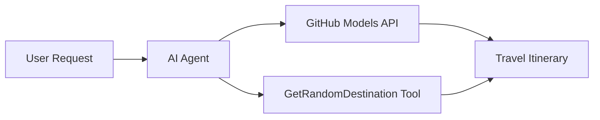

<!--
CO_OP_TRANSLATOR_METADATA:
{
  "original_hash": "5f351412e934f0833c8c821a0a60efaf",
  "translation_date": "2025-11-13T11:01:49+00:00",
  "source_file": "01-intro-to-ai-agents/code_samples/01-dotnet-agent-framework.md",
  "language_code": "ar"
}
-->
# 🌍 وكيل السفر الذكي باستخدام إطار عمل Microsoft Agent (.NET)

## 📋 نظرة عامة على السيناريو

يوضح هذا المثال كيفية بناء وكيل تخطيط سفر ذكي باستخدام إطار عمل Microsoft Agent لـ .NET. يمكن للوكيل إنشاء خطط رحلات يومية مخصصة تلقائيًا لوجهات عشوائية حول العالم.

### القدرات الرئيسية:

- 🎲 **اختيار وجهة عشوائية**: يستخدم أداة مخصصة لاختيار أماكن العطلات
- 🗺️ **تخطيط رحلات ذكي**: ينشئ خططًا مفصلة يومًا بيوم
- 🔄 **البث في الوقت الفعلي**: يدعم الاستجابات الفورية والمباشرة
- 🛠️ **تكامل الأدوات المخصصة**: يوضح كيفية توسيع قدرات الوكيل

## 🔧 البنية التقنية

### التقنيات الأساسية

- **إطار عمل Microsoft Agent**: أحدث تنفيذ لـ .NET لتطوير وكلاء الذكاء الاصطناعي
- **تكامل نماذج GitHub**: يستخدم خدمة استنتاج نماذج الذكاء الاصطناعي من GitHub
- **التوافق مع OpenAI API**: يستفيد من مكتبات عملاء OpenAI مع نقاط نهاية مخصصة
- **إعداد آمن**: إدارة مفاتيح API بناءً على البيئة

### المكونات الرئيسية

1. **AIAgent**: المنسق الرئيسي للوكيل الذي يدير تدفق المحادثة
2. **الأدوات المخصصة**: وظيفة `GetRandomDestination()` المتاحة للوكيل
3. **واجهة المحادثة**: واجهة محادثة مدعومة بنماذج GitHub
4. **دعم البث**: قدرات إنشاء استجابات في الوقت الفعلي

### نمط التكامل



## 🚀 البدء

### المتطلبات الأساسية

- [.NET 10 SDK](https://dotnet.microsoft.com/download/dotnet/10.0) أو أحدث
- [رمز وصول API لنماذج GitHub](https://docs.github.com/github-models/github-models-at-scale/using-your-own-api-keys-in-github-models)

### متغيرات البيئة المطلوبة

```bash
# zsh/bash
export GH_TOKEN=<your_github_token>
export GH_ENDPOINT=https://models.github.ai/inference
export GH_MODEL_ID=openai/gpt-5-mini
```

```powershell
# PowerShell
$env:GH_TOKEN = "<your_github_token>"
$env:GH_ENDPOINT = "https://models.github.ai/inference"
$env:GH_MODEL_ID = "openai/gpt-5-mini"
```

### مثال على الكود

لتشغيل مثال الكود،

```bash
# zsh/bash
chmod +x ./01-dotnet-agent-framework.cs
./01-dotnet-agent-framework.cs
```

أو باستخدام CLI الخاص بـ dotnet:

```bash
dotnet run ./01-dotnet-agent-framework.cs
```

راجع [`01-dotnet-agent-framework.cs`](../../../../01-intro-to-ai-agents/code_samples/01-dotnet-agent-framework.cs) للحصول على الكود الكامل.

```csharp
#!/usr/bin/dotnet run

#:package Microsoft.Extensions.AI@9.*
#:package Microsoft.Agents.AI.OpenAI@1.*-*

using System.ClientModel;
using System.ComponentModel;

using Microsoft.Agents.AI;
using Microsoft.Extensions.AI;

using OpenAI;

// Tool Function: Random Destination Generator
// This static method will be available to the agent as a callable tool
// The [Description] attribute helps the AI understand when to use this function
// This demonstrates how to create custom tools for AI agents
[Description("Provides a random vacation destination.")]
static string GetRandomDestination()
{
    // List of popular vacation destinations around the world
    // The agent will randomly select from these options
    var destinations = new List<string>
    {
        "Paris, France",
        "Tokyo, Japan",
        "New York City, USA",
        "Sydney, Australia",
        "Rome, Italy",
        "Barcelona, Spain",
        "Cape Town, South Africa",
        "Rio de Janeiro, Brazil",
        "Bangkok, Thailand",
        "Vancouver, Canada"
    };

    // Generate random index and return selected destination
    // Uses System.Random for simple random selection
    var random = new Random();
    int index = random.Next(destinations.Count);
    return destinations[index];
}

// Extract configuration from environment variables
// Retrieve the GitHub Models API endpoint, defaults to https://models.github.ai/inference if not specified
// Retrieve the model ID, defaults to openai/gpt-5-mini if not specified
// Retrieve the GitHub token for authentication, throws exception if not specified
var github_endpoint = Environment.GetEnvironmentVariable("GH_ENDPOINT") ?? "https://models.github.ai/inference";
var github_model_id = Environment.GetEnvironmentVariable("GH_MODEL_ID") ?? "openai/gpt-5-mini";
var github_token = Environment.GetEnvironmentVariable("GH_TOKEN") ?? throw new InvalidOperationException("GH_TOKEN is not set.");

// Configure OpenAI Client Options
// Create configuration options to point to GitHub Models endpoint
// This redirects OpenAI client calls to GitHub's model inference service
var openAIOptions = new OpenAIClientOptions()
{
    Endpoint = new Uri(github_endpoint)
};

// Initialize OpenAI Client with GitHub Models Configuration
// Create OpenAI client using GitHub token for authentication
// Configure it to use GitHub Models endpoint instead of OpenAI directly
var openAIClient = new OpenAIClient(new ApiKeyCredential(github_token), openAIOptions);

// Create AI Agent with Travel Planning Capabilities
// Initialize OpenAI client, get chat client for specified model, and create AI agent
// Configure agent with travel planning instructions and random destination tool
// The agent can now plan trips using the GetRandomDestination function
AIAgent agent = openAIClient
    .GetChatClient(github_model_id)
    .CreateAIAgent(
        instructions: "You are a helpful AI Agent that can help plan vacations for customers at random destinations",
        tools: [AIFunctionFactory.Create(GetRandomDestination)]
    );

// Execute Agent: Plan a Day Trip
// Run the agent with streaming enabled for real-time response display
// Shows the agent's thinking and response as it generates the content
// Provides better user experience with immediate feedback
await foreach (var update in agent.RunStreamingAsync("Plan me a day trip"))
{
    await Task.Delay(10);
    Console.Write(update);
}
```

## 🎓 النقاط الرئيسية

1. **بنية الوكيل**: يوفر إطار عمل Microsoft Agent نهجًا نظيفًا وآمنًا من النوع لبناء وكلاء الذكاء الاصطناعي في .NET
2. **تكامل الأدوات**: تصبح الوظائف المزينة بسمات `[Description]` أدوات متاحة للوكيل
3. **إدارة الإعدادات**: تتبع متغيرات البيئة ومعالجة بيانات الاعتماد الآمنة أفضل الممارسات في .NET
4. **التوافق مع OpenAI**: يعمل تكامل نماذج GitHub بسلاسة من خلال واجهات برمجة التطبيقات المتوافقة مع OpenAI

## 🔗 موارد إضافية

- [وثائق إطار عمل Microsoft Agent](https://learn.microsoft.com/agent-framework)
- [سوق نماذج GitHub](https://github.com/marketplace?type=models)
- [Microsoft.Extensions.AI](https://learn.microsoft.com/dotnet/ai/microsoft-extensions-ai)
- [.NET Single File Apps](https://devblogs.microsoft.com/dotnet/announcing-dotnet-run-app)

---

<!-- CO-OP TRANSLATOR DISCLAIMER START -->
**إخلاء المسؤولية**:  
تمت ترجمة هذا المستند باستخدام خدمة الترجمة بالذكاء الاصطناعي [Co-op Translator](https://github.com/Azure/co-op-translator). بينما نسعى لتحقيق الدقة، يرجى العلم أن الترجمات الآلية قد تحتوي على أخطاء أو عدم دقة. يجب اعتبار المستند الأصلي بلغته الأصلية هو المصدر الموثوق. للحصول على معلومات حاسمة، يُوصى بالترجمة البشرية الاحترافية. نحن غير مسؤولين عن أي سوء فهم أو تفسيرات خاطئة ناتجة عن استخدام هذه الترجمة.
<!-- CO-OP TRANSLATOR DISCLAIMER END -->