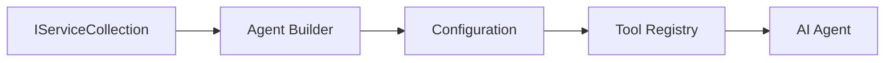

<!--
CO_OP_TRANSLATOR_METADATA:
{
  "original_hash": "bcc874e190347bd6a095aed56dc16de8",
  "translation_date": "2025-11-13T11:04:36+00:00",
  "source_file": "03-agentic-design-patterns/code_samples/03-dotnet-agent-framework.md",
  "language_code": "ar"
}
-->
# 🎨 أنماط تصميم الوكلاء مع نماذج GitHub (.NET)

## 📋 أهداف التعلم

يستعرض هذا المثال أنماط تصميم على مستوى المؤسسات لبناء وكلاء ذكيين باستخدام إطار عمل Microsoft Agent في .NET مع تكامل نماذج GitHub. ستتعلم أنماطًا احترافية ونهجًا معماريًا يجعل الوكلاء جاهزين للإنتاج، وقابلين للصيانة، وقابلين للتوسع.

### أنماط تصميم المؤسسات

- 🏭 **نمط المصنع**: إنشاء وكلاء موحد مع حقن التبعيات
- 🔧 **نمط البناء**: إعداد وتكوين الوكلاء بطريقة سلسة
- 🧵 **أنماط آمنة للخيوط**: إدارة المحادثات المتزامنة
- 📋 **نمط المستودع**: إدارة الأدوات والقدرات بشكل منظم

## 🎯 فوائد معمارية خاصة بـ .NET

### ميزات المؤسسات

- **التصنيف القوي**: التحقق أثناء وقت الترجمة ودعم IntelliSense
- **حقن التبعيات**: تكامل حاوية DI المدمجة
- **إدارة التكوين**: أنماط IConfiguration وOptions
- **Async/Await**: دعم البرمجة غير المتزامنة من الدرجة الأولى

### أنماط جاهزة للإنتاج

- **تكامل التسجيل**: دعم ILogger والتسجيل الهيكلي
- **فحوصات الصحة**: مراقبة وتشخيص مدمج
- **التحقق من التكوين**: التصنيف القوي مع تعليقات البيانات
- **معالجة الأخطاء**: إدارة استثناءات منظمة

## 🔧 الهندسة التقنية

### مكونات .NET الأساسية

- **Microsoft.Extensions.AI**: تجريدات خدمات الذكاء الاصطناعي الموحدة
- **Microsoft.Agents.AI**: إطار عمل تنظيم الوكلاء على مستوى المؤسسات
- **تكامل نماذج GitHub**: أنماط عميل API عالية الأداء
- **نظام التكوين**: تكامل appsettings.json والبيئة

### تنفيذ أنماط التصميم



## 🏗️ أنماط المؤسسات المعروضة

### 1. **أنماط الإنشاء**

- **مصنع الوكلاء**: إنشاء وكلاء مركزي مع تكوين متسق
- **نمط البناء**: واجهة برمجية سلسة لتكوين الوكلاء المعقد
- **نمط Singleton**: إدارة الموارد والتكوين المشتركة
- **حقن التبعيات**: تقليل التداخل وتحسين قابلية الاختبار

### 2. **أنماط السلوك**

- **نمط الاستراتيجية**: استراتيجيات تنفيذ الأدوات القابلة للتبديل
- **نمط الأوامر**: عمليات الوكلاء المغلفة مع التراجع/الإعادة
- **نمط المراقب**: إدارة دورة حياة الوكلاء المدفوعة بالأحداث
- **نمط الطريقة النموذجية**: تدفقات عمل تنفيذ الوكلاء الموحدة

### 3. **أنماط الهيكل**

- **نمط المحول**: طبقة تكامل API لنماذج GitHub
- **نمط الزخرفة**: تعزيز قدرات الوكلاء
- **نمط الواجهة**: واجهات تفاعل مبسطة للوكلاء
- **نمط الوكيل**: التحميل الكسول والتخزين المؤقت لتحسين الأداء

## 📚 مبادئ تصميم .NET

### مبادئ SOLID

- **المسؤولية الواحدة**: لكل مكون غرض واضح
- **مفتوح/مغلق**: قابل للتوسيع دون تعديل
- **استبدال ليسكوف**: تنفيذ الأدوات المستندة إلى الواجهة
- **فصل الواجهة**: واجهات مركزة ومتجانسة
- **عكس التبعيات**: الاعتماد على التجريدات وليس التفاصيل

### الهندسة النظيفة

- **طبقة المجال**: تجريدات الوكلاء والأدوات الأساسية
- **طبقة التطبيق**: تنظيم الوكلاء وتدفقات العمل
- **طبقة البنية التحتية**: تكامل نماذج GitHub والخدمات الخارجية
- **طبقة العرض**: تفاعل المستخدم وتنسيق الاستجابة

## 🔒 اعتبارات المؤسسات

### الأمان

- **إدارة الاعتمادات**: التعامل الآمن مع مفاتيح API باستخدام IConfiguration
- **التحقق من المدخلات**: التصنيف القوي والتحقق من تعليقات البيانات
- **تنقية المخرجات**: معالجة الاستجابات بشكل آمن وتصفيتها
- **تسجيل التدقيق**: تتبع شامل للعمليات

### الأداء

- **أنماط غير متزامنة**: عمليات الإدخال/الإخراج غير المحظورة
- **تجميع الاتصالات**: إدارة فعالة لعملاء HTTP
- **التخزين المؤقت**: تخزين الاستجابات لتحسين الأداء
- **إدارة الموارد**: أنماط التخلص والتنظيف المناسبة

### التوسع

- **أمان الخيوط**: دعم تنفيذ الوكلاء المتزامن
- **تجميع الموارد**: استخدام الموارد بكفاءة
- **إدارة الحمل**: تحديد المعدل ومعالجة الضغط الخلفي
- **المراقبة**: مقاييس الأداء وفحوصات الصحة

## 🚀 نشر الإنتاج

- **إدارة التكوين**: إعدادات خاصة بالبيئة
- **استراتيجية التسجيل**: تسجيل هيكلي مع معرفات الارتباط
- **معالجة الأخطاء**: معالجة استثناءات عالمية مع استرداد مناسب
- **المراقبة**: رؤى التطبيق ومؤشرات الأداء
- **الاختبار**: أنماط الاختبارات الوحدوية، واختبارات التكامل، واختبارات التحميل

جاهز لبناء وكلاء ذكيين على مستوى المؤسسات باستخدام .NET؟ لنقم بتصميم شيء قوي! 🏢✨

## 🚀 البدء

### المتطلبات الأساسية

- [.NET 10 SDK](https://dotnet.microsoft.com/download/dotnet/10.0) أو أعلى
- [رمز الوصول إلى API لنماذج GitHub](https://docs.github.com/github-models/github-models-at-scale/using-your-own-api-keys-in-github-models)

### المتغيرات البيئية المطلوبة

```bash
# zsh/bash
export GH_TOKEN=<your_github_token>
export GH_ENDPOINT=https://models.github.ai/inference
export GH_MODEL_ID=openai/gpt-5-mini
```

```powershell
# PowerShell
$env:GH_TOKEN = "<your_github_token>"
$env:GH_ENDPOINT = "https://models.github.ai/inference"
$env:GH_MODEL_ID = "openai/gpt-5-mini"
```

### كود المثال

لتشغيل مثال الكود،

```bash
# zsh/bash
chmod +x ./03-dotnet-agent-framework.cs
./03-dotnet-agent-framework.cs
```

أو باستخدام dotnet CLI:

```bash
dotnet run ./03-dotnet-agent-framework.cs
```

راجع [`03-dotnet-agent-framework.cs`](../../../../03-agentic-design-patterns/code_samples/03-dotnet-agent-framework.cs) للحصول على الكود الكامل.

```csharp
#!/usr/bin/dotnet run

#:package Microsoft.Extensions.AI@10.*
#:package Microsoft.Agents.AI.OpenAI@1.*-*

using System.ClientModel;
using System.ComponentModel;

using Microsoft.Agents.AI;
using Microsoft.Extensions.AI;

using OpenAI;

// Tool Function: Random Destination Generator
// This static method will be available to the agent as a callable tool
// The [Description] attribute helps the AI understand when to use this function
// This demonstrates how to create custom tools for AI agents
[Description("Provides a random vacation destination.")]
static string GetRandomDestination()
{
    // List of popular vacation destinations around the world
    // The agent will randomly select from these options
    var destinations = new List<string>
    {
        "Paris, France",
        "Tokyo, Japan",
        "New York City, USA",
        "Sydney, Australia",
        "Rome, Italy",
        "Barcelona, Spain",
        "Cape Town, South Africa",
        "Rio de Janeiro, Brazil",
        "Bangkok, Thailand",
        "Vancouver, Canada"
    };

    // Generate random index and return selected destination
    // Uses System.Random for simple random selection
    var random = new Random();
    int index = random.Next(destinations.Count);
    return destinations[index];
}

// Extract configuration from environment variables
// Retrieve the GitHub Models API endpoint, defaults to https://models.github.ai/inference if not specified
// Retrieve the model ID, defaults to openai/gpt-5-mini if not specified
// Retrieve the GitHub token for authentication, throws exception if not specified
var github_endpoint = Environment.GetEnvironmentVariable("GH_ENDPOINT") ?? "https://models.github.ai/inference";
var github_model_id = Environment.GetEnvironmentVariable("GH_MODEL_ID") ?? "openai/gpt-5-mini";
var github_token = Environment.GetEnvironmentVariable("GH_TOKEN") ?? throw new InvalidOperationException("GH_TOKEN is not set.");

// Configure OpenAI Client Options
// Create configuration options to point to GitHub Models endpoint
// This redirects OpenAI client calls to GitHub's model inference service
var openAIOptions = new OpenAIClientOptions()
{
    Endpoint = new Uri(github_endpoint)
};

// Initialize OpenAI Client with GitHub Models Configuration
// Create OpenAI client using GitHub token for authentication
// Configure it to use GitHub Models endpoint instead of OpenAI directly
var openAIClient = new OpenAIClient(new ApiKeyCredential(github_token), openAIOptions);

// Define Agent Identity and Comprehensive Instructions
// Agent name for identification and logging purposes
var AGENT_NAME = "TravelAgent";

// Detailed instructions that define the agent's personality, capabilities, and behavior
// This system prompt shapes how the agent responds and interacts with users
var AGENT_INSTRUCTIONS = """
You are a helpful AI Agent that can help plan vacations for customers.

Important: When users specify a destination, always plan for that location. Only suggest random destinations when the user hasn't specified a preference.

When the conversation begins, introduce yourself with this message:
"Hello! I'm your TravelAgent assistant. I can help plan vacations and suggest interesting destinations for you. Here are some things you can ask me:
1. Plan a day trip to a specific location
2. Suggest a random vacation destination
3. Find destinations with specific features (beaches, mountains, historical sites, etc.)
4. Plan an alternative trip if you don't like my first suggestion

What kind of trip would you like me to help you plan today?"

Always prioritize user preferences. If they mention a specific destination like "Bali" or "Paris," focus your planning on that location rather than suggesting alternatives.
""";

// Create AI Agent with Advanced Travel Planning Capabilities
// Initialize complete agent pipeline: OpenAI client → Chat client → AI agent
// Configure agent with name, detailed instructions, and available tools
// This demonstrates the .NET agent creation pattern with full configuration
AIAgent agent = openAIClient
    .GetChatClient(github_model_id)
    .CreateAIAgent(
        name: AGENT_NAME,
        instructions: AGENT_INSTRUCTIONS,
        tools: [AIFunctionFactory.Create(GetRandomDestination)]
    );

// Create New Conversation Thread for Context Management
// Initialize a new conversation thread to maintain context across multiple interactions
// Threads enable the agent to remember previous exchanges and maintain conversational state
// This is essential for multi-turn conversations and contextual understanding
AgentThread thread = agent.GetNewThread();

// Execute Agent: First Travel Planning Request
// Run the agent with an initial request that will likely trigger the random destination tool
// The agent will analyze the request, use the GetRandomDestination tool, and create an itinerary
// Using the thread parameter maintains conversation context for subsequent interactions
await foreach (var update in agent.RunStreamingAsync("Plan me a day trip", thread))
{
    await Task.Delay(10);
    Console.Write(update);
}

Console.WriteLine();

// Execute Agent: Follow-up Request with Context Awareness
// Demonstrate contextual conversation by referencing the previous response
// The agent remembers the previous destination suggestion and will provide an alternative
// This showcases the power of conversation threads and contextual understanding in .NET agents
await foreach (var update in agent.RunStreamingAsync("I don't like that destination. Plan me another vacation.", thread))
{
    await Task.Delay(10);
    Console.Write(update);
}
```

---

<!-- CO-OP TRANSLATOR DISCLAIMER START -->
**إخلاء المسؤولية**:  
تم ترجمة هذا المستند باستخدام خدمة الترجمة بالذكاء الاصطناعي [Co-op Translator](https://github.com/Azure/co-op-translator). بينما نسعى لتحقيق الدقة، يرجى العلم أن الترجمات الآلية قد تحتوي على أخطاء أو عدم دقة. يجب اعتبار المستند الأصلي بلغته الأصلية المصدر الموثوق. للحصول على معلومات حاسمة، يُوصى بالترجمة البشرية الاحترافية. نحن غير مسؤولين عن أي سوء فهم أو تفسيرات خاطئة ناتجة عن استخدام هذه الترجمة.
<!-- CO-OP TRANSLATOR DISCLAIMER END -->