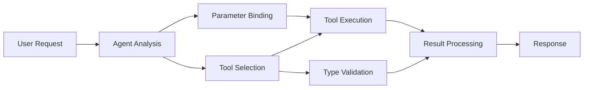

<!--
CO_OP_TRANSLATOR_METADATA:
{
  "original_hash": "91d6061e402489603f2ec8b528cae59b",
  "translation_date": "2025-11-18T16:38:36+00:00",
  "source_file": "04-tool-use/code_samples/04-dotnet-agent-framework.md",
  "language_code": "ar"
}
-->
# 🛠️ استخدام الأدوات المتقدمة مع نماذج GitHub (.NET)

## 📋 أهداف التعلم

يستعرض هذا الدفتر أنماط دمج الأدوات على مستوى المؤسسات باستخدام إطار عمل Microsoft Agent في .NET مع نماذج GitHub. ستتعلم كيفية بناء وكلاء متقدمين باستخدام أدوات متعددة ومتخصصة، مستفيدًا من قوة الكتابة القوية في C# وميزات .NET على مستوى المؤسسات.

### القدرات المتقدمة للأدوات التي ستتقنها

- 🔧 **هيكلية متعددة الأدوات**: بناء وكلاء بقدرات متعددة ومتخصصة
- 🎯 **تنفيذ آمن للأنواع**: الاستفادة من التحقق أثناء وقت الترجمة في C#
- 📊 **أنماط أدوات المؤسسات**: تصميم أدوات جاهزة للإنتاج ومعالجة الأخطاء
- 🔗 **تركيب الأدوات**: دمج الأدوات لإنشاء تدفقات عمل تجارية معقدة

## 🎯 فوائد هيكلية الأدوات في .NET

### ميزات أدوات المؤسسات

- **التحقق أثناء وقت الترجمة**: الكتابة القوية تضمن صحة معلمات الأدوات
- **حقن التبعيات**: تكامل حاوية IoC لإدارة الأدوات
- **أنماط Async/Await**: تنفيذ الأدوات بدون حظر مع إدارة الموارد بشكل صحيح
- **التسجيل المنظم**: تكامل التسجيل المدمج لمراقبة تنفيذ الأدوات

### أنماط جاهزة للإنتاج

- **معالجة الاستثناءات**: إدارة شاملة للأخطاء باستخدام استثناءات محددة
- **إدارة الموارد**: أنماط التخلص المناسبة وإدارة الذاكرة
- **مراقبة الأداء**: مقاييس مدمجة وعدادات الأداء
- **إدارة التكوين**: تكوين آمن للأنواع مع التحقق

## 🔧 الهيكلية التقنية

### مكونات الأدوات الأساسية في .NET

- **Microsoft.Extensions.AI**: طبقة تجريد موحدة للأدوات
- **Microsoft.Agents.AI**: تنسيق أدوات على مستوى المؤسسات
- **تكامل نماذج GitHub**: عميل API عالي الأداء مع تجميع الاتصالات

### خط أنابيب تنفيذ الأدوات



## 🛠️ فئات الأدوات والأنماط

### 1. **أدوات معالجة البيانات**

- **التحقق من المدخلات**: الكتابة القوية مع تعليقات البيانات
- **عمليات التحويل**: تحويل البيانات وتنسيقها بشكل آمن للأنواع
- **منطق الأعمال**: أدوات الحساب والتحليل الخاصة بالمجال
- **تنسيق المخرجات**: إنشاء استجابات منظمة

### 2. **أدوات التكامل**

- **موصلات API**: تكامل خدمات RESTful باستخدام HttpClient
- **أدوات قواعد البيانات**: تكامل Entity Framework للوصول إلى البيانات
- **عمليات الملفات**: عمليات نظام الملفات الآمنة مع التحقق
- **الخدمات الخارجية**: أنماط تكامل الخدمات الخارجية

### 3. **أدوات المساعدة**

- **معالجة النصوص**: أدوات التلاعب بالنصوص وتنسيقها
- **عمليات التاريخ/الوقت**: حسابات التاريخ/الوقت مع مراعاة الثقافة
- **أدوات رياضية**: حسابات دقيقة وعمليات إحصائية
- **أدوات التحقق**: التحقق من قواعد الأعمال والتحقق من البيانات

هل أنت مستعد لبناء وكلاء على مستوى المؤسسات بقدرات أدوات قوية وآمنة للأنواع في .NET؟ لنبدأ في تصميم حلول احترافية! 🏢⚡

## 🚀 البدء

### المتطلبات الأساسية

- [.NET 10 SDK](https://dotnet.microsoft.com/download/dotnet/10.0) أو أعلى
- [رمز الوصول إلى API لنماذج GitHub](https://docs.github.com/github-models/github-models-at-scale/using-your-own-api-keys-in-github-models)

### متغيرات البيئة المطلوبة

```bash
# zsh/bash
export GH_TOKEN=<your_github_token>
export GH_ENDPOINT=https://models.github.ai/inference
export GH_MODEL_ID=openai/gpt-5-mini
```

```powershell
# PowerShell
$env:GH_TOKEN = "<your_github_token>"
$env:GH_ENDPOINT = "https://models.github.ai/inference"
$env:GH_MODEL_ID = "openai/gpt-5-mini"
```

### مثال على الكود

لتشغيل مثال الكود،

```bash
# zsh/bash
chmod +x ./04-dotnet-agent-framework.cs
./04-dotnet-agent-framework.cs
```

أو باستخدام dotnet CLI:

```bash
dotnet run ./04-dotnet-agent-framework.cs
```

راجع [`04-dotnet-agent-framework.cs`](../../../../04-tool-use/code_samples/04-dotnet-agent-framework.cs) للحصول على الكود الكامل.

```csharp
#!/usr/bin/dotnet run

#:package Microsoft.Extensions.AI@10.*
#:package Microsoft.Agents.AI.OpenAI@1.*-*

using System.ClientModel;
using System.ComponentModel;

using Microsoft.Agents.AI;
using Microsoft.Extensions.AI;

using OpenAI;

// Tool Function: Random Destination Generator
// This static method will be available to the agent as a callable tool
// The [Description] attribute helps the AI understand when to use this function
// This demonstrates how to create custom tools for AI agents
[Description("Provides a random vacation destination.")]
static string GetRandomDestination()
{
    // List of popular vacation destinations around the world
    // The agent will randomly select from these options
    var destinations = new List<string>
    {
        "Paris, France",
        "Tokyo, Japan",
        "New York City, USA",
        "Sydney, Australia",
        "Rome, Italy",
        "Barcelona, Spain",
        "Cape Town, South Africa",
        "Rio de Janeiro, Brazil",
        "Bangkok, Thailand",
        "Vancouver, Canada"
    };

    // Generate random index and return selected destination
    // Uses System.Random for simple random selection
    var random = new Random();
    int index = random.Next(destinations.Count);
    return destinations[index];
}

// Extract configuration from environment variables
// Retrieve the GitHub Models API endpoint, defaults to https://models.github.ai/inference if not specified
// Retrieve the model ID, defaults to openai/gpt-5-mini if not specified
// Retrieve the GitHub token for authentication, throws exception if not specified
var github_endpoint = Environment.GetEnvironmentVariable("GH_ENDPOINT") ?? "https://models.github.ai/inference";
var github_model_id = Environment.GetEnvironmentVariable("GH_MODEL_ID") ?? "openai/gpt-5-mini";
var github_token = Environment.GetEnvironmentVariable("GH_TOKEN") ?? throw new InvalidOperationException("GH_TOKEN is not set.");

// Configure OpenAI Client Options
// Create configuration options to point to GitHub Models endpoint
// This redirects OpenAI client calls to GitHub's model inference service
var openAIOptions = new OpenAIClientOptions()
{
    Endpoint = new Uri(github_endpoint)
};

// Initialize OpenAI Client with GitHub Models Configuration
// Create OpenAI client using GitHub token for authentication
// Configure it to use GitHub Models endpoint instead of OpenAI directly
var openAIClient = new OpenAIClient(new ApiKeyCredential(github_token), openAIOptions);

// Define Agent Identity and Comprehensive Instructions
// Agent name for identification and logging purposes
var AGENT_NAME = "TravelAgent";

// Detailed instructions that define the agent's personality, capabilities, and behavior
// This system prompt shapes how the agent responds and interacts with users
var AGENT_INSTRUCTIONS = """
You are a helpful AI Agent that can help plan vacations for customers.

Important: When users specify a destination, always plan for that location. Only suggest random destinations when the user hasn't specified a preference.

When the conversation begins, introduce yourself with this message:
"Hello! I'm your TravelAgent assistant. I can help plan vacations and suggest interesting destinations for you. Here are some things you can ask me:
1. Plan a day trip to a specific location
2. Suggest a random vacation destination
3. Find destinations with specific features (beaches, mountains, historical sites, etc.)
4. Plan an alternative trip if you don't like my first suggestion

What kind of trip would you like me to help you plan today?"

Always prioritize user preferences. If they mention a specific destination like "Bali" or "Paris," focus your planning on that location rather than suggesting alternatives.
""";

// Create AI Agent with Advanced Travel Planning Capabilities
// Initialize complete agent pipeline: OpenAI client → Chat client → AI agent
// Configure agent with name, detailed instructions, and available tools
// This demonstrates the .NET agent creation pattern with full configuration
AIAgent agent = openAIClient
    .GetChatClient(github_model_id)
    .CreateAIAgent(
        name: AGENT_NAME,
        instructions: AGENT_INSTRUCTIONS,
        tools: [AIFunctionFactory.Create(GetRandomDestination)]
    );

// Create New Conversation Thread for Context Management
// Initialize a new conversation thread to maintain context across multiple interactions
// Threads enable the agent to remember previous exchanges and maintain conversational state
// This is essential for multi-turn conversations and contextual understanding
AgentThread thread = agent.GetNewThread();

// Execute Agent: First Travel Planning Request
// Run the agent with an initial request that will likely trigger the random destination tool
// The agent will analyze the request, use the GetRandomDestination tool, and create an itinerary
// Using the thread parameter maintains conversation context for subsequent interactions
await foreach (var update in agent.RunStreamingAsync("Plan me a day trip", thread))
{
    await Task.Delay(10);
    Console.Write(update);
}

Console.WriteLine();

// Execute Agent: Follow-up Request with Context Awareness
// Demonstrate contextual conversation by referencing the previous response
// The agent remembers the previous destination suggestion and will provide an alternative
// This showcases the power of conversation threads and contextual understanding in .NET agents
await foreach (var update in agent.RunStreamingAsync("I don't like that destination. Plan me another vacation.", thread))
{
    await Task.Delay(10);
    Console.Write(update);
}
```

---

<!-- CO-OP TRANSLATOR DISCLAIMER START -->
**إخلاء المسؤولية**:  
تمت ترجمة هذا المستند باستخدام خدمة الترجمة بالذكاء الاصطناعي [Co-op Translator](https://github.com/Azure/co-op-translator). بينما نسعى لتحقيق الدقة، يرجى العلم أن الترجمات الآلية قد تحتوي على أخطاء أو عدم دقة. يجب اعتبار المستند الأصلي بلغته الأصلية المصدر الموثوق. للحصول على معلومات حاسمة، يُوصى بالترجمة البشرية الاحترافية. نحن غير مسؤولين عن أي سوء فهم أو تفسيرات خاطئة ناتجة عن استخدام هذه الترجمة.
<!-- CO-OP TRANSLATOR DISCLAIMER END -->