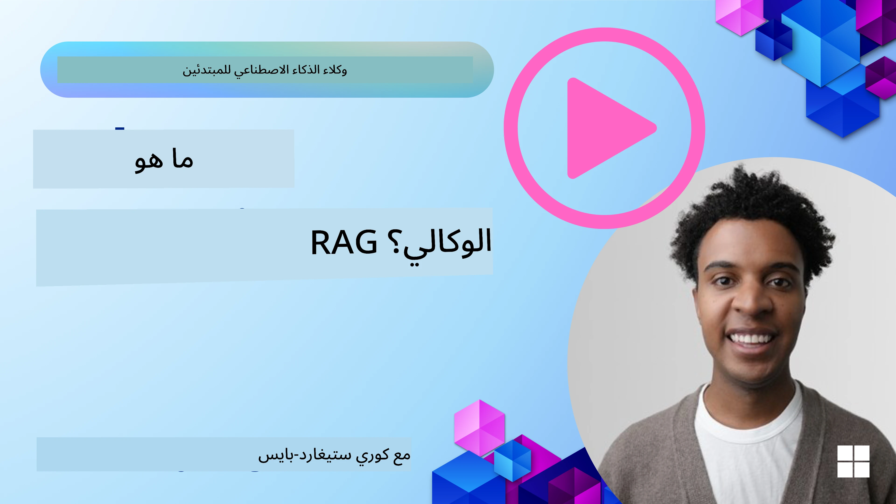
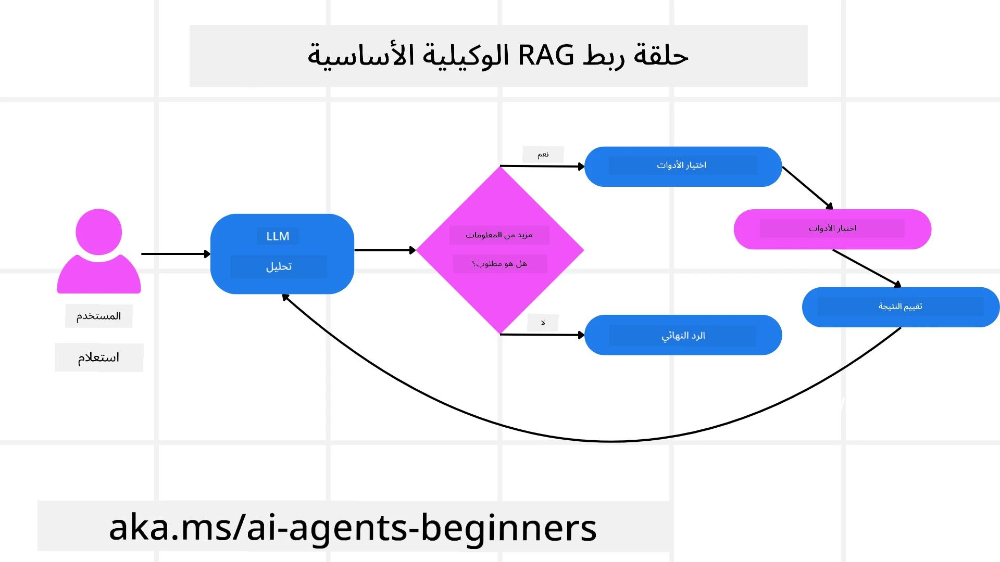
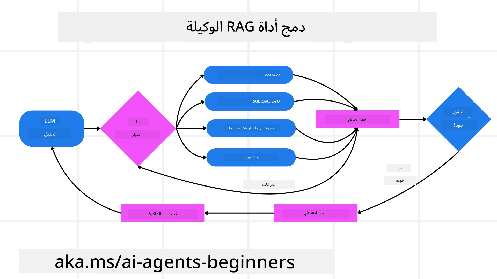
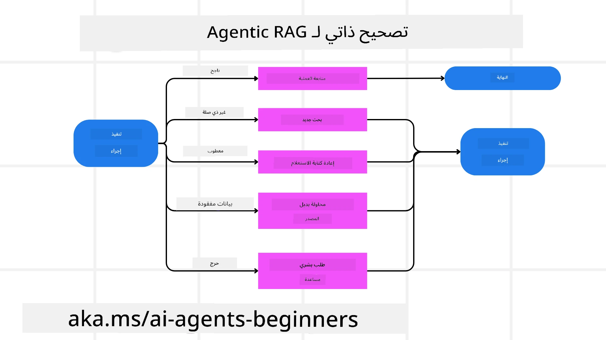
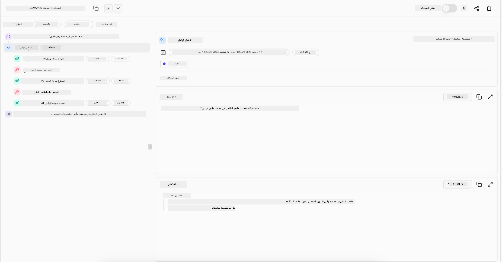

<!--
CO_OP_TRANSLATOR_METADATA:
{
  "original_hash": "0ebf6b2290db55dbf2d10cc49655523b",
  "translation_date": "2025-09-30T06:19:01+00:00",
  "source_file": "05-agentic-rag/README.md",
  "language_code": "ar"
}
-->

> _(اضغط على الصورة أعلاه لمشاهدة فيديو الدرس)_

# Agentic RAG

يقدم هذا الدرس نظرة شاملة على مفهوم "Agentic Retrieval-Augmented Generation" (Agentic RAG)، وهو نموذج جديد في الذكاء الاصطناعي حيث تقوم نماذج اللغة الكبيرة (LLMs) بالتخطيط الذاتي للخطوات التالية أثناء استرجاع المعلومات من مصادر خارجية. على عكس الأنماط التقليدية التي تعتمد على الاسترجاع ثم القراءة، يتضمن Agentic RAG استدعاءات متكررة للنموذج، تتخللها استخدام أدوات أو وظائف وإنتاج مخرجات منظمة. يقوم النظام بتقييم النتائج، تحسين الاستفسارات، استدعاء أدوات إضافية إذا لزم الأمر، ويستمر في هذه الدورة حتى يتم الوصول إلى حل مرضٍ.

## المقدمة

سيتناول هذا الدرس:

- **فهم Agentic RAG:** التعرف على النموذج الجديد في الذكاء الاصطناعي حيث تقوم نماذج اللغة الكبيرة (LLMs) بالتخطيط الذاتي للخطوات التالية أثناء استرجاع المعلومات من مصادر البيانات الخارجية.
- **استيعاب نمط Maker-Checker التكراري:** فهم دورة الاستدعاءات المتكررة للنموذج، تتخللها استخدام أدوات أو وظائف وإنتاج مخرجات منظمة، لتحسين الدقة ومعالجة الاستفسارات غير الصحيحة.
- **استكشاف التطبيقات العملية:** تحديد السيناريوهات التي يتألق فيها Agentic RAG، مثل البيئات التي تركز على الدقة، التفاعلات المعقدة مع قواعد البيانات، وسير العمل الممتد.

## أهداف التعلم

بعد إكمال هذا الدرس، ستتمكن من:

- **فهم Agentic RAG:** التعرف على النموذج الجديد في الذكاء الاصطناعي حيث تقوم نماذج اللغة الكبيرة (LLMs) بالتخطيط الذاتي للخطوات التالية أثناء استرجاع المعلومات من مصادر البيانات الخارجية.
- **نمط Maker-Checker التكراري:** استيعاب مفهوم دورة الاستدعاءات المتكررة للنموذج، تتخللها استخدام أدوات أو وظائف وإنتاج مخرجات منظمة، لتحسين الدقة ومعالجة الاستفسارات غير الصحيحة.
- **امتلاك عملية التفكير:** فهم قدرة النظام على امتلاك عملية التفكير الخاصة به، واتخاذ قرارات حول كيفية التعامل مع المشكلات دون الاعتماد على مسارات محددة مسبقًا.
- **سير العمل:** فهم كيفية اتخاذ النموذج الذاتي قرارات لاسترجاع تقارير اتجاهات السوق، تحديد بيانات المنافسين، ربط مقاييس المبيعات الداخلية، تلخيص النتائج، وتقييم الاستراتيجية.
- **الحلقات التكرارية، تكامل الأدوات، والذاكرة:** التعرف على اعتماد النظام على نمط التفاعل المتكرر، والحفاظ على الحالة والذاكرة عبر الخطوات لتجنب الحلقات المتكررة واتخاذ قرارات مستنيرة.
- **معالجة أوضاع الفشل والتصحيح الذاتي:** استكشاف آليات التصحيح الذاتي القوية للنظام، بما في ذلك التكرار وإعادة الاستفسار، استخدام أدوات التشخيص، والاعتماد على الإشراف البشري عند الحاجة.
- **حدود الوكالة:** فهم حدود Agentic RAG، مع التركيز على الاستقلالية الخاصة بالمجال، الاعتماد على البنية التحتية، واحترام الضوابط.
- **الحالات العملية والقيمة:** تحديد السيناريوهات التي يتألق فيها Agentic RAG، مثل البيئات التي تركز على الدقة، التفاعلات المعقدة مع قواعد البيانات، وسير العمل الممتد.
- **الحوكمة، الشفافية، والثقة:** التعرف على أهمية الحوكمة والشفافية، بما في ذلك التفكير القابل للتفسير، التحكم في التحيز، والإشراف البشري.

## ما هو Agentic RAG؟

"Agentic Retrieval-Augmented Generation" (Agentic RAG) هو نموذج جديد في الذكاء الاصطناعي حيث تقوم نماذج اللغة الكبيرة (LLMs) بالتخطيط الذاتي للخطوات التالية أثناء استرجاع المعلومات من مصادر خارجية. على عكس الأنماط التقليدية التي تعتمد على الاسترجاع ثم القراءة، يتضمن Agentic RAG استدعاءات متكررة للنموذج، تتخللها استخدام أدوات أو وظائف وإنتاج مخرجات منظمة. يقوم النظام بتقييم النتائج، تحسين الاستفسارات، استدعاء أدوات إضافية إذا لزم الأمر، ويستمر في هذه الدورة حتى يتم الوصول إلى حل مرضٍ. هذا النمط التكراري "Maker-Checker" يعزز الدقة، يعالج الاستفسارات غير الصحيحة، ويضمن نتائج عالية الجودة.

يمتلك النظام عملية التفكير الخاصة به، حيث يعيد كتابة الاستفسارات الفاشلة، يختار طرق استرجاع مختلفة، ويقوم بدمج أدوات متعددة—مثل البحث المتجهي في Azure AI Search، قواعد بيانات SQL، أو واجهات برمجة التطبيقات المخصصة—قبل تقديم الإجابة النهائية. السمة المميزة للنظام الذاتي هي قدرته على امتلاك عملية التفكير الخاصة به. تعتمد تطبيقات RAG التقليدية على مسارات محددة مسبقًا، لكن النظام الذاتي يحدد تسلسل الخطوات بناءً على جودة المعلومات التي يجدها.

## تعريف Agentic Retrieval-Augmented Generation (Agentic RAG)

"Agentic Retrieval-Augmented Generation" (Agentic RAG) هو نموذج جديد في تطوير الذكاء الاصطناعي حيث لا تقوم نماذج اللغة الكبيرة (LLMs) فقط باسترجاع المعلومات من مصادر البيانات الخارجية، بل تخطط أيضًا خطواتها التالية بشكل ذاتي. على عكس الأنماط التقليدية التي تعتمد على الاسترجاع ثم القراءة أو تسلسل التعليمات المكتوبة بعناية، يتضمن Agentic RAG دورة من الاستدعاءات التكرارية للنموذج، تتخللها استخدام أدوات أو وظائف وإنتاج مخرجات منظمة. في كل خطوة، يقوم النظام بتقييم النتائج التي حصل عليها، يقرر ما إذا كان يحتاج إلى تحسين استفساراته، يستدعي أدوات إضافية إذا لزم الأمر، ويستمر في هذه الدورة حتى يصل إلى حل مرضٍ.

هذا النمط التكراري "Maker-Checker" مصمم لتحسين الدقة، معالجة الاستفسارات غير الصحيحة لقواعد البيانات المنظمة (مثل NL2SQL)، وضمان نتائج متوازنة وعالية الجودة. بدلاً من الاعتماد فقط على سلاسل التعليمات المصممة بعناية، يمتلك النظام عملية التفكير الخاصة به. يمكنه إعادة كتابة الاستفسارات الفاشلة، اختيار طرق استرجاع مختلفة، ودمج أدوات متعددة—مثل البحث المتجهي في Azure AI Search، قواعد بيانات SQL، أو واجهات برمجة التطبيقات المخصصة—قبل تقديم الإجابة النهائية. هذا يلغي الحاجة إلى أطر تنظيمية معقدة للغاية. بدلاً من ذلك، يمكن لدورة بسيطة نسبيًا من "استدعاء النموذج → استخدام الأداة → استدعاء النموذج → ..." أن تنتج مخرجات متطورة وموثوقة.

## امتلاك عملية التفكير

السمة المميزة التي تجعل النظام "ذاتيًا" هي قدرته على امتلاك عملية التفكير الخاصة به. تعتمد تطبيقات RAG التقليدية غالبًا على البشر لتحديد مسار للنموذج: سلسلة من الأفكار التي تحدد ما يجب استرجاعه ومتى.  
لكن عندما يكون النظام ذاتيًا حقًا، فإنه يقرر داخليًا كيفية التعامل مع المشكلة. إنه لا ينفذ فقط تعليمات مكتوبة؛ بل يحدد بشكل ذاتي تسلسل الخطوات بناءً على جودة المعلومات التي يجدها.  
على سبيل المثال، إذا طُلب منه إنشاء استراتيجية إطلاق منتج، فإنه لا يعتمد فقط على تعليمات مكتوبة تحدد سير العمل بالكامل للبحث واتخاذ القرار. بدلاً من ذلك، يقرر النموذج الذاتي بشكل مستقل:

1. استرجاع تقارير اتجاهات السوق الحالية باستخدام Bing Web Grounding.
2. تحديد بيانات المنافسين ذات الصلة باستخدام Azure AI Search.
3. ربط مقاييس المبيعات الداخلية التاريخية باستخدام Azure SQL Database.
4. تلخيص النتائج في استراتيجية متماسكة يتم تنسيقها عبر Azure OpenAI Service.
5. تقييم الاستراتيجية للثغرات أو التناقضات، مما يستدعي جولة أخرى من الاسترجاع إذا لزم الأمر.  
كل هذه الخطوات—تحسين الاستفسارات، اختيار المصادر، التكرار حتى الوصول إلى إجابة "مرضية"—يتم اتخاذها بواسطة النموذج، وليس مكتوبة مسبقًا بواسطة الإنسان.

## الحلقات التكرارية، تكامل الأدوات، والذاكرة

يعتمد النظام الذاتي على نمط تفاعل متكرر:

- **الاستدعاء الأولي:** يتم تقديم هدف المستخدم (أي الطلب) إلى النموذج.
- **استدعاء الأدوات:** إذا حدد النموذج معلومات مفقودة أو تعليمات غامضة، فإنه يختار أداة أو طريقة استرجاع—مثل استعلام قاعدة بيانات متجهية (مثل Azure AI Search Hybrid search على البيانات الخاصة) أو استدعاء SQL منظم—لجمع المزيد من السياق.
- **التقييم والتحسين:** بعد مراجعة البيانات المسترجعة، يقرر النموذج ما إذا كانت المعلومات كافية. إذا لم تكن كذلك، فإنه يحسن الاستفسار، يجرب أداة مختلفة، أو يضبط نهجه.
- **التكرار حتى الرضا:** تستمر هذه الدورة حتى يقرر النموذج أنه يمتلك وضوحًا كافيًا وأدلة لتقديم استجابة نهائية مدروسة جيدًا.
- **الذاكرة والحالة:** نظرًا لأن النظام يحافظ على الحالة والذاكرة عبر الخطوات، يمكنه استدعاء المحاولات السابقة ونتائجها، مما يتجنب الحلقات المتكررة ويتخذ قرارات أكثر استنارة أثناء تقدمه.

مع مرور الوقت، يخلق هذا إحساسًا بالفهم المتطور، مما يمكن النموذج من التعامل مع المهام المعقدة متعددة الخطوات دون الحاجة إلى تدخل الإنسان المستمر أو إعادة تشكيل الطلب.

## معالجة أوضاع الفشل والتصحيح الذاتي

تشمل استقلالية Agentic RAG أيضًا آليات تصحيح ذاتي قوية. عندما يواجه النظام طرقًا مسدودة—مثل استرجاع مستندات غير ذات صلة أو مواجهة استفسارات غير صحيحة—يمكنه:

- **التكرار وإعادة الاستفسار:** بدلاً من تقديم استجابات منخفضة القيمة، يحاول النموذج استراتيجيات بحث جديدة، يعيد كتابة استفسارات قواعد البيانات، أو ينظر إلى مجموعات بيانات بديلة.
- **استخدام أدوات التشخيص:** قد يستدعي النظام وظائف إضافية مصممة لمساعدته في تصحيح خطوات التفكير أو تأكيد صحة البيانات المسترجعة. ستكون أدوات مثل Azure AI Tracing مهمة لتمكين المراقبة والملاحظة القوية.
- **الاعتماد على الإشراف البشري:** بالنسبة للسيناريوهات الحساسة أو التي تفشل بشكل متكرر، قد يشير النموذج إلى عدم اليقين ويطلب توجيهًا بشريًا. بمجرد أن يقدم الإنسان ملاحظات تصحيحية، يمكن للنموذج دمج هذا الدرس في المستقبل.

هذا النهج التكراري والديناميكي يسمح للنموذج بالتحسن باستمرار، مما يضمن أنه ليس مجرد نظام يعتمد على محاولة واحدة، بل نظام يتعلم من أخطائه خلال الجلسة.

## حدود الوكالة

على الرغم من استقلاليته داخل المهمة، فإن Agentic RAG ليس مكافئًا للذكاء الاصطناعي العام. قدراته "الذاتية" تقتصر على الأدوات، مصادر البيانات، والسياسات التي يوفرها المطورون البشريون. لا يمكنه اختراع أدواته الخاصة أو الخروج عن حدود المجال التي تم تحديدها. بدلاً من ذلك، يتفوق في تنظيم الموارد المتاحة بشكل ديناميكي.  
تشمل الاختلافات الرئيسية عن أشكال الذكاء الاصطناعي الأكثر تقدمًا:

1. **الاستقلالية الخاصة بالمجال:** تركز أنظمة Agentic RAG على تحقيق أهداف محددة من قبل المستخدم داخل مجال معروف، باستخدام استراتيجيات مثل إعادة كتابة الاستفسارات أو اختيار الأدوات لتحسين النتائج.
2. **الاعتماد على البنية التحتية:** تعتمد قدرات النظام على الأدوات والبيانات التي يدمجها المطورون. لا يمكنه تجاوز هذه الحدود دون تدخل بشري.
3. **احترام الضوابط:** تظل المبادئ الأخلاقية، قواعد الامتثال، وسياسات الأعمال مهمة للغاية. حرية الوكيل دائمًا مقيدة بإجراءات السلامة وآليات الإشراف (نأمل؟).

## الحالات العملية والقيمة

يتألق Agentic RAG في السيناريوهات التي تتطلب تحسينًا تكراريًا ودقة:

1. **البيئات التي تركز على الدقة:** في عمليات التحقق من الامتثال، التحليل التنظيمي، أو البحث القانوني، يمكن للنموذج الذاتي التحقق من الحقائق بشكل متكرر، استشارة مصادر متعددة، وإعادة كتابة الاستفسارات حتى يقدم إجابة مدققة تمامًا.
2. **التفاعلات المعقدة مع قواعد البيانات:** عند التعامل مع البيانات المنظمة حيث قد تفشل الاستفسارات أو تحتاج إلى تعديل، يمكن للنظام تحسين استفساراته بشكل ذاتي باستخدام Azure SQL أو Microsoft Fabric OneLake، مما يضمن أن الاسترجاع النهائي يتماشى مع نية المستخدم.
3. **سير العمل الممتد:** قد تتطور الجلسات الطويلة مع ظهور معلومات جديدة. يمكن لـ Agentic RAG دمج البيانات الجديدة باستمرار، وتغيير الاستراتيجيات أثناء تعلم المزيد عن مجال المشكلة.

## الحوكمة، الشفافية، والثقة

مع زيادة استقلالية هذه الأنظمة في التفكير، تصبح الحوكمة والشفافية أمرًا بالغ الأهمية:

- **التفكير القابل للتفسير:** يمكن للنموذج تقديم سجل تدقيق للاستفسارات التي قام بها، المصادر التي استشارها، وخطوات التفكير التي اتخذها للوصول إلى استنتاجه. يمكن لأدوات مثل Azure AI Content Safety وAzure AI Tracing / GenAIOps المساعدة في الحفاظ على الشفافية وتقليل المخاطر.
- **التحكم في التحيز والاسترجاع المتوازن:** يمكن للمطورين ضبط استراتيجيات الاسترجاع لضمان النظر في مصادر البيانات المتوازنة والممثلة، ومراجعة المخرجات بانتظام للكشف عن التحيز أو الأنماط المنحرفة باستخدام نماذج مخصصة للمنظمات المتقدمة في علم البيانات باستخدام Azure Machine Learning.
- **الإشراف البشري والامتثال:** بالنسبة للمهام الحساسة، يظل المراجعة البشرية ضروريًا. لا يحل Agentic RAG محل الحكم البشري في القرارات ذات المخاطر العالية—بل يعززه من خلال تقديم خيارات مدققة بشكل أفضل.

وجود أدوات توفر سجلًا واضحًا للإجراءات أمر ضروري. بدونها، يمكن أن يكون تصحيح عملية متعددة الخطوات أمرًا صعبًا للغاية. انظر المثال التالي من Literal AI (الشركة وراء Chainlit) لتشغيل وكيل:

## الخاتمة

يمثل Agentic RAG تطورًا طبيعيًا في كيفية تعامل أنظمة الذكاء الاصطناعي مع المهام المعقدة والمكثفة بالبيانات. من خلال اعتماد نمط تفاعل متكرر، اختيار الأدوات بشكل ذاتي، وتحسين الاستفسارات حتى تحقيق نتيجة عالية الجودة، ينتقل النظام من اتباع التعليمات الثابتة إلى اتخاذ قرارات أكثر تكيفًا ووعيًا بالسياق. على الرغم من أنه لا يزال مقيدًا بالبنى التحتية المحددة من قبل البشر والمبادئ الأخلاقية، فإن هذه القدرات الذاتية تمكن من تفاعلات أكثر ثراءً وديناميكية، وفي النهاية أكثر فائدة للمؤسسات والمستخدمين النهائيين.

### هل لديك المزيد من الأسئلة حول Agentic RAG؟

انضم إلى [Azure AI Foundry Discord](https://aka.ms/ai-agents/discord) للتواصل مع متعلمين آخرين، حضور ساعات المكتب، والحصول على إجابات لأسئلتك حول وكلاء الذكاء الاصطناعي.

## موارد إضافية

- <a href="https://learn.microsoft.com/training/modules/use-own-data-azure-openai" target="_blank">تنفيذ استرجاع البيانات المعزز (RAG) باستخدام Azure OpenAI Service: تعلم كيفية استخدام بياناتك الخاصة مع Azure OpenAI Service. يقدم هذا الدليل من Microsoft Learn شرحًا شاملاً حول تنفيذ RAG</a>
- <a href="https://learn.microsoft.com/azure/ai-studio/concepts/evaluation-approach-gen-ai" target="_blank">تقييم تطبيقات الذكاء الاصطناعي التوليدي مع Azure AI Foundry: تغطي هذه المقالة تقييم ومقارنة النماذج على مجموعات البيانات المتاحة علنًا، بما في ذلك تطبيقات الذكاء الاصطناعي الذاتي وهياكل RAG</a>
- <a href="https://weaviate.io/blog/what-is-agentic-rag" target="_blank">ما هو Agentic RAG | Weaviate</a>
- <a href="https://ragaboutit.com/agentic-rag-a-complete-guide-to-agent-based-retrieval-augmented-generation/" target="_blank">Agentic RAG: دليل شامل لاسترجاع البيانات المعزز بالوكيل – أخبار من جيل RAG</a>
- <a href="https://huggingface.co/learn/cookbook/agent_rag" target="_blank">Agentic RAG: عزز أداء RAG الخاص بك بإعادة صياغة الاستعلام والاستعلام الذاتي! دليل الذكاء الاصطناعي مفتوح المصدر من Hugging Face</a>
- <a href="https://youtu.be/aQ4yQXeB1Ss?si=2HUqBzHoeB5tR04U" target="_blank">إضافة طبقات وكيلة إلى RAG</a>
- <a href="https://www.youtube.com/watch?v=zeAyuLc_f3Q&t=244s" target="_blank">مستقبل مساعدي المعرفة: جيري ليو</a>
- <a href="https://www.youtube.com/watch?v=AOSjiXP1jmQ" target="_blank">كيفية بناء أنظمة Agentic RAG</a>
- <a href="https://ignite.microsoft.com/sessions/BRK102?source=sessions" target="_blank">استخدام خدمة Azure AI Foundry Agent لتوسيع نطاق وكلاء الذكاء الاصطناعي</a>

### الأوراق الأكاديمية

- <a href="https://arxiv.org/abs/2303.17651" target="_blank">2303.17651 Self-Refine: تحسين تكراري مع التغذية الراجعة الذاتية</a>
- <a href="https://arxiv.org/abs/2303.11366" target="_blank">2303.11366 Reflexion: وكلاء اللغة مع التعلم التعزيزي اللفظي</a>
- <a href="https://arxiv.org/abs/2305.11738" target="_blank">2305.11738 CRITIC: نماذج اللغة الكبيرة يمكنها تصحيح نفسها من خلال النقد التفاعلي مع الأدوات</a>
- <a href="https://arxiv.org/abs/2501.09136" target="_blank">2501.09136 Agentic Retrieval-Augmented Generation: دراسة حول Agentic RAG</a>

## الدرس السابق

[نمط تصميم استخدام الأدوات](../04-tool-use/README.md)

## الدرس التالي

[بناء وكلاء ذكاء اصطناعي موثوقين](../06-building-trustworthy-agents/README.md)

---

**إخلاء المسؤولية**:  
تم ترجمة هذا المستند باستخدام خدمة الترجمة بالذكاء الاصطناعي [Co-op Translator](https://github.com/Azure/co-op-translator). بينما نسعى لتحقيق الدقة، يرجى العلم أن الترجمات الآلية قد تحتوي على أخطاء أو عدم دقة. يجب اعتبار المستند الأصلي بلغته الأصلية المصدر الرسمي. للحصول على معلومات حاسمة، يُوصى بالترجمة البشرية الاحترافية. نحن غير مسؤولين عن أي سوء فهم أو تفسيرات خاطئة ناتجة عن استخدام هذه الترجمة.