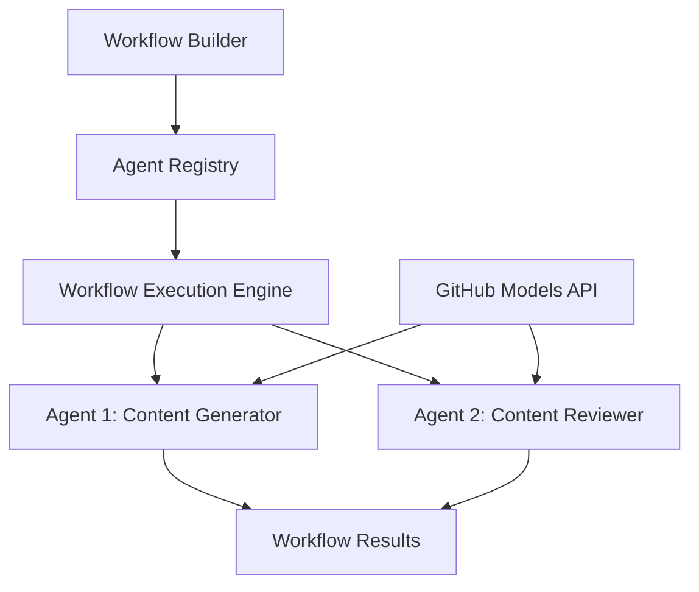

<!--
CO_OP_TRANSLATOR_METADATA:
{
  "original_hash": "034158688d0a45aae06dcbb21b0da5ae",
  "translation_date": "2025-11-11T12:40:25+00:00",
  "source_file": "08-multi-agent/code_samples/workflows-agent-framework/dotNET/01.dotnet-agent-framework-workflow-ghmodel-basic.md",
  "language_code": "ar"
}
-->
# 🔄 أساسيات تدفقات العمل مع نماذج GitHub (.NET)

## 📋 دليل تنظيم تدفقات العمل

يستعرض هذا الدليل كيفية بناء تدفقات عمل **الوكيل الذكي** باستخدام إطار عمل Microsoft Agent لـ .NET ونماذج GitHub. ستتعلم كيفية إنشاء عمليات تجارية متعددة الخطوات حيث يتعاون وكلاء الذكاء الاصطناعي لإنجاز مهام معقدة من خلال أنماط تنظيمية منظمة.

## 🎯 أهداف التعلم

### 🏗️ **أساسيات هندسة تدفقات العمل**
- **منشئ تدفقات العمل**: تصميم وتنظيم عمليات الذكاء الاصطناعي متعددة الخطوات
- **تنسيق الوكلاء**: تنسيق عمل وكلاء متخصصين متعددين داخل تدفقات العمل
- **دمج نماذج GitHub**: الاستفادة من خدمة استنتاج نماذج الذكاء الاصطناعي من GitHub في تدفقات العمل
- **تصميم تدفقات العمل بصريًا**: إنشاء وتصوير هياكل تدفقات العمل لفهم أفضل

### 🔄 **أنماط تنظيم العمليات**
- **المعالجة المتسلسلة**: ربط مهام الوكلاء المتعددة بترتيب منطقي
- **إدارة الحالة**: الحفاظ على السياق وتدفق البيانات عبر مراحل تدفق العمل
- **معالجة الأخطاء**: تنفيذ استرداد الأخطاء بشكل قوي ومرونة تدفق العمل
- **تحسين الأداء**: تصميم تدفقات عمل فعالة لعمليات على مستوى المؤسسات

### 🏢 **تطبيقات تدفقات العمل للمؤسسات**
- **أتمتة العمليات التجارية**: أتمتة تدفقات العمل التنظيمية المعقدة
- **خط إنتاج المحتوى**: تدفقات تحريرية مع مراحل المراجعة والموافقة
- **أتمتة خدمة العملاء**: حل استفسارات العملاء متعددة الخطوات
- **تدفقات معالجة البيانات**: تدفقات ETL مع تحويل مدعوم بالذكاء الاصطناعي

## ⚙️ المتطلبات والإعداد

### 📦 **حزم NuGet المطلوبة**

يستخدم هذا العرض التوضيحي لتدفقات العمل عدة حزم رئيسية لـ .NET:

```xml
<!-- Core AI Framework -->
<PackageReference Include="Microsoft.Extensions.AI" Version="9.9.0" />

<!-- Agent Framework (Local Development) -->
<!-- Microsoft.Agents.AI.dll - Core agent abstractions -->
<!-- Microsoft.Agents.AI.OpenAI.dll - OpenAI/GitHub Models integration -->

<!-- Configuration and Environment -->
<PackageReference Include="DotNetEnv" Version="3.1.1" />
```

### 🔑 **إعداد نماذج GitHub**

**إعداد البيئة (.env file):**
```env
GITHUB_TOKEN=your_github_personal_access_token
GITHUB_ENDPOINT=https://models.inference.ai.azure.com
GITHUB_MODEL_ID=gpt-4o-mini
```

**الوصول إلى نماذج GitHub:**
1. قم بالتسجيل في نماذج GitHub (حاليًا في مرحلة المعاينة)
2. قم بإنشاء رمز وصول شخصي مع أذونات الوصول إلى النماذج
3. قم بتكوين متغيرات البيئة كما هو موضح أعلاه

### 🏗️ **نظرة عامة على هندسة تدفقات العمل**



**المكونات الرئيسية:**
- **WorkflowBuilder**: محرك التنظيم الرئيسي لتصميم تدفقات العمل
- **AIAgent**: وكلاء متخصصون فرديون بقدرات محددة
- **GitHub Models Client**: دمج خدمة استنتاج نماذج الذكاء الاصطناعي
- **Execution Context**: إدارة الحالة وتدفق البيانات بين مراحل تدفق العمل

## 🎨 **أنماط تصميم تدفقات العمل للمؤسسات**

### 📝 **تدفق عمل إنتاج المحتوى**
```
User Request → Content Generation → Quality Review → Final Output
```

### 🔍 **خط معالجة المستندات**
```
Document Input → Analysis → Extraction → Validation → Structured Output
```

### 💼 **تدفق عمل ذكاء الأعمال**
```
Data Collection → Processing → Analysis → Report Generation → Distribution
```

### 🤝 **أتمتة خدمة العملاء**
```
Customer Inquiry → Classification → Processing → Response Generation → Follow-up
```

## 🏢 **فوائد المؤسسات**

### 🎯 **الموثوقية والقابلية للتوسع**
- **تنفيذ حتمي**: نتائج تدفق عمل متسقة وقابلة للتكرار
- **استرداد الأخطاء**: معالجة مرنة للفشل في أي مرحلة من مراحل تدفق العمل
- **مراقبة الأداء**: تتبع مقاييس التنفيذ وفرص التحسين
- **إدارة الموارد**: تخصيص واستخدام فعال لموارد نماذج الذكاء الاصطناعي

### 🔒 **الأمان والامتثال**
- **المصادقة الآمنة**: المصادقة المستندة إلى رموز GitHub للوصول إلى API
- **سجلات التدقيق**: تسجيل كامل لتنفيذ تدفقات العمل ونقاط اتخاذ القرار
- **التحكم في الوصول**: أذونات دقيقة لتنفيذ ومراقبة تدفقات العمل
- **خصوصية البيانات**: التعامل الآمن مع المعلومات الحساسة خلال تدفقات العمل

### 📊 **الرصد والإدارة**
- **تصميم تدفقات العمل بصريًا**: تمثيل واضح لتدفقات العمليات والاعتماديات
- **مراقبة التنفيذ**: تتبع تقدم تدفقات العمل وأدائها في الوقت الفعلي
- **الإبلاغ عن الأخطاء**: تحليل مفصل للأخطاء وقدرات التصحيح
- **تحليلات الأداء**: مقاييس للتحسين وتخطيط السعة

لنبدأ ببناء أول تدفق عمل للذكاء الاصطناعي جاهز للمؤسسات! 🚀

## 💻 تشغيل الكود

التنفيذ الكامل متاح في `01.dotnet-agent-framework-workflow-ghmodel-basic.cs`. يوضح هذا الملف:

1. **إعداد البيئة** - تحميل بيانات اعتماد نماذج GitHub من ملف `.env`
2. **إعداد عميل OpenAI** - تكوين العميل لاستخدام نقطة نهاية نماذج GitHub
3. **إنشاء الوكلاء** - تعريف وكلاء متخصصين (Front Desk و Concierge)
4. **منشئ تدفقات العمل** - إنشاء تدفق عمل متعدد الوكلاء مع معالجة متسلسلة
5. **تنفيذ تدفق العمل** - تشغيل تدفق العمل مع نتائج متدفقة

### 🚀 تشغيل المثال

```bash
# Make the script executable (Unix/Linux/macOS)
chmod +x 01.dotnet-agent-framework-workflow-ghmodel-basic.cs

# Run the workflow
./01.dotnet-agent-framework-workflow-ghmodel-basic.cs
```

أو على Windows:
```powershell
dotnet run 01.dotnet-agent-framework-workflow-ghmodel-basic.cs
```

### 📝 النتائج المتوقعة

سيقوم تدفق العمل بـ:
1. قبول طلب وجهة السفر الخاصة بك ("أود الذهاب إلى باريس")
2. يقدم وكيل Front Desk توصية أولية
3. يقوم وكيل Concierge بمراجعة وتحسين التوصية
4. يعرض الإخراج النهائي تدفق المحادثة الكامل

### 🔧 التخصيص

يمكنك تخصيص تدفق العمل عن طريق:
- تعديل تعليمات الوكلاء لتغيير سلوكهم
- إضافة المزيد من الوكلاء لإنشاء تدفقات عمل متعددة الخطوات معقدة
- تغيير رسالة المستخدم لاختبار سيناريوهات مختلفة
- تعديل حواف تدفق العمل لإنشاء أنماط تنفيذ مختلفة

---

<!-- CO-OP TRANSLATOR DISCLAIMER START -->
**إخلاء المسؤولية**:  
تم ترجمة هذا المستند باستخدام خدمة الترجمة بالذكاء الاصطناعي [Co-op Translator](https://github.com/Azure/co-op-translator). بينما نسعى لتحقيق الدقة، يرجى العلم أن الترجمات الآلية قد تحتوي على أخطاء أو عدم دقة. يجب اعتبار المستند الأصلي بلغته الأصلية المصدر الرسمي. للحصول على معلومات حاسمة، يُوصى بالترجمة البشرية الاحترافية. نحن غير مسؤولين عن أي سوء فهم أو تفسيرات خاطئة تنشأ عن استخدام هذه الترجمة.
<!-- CO-OP TRANSLATOR DISCLAIMER END -->