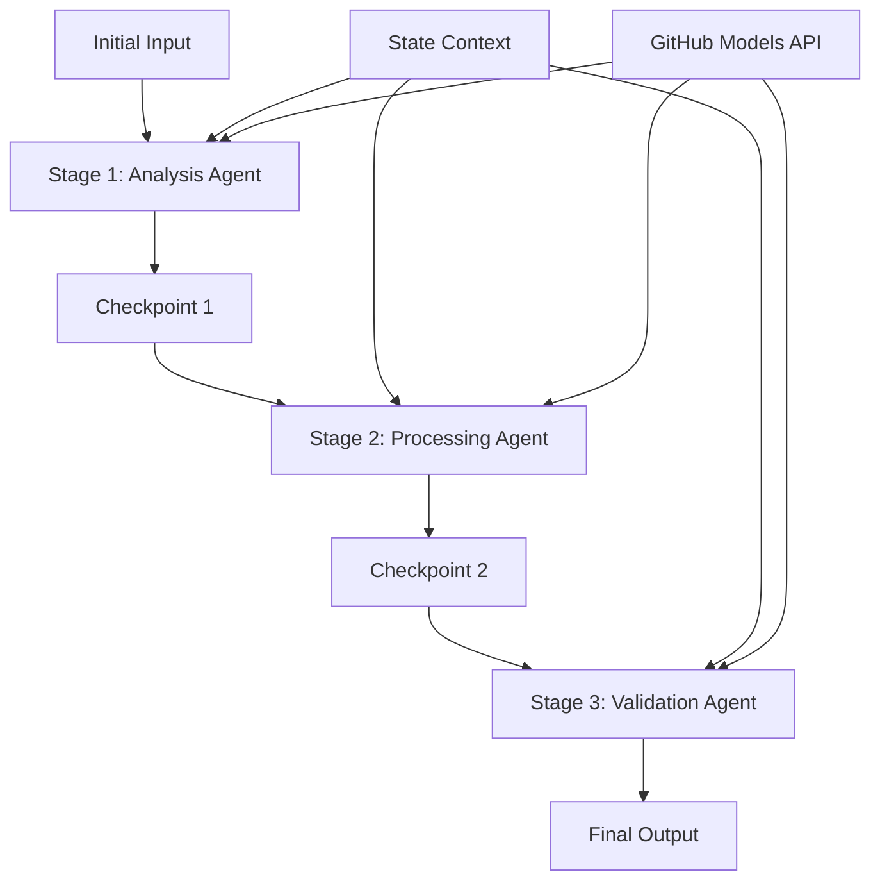

<!--
CO_OP_TRANSLATOR_METADATA:
{
  "original_hash": "1be9c8dcbd79a02d33d2c138684c1394",
  "translation_date": "2025-11-11T13:41:17+00:00",
  "source_file": "08-multi-agent/code_samples/workflows-agent-framework/dotNET/02.dotnet-agent-framework-workflow-ghmodel-sequential.md",
  "language_code": "ar"
}
-->
# ⏩ سير عمل الوكلاء المتسلسل باستخدام نماذج GitHub (.NET)

## 📋 دليل متقدم لمعالجة العمليات المتسلسلة

يستعرض هذا الدليل أنماط **سير العمل المتسلسل** باستخدام إطار عمل Microsoft Agent لـ .NET ونماذج GitHub. ستتعلم كيفية بناء أنظمة معالجة متقدمة خطوة بخطوة حيث ينفذ الوكلاء المهام بترتيب محدد، مع بناء كل مرحلة على نتائج المرحلة السابقة.

## 🎯 أهداف التعلم

### 🔄 **هيكلية المعالجة المتسلسلة**
- **تصميم سير العمل الخطي**: إنشاء أنظمة معالجة خطوة بخطوة مع تحديد واضح للتبعيات
- **إدارة الحالة**: الحفاظ على السياق وتدفق البيانات عبر مراحل سير العمل المتسلسلة
- **دمج نماذج GitHub**: الاستفادة من نماذج الذكاء الاصطناعي الخاصة بـ GitHub في سير العمل متعدد المراحل بـ .NET
- **أنماط خطوط الإنتاج المؤسسية**: بناء أنظمة معالجة متسلسلة جاهزة للإنتاج

### 🏗️ **أنماط متقدمة للمعالجة المتسلسلة**
- **معالجة بوابة المرحلة**: تنفيذ نقاط تحقق للتحقق بين مراحل سير العمل
- **الحفاظ على السياق**: الحفاظ على الحالة والمعرفة المتراكمة عبر جميع المراحل
- **نشر الأخطاء**: التعامل مع الفشل بشكل سلس في سلاسل المعالجة المتسلسلة
- **تحسين الأداء**: تنفيذ متسلسل فعال بأقل قدر من العبء

### 🏢 **تطبيقات متسلسلة للمؤسسات**
- **خط معالجة المستندات**: تحليل المستندات متعدد المراحل، التحويل، والتحقق
- **سير عمل ضمان الجودة**: المراجعة المتسلسلة، التحقق، وعمليات الموافقة
- **خط إنتاج المحتوى**: البحث → الكتابة → التحرير → المراجعة → النشر
- **أتمتة العمليات التجارية**: سير عمل تجاري متعدد الخطوات مع تبعيات واضحة بين المراحل

## ⚙️ المتطلبات والإعداد

### 📦 **حزم NuGet المطلوبة**

الحزم الأساسية لسير العمل المتسلسل بـ .NET:

```xml
<!-- Core AI Framework -->
<PackageReference Include="Microsoft.Extensions.AI" Version="9.9.0" />

<!-- Client Model Abstractions -->
<PackageReference Include="System.ClientModel" Version="1.6.1.0" />

<!-- Azure Identity and Async LINQ Support -->
<PackageReference Include="Azure.Identity" Version="1.15.0" />
<PackageReference Include="System.Linq.Async" Version="6.0.3" />

<!-- Local Agent Framework References -->
<!-- Microsoft.Agents.AI.dll - Core agent abstractions -->
<!-- Microsoft.Agents.AI.OpenAI.dll - GitHub Models integration -->
```

### 🔑 **إعداد نماذج GitHub**

**إعداد البيئة (ملف .env):**
```env
GITHUB_TOKEN=your_github_personal_access_token
GITHUB_ENDPOINT=https://models.inference.ai.azure.com
GITHUB_MODEL_ID=gpt-4o-mini
```

**إدارة التكوين:**
```csharp
// Load environment variables securely
Env.Load("../../../.env");
var githubToken = Environment.GetEnvironmentVariable("GITHUB_TOKEN");
var githubEndpoint = Environment.GetEnvironmentVariable("GITHUB_ENDPOINT");
var modelId = Environment.GetEnvironmentVariable("GITHUB_MODEL_ID");
```

### 🏗️ **هيكلية سير العمل المتسلسل**



**المكونات الرئيسية:**
- **الوكلاء المتسلسلون**: وكلاء متخصصون لكل مرحلة معالجة
- **سياق الحالة**: يحافظ على البيانات والقرارات المتراكمة عبر المراحل
- **نقاط التحقق**: نقاط تحقق بين المراحل لضمان الجودة والاتساق
- **عميل نماذج GitHub**: وصول ثابت لنماذج الذكاء الاصطناعي عبر جميع مراحل سير العمل

## 🎨 **أنماط تصميم سير العمل المتسلسل**

### 📝 **خط معالجة المستندات**
```
Raw Document → Content Extraction → Analysis → Validation → Structured Output
```

### 🎯 **سير عمل إنشاء المحتوى**
```
Brief/Requirements → Research → Content Creation → Review → Final Polish
```

### 🔍 **خط ضمان الجودة**
```
Initial Review → Technical Validation → Compliance Check → Final Approval
```

### 💼 **سير عمل ذكاء الأعمال**
```
Data Collection → Processing → Analysis → Report Generation → Distribution
```

## 🏢 **فوائد المعالجة المتسلسلة للمؤسسات**

### 🎯 **الموثوقية والجودة**
- **المعالجة الحتمية**: نتائج متسقة وقابلة للتكرار من خلال مراحل منظمة
- **بوابات الجودة**: نقاط تحقق لضمان الجودة في كل مرحلة
- **عزل الأخطاء**: المشاكل في مرحلة واحدة لا تنتقل إلى المراحل اللاحقة
- **مسارات التدقيق**: تتبع كامل للقرارات والتحويلات في كل مرحلة

### 📈 **القابلية للتوسع والأداء**
- **تصميم معياري**: يمكن تحسين كل مرحلة بشكل مستقل
- **إدارة الموارد**: تخصيص فعال لموارد نماذج الذكاء الاصطناعي عبر المراحل
- **تحسين الحالة**: نقل الحالة بين المراحل بأقل قدر ممكن لتحقيق الأداء الأمثل
- **مجموعات المراحل المتوازية**: يمكن تشغيل سير عمل متسلسل متعدد بالتوازي

### 🔒 **الأمان والامتثال**
- **أمان على مستوى المرحلة**: سياسات أمان مختلفة لمراحل المعالجة المختلفة
- **التحقق من البيانات**: ضمان سلامة البيانات والامتثال في كل نقطة تحقق
- **التحكم في الوصول**: أذونات دقيقة لمراحل سير العمل المختلفة
- **الامتثال التنظيمي**: تلبية المتطلبات التنظيمية من خلال المعالجة المنظمة

### 📊 **المراقبة والتحليلات**
- **مقاييس على مستوى المرحلة**: مراقبة الأداء لكل مرحلة من مراحل سير العمل
- **تحديد الاختناقات**: تحديد وتحسين المراحل البطيئة
- **مقاييس الجودة**: تتبع الجودة ومعدلات النجاح في كل مرحلة
- **تحسين العمليات**: تحسين مستمر بناءً على تحليلات على مستوى المرحلة

لنبدأ ببناء أنظمة معالجة متسلسلة قوية للذكاء الاصطناعي! 🚀

## 💻 تشغيل الكود

التنفيذ الكامل متوفر في `02.dotnet-agent-framework-workflow-ghmodel-sequential.cs`. يوضح هذا الملف سير عمل تحليل الأثاث المكون من ثلاث مراحل:

1. **المرحلة الأولى - وكيل المبيعات**: يحلل صور الأثاث ويقدم اقتراحات للشراء
2. **المرحلة الثانية - وكيل الأسعار**: يقدم تفاصيل تحليل الأسعار وخيارات الميزانية
3. **المرحلة الثالثة - وكيل العروض**: ينشئ مستند عرض احترافي بتنسيق Markdown

### 🏗️ **هيكلية سير العمل**

```
Image Input → Sales Analysis → Price Estimation → Quote Generation → Final Output
```

كل وكيل:
- يتلقى المخرجات من المرحلة السابقة كسياق
- يبني على التحليل السابق بخبرة متخصصة
- يحافظ على استمرارية سير العمل من خلال إدارة الحالة

### 🚀 تشغيل المثال

**المتطلبات:**
- ضع صورة أثاث في `../imgs/home.png` (أو قم بتحديث متغير `imgPath`)
- قم بإعداد ملف `.env` الخاص بك باستخدام بيانات اعتماد نماذج GitHub

```bash
# Make the script executable (Unix/Linux/macOS)
chmod +x 02.dotnet-agent-framework-workflow-ghmodel-sequential.cs

# Run the sequential workflow
./02.dotnet-agent-framework-workflow-ghmodel-sequential.cs
```

أو على Windows:
```powershell
dotnet run 02.dotnet-agent-framework-workflow-ghmodel-sequential.cs
```

### 📝 المخرجات المتوقعة

سير العمل سيقوم بـ:
1. **وكيل المبيعات**: تحديد عناصر الأثاث من الصورة وتقديم التوصيات
2. **وكيل الأسعار**: إضافة تحليل تفصيلي للأسعار مع مستويات الميزانية وتوصيات التسوق
3. **وكيل العروض**: إنشاء مستند عرض منسق يحتوي على جميع المعلومات المجمعة

المخرجات النهائية ستكون عرض أثاث شامل واحترافي بناءً على تحليل الصور.

### 🔧 خيارات التخصيص

**تعديل سلوك الوكيل:**
```csharp
// Adjust agent instructions to change their focus
const string SalesAgentInstructions = "Your custom instructions...";
```

**تغيير التدفق المتسلسل:**
```csharp
// Add or reorder workflow stages
var workflow = new WorkflowBuilder(salesagent)
    .AddEdge(salesagent, priceagent)
    .AddEdge(priceagent, quoteagent)
    .AddEdge(quoteagent, newAgent)  // Add another stage
    .Build();
```

**استخدام إدخال مختلف:**
```csharp
// Process text instead of images
ChatMessage userMessage = new ChatMessage(ChatRole.User, [
    new TextContent("Analyze pricing for a modern living room set")
]);
```

### 🎯 تطبيقات العالم الحقيقي

هذا النمط المتسلسل مثالي لـ:
- **التجارة الإلكترونية**: تحليل المنتجات → التسعير → إنشاء العروض
- **العقارات**: تحليل الممتلكات → التقييم → إنشاء القوائم
- **التأمين**: تحليل المطالبات → التقييم → إنشاء العروض
- **إنشاء المحتوى**: البحث → الكتابة → التحرير → النشر

### 🔍 فهم تدفق الحالة

كل وكيل في التسلسل يتلقى:
- **الإدخال الأصلي**: الرسالة الأولية للمستخدم (الصورة + النص)
- **مخرجات الوكلاء السابقين**: جميع استجابات الوكلاء السابقة في سجل المحادثة
- **السياق المتراكم**: الحالة الكاملة المحفوظة طوال سير العمل

هذا يتيح معالجة متعددة المراحل متقدمة حيث يبني كل وكيل على سياق شامل من جميع المراحل السابقة.

---

<!-- CO-OP TRANSLATOR DISCLAIMER START -->
**إخلاء المسؤولية**:  
تم ترجمة هذا المستند باستخدام خدمة الترجمة بالذكاء الاصطناعي [Co-op Translator](https://github.com/Azure/co-op-translator). بينما نسعى لتحقيق الدقة، يرجى العلم أن الترجمات الآلية قد تحتوي على أخطاء أو عدم دقة. يجب اعتبار المستند الأصلي بلغته الأصلية المصدر الرسمي. للحصول على معلومات حاسمة، يُوصى بالترجمة البشرية الاحترافية. نحن غير مسؤولين عن أي سوء فهم أو تفسيرات خاطئة ناتجة عن استخدام هذه الترجمة.
<!-- CO-OP TRANSLATOR DISCLAIMER END -->