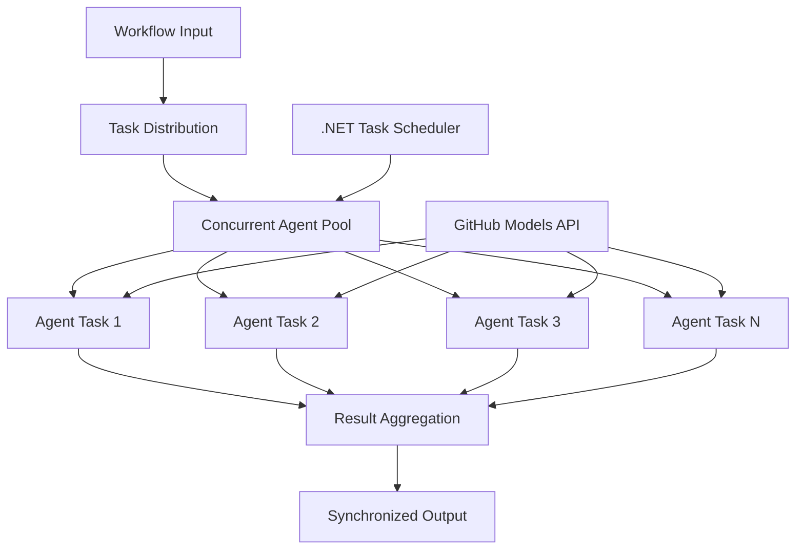

<!--
CO_OP_TRANSLATOR_METADATA:
{
  "original_hash": "b9c6e32c9b5f2fed20b6916984440d88",
  "translation_date": "2025-11-11T13:06:57+00:00",
  "source_file": "08-multi-agent/code_samples/workflows-agent-framework/dotNET/03.dotnet-agent-framework-workflow-ghmodel-concurrent.md",
  "language_code": "ar"
}
-->
# ⚡ سير عمل الوكلاء المتزامنين باستخدام نماذج GitHub (.NET)

## 📋 دليل المعالجة المتوازية عالية الأداء

يستعرض هذا الدليل أنماط **سير العمل المتزامن** باستخدام إطار عمل Microsoft Agent لـ .NET ونماذج GitHub. ستتعلم كيفية بناء سير عمل معالجة متوازية عالية الأداء تزيد من الإنتاجية من خلال تشغيل عدة وكلاء ذكاء اصطناعي في وقت واحد مع الحفاظ على التنسيق واتساق البيانات.

## 🎯 أهداف التعلم

### 🚀 **أساسيات المعالجة المتزامنة**
- **تنفيذ الوكلاء المتوازي**: تشغيل عدة وكلاء ذكاء اصطناعي في وقت واحد لتحقيق أقصى أداء
- **أنماط Async/Await**: الاستفادة من نموذج البرمجة غير المتزامن في .NET لتحقيق كفاءة في التزامن
- **دمج نماذج GitHub**: تنسيق عدة استدعاءات متزامنة لخدمة استنتاج نماذج الذكاء الاصطناعي من GitHub
- **إدارة الموارد**: إدارة موارد نماذج الذكاء الاصطناعي بكفاءة عبر العمليات المتزامنة

### 🏗️ **هندسة التزامن المتقدمة**
- **التوازي القائم على المهام**: استخدام مكتبة المهام المتوازية في .NET لتنفيذ متزامن أمثل
- **أنماط التزامن**: تنسيق الوكلاء المتزامنين مع تجنب حالات السباق
- **توزيع الحمل**: توزيع العمل بكفاءة عبر القدرة المتاحة للمعالجة المتزامنة
- **تحمل الأخطاء**: التعامل مع فشل الوكلاء الفرديين دون إيقاف سير العمل بالكامل

### 🏢 **تطبيقات التزامن المؤسسية**
- **معالجة الوثائق عالية الحجم**: معالجة عدة وثائق في وقت واحد
- **تحليل المحتوى في الوقت الحقيقي**: تحليل متزامن لتدفقات البيانات الواردة
- **تحسين المعالجة الدفعية**: زيادة الإنتاجية لعمليات معالجة البيانات واسعة النطاق
- **التحليل متعدد الأنماط**: معالجة متوازية لأنواع ومحتويات مختلفة

## ⚙️ المتطلبات والإعداد

### 📦 **حزم NuGet المطلوبة**

الحزم الأساسية لسير العمل المتزامن عالي الأداء:

```xml
<!-- Core AI Framework with Async Support -->
<PackageReference Include="Microsoft.Extensions.AI" Version="9.9.0" />

<!-- Client Model Abstractions for API Communication -->
<PackageReference Include="System.ClientModel" Version="1.6.1.0" />

<!-- Azure Identity and Async LINQ for Advanced Operations -->
<PackageReference Include="Azure.Identity" Version="1.15.0" />
<PackageReference Include="System.Linq.Async" Version="6.0.3" />

<!-- Local Agent Framework References -->
<!-- Microsoft.Agents.AI.dll - Core agent abstractions with async support -->
<!-- Microsoft.Agents.AI.OpenAI.dll - GitHub Models integration with concurrency -->
```

### 🔑 **إعداد نماذج GitHub**

**إعداد البيئة (ملف .env):**
```env
GITHUB_TOKEN=your_github_personal_access_token
GITHUB_ENDPOINT=https://models.inference.ai.azure.com
GITHUB_MODEL_ID=gpt-4o-mini
```

**اعتبارات المعالجة المتزامنة:**
```csharp
// Configure for concurrent operations
var clientOptions = new OpenAIClientOptions()
{
    Endpoint = new Uri(githubEndpoint),
    // Configure connection pooling for concurrent requests
    NetworkTimeout = TimeSpan.FromMinutes(5)
};
```

### 🏗️ **هندسة سير العمل المتزامن**



**المكونات الرئيسية:**
- **مكتبة المهام المتوازية**: دعم .NET المدمج للعمليات المتزامنة
- **مجموعة الوكلاء**: عدة مثيلات للوكلاء للمعالجة المتوازية
- **تجميع النتائج**: تنسيق ودمج نتائج الوكلاء المتزامنين
- **نقاط التزامن**: ضمان اتساق البيانات عبر العمليات المتزامنة

## 🎨 **أنماط تصميم سير العمل المتزامن**

### 🔍 **البحث والتحليل المتوازي**
```
Research Topic → Concurrent Research Agents → Result Synthesis → Final Report
```

### 📊 **معالجة البيانات متعددة المصادر**
```
Data Sources → Parallel Processing Agents → Data Integration → Unified Output
```

### 🎭 **خط إنتاج المحتوى**
```
Content Requirements → Concurrent Content Generators → Quality Review → Final Content
```

### 🔄 **معالجة Fan-Out/Fan-In**
```
Single Input → Multiple Concurrent Processors → Result Aggregation → Single Output
```

## 🏢 **فوائد الأداء المؤسسي**

### ⚡ **الإنتاجية وقابلية التوسع**
- **توسيع الأداء خطيًا**: إضافة المزيد من الوكلاء المتزامنين لزيادة الإنتاجية
- **استخدام الموارد**: تحقيق أقصى كفاءة لقدرة نماذج الذكاء الاصطناعي المتاحة
- **تقليل وقت المعالجة**: تقليل الوقت بشكل كبير من خلال التنفيذ المتوازي
- **التوسع المرن**: تعديل عدد الوكلاء المتزامنين ديناميكيًا بناءً على عبء العمل

### 🛡️ **الموثوقية والمرونة**
- **عزل الأخطاء**: فشل الوكلاء الفرديين لا يؤثر على العمليات المتزامنة الأخرى
- **التدهور التدريجي**: يستمر النظام في العمل بقدرة وكلاء منخفضة
- **استرداد الأخطاء**: آليات إعادة المحاولة التلقائية للعمليات المتزامنة الفاشلة
- **توزيع الحمل**: توزيع العمل بالتساوي عبر الوكلاء المتاحين

### 📊 **مراقبة الأداء**
- **مقاييس التنفيذ المتزامن**: تتبع أداء جميع العمليات المتوازية
- **تحليلات استخدام الموارد**: مراقبة استخدام وحدة المعالجة المركزية والذاكرة والشبكة
- **تحليل الإنتاجية**: قياس مكاسب الكفاءة من المعالجة المتزامنة
- **كشف الاختناقات**: تحديد وحل قيود الأداء

### 🔧 **التطوير والعمليات**
- **نموذج البرمجة غير المتزامن**: الاستفادة من أنماط async/await الناضجة في .NET
- **تنسيق المهام**: قدرات إدارة المهام والتنسيق المدمجة
- **معالجة الاستثناءات**: معالجة شاملة للأخطاء في العمليات المتزامنة
- **دعم التصحيح**: أدوات التصحيح في Visual Studio لسير العمل المتزامن

لنبدأ ببناء سير عمل ذكاء اصطناعي متزامن عالي الأداء باستخدام .NET! 🚀

## 💻 تشغيل الكود

التنفيذ الكامل متاح في `03.dotnet-agent-framework-workflow-ghmodel-concurrent.cs`. يوضح هذا الملف **سير عمل Fan-Out/Fan-In المتزامن** لتخطيط السفر:

### 🏗️ **هندسة سير العمل**

```
User Request → ConcurrentStartExecutor → [Researcher Agent || Planner Agent] → ConcurrentAggregationExecutor → Final Output
```

**المكونات الرئيسية:**

1. **ConcurrentStartExecutor**: يبث طلب المستخدم إلى جميع الوكلاء في وقت واحد
2. **وكيل الباحث**: يحلل الوجهات والمعالم السياحية بشكل متزامن
3. **وكيل المخطط**: ينشئ خطط سفر مفصلة بشكل متزامن
4. **ConcurrentAggregationExecutor**: يجمع ويدمج النتائج من كلا الوكيلين

### 🎯 **نمط Fan-Out/Fan-In**

يستعرض هذا سير العمل نمط **Fan-Out/Fan-In** الكلاسيكي:
- **Fan-Out**: يتم بث رسالة إدخال واحدة إلى عدة وكلاء في وقت واحد
- **المعالجة المتزامنة**: يعمل عدة وكلاء بالتوازي على نفس المهمة
- **Fan-In**: يتم جمع النتائج من جميع الوكلاء ودمجها في مخرجات واحدة

### 🚀 تشغيل المثال

```bash
# Make the script executable (Unix/Linux/macOS)
chmod +x 03.dotnet-agent-framework-workflow-ghmodel-concurrent.cs

# Run the concurrent workflow
./03.dotnet-agent-framework-workflow-ghmodel-concurrent.cs
```

أو على Windows:
```powershell
dotnet run 03.dotnet-agent-framework-workflow-ghmodel-concurrent.cs
```

### 📝 المخرجات المتوقعة

سير العمل سيقوم بـ:
1. **بث الطلب**: إرسال "خطط رحلة إلى سياتل في ديسمبر" إلى كلا الوكيلين
2. **المعالجة المتزامنة**: يعمل كلا الوكيلين في وقت واحد:
   - الباحث يحدد المعالم والتفاصيل
   - المخطط ينشئ جدول الرحلة واللوجستيات
3. **التجميع**: دمج كلا الردين في مخرجات شاملة
4. **عرض النتائج**: عرض خطة السفر المدمجة مع جميع المعلومات

### 🔧 خيارات التخصيص

**إضافة المزيد من الوكلاء المتزامنين:**
```csharp
// Create additional specialized agents
AIAgent budgetAgent = openAIClient.GetChatClient(github_model_id).CreateAIAgent(
    name: "Budget-Agent", instructions: "Calculate travel costs...");

// Add to fan-out
var workflow = new WorkflowBuilder(startExecutor)
    .AddFanOutEdge(startExecutor, targets: [researcherAgent, plannerAgent, budgetAgent])
    .AddFanInEdge(aggregationExecutor, sources: [researcherAgent, plannerAgent, budgetAgent])
    .WithOutputFrom(aggregationExecutor)
    .Build();

// Update aggregation count
if (this._messages.Count == 3) { ... }
```

**تعديل تعليمات الوكلاء:**
```csharp
const string ResearcherAgentInstructions = "Your custom instructions for research...";
const string PlanAgentInstructions = "Your custom instructions for planning...";
```

**تغيير المهمة:**
```csharp
StreamingRun run = await InProcessExecution.StreamAsync(
    workflow, 
    "Plan a European vacation for 2 weeks in summer"
);
```

### 🎯 تطبيقات العالم الحقيقي

هذا النمط المتزامن مثالي لـ:
- **إنشاء المحتوى**: عدة كتاب يعملون على أقسام مختلفة في وقت واحد
- **مراجعة الكود**: عدة مراجعين يحللون الكود من وجهات نظر مختلفة
- **أبحاث السوق**: تحليل متوازي لقطاعات السوق المختلفة
- **معالجة الوثائق**: استخراج وتحليل وتحقق متزامن
- **تحليل متعدد الزوايا**: الحصول على وجهات نظر متنوعة حول نفس المدخلات

### 🔍 فهم المنفذين المخصصين

**ConcurrentStartExecutor:**
- ينفذ `IMessageHandler<string>` لقبول مدخلات نصية
- يبث الرسائل إلى جميع الوكلاء المتصلين
- يرسل `TurnToken` لتفعيل المعالجة المتزامنة

**ConcurrentAggregationExecutor:**
- ينفذ `IMessageHandler<ChatMessage>` لاستقبال ردود الوكلاء
- يجمع الرسائل بطريقة آمنة للخيوط
- يجمع النتائج عند وصول جميع الردود المتوقعة
- يقدم المخرجات النهائية باستخدام `context.YieldOutputAsync()`

### ⚡ فوائد الأداء

**المعالجة المتزامنة مقابل التسلسلية:**
- التسلسلية: الوكيل1 (30 ثانية) → الوكيل2 (30 ثانية) = **60 ثانية إجمالاً**
- المتزامنة: الوكيل1 (30 ثانية) || الوكيل2 (30 ثانية) = **30 ثانية إجمالاً**

**تحسين الإنتاجية**: أسرع حتى N× لوكلاء متزامنين N (حسب عبء العمل والموارد)

### 🛡️ معالجة الأخطاء

يتعامل سير العمل مع فشل الوكلاء الفرديين بسلاسة:
- إذا فشل أحد الوكلاء، يستمر الآخرون في المعالجة
- يمكن للمجمع تنفيذ منطق المهلة
- يمكن إرجاع النتائج الجزئية إذا لزم الأمر

### 📊 ميزات متقدمة

**عدد الوكلاء الديناميكي:**
عدل منطق التجميع لدعم عدد متغير من الوكلاء:

```csharp
private int _expectedAgentCount;
private readonly List<ChatMessage> _messages = [];

public async ValueTask HandleAsync(ChatMessage message, IWorkflowContext context)
{
    this._messages.Add(message);
    if (this._messages.Count == _expectedAgentCount)
    {
        // Process aggregation
    }
}
```

هذا النمط من سير العمل المتزامن ضروري لبناء أنظمة وكلاء ذكاء اصطناعي عالية الأداء وقابلة للتوسع!

---

<!-- CO-OP TRANSLATOR DISCLAIMER START -->
**إخلاء المسؤولية**:  
تم ترجمة هذا المستند باستخدام خدمة الترجمة بالذكاء الاصطناعي [Co-op Translator](https://github.com/Azure/co-op-translator). بينما نسعى لتحقيق الدقة، يرجى العلم أن الترجمات الآلية قد تحتوي على أخطاء أو عدم دقة. يجب اعتبار المستند الأصلي بلغته الأصلية المصدر الموثوق. للحصول على معلومات حاسمة، يُوصى بالترجمة البشرية الاحترافية. نحن غير مسؤولين عن أي سوء فهم أو تفسيرات خاطئة ناتجة عن استخدام هذه الترجمة.
<!-- CO-OP TRANSLATOR DISCLAIMER END -->