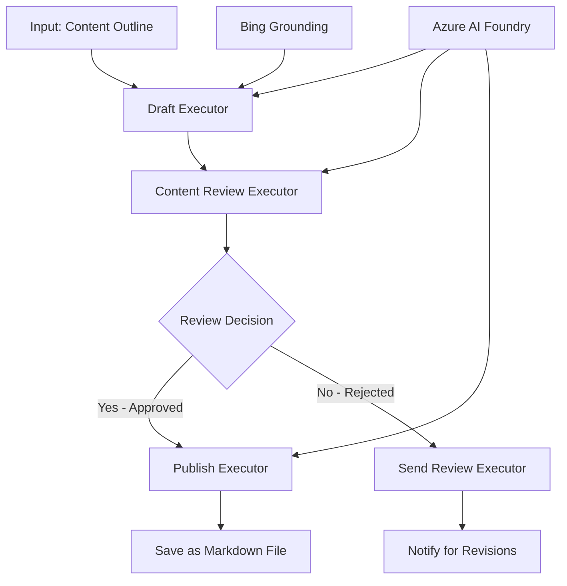

<!--
CO_OP_TRANSLATOR_METADATA:
{
  "original_hash": "8abd335151cee553293b637ee3d80d10",
  "translation_date": "2025-11-11T12:02:33+00:00",
  "source_file": "08-multi-agent/code_samples/workflows-agent-framework/dotNET/04.dotnet-agent-framework-workflow-aifoundry-condition.md",
  "language_code": "ar"
}
-->
# 🔀 سير عمل الوكيل الشرطي مع Azure AI Foundry (.NET)

## 📋 دليل سير العمل القائم على القرارات الذكية

يستعرض هذا الدليل أنماط سير العمل الشرطي باستخدام Azure AI Foundry وإطار عمل Microsoft Agent Framework لـ .NET. ستتعلم كيفية بناء سير عمل متقدم يعتمد على القرارات الذكية لتوجيه العمليات بناءً على تحليل الذكاء الاصطناعي، قواعد العمل، والظروف الديناميكية لتحقيق أتمتة على مستوى المؤسسات.

## 🎯 أهداف التعلم

### 🧠 **هيكلية القرارات الذكية**
- **تنفيذ المنطق الشرطي**: بناء أشجار قرارات مع نقاط تفرع متعددة
- **التوجيه المدعوم بالذكاء الاصطناعي**: استخدام نماذج Azure AI Foundry لاتخاذ قرارات توجيه ذكية
- **تكييف سير العمل الديناميكي**: تعديل سلوك سير العمل بناءً على التحليل والظروف أثناء التشغيل
- **دمج قواعد العمل**: تضمين منطق العمل ومتطلبات الامتثال في سير العمل

### 🔀 **أنماط شرطية متقدمة**
- **اتخاذ القرارات متعددة المعايير**: تقييم عوامل متعددة لاتخاذ قرارات التوجيه
- **المعالجة الواعية للسياق**: اتخاذ قرارات بناءً على سياق سير العمل المتراكم وتاريخه
- **تعديل سير العمل التكيفي**: ضبط مسارات المعالجة ديناميكيًا بناءً على الظروف الفورية
- **دمج محركات القواعد**: تنفيذ محركات قواعد العمل المتقدمة داخل سير العمل

### 🏢 **تطبيقات شرطية على مستوى المؤسسات**
- **تصنيف المستندات وتوجيهها**: تصنيف المستندات تلقائيًا وتوجيهها إلى سير العمل المناسب
- **فرز خدمة العملاء**: التوجيه الذكي لاستفسارات العملاء إلى فرق معالجة متخصصة
- **معالجة الامتثال والمخاطر**: تطبيق عمليات التحقق والمراجعة المختلفة بناءً على تقييم المخاطر
- **سير عمل ضمان الجودة**: توجيه المحتوى عبر عمليات المراجعة المناسبة بناءً على مقاييس الجودة

## ⚙️ المتطلبات والإعداد

### 📦 **حزم NuGet المطلوبة**

حزم متقدمة لمعالجة سير العمل الشرطي:

```xml
<!-- Core AI Framework -->
<PackageReference Include="Microsoft.Extensions.AI" Version="9.9.0" />

<!-- Azure AI Agents with Persistent State -->
<PackageReference Include="Azure.AI.Agents.Persistent" Version="1.2.0-beta.5" />

<!-- Azure Identity and Utilities -->
<PackageReference Include="Azure.Identity" Version="1.15.0" />
<PackageReference Include="System.Linq.Async" Version="6.0.3" />
<PackageReference Include="DotNetEnv" Version="3.1.1" />

<!-- Local Workflow Framework References -->
<!-- Microsoft.Agents.Workflows.dll - Advanced workflow orchestration -->
<!-- Microsoft.Agents.AI.AzureAI.dll - Azure AI Foundry integration -->
<!-- Microsoft.Agents.AI.dll - Core agent abstractions -->
```

### 🔑 **إعداد Azure AI Foundry**

**الموارد المطلوبة من Azure:**
- مساحة عمل Azure AI Foundry مع نماذج معالجة شرطية
- اشتراك Azure مع الحصص والامتيازات المناسبة
- نماذج ذكاء اصطناعي منشورة لاتخاذ القرارات وتحليل المحتوى
- (اختياري) اتصال Bing Search API للحصول على قدرات التأسيس

**إعداد البيئة (.env file):**
```env
# Azure AI Foundry Configuration
AZURE_AI_PROJECT_ENDPOINT=https://your-project.cognitiveservices.azure.com/
BING_CONNECTION_ID=your-bing-connection-id
```

**إعداد المصادقة:**
```csharp
// Azure CLI or Managed Identity authentication
using Azure.Identity;
var credential = new AzureCliCredential();

// Load environment configuration
DotNetEnv.Env.Load("../../../.env");
```

### 🏗️ **هيكلية سير العمل الشرطي**



**المكونات الرئيسية:**
- **منفذ المسودة**: وكيل ذكاء اصطناعي ينشئ مسودات المحتوى الأولية من المخططات
- **منفذ مراجعة المحتوى**: وكيل ذكاء اصطناعي يقيم جودة المسودة والامتثال
- **التوجيه الشرطي**: منطق القرار الذي يوجه بناءً على نتائج المراجعة
- **مسارات النشر/المراجعة**: مسارات معالجة منفصلة للمحتوى الموافق عليه مقابل المرفوض
- **إدارة الحالة**: يحافظ على سياق المحتوى والمراجعة طوال سير العمل

## 🎨 **أنماط تصميم سير العمل الشرطي**

### 📋 **إنتاج المحتوى مع بوابات الجودة**
```
Outline → Draft Creation → Quality Review → {Approve: Publish | Reject: Revise}
```

### 🎯 **معالجة المستندات بناءً على المخاطر**
```
Document → Risk Assessment → {Low: Standard | High: Enhanced Review}
```

### 🔍 **التوجيه الذكي لخدمة العملاء**
```
Customer Query → Analysis → {Simple: FAQ Bot | Complex: Human Agent}
```

### 💼 **سير العمل القائم على الامتثال**
```
Content → Compliance Check → {Pass: Publish | Fail: Legal Review}
```

## 🏢 **فوائد شرطية على مستوى المؤسسات**

### 🎯 **الأتمتة الذكية**
- **اتخاذ قرارات ذكية**: قرارات توجيه مدعومة بالذكاء الاصطناعي بناءً على تحليل المحتوى والسياق
- **معالجة تكيفية**: سير عمل يتكيف تلقائيًا بناءً على الظروف المتغيرة
- **تطبيق قواعد العمل**: تطبيق تلقائي لمنطق العمل والسياسات المعقدة
- **التوجيه الواعي للسياق**: قرارات تستند إلى تاريخ سير العمل الكامل والسياق المتراكم

### 📈 **التميز التشغيلي**
- **تخصيص الموارد الأمثل**: توجيه العمل إلى المتخصصين والعمليات الأكثر ملاءمة
- **تقليل التدخل اليدوي**: اتخاذ قرارات تلقائية يقلل الحاجة إلى التوجيه البشري
- **أوقات حل أسرع**: التوجيه المباشر إلى الخبرة والقدرات المناسبة
- **تطبيق متسق**: تطبيق موحد لقواعد العمل ومعايير القرار

### 🛡️ **إدارة المخاطر والامتثال**
- **تقييم المخاطر التلقائي**: تقييم مدعوم بالذكاء الاصطناعي لمستويات المخاطر في المحتوى والمواقف
- **تطبيق الامتثال**: التوجيه التلقائي عبر العمليات التنظيمية المطلوبة
- **تطبيق بروتوكولات الأمان**: تعزيز التدابير الأمنية بناءً على تقييم المخاطر
- **الحفاظ على سجل التدقيق**: توثيق كامل لقرارات التوجيه وأسبابها

### 📊 **التحليلات والتحسين المستمر**
- **تحليلات القرار**: تتبع فعالية ودقة قرارات التوجيه
- **التعرف على الأنماط**: تحديد الاتجاهات والأنماط في قرارات التوجيه بمرور الوقت
- **تحسين الأداء**: تحسين مستمر لمعايير القرار وكفاءة التوجيه
- **ذكاء الأعمال**: رؤى حول خصائص المحتوى ومتطلبات المعالجة

### 🔧 **التميز التقني**
- **إدارة الحالة المستمرة**: الحفاظ على حالة معقدة عبر تنفيذ سير العمل
- **هيكلية قابلة للتوسع**: التعامل مع متطلبات المعالجة الشرطية ذات الحجم الكبير
- **قدرات التكامل**: تكامل سلس مع أنظمة وعمليات الأعمال الحالية
- **المراقبة والملاحظة**: تتبع شامل لأداء سير العمل والقرارات

لنبدأ في بناء سير عمل ذكي قائم على القرارات للمؤسسات باستخدام .NET! 🚀

## 💻 تشغيل الكود

التنفيذ الكامل متاح في `04.dotnet-agent-framework-workflow-aifoundry-condition.cs`. يوضح هذا سير عمل إنتاج المحتوى مع بوابات الجودة:

### 🏗️ **هيكلية سير العمل**

```
Content Outline → Draft Creation → Quality Review → Conditional Routing:
                                                      ├─ Approved (>200 words) → Publish
                                                      └─ Rejected (<200 words) → Review Notification
```

**الوكلاء في سير العمل:**
1. **وكيل التبشير**: ينشئ مسودات الدروس من المخططات باستخدام Bing
2. **وكيل مراجعة المحتوى**: يقيم جودة المسودة (عدد الكلمات، الاكتمال)
3. **وكيل النشر**: يحفظ المحتوى الموافق عليه كملفات Markdown مؤرخة

**المنفذون المخصصون:**
1. **DraftExecutor**: ينظم إنشاء المسودات
2. **ContentReviewExecutor**: يقوم بتقييم الجودة
3. **PublishExecutor**: يتعامل مع نشر المحتوى الموافق عليه
4. **SendReviewExecutor**: يدير إشعارات المحتوى المرفوض

### 🚀 تشغيل المثال

**المتطلبات:**
- مساحة عمل Azure AI Foundry مهيأة
- مصادقة Azure CLI (`az login`)
- (اختياري) اتصال Bing Search للحصول على التأسيس

```bash
# Make the script executable (Unix/Linux/macOS)
chmod +x 04.dotnet-agent-framework-workflow-aifoundry-condition.cs

# Run the conditional workflow
./04.dotnet-agent-framework-workflow-aifoundry-condition.cs
```

أو على Windows:
```powershell
dotnet run 04.dotnet-agent-framework-workflow-aifoundry-condition.cs
```

### 📝 النتائج المتوقعة

سير العمل سيقوم بـ:
1. **إنشاء الوكلاء**: تهيئة ثلاثة وكلاء متخصصين من Azure AI Foundry
2. **إنشاء المسودة**: وكيل التبشير ينشئ مسودة الدرس من المخطط
3. **مراجعة المحتوى**: وكيل مراجعة المحتوى يقيم جودة المسودة
4. **التوجيه الشرطي**:
   - **إذا تمت الموافقة (>200 كلمة)**: ينشر المنفذ المسودة كملف Markdown
   - **إذا تم الرفض (<200 كلمة)**: يرسل إشعار المراجعة
5. **عرض النتائج**: عرض نتيجة سير العمل النهائية

### 🔧 خيارات التخصيص

**تعديل معايير المراجعة:**
```csharp
const string ContentReviewerInstructions = @"
You are a content reviewer...
1. Check if content is more than 500 words (instead of 200)
2. Verify technical accuracy
3. Ensure proper formatting
...";
```

**إضافة المزيد من المسارات الشرطية:**
```csharp
var workflow = new WorkflowBuilder(draftExecutor)
    .AddEdge(draftExecutor, contentReviewerExecutor)
    .AddEdge(contentReviewerExecutor, publishExecutor, condition: GetCondition("Excellent"))
    .AddEdge(contentReviewerExecutor, editExecutor, condition: GetCondition("Good"))
    .AddEdge(contentReviewerExecutor, sendReviewerExecutor, condition: GetCondition("Poor"))
    .Build();
```

**تغيير متطلبات المحتوى:**
```csharp
string OUTLINE_Content = @"
# Your Custom Topic
## Section 1
https://your-reference-url
## Section 2
...
";
```

### 🎯 تطبيقات العالم الحقيقي

هذا النمط من سير العمل الشرطي مثالي لـ:
- **أنظمة إدارة المحتوى**: سير عمل تحرير تلقائي مع بوابات الجودة
- **معالجة المستندات**: توجيه المستندات بناءً على التصنيف والامتثال
- **دعم العملاء**: توجيه التذاكر الذكي بناءً على التعقيد والإلحاح
- **المراجعة القانونية**: توجيه العقود بناءً على تقييم المخاطر والقيمة
- **عمليات الموارد البشرية**: توجيه الطلبات عبر سير عمل الفحص المناسب

### 🔍 فهم المنطق الشرطي

**وظيفة الشرط:**
```csharp
public Func<object?, bool> GetCondition(string expectedResult) =>
    reviewResult => reviewResult is ReviewResult review && review.Result == expectedResult;
```

هذه الوظيفة تنشئ شرطًا:
1. يتحقق مما إذا كانت النتيجة من نوع `ReviewResult`
2. يقارن خاصية `Result` بالقيمة المتوقعة
3. يعيد true/false لتحديد التوجيه

**حواف سير العمل مع الشروط:**
```csharp
.AddEdge(contentReviewerExecutor, publishExecutor, condition: GetCondition("Yes"))
.AddEdge(contentReviewerExecutor, sendReviewerExecutor, condition: GetCondition("No"))
```

### 📊 ميزات متقدمة

**التحقق من صحة JSON Schema:**
يستخدم سير العمل مخططات JSON لضمان الردود المهيكلة:

```csharp
// Define response structure
public class ReviewResult
{
    [JsonPropertyName("review_result")]
    public string Result { get; set; } = string.Empty;
    
    [JsonPropertyName("reason")]
    public string Reason { get; set; } = string.Empty;
    
    [JsonPropertyName("draft_content")]
    public string DraftContent { get; set; } = string.Empty;
}

// Apply to agent
ResponseFormat = ChatResponseFormat.ForJsonSchema(
    AIJsonUtilities.CreateJsonSchema(typeof(ReviewResult)), 
    "ReviewResult", 
    "Review Result From DraftContent"
)
```

**دمج Bing Grounding:**
يستخدم وكيل التبشير Bing Grounding للوصول إلى المعلومات في الوقت الفعلي:

```csharp
var bingGroundingConfig = new BingGroundingSearchConfiguration(bing_conn_id);
BingGroundingToolDefinition bingGroundingTool = new(
    new BingGroundingSearchToolParameters([bingGroundingConfig])
);
```

هذا يمكّن الوكيل من متابعة الروابط في المخطط واستخراج المعلومات الحالية.

### 🛡️ معالجة الأخطاء

يتضمن سير العمل معالجة أخطاء قوية للمحتوى المرفوض:
- فشل المراجعة يؤدي إلى المسار البديل
- الإشعارات تقدم أسباب الرفض بوضوح
- يتم الحفاظ على المحتوى للمراجعة

### 🔄 توسيع سير العمل

**إضافة حلقة مراجعة:**
إنشاء حلقة تغذية راجعة تعيد صياغة المحتوى تلقائيًا:

```csharp
.AddEdge(contentReviewerExecutor, publishExecutor, condition: GetCondition("Yes"))
.AddEdge(contentReviewerExecutor, draftExecutor, condition: GetCondition("No")) // Loop back
```

**تنفيذ مراجعة متعددة المستويات:**
إضافة مراحل مراجعة متعددة بمعايير مختلفة:

```csharp
.AddEdge(draftExecutor, technicalReviewer)
.AddEdge(technicalReviewer, editorialReviewer, condition: GetCondition("TechPass"))
.AddEdge(editorialReviewer, publishExecutor, condition: GetCondition("EditPass"))
```

يوفر هذا النمط من سير العمل الشرطي الأساس لبناء أنظمة أتمتة ذكية ومتقدمة على مستوى المؤسسات! 🚀

---

<!-- CO-OP TRANSLATOR DISCLAIMER START -->
**إخلاء المسؤولية**:  
تم ترجمة هذا المستند باستخدام خدمة الترجمة بالذكاء الاصطناعي [Co-op Translator](https://github.com/Azure/co-op-translator). بينما نسعى لتحقيق الدقة، يرجى العلم أن الترجمات الآلية قد تحتوي على أخطاء أو عدم دقة. يجب اعتبار المستند الأصلي بلغته الأصلية المصدر الرسمي. للحصول على معلومات حاسمة، يُوصى بالترجمة البشرية الاحترافية. نحن غير مسؤولين عن أي سوء فهم أو تفسيرات خاطئة تنشأ عن استخدام هذه الترجمة.
<!-- CO-OP TRANSLATOR DISCLAIMER END -->