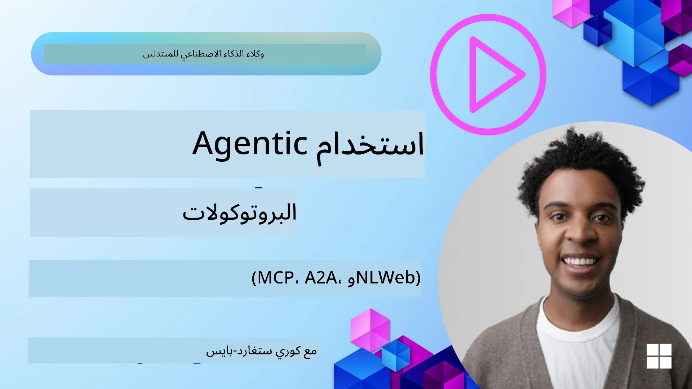
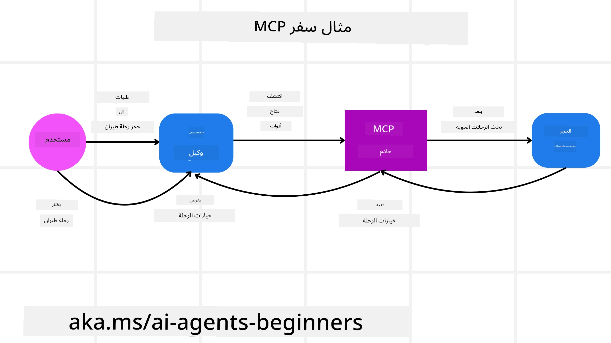
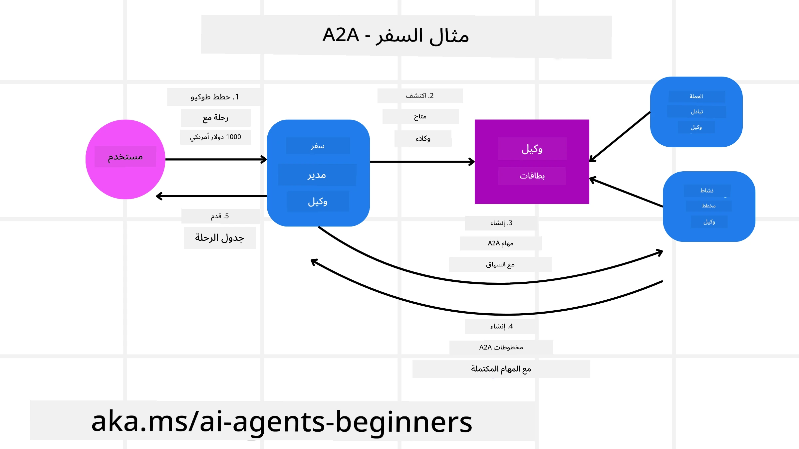
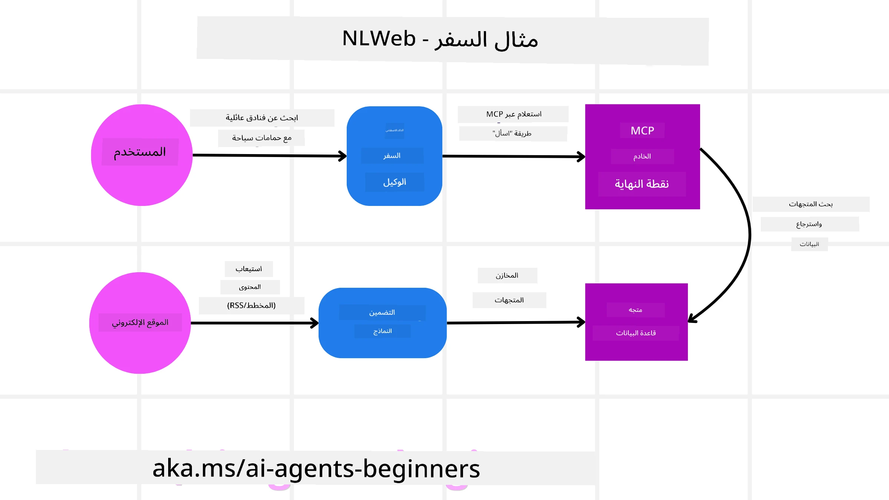

<!--
CO_OP_TRANSLATOR_METADATA:
{
  "original_hash": "aff92c6f019b4627ca9399c6e3882e17",
  "translation_date": "2025-09-18T14:09:58+00:00",
  "source_file": "11-agentic-protocols/README.md",
  "language_code": "ar"
}
-->
# استخدام بروتوكولات الوكلاء (MCP، A2A وNLWeb)

> _(اضغط على الصورة أعلاه لمشاهدة فيديو هذا الدرس)_

مع تزايد استخدام وكلاء الذكاء الاصطناعي، تزداد الحاجة إلى بروتوكولات تضمن التوحيد القياسي، الأمان، ودعم الابتكار المفتوح. في هذا الدرس، سنتناول ثلاثة بروتوكولات تهدف إلى تلبية هذه الحاجة - بروتوكول سياق النموذج (MCP)، بروتوكول وكيل إلى وكيل (A2A)، والويب الطبيعي (NLWeb).

## المقدمة

في هذا الدرس، سنتناول:

• كيف يتيح **MCP** لوكلاء الذكاء الاصطناعي الوصول إلى الأدوات والبيانات الخارجية لإتمام مهام المستخدم.

• كيف يمكّن **A2A** التواصل والتعاون بين وكلاء الذكاء الاصطناعي المختلفين.

• كيف يجلب **NLWeb** واجهات اللغة الطبيعية إلى أي موقع ويب، مما يتيح لوكلاء الذكاء الاصطناعي اكتشاف المحتوى والتفاعل معه.

## أهداف التعلم

• **التعرف** على الغرض الأساسي وفوائد MCP، A2A، وNLWeb في سياق وكلاء الذكاء الاصطناعي.

• **شرح** كيف يسهل كل بروتوكول التواصل والتفاعل بين النماذج اللغوية الكبيرة (LLMs)، الأدوات، والوكلاء الآخرين.

• **التعرف** على الأدوار المميزة التي يلعبها كل بروتوكول في بناء أنظمة وكلاء معقدة.

## بروتوكول سياق النموذج

**بروتوكول سياق النموذج (MCP)** هو معيار مفتوح يوفر طريقة موحدة للتطبيقات لتقديم السياق والأدوات للنماذج اللغوية الكبيرة (LLMs). يتيح هذا وجود "محول عالمي" لمصادر البيانات والأدوات المختلفة التي يمكن لوكلاء الذكاء الاصطناعي الاتصال بها بطريقة متسقة.

دعونا نلقي نظرة على مكونات MCP، الفوائد مقارنة باستخدام واجهات برمجة التطبيقات المباشرة، ومثال على كيفية استخدام وكلاء الذكاء الاصطناعي لخادم MCP.

### المكونات الأساسية لـ MCP

يعمل MCP على **بنية العميل-الخادم**، والمكونات الأساسية هي:

• **المضيفون**: هم تطبيقات النماذج اللغوية الكبيرة (مثل محرر الأكواد VSCode) التي تبدأ الاتصالات مع خادم MCP.

• **العملاء**: هم المكونات داخل تطبيق المضيف التي تحافظ على اتصالات فردية مع الخوادم.

• **الخوادم**: هي برامج خفيفة الوزن تعرض قدرات محددة.

يتضمن البروتوكول ثلاث وحدات أساسية تمثل قدرات خادم MCP:

• **الأدوات**: هي إجراءات أو وظائف منفصلة يمكن لوكيل الذكاء الاصطناعي استدعاؤها لتنفيذ إجراء معين. على سبيل المثال، قد يوفر خادم الطقس أداة "الحصول على الطقس"، أو قد يوفر خادم التجارة الإلكترونية أداة "شراء منتج". يعلن خادم MCP عن اسم كل أداة، وصفها، ومخطط الإدخال/الإخراج الخاص بها في قائمة القدرات.

• **الموارد**: هي عناصر بيانات أو مستندات للقراءة فقط يمكن لخادم MCP توفيرها، ويمكن للعملاء استرجاعها عند الطلب. تشمل الأمثلة محتويات الملفات، سجلات قواعد البيانات، أو ملفات السجلات. يمكن أن تكون الموارد نصوصًا (مثل الأكواد أو JSON) أو ثنائية (مثل الصور أو ملفات PDF).

• **القوالب**: هي قوالب محددة مسبقًا توفر مطالبات مقترحة، مما يسمح بسير عمل أكثر تعقيدًا.

### فوائد MCP

يوفر MCP فوائد كبيرة لوكلاء الذكاء الاصطناعي:

• **اكتشاف الأدوات الديناميكي**: يمكن للوكلاء تلقي قائمة ديناميكية بالأدوات المتاحة من الخادم مع أوصاف لما تفعله. هذا يختلف عن واجهات برمجة التطبيقات التقليدية التي غالبًا ما تتطلب ترميزًا ثابتًا للتكاملات، مما يعني أن أي تغيير في واجهة برمجة التطبيقات يتطلب تحديثات في الكود. يوفر MCP نهج "التكامل مرة واحدة"، مما يؤدي إلى مرونة أكبر.

• **التشغيل البيني عبر النماذج اللغوية الكبيرة**: يعمل MCP عبر نماذج لغوية كبيرة مختلفة، مما يوفر مرونة لتبديل النماذج الأساسية لتقييم الأداء الأفضل.

• **أمان موحد**: يتضمن MCP طريقة مصادقة موحدة، مما يحسن من قابلية التوسع عند إضافة الوصول إلى خوادم MCP إضافية. هذا أبسط من إدارة مفاتيح وأنواع مصادقة مختلفة لواجهات برمجة التطبيقات التقليدية.

### مثال على MCP

تخيل أن مستخدمًا يريد حجز رحلة باستخدام مساعد ذكاء اصطناعي مدعوم بـ MCP.

1. **الاتصال**: يتصل مساعد الذكاء الاصطناعي (عميل MCP) بخادم MCP الذي توفره شركة طيران.

2. **اكتشاف الأدوات**: يسأل العميل خادم MCP الخاص بشركة الطيران، "ما الأدوات المتاحة لديك؟" يرد الخادم بأدوات مثل "البحث عن رحلات" و"حجز رحلات".

3. **استدعاء الأداة**: تطلب من مساعد الذكاء الاصطناعي، "يرجى البحث عن رحلة من بورتلاند إلى هونولولو." يحدد مساعد الذكاء الاصطناعي، باستخدام نموذجه اللغوي الكبير، أنه يحتاج إلى استدعاء أداة "البحث عن رحلات" ويمرر المعلمات ذات الصلة (المصدر، الوجهة) إلى خادم MCP.

4. **التنفيذ والاستجابة**: يقوم خادم MCP، الذي يعمل كغلاف، بإجراء الاتصال الفعلي بواجهة برمجة التطبيقات الداخلية لشركة الطيران. ثم يتلقى معلومات الرحلة (مثل بيانات JSON) ويرسلها مرة أخرى إلى مساعد الذكاء الاصطناعي.

5. **تفاعل إضافي**: يقدم مساعد الذكاء الاصطناعي خيارات الرحلات. بمجرد اختيارك لرحلة، قد يستدعي المساعد أداة "حجز الرحلة" على نفس خادم MCP، لإتمام الحجز.

## بروتوكول وكيل إلى وكيل (A2A)

بينما يركز MCP على ربط النماذج اللغوية الكبيرة بالأدوات، يأخذ **بروتوكول وكيل إلى وكيل (A2A)** خطوة أبعد من خلال تمكين التواصل والتعاون بين وكلاء الذكاء الاصطناعي المختلفين. يربط A2A وكلاء الذكاء الاصطناعي عبر منظمات، بيئات، وتقنيات مختلفة لإتمام مهمة مشتركة.

سنستعرض مكونات وفوائد A2A، بالإضافة إلى مثال على كيفية تطبيقه في تطبيق السفر الخاص بنا.

### المكونات الأساسية لـ A2A

يركز A2A على تمكين التواصل بين الوكلاء وجعلهم يعملون معًا لإتمام مهمة فرعية للمستخدم. يساهم كل مكون من مكونات البروتوكول في ذلك:

#### بطاقة الوكيل

على غرار كيفية مشاركة خادم MCP قائمة الأدوات، تحتوي بطاقة الوكيل على:
- اسم الوكيل.
- **وصف للمهام العامة** التي ينفذها.
- **قائمة بالمهارات المحددة** مع أوصاف لمساعدة الوكلاء الآخرين (أو حتى المستخدمين البشريين) على فهم متى ولماذا قد يرغبون في استدعاء هذا الوكيل.
- **عنوان URL الحالي لنقطة النهاية** الخاصة بالوكيل.
- **الإصدار** و**القدرات** الخاصة بالوكيل مثل استجابات البث والإشعارات الفورية.

#### منفذ الوكيل

منفذ الوكيل مسؤول عن **تمرير سياق محادثة المستخدم إلى الوكيل البعيد**، حيث يحتاج الوكيل البعيد إلى هذا السياق لفهم المهمة التي يجب إتمامها. في خادم A2A، يستخدم الوكيل نموذجه اللغوي الكبير الخاص لتحليل الطلبات الواردة وتنفيذ المهام باستخدام أدواته الداخلية.

#### الأثر

بمجرد أن يكمل الوكيل البعيد المهمة المطلوبة، يتم إنشاء ناتج عمله كأثر. يحتوي الأثر على **نتيجة عمل الوكيل**، **وصف لما تم إنجازه**، و**سياق النص** الذي يتم إرساله عبر البروتوكول. بعد إرسال الأثر، يتم إغلاق الاتصال مع الوكيل البعيد حتى يتم الحاجة إليه مرة أخرى.

#### قائمة الأحداث

يُستخدم هذا المكون **لإدارة التحديثات وتمرير الرسائل**. يعتبر هذا مهمًا بشكل خاص في الإنتاج لأنظمة الوكلاء لمنع إغلاق الاتصال بين الوكلاء قبل إتمام المهمة، خاصة عندما تستغرق أوقات إتمام المهام وقتًا أطول.

### فوائد A2A

• **تعزيز التعاون**: يتيح للوكلاء من مزودين ومنصات مختلفة التفاعل، مشاركة السياق، والعمل معًا، مما يسهل الأتمتة السلسة عبر الأنظمة التي كانت تقليديًا منفصلة.

• **مرونة اختيار النموذج**: يمكن لكل وكيل A2A أن يقرر أي نموذج لغوي كبير يستخدمه لخدمة طلباته، مما يسمح بتحسين النماذج أو تخصيصها لكل وكيل، على عكس اتصال نموذج لغوي كبير واحد في بعض سيناريوهات MCP.

• **مصادقة مدمجة**: يتم دمج المصادقة مباشرة في بروتوكول A2A، مما يوفر إطار أمان قوي لتفاعلات الوكلاء.

### مثال على A2A

دعونا نوسع سيناريو حجز السفر الخاص بنا، ولكن هذه المرة باستخدام A2A.

1. **طلب المستخدم إلى وكيل متعدد**: يتفاعل المستخدم مع وكيل "السفر" A2A (عميل/وكيل)، ربما عن طريق قول: "يرجى حجز رحلة كاملة إلى هونولولو للأسبوع المقبل، بما في ذلك الرحلات الجوية، فندق، وسيارة للإيجار".

2. **تنسيق وكيل السفر**: يتلقى وكيل السفر هذا الطلب المعقد. يستخدم نموذجه اللغوي الكبير للتفكير في المهمة وتحديد أنه يحتاج إلى التفاعل مع وكلاء متخصصين آخرين.

3. **التواصل بين الوكلاء**: يستخدم وكيل السفر بروتوكول A2A للاتصال بالوكلاء المتخصصين، مثل "وكيل الطيران"، "وكيل الفندق"، و"وكيل تأجير السيارات" الذين تم إنشاؤهم من قبل شركات مختلفة.

4. **تنفيذ المهام المفوضة**: يرسل وكيل السفر مهامًا محددة إلى هؤلاء الوكلاء المتخصصين (مثل "ابحث عن رحلات إلى هونولولو"، "احجز فندقًا"، "استأجر سيارة"). يقوم كل من هؤلاء الوكلاء المتخصصين، الذين يشغلون نماذجهم اللغوية الكبيرة الخاصة بهم ويستخدمون أدواتهم الخاصة (والتي قد تكون خوادم MCP نفسها)، بتنفيذ الجزء الخاص بهم من الحجز.

5. **استجابة موحدة**: بمجرد أن يكمل جميع الوكلاء الفرعيين مهامهم، يقوم وكيل السفر بتجميع النتائج (تفاصيل الرحلة، تأكيد الفندق، حجز السيارة) ويرسل استجابة شاملة بأسلوب المحادثة إلى المستخدم.

## الويب الطبيعي (NLWeb)

لطالما كانت مواقع الويب الطريقة الأساسية للمستخدمين للوصول إلى المعلومات والبيانات عبر الإنترنت.

دعونا نلقي نظرة على المكونات المختلفة لـ NLWeb، فوائد NLWeb، ومثال على كيفية عمل NLWeb من خلال النظر إلى تطبيق السفر الخاص بنا.

### مكونات NLWeb

- **تطبيق NLWeb (كود الخدمة الأساسية)**: النظام الذي يعالج الأسئلة بلغة طبيعية. يربط بين الأجزاء المختلفة للمنصة لإنشاء استجابات. يمكنك اعتباره **المحرك الذي يشغل ميزات اللغة الطبيعية** لموقع الويب.

- **بروتوكول NLWeb**: هو **مجموعة أساسية من القواعد للتفاعل بلغة طبيعية** مع موقع الويب. يعيد الاستجابات بتنسيق JSON (غالبًا باستخدام Schema.org). الغرض منه هو إنشاء أساس بسيط لـ "الويب الذكي"، بنفس الطريقة التي جعل بها HTML مشاركة المستندات عبر الإنترنت ممكنة.

- **خادم MCP (نقطة نهاية بروتوكول سياق النموذج)**: يعمل كل إعداد NLWeb أيضًا كـ **خادم MCP**. هذا يعني أنه يمكنه **مشاركة الأدوات (مثل طريقة "ask") والبيانات** مع أنظمة الذكاء الاصطناعي الأخرى. عمليًا، يجعل هذا محتوى الموقع وقدراته قابلة للاستخدام من قبل وكلاء الذكاء الاصطناعي، مما يسمح للموقع بأن يصبح جزءًا من "نظام الوكلاء" الأوسع.

- **نماذج التضمين**: تُستخدم هذه النماذج **لتحويل محتوى الموقع إلى تمثيلات رقمية تُعرف بالتضمينات**. تلتقط هذه التضمينات المعنى بطريقة يمكن للحواسيب مقارنتها والبحث فيها. يتم تخزينها في قاعدة بيانات خاصة، ويمكن للمستخدمين اختيار نموذج التضمين الذي يريدون استخدامه.

- **قاعدة بيانات التضمين (آلية الاسترجاع)**: تخزن هذه القاعدة **تضمينات محتوى الموقع**. عندما يطرح شخص ما سؤالًا، يتحقق NLWeb من قاعدة بيانات التضمين للعثور بسرعة على المعلومات الأكثر صلة. يعطي قائمة سريعة بالإجابات المحتملة، مرتبة حسب التشابه. يعمل NLWeb مع أنظمة تخزين تضمينات مختلفة مثل Qdrant، Snowflake، Milvus، Azure AI Search، وElasticsearch.

### NLWeb بالمثال

لنأخذ بعين الاعتبار موقع حجز السفر الخاص بنا مرة أخرى، ولكن هذه المرة، يتم تشغيله بواسطة NLWeb.

1. **إدخال البيانات**: يتم تنسيق كتالوجات المنتجات الحالية لموقع السفر (مثل قوائم الرحلات الجوية، أوصاف الفنادق، حزم الجولات) باستخدام Schema.org أو يتم تحميلها عبر خلاصات RSS. تقوم أدوات NLWeb بتحميل هذه البيانات المنظمة، وإنشاء تضمينات، وتخزينها في قاعدة بيانات تضمين محلية أو بعيدة.

2. **استفسار بلغة طبيعية (بشري)**: يزور المستخدم الموقع، وبدلاً من التنقل عبر القوائم، يكتب في واجهة المحادثة: "ابحث لي عن فندق مناسب للعائلات في هونولولو مع مسبح للأسبوع المقبل".

3. **معالجة NLWeb**: يتلقى تطبيق NLWeb هذا الاستفسار. يرسل الاستفسار إلى نموذج لغوي كبير لفهمه وفي الوقت نفسه يبحث في قاعدة بيانات التضمين عن قوائم الفنادق ذات الصلة.

4. **نتائج دقيقة**: يساعد النموذج اللغوي الكبير في تفسير نتائج البحث من قاعدة البيانات، وتحديد أفضل التطابقات بناءً على معايير "مناسب للعائلات"، "مسبح"، و"هونولولو"، ثم يصيغ استجابة بلغة طبيعية. الأهم من ذلك، تشير الاستجابة إلى فنادق فعلية من كتالوج الموقع، مما يتجنب المعلومات المختلقة.

5. **تفاعل وكيل الذكاء الاصطناعي**: نظرًا لأن NLWeb يعمل كخادم MCP، يمكن لوكيل ذكاء اصطناعي خارجي للسفر أيضًا الاتصال بمثيل NLWeb الخاص بهذا الموقع. يمكن لوكيل الذكاء الاصطناعي بعد ذلك استخدام طريقة `ask` الخاصة بـ MCP للاستفسار مباشرة من الموقع: `ask("هل هناك مطاعم صديقة للنباتيين في منطقة هونولولو يوصي بها الفندق؟")`. يقوم مثيل NLWeb بمعالجة هذا، مستفيدًا من قاعدة بياناته الخاصة بمعلومات المطاعم (إذا تم تحميلها)، ويعيد استجابة JSON منظمة.

### هل لديك المزيد من الأسئلة حول MCP/A2A/NLWeb؟

انضم إلى [خادم Discord الخاص بـ Azure AI Foundry](https://aka.ms/ai-agents/discord) للتواصل مع متعلمين آخرين، حضور ساعات المكتب، والحصول على إجابات لأسئلتك حول وكلاء الذكاء الاصطناعي.

## الموارد

- [MCP للمبتدئين](https://aka.ms/mcp-for-beginners)  
- [وثائق MCP](https://github.com/microsoft/semantic-kernel/tree/main/python/semantic-kernel/semantic_kernel/connectors/mcp)  
- [مستودع NLWeb](https://github.com/nlweb-ai/NLWeb)  
- [أدلة Semantic Kernel](https://learn.microsoft.com/semantic-kernel/)  

---

**إخلاء المسؤولية**:  
تم ترجمة هذا المستند باستخدام خدمة الترجمة بالذكاء الاصطناعي [Co-op Translator](https://github.com/Azure/co-op-translator). بينما نسعى لتحقيق الدقة، يرجى العلم أن الترجمات الآلية قد تحتوي على أخطاء أو معلومات غير دقيقة. يجب اعتبار المستند الأصلي بلغته الأصلية المصدر الرسمي. للحصول على معلومات حاسمة، يُوصى بالاستعانة بترجمة بشرية احترافية. نحن غير مسؤولين عن أي سوء فهم أو تفسيرات خاطئة ناتجة عن استخدام هذه الترجمة.