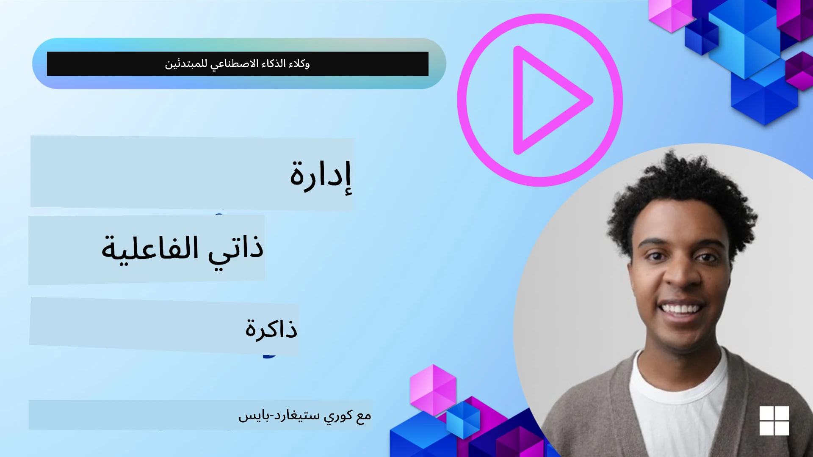

<!--
CO_OP_TRANSLATOR_METADATA:
{
  "original_hash": "a1d90991499ad697c4ad24decaf36968",
  "translation_date": "2025-12-09T11:50:16+00:00",
  "source_file": "13-agent-memory/README.md",
  "language_code": "ar"
}
-->
# الذاكرة لوكلاء الذكاء الاصطناعي

عند مناقشة الفوائد الفريدة لإنشاء وكلاء الذكاء الاصطناعي، يتم التركيز بشكل أساسي على أمرين: القدرة على استخدام الأدوات لإتمام المهام والقدرة على التحسن مع مرور الوقت. الذاكرة هي الأساس لإنشاء وكيل ذاتي التحسين يمكنه تقديم تجارب أفضل لمستخدمينا.

في هذا الدرس، سنلقي نظرة على ماهية الذاكرة لوكلاء الذكاء الاصطناعي وكيف يمكننا إدارتها واستخدامها لصالح تطبيقاتنا.

## المقدمة

سيغطي هذا الدرس:

• **فهم ذاكرة وكلاء الذكاء الاصطناعي**: ما هي الذاكرة ولماذا هي ضرورية للوكلاء.

• **تنفيذ وتخزين الذاكرة**: طرق عملية لإضافة قدرات الذاكرة إلى وكلاء الذكاء الاصطناعي، مع التركيز على الذاكرة قصيرة وطويلة المدى.

• **جعل وكلاء الذكاء الاصطناعي ذاتية التحسين**: كيف تمكّن الذاكرة الوكلاء من التعلم من التفاعلات السابقة والتحسن مع مرور الوقت.

## التطبيقات المتاحة

يتضمن هذا الدرس درسين شاملين في دفاتر الملاحظات:

• **[13-agent-memory.ipynb](./13-agent-memory.ipynb)**: ينفذ الذاكرة باستخدام Mem0 وAzure AI Search مع إطار عمل Semantic Kernel.

• **[13-agent-memory-cognee.ipynb](./13-agent-memory-cognee.ipynb)**: ينفذ ذاكرة منظمة باستخدام Cognee، حيث يتم بناء رسم بياني للمعرفة مدعوم بالتضمينات، مع تصور الرسم البياني واسترجاع ذكي.

## أهداف التعلم

بعد إكمال هذا الدرس، ستتمكن من:

• **التمييز بين أنواع مختلفة من ذاكرة وكلاء الذكاء الاصطناعي**، بما في ذلك الذاكرة العاملة، قصيرة المدى، طويلة المدى، وأشكال متخصصة مثل ذاكرة الشخصية والذاكرة الحلقية.

• **تنفيذ وإدارة الذاكرة قصيرة وطويلة المدى لوكلاء الذكاء الاصطناعي** باستخدام إطار عمل Semantic Kernel، والاستفادة من أدوات مثل Mem0 وCognee وWhiteboard memory، والتكامل مع Azure AI Search.

• **فهم المبادئ وراء وكلاء الذكاء الاصطناعي ذاتية التحسين** وكيف تساهم أنظمة إدارة الذاكرة القوية في التعلم المستمر والتكيف.

## فهم ذاكرة وكلاء الذكاء الاصطناعي

في جوهرها، **تشير الذاكرة لوكلاء الذكاء الاصطناعي إلى الآليات التي تسمح لهم بالاحتفاظ بالمعلومات واسترجاعها**. يمكن أن تكون هذه المعلومات تفاصيل محددة عن محادثة، تفضيلات المستخدم، إجراءات سابقة، أو حتى أنماط مكتسبة.

بدون ذاكرة، تكون تطبيقات الذكاء الاصطناعي غالبًا بلا حالة، مما يعني أن كل تفاعل يبدأ من الصفر. يؤدي ذلك إلى تجربة مستخدم متكررة ومحبطة حيث "ينسى" الوكيل السياق أو التفضيلات السابقة.

### لماذا الذاكرة مهمة؟

ترتبط ذكاء الوكيل بقدرته على استرجاع واستخدام المعلومات السابقة. تتيح الذاكرة للوكلاء أن يكونوا:

• **تأمليين**: التعلم من الإجراءات والنتائج السابقة.

• **تفاعليين**: الحفاظ على السياق خلال محادثة مستمرة.

• **استباقيين وتفاعليين**: توقع الاحتياجات أو الاستجابة بشكل مناسب بناءً على البيانات التاريخية.

• **مستقلين**: العمل بشكل أكثر استقلالية من خلال الاعتماد على المعرفة المخزنة.

الهدف من تنفيذ الذاكرة هو جعل الوكلاء أكثر **موثوقية وقدرة**.

### أنواع الذاكرة

#### الذاكرة العاملة

فكر في هذه الذاكرة كقطعة من الورق يستخدمها الوكيل أثناء مهمة واحدة أو عملية تفكير مستمرة. تحتفظ بالمعلومات الفورية اللازمة لحساب الخطوة التالية.

بالنسبة لوكلاء الذكاء الاصطناعي، غالبًا ما تلتقط الذاكرة العاملة المعلومات الأكثر صلة من محادثة، حتى لو كان تاريخ الدردشة طويلًا أو مختصرًا. تركز على استخراج العناصر الرئيسية مثل المتطلبات، الاقتراحات، القرارات، والإجراءات.

**مثال على الذاكرة العاملة**

في وكيل حجز السفر، قد تلتقط الذاكرة العاملة طلب المستخدم الحالي، مثل "أريد حجز رحلة إلى باريس". يتم الاحتفاظ بهذا المتطلب المحدد في سياق الوكيل الفوري لتوجيه التفاعل الحالي.

#### الذاكرة قصيرة المدى

هذا النوع من الذاكرة يحتفظ بالمعلومات طوال مدة محادثة واحدة أو جلسة واحدة. إنها سياق الدردشة الحالية، مما يسمح للوكيل بالإشارة إلى الأدوار السابقة في الحوار.

**مثال على الذاكرة قصيرة المدى**

إذا سأل المستخدم، "كم تكلفة رحلة إلى باريس؟" ثم تابع بـ "ماذا عن الإقامة هناك؟"، تضمن الذاكرة قصيرة المدى أن الوكيل يعرف أن "هناك" تشير إلى "باريس" في نفس المحادثة.

#### الذاكرة طويلة المدى

هذه هي المعلومات التي تستمر عبر محادثات أو جلسات متعددة. تتيح للوكلاء تذكر تفضيلات المستخدم، التفاعلات التاريخية، أو المعرفة العامة على مدى فترات طويلة. هذا مهم للتخصيص.

**مثال على الذاكرة طويلة المدى**

قد تخزن الذاكرة طويلة المدى أن "بن يحب التزلج والأنشطة الخارجية، يفضل القهوة مع إطلالة على الجبال، ويريد تجنب منحدرات التزلج المتقدمة بسبب إصابة سابقة". تؤثر هذه المعلومات، التي تم تعلمها من التفاعلات السابقة، على التوصيات في جلسات تخطيط السفر المستقبلية، مما يجعلها مخصصة للغاية.

#### ذاكرة الشخصية

هذا النوع المتخصص من الذاكرة يساعد الوكيل على تطوير "شخصية" أو "هوية" متسقة. يسمح للوكيل بتذكر التفاصيل عن نفسه أو دوره المقصود، مما يجعل التفاعلات أكثر سلاسة وتركيزًا.

**مثال على ذاكرة الشخصية**

إذا تم تصميم وكيل السفر ليكون "خبيرًا في تخطيط التزلج"، فقد تعزز ذاكرة الشخصية هذا الدور، مما يؤثر على ردوده لتتماشى مع نبرة ومعرفة الخبير.

#### ذاكرة الحلقات/العمليات

تخزن هذه الذاكرة تسلسل الخطوات التي يتخذها الوكيل أثناء مهمة معقدة، بما في ذلك النجاحات والإخفاقات. إنها مثل تذكر "الحلقات" أو التجارب السابقة للتعلم منها.

**مثال على ذاكرة الحلقات**

إذا حاول الوكيل حجز رحلة معينة ولكنها فشلت بسبب عدم التوفر، يمكن لذاكرة الحلقات تسجيل هذا الفشل، مما يسمح للوكيل بمحاولة رحلات بديلة أو إبلاغ المستخدم بالمشكلة بطريقة أكثر وعيًا خلال محاولة لاحقة.

#### ذاكرة الكيانات

تشمل هذه الذاكرة استخراج وتذكر كيانات محددة (مثل الأشخاص، الأماكن، أو الأشياء) والأحداث من المحادثات. تتيح للوكيل بناء فهم منظم للعناصر الرئيسية التي تمت مناقشتها.

**مثال على ذاكرة الكيانات**

من محادثة حول رحلة سابقة، قد يستخرج الوكيل "باريس"، "برج إيفل"، و"عشاء في مطعم لو شات نوار" ككيانات. في تفاعل مستقبلي، يمكن للوكيل تذكر "لو شات نوار" وعرض حجز جديد هناك.

#### RAG المنظم (توليد معزز بالاسترجاع)

بينما يعد RAG تقنية أوسع، يتم تسليط الضوء على "RAG المنظم" كتقنية ذاكرة قوية. يستخرج معلومات كثيفة ومنظمة من مصادر متنوعة (المحادثات، الرسائل الإلكترونية، الصور) ويستخدمها لتعزيز الدقة، الاسترجاع، والسرعة في الردود. على عكس RAG الكلاسيكي الذي يعتمد فقط على التشابه الدلالي، يعمل RAG المنظم مع البنية المتأصلة للمعلومات.

**مثال على RAG المنظم**

بدلاً من مجرد مطابقة الكلمات المفتاحية، يمكن لـ RAG المنظم تحليل تفاصيل الرحلة (الوجهة، التاريخ، الوقت، شركة الطيران) من رسالة إلكترونية وتخزينها بطريقة منظمة. يتيح ذلك استفسارات دقيقة مثل "ما الرحلة التي حجزتها إلى باريس يوم الثلاثاء؟"

## تنفيذ وتخزين الذاكرة

يتضمن تنفيذ الذاكرة لوكلاء الذكاء الاصطناعي عملية منهجية لإدارة الذاكرة، والتي تشمل إنشاء، تخزين، استرجاع، دمج، تحديث، وحتى "نسيان" (أو حذف) المعلومات. الاسترجاع هو جانب حاسم بشكل خاص.

### أدوات ذاكرة متخصصة

#### Mem0

إحدى الطرق لتخزين وإدارة ذاكرة الوكيل هي استخدام أدوات متخصصة مثل Mem0. يعمل Mem0 كطبقة ذاكرة دائمة، مما يسمح للوكلاء باسترجاع التفاعلات ذات الصلة، تخزين تفضيلات المستخدم والسياق الواقعي، والتعلم من النجاحات والإخفاقات مع مرور الوقت. الفكرة هنا هي أن الوكلاء بدون حالة يتحولون إلى وكلاء بحالة.

#### Cognee

نهج قوي آخر هو استخدام **Cognee**، ذاكرة دلالية مفتوحة المصدر لوكلاء الذكاء الاصطناعي التي تحول البيانات المنظمة وغير المنظمة إلى رسوم بيانية للمعرفة قابلة للاستعلام مدعومة بالتضمينات.

### تخزين الذاكرة باستخدام RAG

يمكنك الاستفادة من خدمات البحث القوية مثل **Azure AI Search** كخلفية لتخزين واسترجاع الذكريات، خاصة لـ RAG المنظم.

## جعل وكلاء الذكاء الاصطناعي ذاتية التحسين

نمط شائع للوكلاء ذاتية التحسين يتضمن تقديم **"وكيل المعرفة"**. هذا الوكيل المنفصل يراقب المحادثة الرئيسية بين المستخدم والوكيل الأساسي.

### تحسينات للذاكرة

• **إدارة التأخير**: لتجنب إبطاء التفاعلات، يمكن استخدام نموذج أرخص وأسرع في البداية للتحقق بسرعة مما إذا كانت المعلومات تستحق التخزين أو الاسترجاع.

• **صيانة قاعدة المعرفة**: بالنسبة لقاعدة معرفة متزايدة، يمكن نقل المعلومات الأقل استخدامًا إلى "التخزين البارد" لإدارة التكاليف.

## هل لديك المزيد من الأسئلة حول ذاكرة الوكلاء؟

انضم إلى [خادم Discord الخاص بـ Azure AI Foundry](https://aka.ms/ai-agents/discord) للتواصل مع متعلمين آخرين، حضور ساعات المكتب، والحصول على إجابات لأسئلتك حول وكلاء الذكاء الاصطناعي.

---

<!-- CO-OP TRANSLATOR DISCLAIMER START -->
**إخلاء المسؤولية**:  
تم ترجمة هذا المستند باستخدام خدمة الترجمة بالذكاء الاصطناعي [Co-op Translator](https://github.com/Azure/co-op-translator). بينما نسعى لتحقيق الدقة، يرجى العلم أن الترجمات الآلية قد تحتوي على أخطاء أو عدم دقة. يجب اعتبار المستند الأصلي بلغته الأصلية المصدر الرسمي. للحصول على معلومات حاسمة، يُوصى بالترجمة البشرية الاحترافية. نحن غير مسؤولين عن أي سوء فهم أو تفسيرات خاطئة ناتجة عن استخدام هذه الترجمة.
<!-- CO-OP TRANSLATOR DISCLAIMER END -->