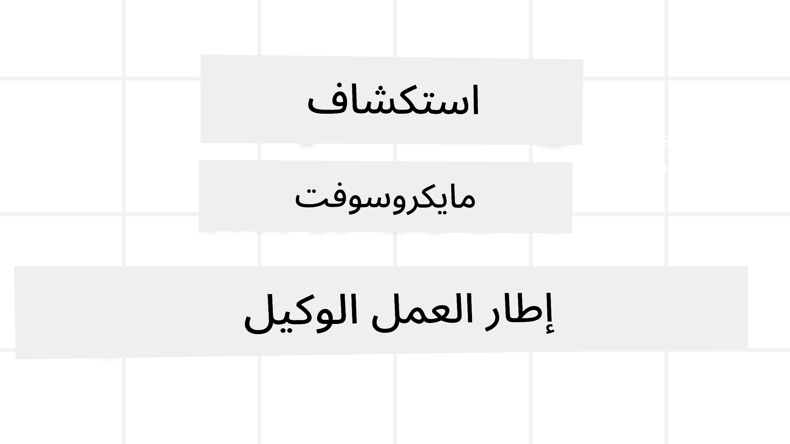
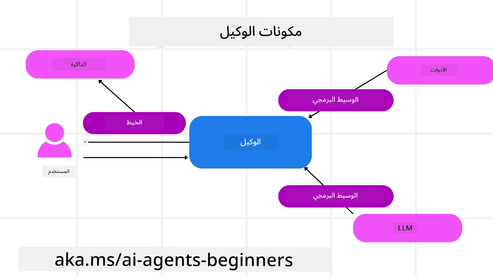

<!--
CO_OP_TRANSLATOR_METADATA:
{
  "original_hash": "19c4dab375acbc733855cc7f2f04edbc",
  "translation_date": "2025-10-02T11:13:46+00:00",
  "source_file": "14-microsoft-agent-framework/README.md",
  "language_code": "ar"
}
-->
# استكشاف إطار عمل Microsoft Agent Framework



### المقدمة

ستتناول هذه الدرس:

- فهم إطار عمل Microsoft Agent Framework: الميزات الرئيسية والقيمة  
- استكشاف المفاهيم الأساسية لإطار عمل Microsoft Agent Framework
- مقارنة MAF مع Semantic Kernel و AutoGen: دليل الانتقال

## أهداف التعلم

بعد إكمال هذا الدرس، ستتمكن من:

- بناء وكلاء ذكاء اصطناعي جاهزين للإنتاج باستخدام إطار عمل Microsoft Agent Framework
- تطبيق الميزات الأساسية لإطار عمل Microsoft Agent Framework على حالات الاستخدام الخاصة بالوكالة
- الانتقال ودمج الأطر والأدوات الوكالية الحالية  

## عينات الكود

يمكن العثور على عينات الكود الخاصة بـ [Microsoft Agent Framework (MAF)](https://aka.ms/ai-agents-beginners/agent-framewrok) في هذا المستودع تحت ملفات `xx-python-agent-framework` و `xx-dotnet-agent-framework`.

## فهم إطار عمل Microsoft Agent Framework


[إطار عمل Microsoft Agent Framework (MAF)](https://aka.ms/ai-agents-beginners/agent-framewrok) يعتمد على الخبرة والدروس المستفادة من Semantic Kernel و AutoGen. يوفر المرونة لمعالجة مجموعة واسعة من حالات الاستخدام الوكالية في بيئات الإنتاج والبحث، بما في ذلك:

- **تنسيق الوكلاء المتسلسل** في السيناريوهات التي تتطلب سير عمل خطوة بخطوة.
- **التنسيق المتزامن** في السيناريوهات التي يحتاج فيها الوكلاء إلى إكمال المهام في نفس الوقت.
- **تنسيق الدردشة الجماعية** في السيناريوهات التي يمكن للوكلاء التعاون فيها معًا على مهمة واحدة.
- **تنسيق التسليم** في السيناريوهات التي يقوم فيها الوكلاء بتسليم المهمة لبعضهم البعض عند اكتمال المهام الفرعية.
- **التنسيق المغناطيسي** في السيناريوهات التي يقوم فيها وكيل المدير بإنشاء وتعديل قائمة المهام ويتولى تنسيق الوكلاء الفرعيين لإكمال المهمة.

لتقديم وكلاء ذكاء اصطناعي في الإنتاج، يتضمن MAF ميزات مثل:

- **الرصد** باستخدام OpenTelemetry حيث يتم تتبع كل إجراء يقوم به وكيل الذكاء الاصطناعي بما في ذلك استدعاء الأدوات، خطوات التنسيق، تدفقات التفكير ومراقبة الأداء عبر لوحات معلومات Azure AI Foundry.
- **الأمان** من خلال استضافة الوكلاء محليًا على Azure AI Foundry الذي يتضمن ضوابط أمان مثل الوصول المستند إلى الأدوار، التعامل مع البيانات الخاصة وسلامة المحتوى المدمجة.
- **الاستمرارية** حيث يمكن لوكلاء الذكاء الاصطناعي إيقاف واستئناف واسترداد الأخطاء مما يتيح عمليات طويلة الأمد.
- **التحكم** حيث يتم دعم سير العمل الذي يتطلب تدخل الإنسان حيث يتم وضع علامة على المهام التي تحتاج إلى موافقة بشرية.

يركز إطار عمل Microsoft Agent Framework أيضًا على التوافق من خلال:

- **عدم الاعتماد على السحابة** - يمكن للوكلاء العمل في الحاويات، في بيئات محلية وعبر سحابات متعددة.
- **عدم الاعتماد على المزود** - يمكن إنشاء الوكلاء باستخدام SDK المفضل لديك بما في ذلك Azure OpenAI و OpenAI.
- **دمج المعايير المفتوحة** - يمكن للوكلاء استخدام بروتوكولات مثل Agent-to-Agent (A2A) و Model Context Protocol (MCP) لاكتشاف واستخدام وكلاء وأدوات أخرى.
- **الإضافات والموصلات** - يمكن إنشاء اتصالات مع خدمات البيانات والذاكرة مثل Microsoft Fabric، SharePoint، Pinecone و Qdrant.

لنلقِ نظرة على كيفية تطبيق هذه الميزات على بعض المفاهيم الأساسية لإطار عمل Microsoft Agent Framework.

## المفاهيم الأساسية لإطار عمل Microsoft Agent Framework

### الوكلاء



**إنشاء الوكلاء**

يتم إنشاء الوكلاء من خلال تعريف خدمة الاستدلال (مزود LLM)، مجموعة من التعليمات التي يجب على وكيل الذكاء الاصطناعي اتباعها، واسم معين:

```python
agent = AzureOpenAIChatClient(credential=AzureCliCredential()).create_agent( instructions="You are good at recommending trips to customers based on their preferences.", name="TripRecommender" )
```

يتم استخدام `Azure OpenAI` أعلاه، ولكن يمكن إنشاء الوكلاء باستخدام مجموعة متنوعة من الخدمات بما في ذلك `Azure AI Foundry Agent Service`:

```python
AzureAIAgentClient(async_credential=credential).create_agent( name="HelperAgent", instructions="You are a helpful assistant." ) as agent
```

واجهات برمجة التطبيقات `Responses` و `ChatCompletion` الخاصة بـ OpenAI

```python
agent = OpenAIResponsesClient().create_agent( name="WeatherBot", instructions="You are a helpful weather assistant.", )
```

```python
agent = OpenAIChatClient().create_agent( name="HelpfulAssistant", instructions="You are a helpful assistant.", )
```

أو الوكلاء البعيدين باستخدام بروتوكول A2A:

```python
agent = A2AAgent( name=agent_card.name, description=agent_card.description, agent_card=agent_card, url="https://your-a2a-agent-host" )
```

**تشغيل الوكلاء**

يتم تشغيل الوكلاء باستخدام الطرق `.run` أو `.run_stream` للحصول على استجابات غير متدفقة أو متدفقة.

```python
result = await agent.run("What are good places to visit in Amsterdam?")
print(result.text)
```

```python
async for update in agent.run_stream("What are the good places to visit in Amsterdam?"):
    if update.text:
        print(update.text, end="", flush=True)

```

يمكن لكل تشغيل للوكيل أيضًا أن يحتوي على خيارات لتخصيص المعلمات مثل `max_tokens` التي يستخدمها الوكيل، `tools` التي يمكن للوكيل استدعاؤها، وحتى النموذج نفسه المستخدم للوكيل.

هذا مفيد في الحالات التي تتطلب نماذج أو أدوات محددة لإكمال مهمة المستخدم.

**الأدوات**

يمكن تعريف الأدوات عند تعريف الوكيل:

```python
def get_attractions( location: Annotated[str, Field(description="The location to get the top tourist attractions for")], ) -> str: """Get the top tourist attractions for a given location.""" return f"The top attractions for {location} are." 


# When creating a ChatAgent directly 

agent = ChatAgent( chat_client=OpenAIChatClient(), instructions="You are a helpful assistant", tools=[get_attractions]

```

وأيضًا عند تشغيل الوكيل:

```python

result1 = await agent.run( "What's the best place to visit in Seattle?", tools=[get_attractions] # Tool provided for this run only )
```

**سلاسل الوكلاء**

تُستخدم سلاسل الوكلاء للتعامل مع المحادثات متعددة الأدوار. يمكن إنشاء السلاسل إما باستخدام:

- `get_new_thread()` الذي يتيح حفظ السلسلة مع مرور الوقت
- إنشاء سلسلة تلقائيًا عند تشغيل الوكيل وجعل السلسلة تستمر فقط أثناء التشغيل الحالي.

لإنشاء سلسلة، يبدو الكود كما يلي:

```python
# Create a new thread. 
thread = agent.get_new_thread() # Run the agent with the thread. 
response = await agent.run("Hello, I am here to help you book travel. Where would you like to go?", thread=thread)

```

يمكنك بعد ذلك تسلسل السلسلة لتخزينها للاستخدام لاحقًا:

```python
# Create a new thread. 
thread = agent.get_new_thread() 

# Run the agent with the thread. 

response = await agent.run("Hello, how are you?", thread=thread) 

# Serialize the thread for storage. 

serialized_thread = await thread.serialize() 

# Deserialize the thread state after loading from storage. 

resumed_thread = await agent.deserialize_thread(serialized_thread)
```

**وسيط الوكلاء**

يتفاعل الوكلاء مع الأدوات و LLMs لإكمال مهام المستخدم. في بعض السيناريوهات، نريد تنفيذ أو تتبع بين هذه التفاعلات. يتيح لنا وسيط الوكلاء القيام بذلك من خلال:

*وسيط الوظيفة*

يسمح هذا الوسيط بتنفيذ إجراء بين الوكيل والوظيفة/الأداة التي سيقوم باستدعائها. مثال على ذلك هو عندما ترغب في تسجيل استدعاء الوظيفة.

في الكود أدناه، يحدد `next` ما إذا كان يجب استدعاء الوسيط التالي أو الوظيفة الفعلية.

```python
async def logging_function_middleware(
    context: FunctionInvocationContext,
    next: Callable[[FunctionInvocationContext], Awaitable[None]],
) -> None:
    """Function middleware that logs function execution."""
    # Pre-processing: Log before function execution
    print(f"[Function] Calling {context.function.name}")

    # Continue to next middleware or function execution
    await next(context)

    # Post-processing: Log after function execution
    print(f"[Function] {context.function.name} completed")
```

*وسيط الدردشة*

يسمح هذا الوسيط بتنفيذ أو تسجيل إجراء بين الوكيل والطلبات بين LLM.

يتضمن هذا معلومات مهمة مثل `messages` التي يتم إرسالها إلى خدمة الذكاء الاصطناعي.

```python
async def logging_chat_middleware(
    context: ChatContext,
    next: Callable[[ChatContext], Awaitable[None]],
) -> None:
    """Chat middleware that logs AI interactions."""
    # Pre-processing: Log before AI call
    print(f"[Chat] Sending {len(context.messages)} messages to AI")

    # Continue to next middleware or AI service
    await next(context)

    # Post-processing: Log after AI response
    print("[Chat] AI response received")

```

**ذاكرة الوكلاء**

كما تم تغطيته في درس `Agentic Memory`، تعد الذاكرة عنصرًا مهمًا لتمكين الوكيل من العمل عبر سياقات مختلفة. يوفر MAF عدة أنواع مختلفة من الذكريات:

*التخزين في الذاكرة*

هذه هي الذاكرة المخزنة في السلاسل أثناء وقت تشغيل التطبيق.

```python
# Create a new thread. 
thread = agent.get_new_thread() # Run the agent with the thread. 
response = await agent.run("Hello, I am here to help you book travel. Where would you like to go?", thread=thread)
```

*الرسائل الدائمة*

تُستخدم هذه الذاكرة عند تخزين تاريخ المحادثة عبر جلسات مختلفة. يتم تعريفها باستخدام `chat_message_store_factory`:

```python
from agent_framework import ChatMessageStore

# Create a custom message store
def create_message_store():
    return ChatMessageStore()

agent = ChatAgent(
    chat_client=OpenAIChatClient(),
    instructions="You are a Travel assistant.",
    chat_message_store_factory=create_message_store
)

```

*الذاكرة الديناميكية*

تُضاف هذه الذاكرة إلى السياق قبل تشغيل الوكلاء. يمكن تخزين هذه الذكريات في خدمات خارجية مثل mem0:

```python
from agent_framework.mem0 import Mem0Provider

# Using Mem0 for advanced memory capabilities
memory_provider = Mem0Provider(
    api_key="your-mem0-api-key",
    user_id="user_123",
    application_id="my_app"
)

agent = ChatAgent(
    chat_client=OpenAIChatClient(),
    instructions="You are a helpful assistant with memory.",
    context_providers=memory_provider
)

```

**رصد الوكلاء**

الرصد مهم لبناء أنظمة وكالية موثوقة وقابلة للصيانة. يدمج MAF مع OpenTelemetry لتوفير التتبع والمقاييس لتحسين الرصد.

```python
from agent_framework.observability import get_tracer, get_meter

tracer = get_tracer()
meter = get_meter()
with tracer.start_as_current_span("my_custom_span"):
    # do something
    pass
counter = meter.create_counter("my_custom_counter")
counter.add(1, {"key": "value"})
```

### سير العمل

يوفر MAF سير عمل يتكون من خطوات محددة مسبقًا لإكمال مهمة ويتضمن وكلاء الذكاء الاصطناعي كعناصر في تلك الخطوات.

يتكون سير العمل من مكونات مختلفة تتيح التحكم الأفضل في التدفق. كما يتيح سير العمل **تنسيق الوكلاء المتعددين** و **حفظ نقاط التحقق** لتخزين حالات سير العمل.

المكونات الأساسية لسير العمل هي:

**المنفذون**

يتلقون رسائل الإدخال، ينفذون المهام الموكلة إليهم، ثم ينتجون رسالة إخراج. هذا يدفع سير العمل نحو إكمال المهمة الأكبر. يمكن أن يكون المنفذون وكلاء ذكاء اصطناعي أو منطق مخصص.

**الحواف**

تُستخدم الحواف لتحديد تدفق الرسائل في سير العمل. يمكن أن تكون:

*الحواف المباشرة* - اتصالات بسيطة من واحد إلى واحد بين المنفذين:

```python
from agent_framework import WorkflowBuilder

builder = WorkflowBuilder()
builder.add_edge(source_executor, target_executor)
builder.set_start_executor(source_executor)
workflow = builder.build()
```

*الحواف الشرطية* - يتم تفعيلها بعد استيفاء شرط معين. على سبيل المثال، عندما تكون غرف الفنادق غير متوفرة، يمكن للمنفذ اقتراح خيارات أخرى.

*حواف التبديل* - توجيه الرسائل إلى منفذين مختلفين بناءً على شروط محددة. على سبيل المثال، إذا كان لدى العميل الأولوية، فستتم معالجة مهامه من خلال سير عمل آخر.

*حواف التوزيع* - إرسال رسالة واحدة إلى أهداف متعددة.

*حواف التجميع* - جمع رسائل متعددة من منفذين مختلفين وإرسالها إلى هدف واحد.

**الأحداث**

لتوفير رصد أفضل لسير العمل، يقدم MAF أحداثًا مدمجة للتنفيذ بما في ذلك:

- `WorkflowStartedEvent` - بدء تنفيذ سير العمل
- `WorkflowOutputEvent` - إنتاج سير العمل لمخرجات
- `WorkflowErrorEvent` - مواجهة سير العمل لخطأ
- `ExecutorInvokeEvent` - بدء معالجة المنفذ
- `ExecutorCompleteEvent` - انتهاء معالجة المنفذ
- `RequestInfoEvent` - إصدار طلب

## الانتقال من أطر أخرى (Semantic Kernel و AutoGen)

### الفروقات بين MAF و Semantic Kernel

**إنشاء الوكلاء المبسط**

يعتمد Semantic Kernel على إنشاء مثيل Kernel لكل وكيل. يستخدم MAF نهجًا مبسطًا باستخدام الامتدادات للمزودين الرئيسيين.

```python
agent = AzureOpenAIChatClient(credential=AzureCliCredential()).create_agent( instructions="You are good at reccomending trips to customers based on their preferences.", name="TripRecommender" )
```

**إنشاء سلاسل الوكلاء**

يتطلب Semantic Kernel إنشاء السلاسل يدويًا. في MAF، يتم تعيين السلسلة مباشرة للوكيل.

```python
thread = agent.get_new_thread() # Run the agent with the thread. 
```

**تسجيل الأدوات**

في Semantic Kernel، يتم تسجيل الأدوات في Kernel ثم يتم تمرير Kernel إلى الوكيل. في MAF، يتم تسجيل الأدوات مباشرة أثناء عملية إنشاء الوكيل.

```python
agent = ChatAgent( chat_client=OpenAIChatClient(), instructions="You are a helpful assistant", tools=[get_attractions]
```

### الفروقات بين MAF و AutoGen

**الفرق بين الفرق وسير العمل**

`Teams` هي هيكل الأحداث للنشاط المدفوع بالأحداث مع الوكلاء في AutoGen. يستخدم MAF `Workflows` التي توجه البيانات إلى المنفذين من خلال بنية تعتمد على الرسوم البيانية.

**إنشاء الأدوات**

يستخدم AutoGen `FunctionTool` لتغليف الوظائف التي يمكن للوكلاء استدعاؤها. يستخدم MAF @ai_function الذي يعمل بشكل مشابه ولكنه يستنتج المخططات تلقائيًا لكل وظيفة.

**سلوك الوكلاء**

الوكلاء في AutoGen هم وكلاء ذو دورة واحدة افتراضيًا ما لم يتم تعيين `max_tool_iterations` إلى قيمة أعلى. في MAF، يكون `ChatAgent` متعدد الأدوار افتراضيًا مما يعني أنه سيستمر في استدعاء الأدوات حتى يتم إكمال مهمة المستخدم.

## عينات الكود

يمكن العثور على عينات الكود الخاصة بـ Microsoft Agent Framework في هذا المستودع تحت ملفات `xx-python-agent-framework` و `xx-dotnet-agent-framework`.

## هل لديك المزيد من الأسئلة حول Microsoft Agent Framework؟

انضم إلى [Azure AI Foundry Discord](https://aka.ms/ai-agents/discord) للتواصل مع متعلمين آخرين، حضور ساعات المكتب والحصول على إجابات لأسئلتك حول وكلاء الذكاء الاصطناعي.

---

**إخلاء المسؤولية**:  
تم ترجمة هذا المستند باستخدام خدمة الترجمة بالذكاء الاصطناعي [Co-op Translator](https://github.com/Azure/co-op-translator). بينما نسعى لتحقيق الدقة، يرجى العلم أن الترجمات الآلية قد تحتوي على أخطاء أو عدم دقة. يجب اعتبار المستند الأصلي بلغته الأصلية المصدر الرسمي. للحصول على معلومات حاسمة، يُوصى بالترجمة البشرية الاحترافية. نحن غير مسؤولين عن أي سوء فهم أو تفسيرات خاطئة ناتجة عن استخدام هذه الترجمة.