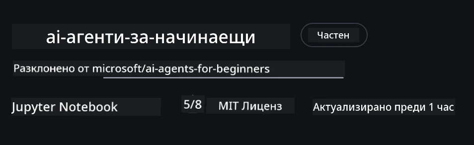
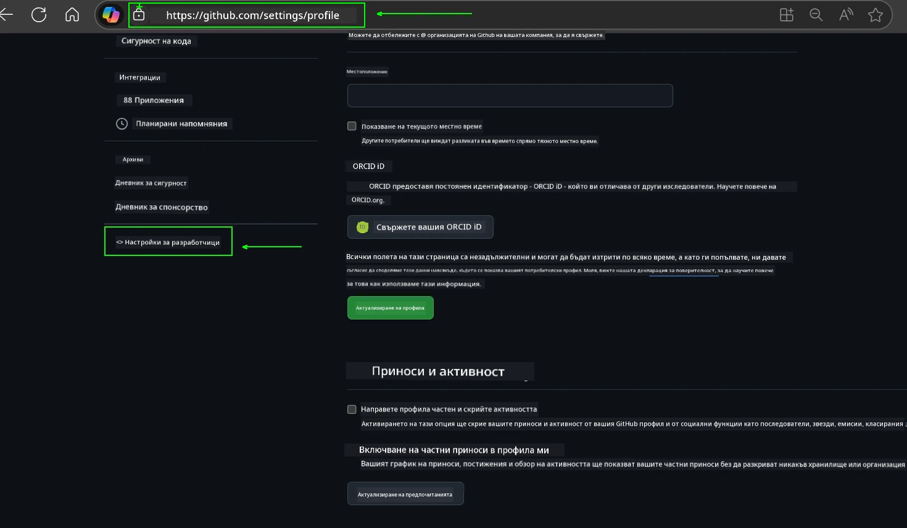
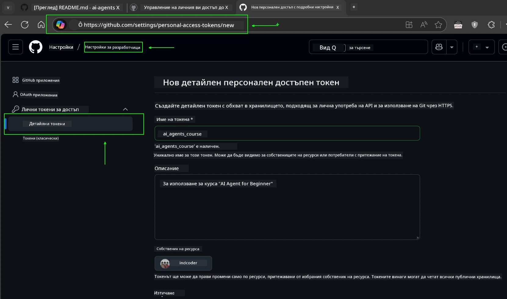
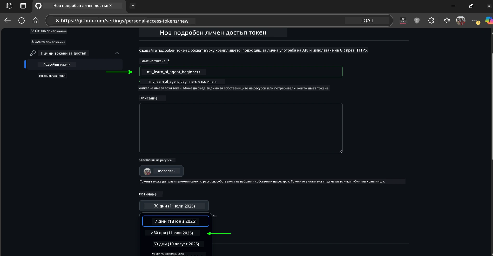
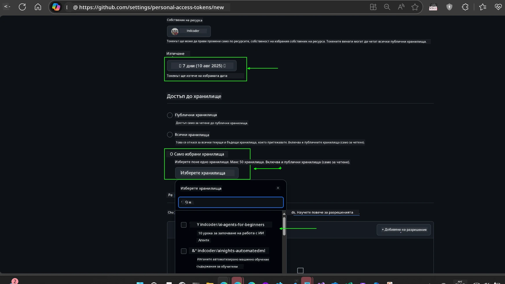
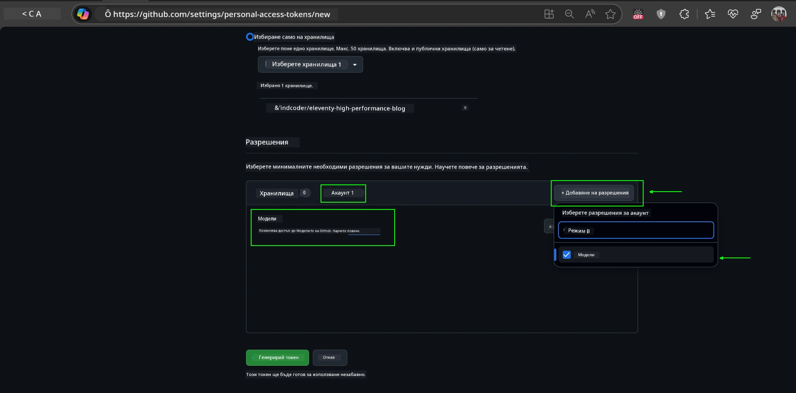
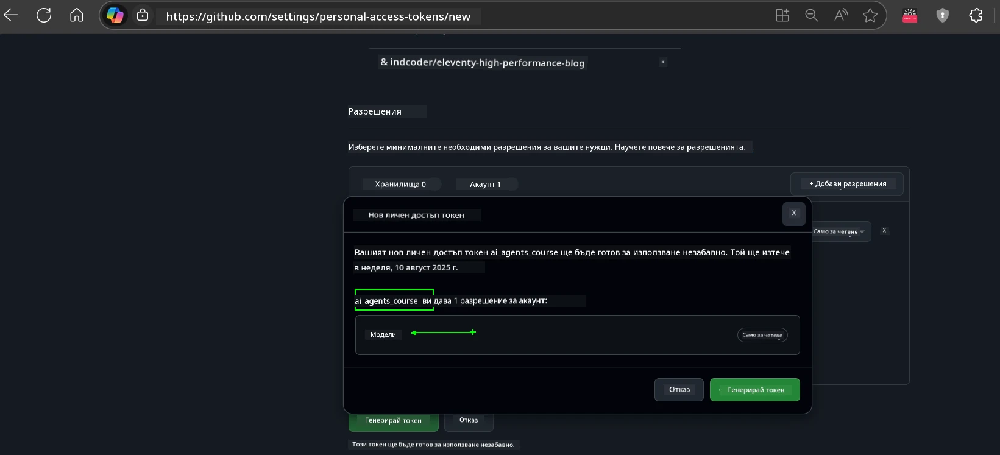
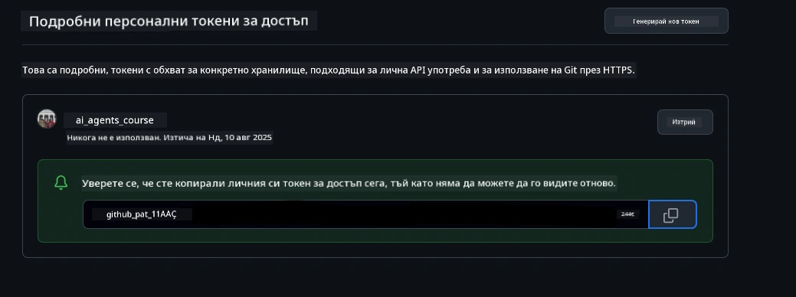
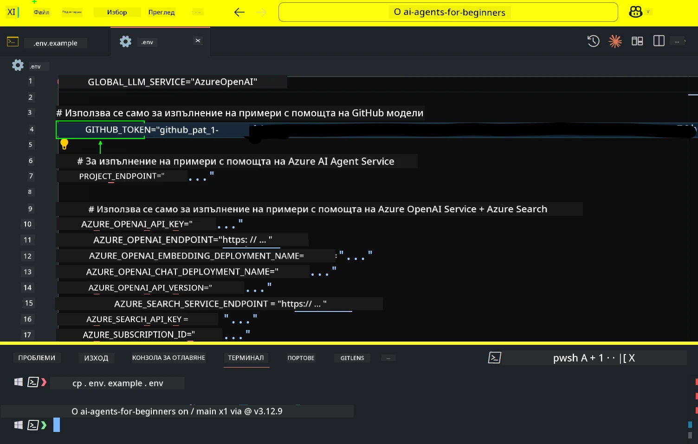
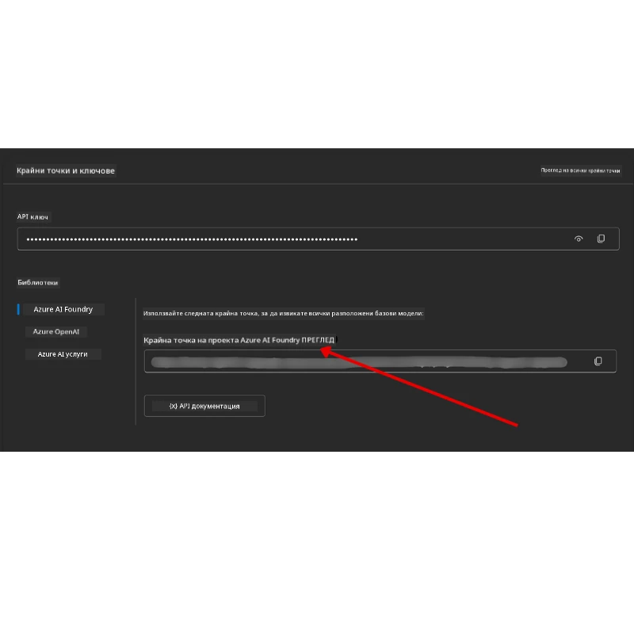

<!--
CO_OP_TRANSLATOR_METADATA:
{
  "original_hash": "63b1a8f6e840df15934935b728e569f0",
  "translation_date": "2025-12-03T14:59:01+00:00",
  "source_file": "00-course-setup/README.md",
  "language_code": "bg"
}
-->
# Настройка на курса

## Въведение

Този урок ще обхване как да стартирате примерите с код от този курс.

## Присъединете се към други обучаващи се и получете помощ

Преди да започнете да клонирате вашето хранилище, присъединете се към [AI Agents For Beginners Discord канала](https://aka.ms/ai-agents/discord), за да получите помощ с настройката, да зададете въпроси относно курса или да се свържете с други обучаващи се.

## Клонирайте или създайте копие на това хранилище

За да започнете, моля, клонирайте или създайте копие на GitHub хранилището. Това ще създаде ваша собствена версия на материалите от курса, за да можете да стартирате, тествате и променяте кода!

Това може да се направи, като кликнете на линка за <a href="https://github.com/microsoft/ai-agents-for-beginners/fork" target="_blank">създаване на копие на хранилището</a>.

Сега трябва да имате ваша собствена версия на този курс на следния линк:



### Повърхностно клониране (препоръчително за работилници / Codespaces)

  >Пълното хранилище може да бъде голямо (~3 GB), когато изтеглите цялата история и всички файлове. Ако само посещавате работилницата или ви трябват само няколко папки с уроци, повърхностното клониране (или частично клониране) избягва голяма част от това изтегляне, като съкращава историята и/или пропуска ненужни файлове.

#### Бързо повърхностно клониране — минимална история, всички файлове

Заменете `<your-username>` в командите по-долу с URL на вашето копие (или основния URL, ако предпочитате).

За да клонирате само последната история на комитите (малко изтегляне):

```bash|powershell
git clone --depth 1 https://github.com/<your-username>/ai-agents-for-beginners.git
```

За да клонирате конкретен клон:

```bash|powershell
git clone --depth 1 --branch <branch-name> https://github.com/<your-username>/ai-agents-for-beginners.git
```

#### Частично (спарс) клониране — минимални файлове + само избрани папки

Това използва частично клониране и спарс-чекаут (изисква Git 2.25+ и препоръчителен модерен Git с поддръжка за частично клониране):

```bash|powershell
git clone --depth 1 --filter=blob:none --sparse https://github.com/<your-username>/ai-agents-for-beginners.git
```

Влезте в папката на хранилището:

```bash|powershell
cd ai-agents-for-beginners
```

След това посочете кои папки искате (примерът по-долу показва две папки):

```bash|powershell
git sparse-checkout set 00-course-setup 01-intro-to-ai-agents
```

След клониране и проверка на файловете, ако ви трябват само файлове и искате да освободите пространство (без история на Git), моля, изтрийте метаданните на хранилището (💀необратимо — ще загубите всички функции на Git: няма комити, изтегляния, качвания или достъп до история).

```bash
# zsh/bash
rm -rf .git
```

```powershell
# PowerShell
Remove-Item -Recurse -Force .git
```

#### Използване на GitHub Codespaces (препоръчително за избягване на големи локални изтегляния)

- Създайте нов Codespace за това хранилище чрез [GitHub UI](https://github.com/codespaces).  

- В терминала на новосъздадения Codespace, изпълнете една от командите за повърхностно/частично клониране по-горе, за да донесете само папките с уроци, които ви трябват, в работното пространство на Codespace.
- По избор: след клониране в Codespaces, премахнете .git, за да освободите допълнително пространство (вижте командите за премахване по-горе).
- Забележка: Ако предпочитате да отворите хранилището директно в Codespaces (без допълнително клониране), имайте предвид, че Codespaces ще създаде средата на devcontainer и може все още да предостави повече, отколкото ви е необходимо. Клонирането на повърхностно копие в нов Codespace ви дава повече контрол върху използването на диска.

#### Съвети

- Винаги заменяйте URL за клониране с вашето копие, ако искате да редактирате/комитирате.
- Ако по-късно ви трябва повече история или файлове, можете да ги изтеглите или да коригирате спарс-чекаут, за да включите допълнителни папки.

## Стартиране на кода

Този курс предлага серия от Jupyter Notebooks, които можете да стартирате, за да получите практически опит в изграждането на AI агенти.

Примерите с код използват:

**Изисква GitHub акаунт - Безплатно**:

1) Semantic Kernel Agent Framework + GitHub Models Marketplace. Обозначено като (semantic-kernel.ipynb)
2) AutoGen Framework + GitHub Models Marketplace. Обозначено като (autogen.ipynb)

**Изисква Azure абонамент**:

3) Azure AI Foundry + Azure AI Agent Service. Обозначено като (azureaiagent.ipynb)

Препоръчваме ви да изпробвате и трите типа примери, за да видите кой работи най-добре за вас.

Който и вариант да изберете, той ще определи кои стъпки за настройка трябва да следвате по-долу:

## Изисквания

- Python 3.12+
  - **NOTE**: Ако нямате инсталиран Python3.12, уверете се, че го инсталирате. След това създайте вашия venv, използвайки python3.12, за да гарантирате, че правилните версии са инсталирани от файла requirements.txt.
  
    >Пример

    Създайте директория за Python venv:

    ```bash|powershell
    python -m venv venv
    ```

    След това активирайте venv средата за:

    ```bash
    # zsh/bash
    source venv/bin/activate
    ```
  
    ```dos
    # Command Prompt for Windows
    venv\Scripts\activate
    ```

- .NET 10+: За примерите с код, използващи .NET, уверете се, че сте инсталирали [.NET 10 SDK](https://dotnet.microsoft.com/download/dotnet/10.0) или по-нова версия. След това проверете инсталираната версия на .NET SDK:

    ```bash|powershell
    dotnet --list-sdks
    ```

- GitHub акаунт - За достъп до GitHub Models Marketplace
- Azure абонамент - За достъп до Azure AI Foundry
- Azure AI Foundry акаунт - За достъп до Azure AI Agent Service

В корена на това хранилище сме включили файл `requirements.txt`, който съдържа всички необходими Python пакети за стартиране на примерите с код.

Можете да ги инсталирате, като изпълните следната команда в терминала в корена на хранилището:

```bash|powershell
pip install -r requirements.txt
```

Препоръчваме създаването на Python виртуална среда, за да избегнете конфликти и проблеми.

## Настройка на VSCode

Уверете се, че използвате правилната версия на Python в VSCode.


## Настройка за примери, използващи GitHub модели

### Стъпка 1: Получете вашия GitHub Personal Access Token (PAT)

Този курс използва GitHub Models Marketplace, предоставяйки безплатен достъп до големи езикови модели (LLMs), които ще използвате за изграждане на AI агенти.

За да използвате GitHub моделите, ще трябва да създадете [GitHub Personal Access Token](https://docs.github.com/en/authentication/keeping-your-account-and-data-secure/managing-your-personal-access-tokens).

Това може да се направи, като отидете на <a href="https://github.com/settings/personal-access-tokens" target="_blank">настройките за лични токени</a> във вашия GitHub акаунт.

Моля, следвайте [Принципа на минималните привилегии](https://docs.github.com/en/get-started/learning-to-code/storing-your-secrets-safely), когато създавате вашия токен. Това означава, че трябва да дадете на токена само разрешенията, които са му необходими за стартиране на примерите с код в този курс.

1. Изберете опцията `Fine-grained tokens` от лявата страна на екрана, като отидете в **Developer settings**.

   

   След това изберете `Generate new token`.

   

2. Въведете описателно име за вашия токен, което отразява неговата цел, за да бъде лесно разпознаваем по-късно.

    🔐 Препоръка за продължителност на токена

    Препоръчителна продължителност: 30 дни
    За по-сигурна настройка можете да изберете по-кратък период — например 7 дни 🛡️
    Това е чудесен начин да си поставите лична цел и да завършите курса, докато вашият учебен импулс е висок 🚀.

    

3. Ограничете обхвата на токена до вашето копие на това хранилище.

    

4. Ограничете разрешенията на токена: Под **Permissions**, кликнете върху таба **Account** и натиснете бутона "+ Add permissions". Ще се появи падащо меню. Моля, потърсете **Models** и отметнете полето за него.

    

5. Проверете необходимите разрешения преди да генерирате токена. 

6. Преди да генерирате токена, уверете се, че сте готови да го съхраните на сигурно място, като например сейф за пароли, тъй като той няма да бъде показан отново след създаването му. 

Копирайте новия токен, който току-що сте създали. Сега ще го добавите към вашия `.env` файл, включен в този курс.

### Стъпка 2: Създайте вашия `.env` файл

За да създадете вашия `.env` файл, изпълнете следната команда в терминала.

```bash
# zsh/bash
cp .env.example .env
```

```powershell
# PowerShell
Copy-Item .env.example .env
```

Това ще копира примерния файл и ще създаде `.env` във вашата директория, където ще попълните стойностите за променливите на средата.

С копирания токен, отворете `.env` файла в любимия си текстов редактор и поставете вашия токен в полето `GITHUB_TOKEN`.



Сега трябва да можете да стартирате примерите с код от този курс.

## Настройка за примери, използващи Azure AI Foundry и Azure AI Agent Service

### Стъпка 1: Получете вашия Azure Project Endpoint

Следвайте стъпките за създаване на хъб и проект в Azure AI Foundry, описани тук: [Hub resources overview](https://learn.microsoft.com/azure/ai-foundry/concepts/ai-resources)

След като създадете вашия проект, ще трябва да получите низ за връзка за вашия проект.

Това може да се направи, като отидете на страницата **Overview** на вашия проект в портала Azure AI Foundry.



### Стъпка 2: Създайте вашия `.env` файл

За да създадете вашия `.env` файл, изпълнете следната команда в терминала.

```bash
# zsh/bash
cp .env.example .env
```

```powershell
# PowerShell
Copy-Item .env.example .env
```

Това ще копира примерния файл и ще създаде `.env` във вашата директория, където ще попълните стойностите за променливите на средата.

С копирания токен, отворете `.env` файла в любимия си текстов редактор и поставете вашия токен в полето `PROJECT_ENDPOINT`.

### Стъпка 3: Влезте в Azure

Като най-добра практика за сигурност, ще използваме [автентикация без ключове](https://learn.microsoft.com/azure/developer/ai/keyless-connections?tabs=csharp%2Cazure-cli?WT.mc_id=academic-105485-koreyst), за да се автентикираме към Azure OpenAI с Microsoft Entra ID. 

След това отворете терминал и изпълнете `az login --use-device-code`, за да влезете във вашия Azure акаунт.

След като влезете, изберете вашия абонамент в терминала.

## Допълнителни променливи на средата - Azure Search и Azure OpenAI 

За урока Agentic RAG - Урок 5 - има примери, които използват Azure Search и Azure OpenAI.

Ако искате да стартирате тези примери, ще трябва да добавите следните променливи на средата към вашия `.env` файл:

### Страница Overview (Проект)

- `AZURE_SUBSCRIPTION_ID` - Проверете **Project details** на страницата **Overview** на вашия проект.

- `AZURE_AI_PROJECT_NAME` - Погледнете в горната част на страницата **Overview** за вашия проект.

- `AZURE_OPENAI_SERVICE` - Намерете това в таба **Included capabilities** за **Azure OpenAI Service** на страницата **Overview**.

### Център за управление

- `AZURE_OPENAI_RESOURCE_GROUP` - Отидете на **Project properties** на страницата **Overview** на **Management Center**.

- `GLOBAL_LLM_SERVICE` - Под **Connected resources**, намерете името на връзката **Azure AI Services**. Ако не е изброено, проверете **Azure portal** под вашата ресурсна група за името на ресурса AI Services.

### Страница Models + Endpoints

- `AZURE_OPENAI_EMBEDDING_DEPLOYMENT_NAME` - Изберете вашия модел за вграждане (например `text-embedding-ada-002`) и отбележете **Deployment name** от детайлите на модела.

- `AZURE_OPENAI_CHAT_DEPLOYMENT_NAME` - Изберете вашия чат модел (например `gpt-4o-mini`) и отбележете **Deployment name** от детайлите на модела.

### Azure портал

- `AZURE_OPENAI_ENDPOINT` - Потърсете **Azure AI services**, кликнете върху него, след това отидете на **Resource Management**, **Keys and Endpoint**, превъртете надолу до "Azure OpenAI endpoints" и копирайте този, който казва "Language APIs".

- `AZURE_OPENAI_API_KEY` - От същия екран, копирайте KEY 1 или KEY 2.

- `AZURE_SEARCH_SERVICE_ENDPOINT` - Намерете вашия **Azure AI Search** ресурс, кликнете върху него и вижте **Overview**.

- `AZURE_SEARCH_API_KEY` - След това отидете на **Settings** и след това **Keys**, за да копирате основния или вторичния администраторски ключ.

### Външна уеб страница

- `AZURE_OPENAI_API_VERSION` - Посетете страницата [API version lifecycle](https://learn.microsoft.com/azure/ai-services/openai/api-version-deprecation#latest-ga-api-release) под **Latest GA API release**.

### Настройка на автентикация без ключове

Вместо да кодирате вашите идентификационни данни, ще използваме връзка без ключове с Azure OpenAI. За целта ще импортираме `DefaultAzureCredential` и по-късно ще извикаме функцията `DefaultAzureCredential`, за да получим идентификационните данни.

```python
# Пайтън
from azure.identity import DefaultAzureCredential, InteractiveBrowserCredential
```

## Нуждаете се от помощ?
Ако имате някакви проблеми с изпълнението на тази настройка, присъединете се към нашия <a href="https://discord.gg/kzRShWzttr" target="_blank">Discord на общността Azure AI</a> или <a href="https://github.com/microsoft/ai-agents-for-beginners/issues?WT.mc_id=academic-105485-koreyst" target="_blank">създайте проблем</a>.

## Следващ урок

Вече сте готови да изпълните кода за този курс. Приятно учене за света на AI агентите!

[Въведение в AI агентите и техните случаи на употреба](../01-intro-to-ai-agents/README.md)

---

<!-- CO-OP TRANSLATOR DISCLAIMER START -->
**Отказ от отговорност**:  
Този документ е преведен с помощта на AI услуга за превод [Co-op Translator](https://github.com/Azure/co-op-translator). Въпреки че се стремим към точност, моля, имайте предвид, че автоматичните преводи може да съдържат грешки или неточности. Оригиналният документ на неговия оригинален език трябва да се счита за авторитетен източник. За критична информация се препоръчва професионален човешки превод. Ние не носим отговорност за каквито и да било недоразумения или погрешни интерпретации, произтичащи от използването на този превод.
<!-- CO-OP TRANSLATOR DISCLAIMER END -->