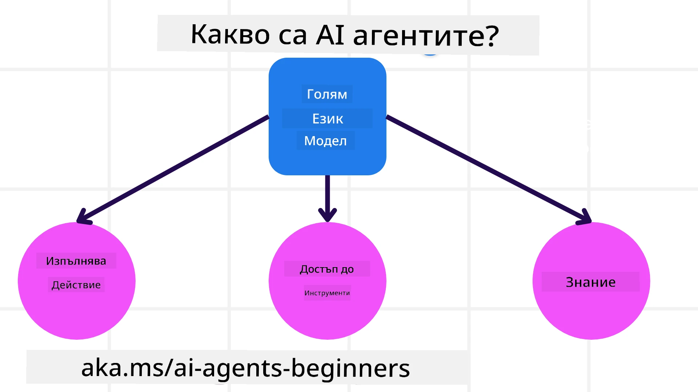
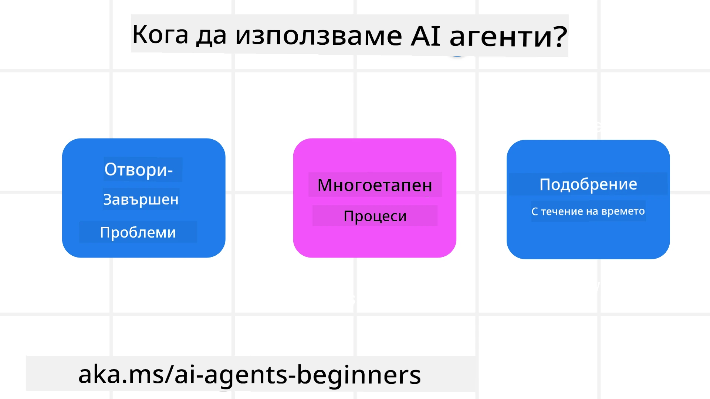

<!--
CO_OP_TRANSLATOR_METADATA:
{
  "original_hash": "cdd28bc00816d2773bb2b5968d782abc",
  "translation_date": "2025-11-11T11:39:12+00:00",
  "source_file": "01-intro-to-ai-agents/README.md",
  "language_code": "bg"
}
-->

> _(Кликнете върху изображението по-горе, за да гледате видеото на този урок)_

# Въведение в AI агенти и техните приложения

Добре дошли в курса "AI агенти за начинаещи"! Този курс предоставя основни знания и практически примери за създаване на AI агенти.

Присъединете се към <a href="https://discord.gg/kzRShWzttr" target="_blank">Azure AI Discord общността</a>, за да се срещнете с други обучаващи се и разработчици на AI агенти и да зададете въпроси относно курса.

За да започнем курса, първо ще се запознаем с това какво представляват AI агентите и как можем да ги използваме в приложенията и работните процеси, които създаваме.

## Въведение

Този урок обхваща:

- Какво представляват AI агентите и какви са различните видове агенти?
- Кои са най-подходящите приложения за AI агенти и как могат да ни помогнат?
- Кои са основните градивни елементи при проектирането на агентни решения?

## Цели на обучението
След завършване на този урок, трябва да можете:

- Да разбирате концепциите за AI агенти и как те се различават от други AI решения.
- Да прилагате AI агенти най-ефективно.
- Да проектирате агентни решения продуктивно както за потребителите, така и за клиентите.

## Определение на AI агенти и видове AI агенти

### Какво представляват AI агенти?

AI агентите са **системи**, които позволяват на **големи езикови модели (LLMs)** да **извършват действия**, като разширяват техните възможности чрез предоставяне на **достъп до инструменти** и **знания**.

Нека разгледаме това определение на части:

- **Система** - Важно е да мислим за агентите не като за един единствен компонент, а като за система от много компоненти. На основно ниво, компонентите на AI агент са:
  - **Среда** - Определеното пространство, в което AI агентът работи. Например, ако имаме AI агент за резервации на пътувания, средата може да бъде системата за резервации, която агентът използва за изпълнение на задачи.
  - **Сензори** - Средите предоставят информация и обратна връзка. AI агентите използват сензори, за да събират и интерпретират тази информация за текущото състояние на средата. В примера с агента за резервации, системата може да предоставя информация като наличност на хотели или цени на полети.
  - **Актуатори** - След като AI агентът получи текущото състояние на средата, за текущата задача агентът определя какво действие да извърши, за да промени средата. За агента за резервации това може да бъде резервиране на налична стая за потребителя.

**Големи езикови модели** - Концепцията за агенти съществуваше преди създаването на LLMs. Предимството на изграждането на AI агенти с LLMs е способността им да интерпретират човешки език и данни. Тази способност позволява на LLMs да интерпретират информацията от средата и да определят план за промяна на средата.

**Извършване на действия** - Извън системите на AI агенти, LLMs са ограничени до ситуации, в които действието е генериране на съдържание или информация въз основа на заявка на потребителя. В системите на AI агенти, LLMs могат да изпълняват задачи, като интерпретират заявката на потребителя и използват инструменти, налични в тяхната среда.

**Достъп до инструменти** - Какви инструменти има достъп LLM се определя от 1) средата, в която работи, и 2) разработчика на AI агента. В примера с агента за пътувания, инструментите на агента са ограничени от операциите, налични в системата за резервации, и/или разработчикът може да ограничи достъпа на агента до инструменти като полети.

**Памет+Знания** - Паметта може да бъде краткосрочна в контекста на разговора между потребителя и агента. Дългосрочно, извън информацията, предоставена от средата, AI агентите могат също да извличат знания от други системи, услуги, инструменти и дори други агенти. В примера с агента за пътувания, тези знания могат да бъдат информация за предпочитанията на потребителя, намираща се в клиентска база данни.

### Различните видове агенти

Сега, когато имаме общо определение за AI агенти, нека разгледаме някои специфични видове агенти и как те биха се приложили към AI агент за резервации на пътувания.

| **Тип агент**                | **Описание**                                                                                                                       | **Пример**                                                                                                                                                                                                                   |
| ----------------------------- | ------------------------------------------------------------------------------------------------------------------------------------- | ----------------------------------------------------------------------------------------------------------------------------------------------------------------------------------------------------------------------------- |
| **Прости рефлексни агенти**      | Извършват незабавни действия въз основа на предварително зададени правила.                                                                                  | Агента за пътувания интерпретира контекста на имейла и препраща оплакванията за пътувания към обслужване на клиенти.                                                                                                                          |
| **Агенти, базирани на модел** | Извършват действия въз основа на модел на света и промени в този модел.                                                              | Агента за пътувания приоритизира маршрути със значителни промени в цените въз основа на достъп до исторически данни за цени.                                                                                                             |
| **Агенти, базирани на цели**         | Създават планове за постигане на конкретни цели, като интерпретират целта и определят действия за нейното достигане.                                  | Агента за пътувания резервира пътуване, като определя необходимите транспортни средства (кола, обществен транспорт, полети) от текущото местоположение до дестинацията.                                                                                |
| **Агенти, базирани на полезност**      | Вземат предвид предпочитанията и претеглят компромиси числено, за да определят как да постигнат целите.                                               | Агента за пътувания максимизира полезността, като претегля удобството спрямо цената при резервиране на пътуване.                                                                                                                                          |
| **Обучаващи се агенти**           | Подобряват се с времето, като реагират на обратна връзка и съответно коригират действията си.                                                        | Агента за пътувания се подобрява, като използва обратна връзка от клиентски анкети след пътуване, за да прави корекции в бъдещи резервации.                                                                                                               |
| **Йерархични агенти**       | Включват множество агенти в многослойна система, като агенти на по-високо ниво разделят задачи на подзадачи за изпълнение от агенти на по-ниско ниво. | Агента за пътувания отменя пътуване, като разделя задачата на подзадачи (например, анулиране на конкретни резервации) и агенти на по-ниско ниво ги изпълняват, докладвайки обратно на агента на по-високо ниво.                                     |
| **Системи с множество агенти (MAS)** | Агенти изпълняват задачи независимо, било то кооперативно или конкурентно.                                                           | Кооперативно: Множество агенти резервират конкретни услуги за пътуване като хотели, полети и развлечения. Конкурентно: Множество агенти управляват и се конкурират за споделен календар за резервации на хотели, за да резервират клиенти в хотела. |

## Кога да използваме AI агенти

В предишния раздел използвахме примера с агента за пътувания, за да обясним как различните видове агенти могат да се използват в различни сценарии за резервации. Ще продължим да използваме това приложение през целия курс.

Нека разгледаме типовете приложения, за които AI агентите са най-подходящи:

- **Отворени проблеми** - позволяване на LLM да определи необходимите стъпки за изпълнение на задача, защото не винаги може да бъде твърдо кодирано в работен процес.
- **Многостъпкови процеси** - задачи, които изискват ниво на сложност, при което AI агентът трябва да използва инструменти или информация през множество стъпки, вместо еднократно извличане.  
- **Подобрение с времето** - задачи, при които агентът може да се подобрява с времето, като получава обратна връзка от средата или потребителите, за да предоставя по-добра полезност.

Ще разгледаме повече съображения за използването на AI агенти в урока за изграждане на надеждни AI агенти.

## Основи на агентните решения

### Разработка на агенти

Първата стъпка в проектирането на система за AI агенти е да се дефинират инструментите, действията и поведението. В този курс се фокусираме върху използването на **Azure AI Agent Service** за дефиниране на нашите агенти. Той предлага функции като:

- Избор на отворени модели като OpenAI, Mistral и Llama
- Използване на лицензирани данни чрез доставчици като Tripadvisor
- Използване на стандартизирани инструменти OpenAPI 3.0

### Агентни модели

Комуникацията с LLMs се осъществява чрез подсказки. С оглед на полуавтономния характер на AI агентите, не винаги е възможно или необходимо ръчно да се променя подсказката след промяна в средата. Използваме **агентни модели**, които ни позволяват да подсказваме LLM през множество стъпки по по-скалируем начин.

Този курс е разделен на някои от текущите популярни агентни модели.

### Агентни рамки

Агентните рамки позволяват на разработчиците да внедряват агентни модели чрез код. Тези рамки предлагат шаблони, плъгини и инструменти за по-добро сътрудничество на AI агентите. Тези предимства предоставят възможности за по-добра наблюдаемост и отстраняване на проблеми в системите на AI агенти.

В този курс ще разгледаме изследователската рамка AutoGen и производствената рамка Agent от Semantic Kernel.

## Примерни кодове

- Python: [Agent Framework](./code_samples/01-python-agent-framework.ipynb)
- .NET: [Agent Framework](./code_samples/01-dotnet-agent-framework.md)

## Имате още въпроси за AI агенти?

Присъединете се към [Azure AI Foundry Discord](https://aka.ms/ai-agents/discord), за да се срещнете с други обучаващи се, да присъствате на офис часове и да получите отговори на вашите въпроси за AI агенти.

## Предишен урок

[Настройка на курса](../00-course-setup/README.md)

## Следващ урок

[Изследване на агентни рамки](../02-explore-agentic-frameworks/README.md)

---

<!-- CO-OP TRANSLATOR DISCLAIMER START -->
**Отказ от отговорност**:  
Този документ е преведен с помощта на AI услуга за превод [Co-op Translator](https://github.com/Azure/co-op-translator). Въпреки че се стремим към точност, моля, имайте предвид, че автоматизираните преводи може да съдържат грешки или неточности. Оригиналният документ на неговия роден език трябва да се счита за авторитетен източник. За критична информация се препоръчва професионален човешки превод. Не носим отговорност за каквито и да е недоразумения или погрешни интерпретации, произтичащи от използването на този превод.
<!-- CO-OP TRANSLATOR DISCLAIMER END -->