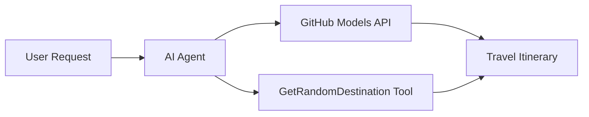

<!--
CO_OP_TRANSLATOR_METADATA:
{
  "original_hash": "5f351412e934f0833c8c821a0a60efaf",
  "translation_date": "2025-11-13T14:04:38+00:00",
  "source_file": "01-intro-to-ai-agents/code_samples/01-dotnet-agent-framework.md",
  "language_code": "bg"
}
-->
# 🌍 AI туристически агент с Microsoft Agent Framework (.NET)

## 📋 Преглед на сценария

Този пример демонстрира как да създадете интелигентен агент за планиране на пътувания, използвайки Microsoft Agent Framework за .NET. Агентът може автоматично да генерира персонализирани маршрути за еднодневни екскурзии до случайни дестинации по света.

### Основни възможности:

- 🎲 **Случаен избор на дестинация**: Използва персонализиран инструмент за избор на ваканционни места
- 🗺️ **Интелигентно планиране на пътувания**: Създава подробни маршрути ден по ден
- 🔄 **Поточно предаване в реално време**: Поддържа както незабавни, така и поточни отговори
- 🛠️ **Интеграция на персонализирани инструменти**: Демонстрира как да се разширят възможностите на агента

## 🔧 Техническа архитектура

### Основни технологии

- **Microsoft Agent Framework**: Най-новата .NET имплементация за разработка на AI агенти
- **Интеграция с GitHub Models**: Използва услугата за модели на GitHub за AI инференция
- **Съвместимост с OpenAI API**: Възползва се от клиентските библиотеки на OpenAI с персонализирани крайни точки
- **Сигурна конфигурация**: Управление на API ключове чрез променливи на средата

### Основни компоненти

1. **AIAgent**: Основният оркестратор на агента, който управлява потока на разговорите
2. **Персонализирани инструменти**: Функцията `GetRandomDestination()` е достъпна за агента
3. **Chat Client**: Интерфейс за разговори, поддържан от GitHub Models
4. **Поточно предаване**: Възможности за генериране на отговори в реално време

### Модел на интеграция



## 🚀 Първи стъпки

### Предпоставки

- [.NET 10 SDK](https://dotnet.microsoft.com/download/dotnet/10.0) или по-нова версия
- [GitHub Models API токен за достъп](https://docs.github.com/github-models/github-models-at-scale/using-your-own-api-keys-in-github-models)

### Необходими променливи на средата

```bash
# zsh/bash
export GH_TOKEN=<your_github_token>
export GH_ENDPOINT=https://models.github.ai/inference
export GH_MODEL_ID=openai/gpt-5-mini
```

```powershell
# PowerShell
$env:GH_TOKEN = "<your_github_token>"
$env:GH_ENDPOINT = "https://models.github.ai/inference"
$env:GH_MODEL_ID = "openai/gpt-5-mini"
```

### Примерен код

За да изпълните примерния код,

```bash
# zsh/bash
chmod +x ./01-dotnet-agent-framework.cs
./01-dotnet-agent-framework.cs
```

Или използвайки dotnet CLI:

```bash
dotnet run ./01-dotnet-agent-framework.cs
```

Вижте [`01-dotnet-agent-framework.cs`](../../../../01-intro-to-ai-agents/code_samples/01-dotnet-agent-framework.cs) за пълния код.

```csharp
#!/usr/bin/dotnet run

#:package Microsoft.Extensions.AI@9.*
#:package Microsoft.Agents.AI.OpenAI@1.*-*

using System.ClientModel;
using System.ComponentModel;

using Microsoft.Agents.AI;
using Microsoft.Extensions.AI;

using OpenAI;

// Tool Function: Random Destination Generator
// This static method will be available to the agent as a callable tool
// The [Description] attribute helps the AI understand when to use this function
// This demonstrates how to create custom tools for AI agents
[Description("Provides a random vacation destination.")]
static string GetRandomDestination()
{
    // List of popular vacation destinations around the world
    // The agent will randomly select from these options
    var destinations = new List<string>
    {
        "Paris, France",
        "Tokyo, Japan",
        "New York City, USA",
        "Sydney, Australia",
        "Rome, Italy",
        "Barcelona, Spain",
        "Cape Town, South Africa",
        "Rio de Janeiro, Brazil",
        "Bangkok, Thailand",
        "Vancouver, Canada"
    };

    // Generate random index and return selected destination
    // Uses System.Random for simple random selection
    var random = new Random();
    int index = random.Next(destinations.Count);
    return destinations[index];
}

// Extract configuration from environment variables
// Retrieve the GitHub Models API endpoint, defaults to https://models.github.ai/inference if not specified
// Retrieve the model ID, defaults to openai/gpt-5-mini if not specified
// Retrieve the GitHub token for authentication, throws exception if not specified
var github_endpoint = Environment.GetEnvironmentVariable("GH_ENDPOINT") ?? "https://models.github.ai/inference";
var github_model_id = Environment.GetEnvironmentVariable("GH_MODEL_ID") ?? "openai/gpt-5-mini";
var github_token = Environment.GetEnvironmentVariable("GH_TOKEN") ?? throw new InvalidOperationException("GH_TOKEN is not set.");

// Configure OpenAI Client Options
// Create configuration options to point to GitHub Models endpoint
// This redirects OpenAI client calls to GitHub's model inference service
var openAIOptions = new OpenAIClientOptions()
{
    Endpoint = new Uri(github_endpoint)
};

// Initialize OpenAI Client with GitHub Models Configuration
// Create OpenAI client using GitHub token for authentication
// Configure it to use GitHub Models endpoint instead of OpenAI directly
var openAIClient = new OpenAIClient(new ApiKeyCredential(github_token), openAIOptions);

// Create AI Agent with Travel Planning Capabilities
// Initialize OpenAI client, get chat client for specified model, and create AI agent
// Configure agent with travel planning instructions and random destination tool
// The agent can now plan trips using the GetRandomDestination function
AIAgent agent = openAIClient
    .GetChatClient(github_model_id)
    .CreateAIAgent(
        instructions: "You are a helpful AI Agent that can help plan vacations for customers at random destinations",
        tools: [AIFunctionFactory.Create(GetRandomDestination)]
    );

// Execute Agent: Plan a Day Trip
// Run the agent with streaming enabled for real-time response display
// Shows the agent's thinking and response as it generates the content
// Provides better user experience with immediate feedback
await foreach (var update in agent.RunStreamingAsync("Plan me a day trip"))
{
    await Task.Delay(10);
    Console.Write(update);
}
```

## 🎓 Основни изводи

1. **Архитектура на агента**: Microsoft Agent Framework предоставя чист и типово безопасен подход за създаване на AI агенти в .NET
2. **Интеграция на инструменти**: Функции, декорирани с атрибути `[Description]`, стават достъпни инструменти за агента
3. **Управление на конфигурацията**: Променливите на средата и сигурното управление на идентификационни данни следват най-добрите практики на .NET
4. **Съвместимост с OpenAI**: Интеграцията с GitHub Models работи безпроблемно чрез OpenAI-съвместими API

## 🔗 Допълнителни ресурси

- [Документация за Microsoft Agent Framework](https://learn.microsoft.com/agent-framework)
- [GitHub Models Marketplace](https://github.com/marketplace?type=models)
- [Microsoft.Extensions.AI](https://learn.microsoft.com/dotnet/ai/microsoft-extensions-ai)
- [.NET Single File Apps](https://devblogs.microsoft.com/dotnet/announcing-dotnet-run-app)

---

<!-- CO-OP TRANSLATOR DISCLAIMER START -->
**Отказ от отговорност**:  
Този документ е преведен с помощта на AI услуга за превод [Co-op Translator](https://github.com/Azure/co-op-translator). Въпреки че се стремим към точност, моля, имайте предвид, че автоматизираните преводи може да съдържат грешки или неточности. Оригиналният документ на неговия роден език трябва да се счита за авторитетен източник. За критична информация се препоръчва професионален човешки превод. Ние не носим отговорност за каквито и да е недоразумения или погрешни интерпретации, произтичащи от използването на този превод.
<!-- CO-OP TRANSLATOR DISCLAIMER END -->