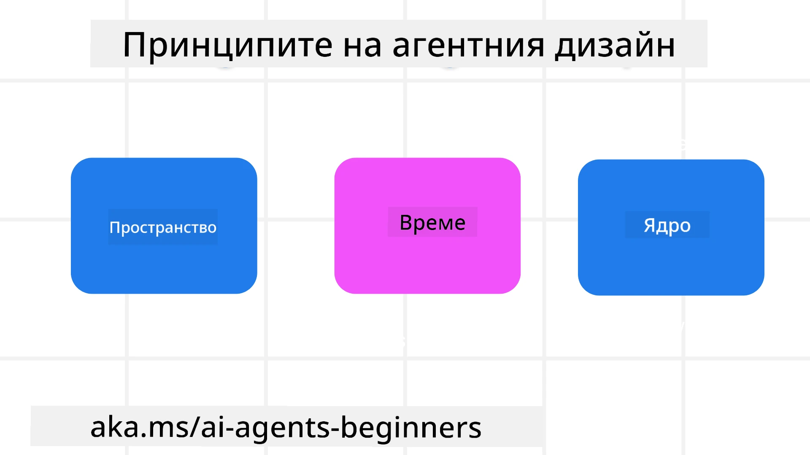

<!--
CO_OP_TRANSLATOR_METADATA:
{
  "original_hash": "d71524fe83a23829ae7a23b4031aaac8",
  "translation_date": "2025-11-13T14:09:31+00:00",
  "source_file": "03-agentic-design-patterns/README.md",
  "language_code": "bg"
}
-->

> _(Кликнете върху изображението по-горе, за да гледате видеото на този урок)_
# Принципи за проектиране на AI агенти

## Въведение

Съществуват много начини за мислене относно изграждането на AI агентни системи. Като се има предвид, че двусмислието е характеристика, а не недостатък в дизайна на генеративния AI, понякога инженерите се затрудняват да определят откъде да започнат. Създадохме набор от принципи за UX дизайн, ориентирани към човека, за да помогнем на разработчиците да изграждат системи, ориентирани към клиента, които да отговарят на техните бизнес нужди. Тези принципи за дизайн не са предписателна архитектура, а по-скоро отправна точка за екипи, които дефинират и изграждат агентни преживявания.

По принцип, агентите трябва:

- Да разширяват и мащабират човешките способности (мозъчна атака, решаване на проблеми, автоматизация и др.)
- Да запълват пропуски в знанията (да ме информират за нови области, превод и др.)
- Да улесняват и подкрепят сътрудничеството по начините, по които предпочитаме да работим с другите
- Да ни правят по-добри версии на самите нас (напр. личен треньор/организатор на задачи, помощ при усвояване на умения за емоционална регулация и осъзнатост, изграждане на устойчивост и др.)

## Този урок ще обхване

- Какви са принципите за агентен дизайн
- Какви насоки да следваме при прилагането на тези принципи за дизайн
- Примери за използване на принципите за дизайн

## Цели на обучението

След завършване на този урок, ще можете:

1. Да обясните какви са принципите за агентен дизайн
2. Да обясните насоките за използване на принципите за агентен дизайн
3. Да разберете как да изградите агент, използвайки принципите за агентен дизайн

## Принципите за агентен дизайн

### Агент (Пространство)

Това е средата, в която агентът оперира. Тези принципи информират как да проектираме агенти за взаимодействие във физически и дигитални светове.

- **Свързване, а не заместване** – помагат за свързване на хора с други хора, събития и приложими знания, за да се улесни сътрудничеството и връзката.
- Агентите помагат за свързване на събития, знания и хора.
- Агентите сближават хората. Те не са създадени да заменят или омаловажават хората.
- **Лесно достъпни, но понякога невидими** – агентът основно оперира във фонов режим и ни подтиква само когато е уместно и подходящо.
  - Агентът е лесно откриваем и достъпен за упълномощени потребители на всяко устройство или платформа.
  - Агентът поддържа мултимодални входове и изходи (звук, глас, текст и др.).
  - Агентът може безпроблемно да преминава между преден и заден план; между проактивен и реактивен, в зависимост от усещането за нуждите на потребителя.
  - Агентът може да оперира в невидима форма, но процесът му във фонов режим и сътрудничеството с други агенти са прозрачни и контролируеми от потребителя.

### Агент (Време)

Това е начинът, по който агентът оперира във времето. Тези принципи информират как да проектираме агенти, които взаимодействат през миналото, настоящето и бъдещето.

- **Минало**: Отразяване на история, която включва както състояние, така и контекст.
  - Агентът предоставя по-релевантни резултати въз основа на анализ на по-богати исторически данни, отвъд само събития, хора или състояния.
  - Агентът създава връзки от минали събития и активно отразява паметта, за да се ангажира с текущи ситуации.
- **Сега**: Подтикване, а не уведомяване.
  - Агентът въплъщава цялостен подход към взаимодействие с хората. Когато се случи събитие, агентът надхвърля статичното уведомление или друга формалност. Агентът може да опрости процеси или динамично да генерира подсказки, за да насочи вниманието на потребителя в точния момент.
  - Агентът предоставя информация въз основа на контекстуална среда, социални и културни промени и е съобразен с намеренията на потребителя.
  - Взаимодействието с агента може да бъде постепенно, развиващо се/нарастващо в сложност, за да овластява потребителите в дългосрочен план.
- **Бъдеще**: Адаптиране и еволюция.
  - Агентът се адаптира към различни устройства, платформи и модалности.
  - Агентът се адаптира към поведението на потребителя, нуждите за достъпност и е свободно персонализируем.
  - Агентът се формира и еволюира чрез непрекъснато взаимодействие с потребителя.

### Агент (Сърцевина)

Това са ключовите елементи в сърцевината на дизайна на агента.

- **Приемане на несигурността, но установяване на доверие**.
  - Определено ниво на несигурност в агента е очаквано. Несигурността е ключов елемент в дизайна на агента.
  - Доверието и прозрачността са основни слоеве в дизайна на агента.
  - Хората контролират кога агентът е включен/изключен, а статусът на агента е ясно видим по всяко време.

## Насоки за прилагане на тези принципи

Когато използвате предходните принципи за дизайн, следвайте следните насоки:

1. **Прозрачност**: Информирайте потребителя, че AI е включен, как функционира (включително минали действия) и как да даде обратна връзка и да модифицира системата.
2. **Контрол**: Позволете на потребителя да персонализира, задава предпочитания и контролира системата и нейните атрибути (включително възможността за забравяне).
3. **Последователност**: Стремете се към последователни, мултимодални преживявания на различни устройства и крайни точки. Използвайте познати UI/UX елементи, където е възможно (напр. икона на микрофон за гласово взаимодействие) и намалете когнитивното натоварване на клиента колкото е възможно (напр. стремете се към кратки отговори, визуални помощни средства и съдържание „Научете повече“).

## Как да проектирате туристически агент, използвайки тези принципи и насоки

Представете си, че проектирате туристически агент, ето как бихте могли да мислите за използването на принципите за дизайн и насоките:

1. **Прозрачност** – Информирайте потребителя, че туристическият агент е AI-активиран агент. Осигурете основни инструкции за започване (напр. съобщение „Здравейте“, примерни подсказки). Ясно документирайте това на продуктовата страница. Покажете списъка с подсказки, които потребителят е задавал в миналото. Направете ясно как да се даде обратна връзка (бутон за палец нагоре и надолу, бутон „Изпратете обратна връзка“ и др.). Ясно артикулирайте дали агентът има ограничения за употреба или теми.
2. **Контрол** – Уверете се, че е ясно как потребителят може да модифицира агента след създаването му с неща като системната подсказка. Позволете на потребителя да избере колко подробен да бъде агентът, неговия стил на писане и всякакви ограничения за теми, за които агентът не трябва да говори. Позволете на потребителя да преглежда и изтрива свързани файлове или данни, подсказки и минали разговори.
3. **Последователност** – Уверете се, че иконите за споделяне на подсказка, добавяне на файл или снимка и маркиране на някого или нещо са стандартни и разпознаваеми. Използвайте иконата на кламер, за да обозначите качване/споделяне на файл с агента, и иконата на изображение, за да обозначите качване на графики.

## Примерни кодове

- Python: [Agent Framework](./code_samples/03-python-agent-framework.ipynb)
- .NET: [Agent Framework](./code_samples/03-dotnet-agent-framework.md)

## Имате още въпроси относно моделите за дизайн на AI агенти?

Присъединете се към [Azure AI Foundry Discord](https://aka.ms/ai-agents/discord), за да се срещнете с други обучаващи се, да присъствате на консултации и да получите отговори на вашите въпроси за AI агенти.

## Допълнителни ресурси

- <a href="https://openai.com" target="_blank">Практики за управление на агентни AI системи | OpenAI</a>
- <a href="https://microsoft.com" target="_blank">Проектът HAX Toolkit - Microsoft Research</a>
- <a href="https://responsibleaitoolbox.ai" target="_blank">Инструментариум за отговорен AI</a>

## Предишен урок

[Изследване на агентни рамки](../02-explore-agentic-frameworks/README.md)

## Следващ урок

[Модел за дизайн на използване на инструменти](../04-tool-use/README.md)

---

<!-- CO-OP TRANSLATOR DISCLAIMER START -->
**Отказ от отговорност**:  
Този документ е преведен с помощта на AI услуга за превод [Co-op Translator](https://github.com/Azure/co-op-translator). Въпреки че се стремим към точност, моля, имайте предвид, че автоматизираните преводи може да съдържат грешки или неточности. Оригиналният документ на неговия роден език трябва да се счита за авторитетен източник. За критична информация се препоръчва професионален човешки превод. Не носим отговорност за каквито и да е недоразумения или погрешни интерпретации, произтичащи от използването на този превод.
<!-- CO-OP TRANSLATOR DISCLAIMER END -->