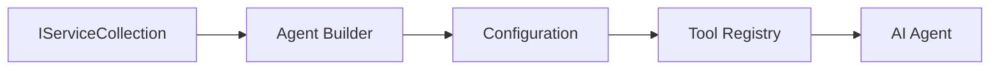

<!--
CO_OP_TRANSLATOR_METADATA:
{
  "original_hash": "bcc874e190347bd6a095aed56dc16de8",
  "translation_date": "2025-11-13T14:11:01+00:00",
  "source_file": "03-agentic-design-patterns/code_samples/03-dotnet-agent-framework.md",
  "language_code": "bg"
}
-->
# 🎨 Агентски дизайнерски модели с GitHub модели (.NET)

## 📋 Учебни цели

Този пример демонстрира корпоративни дизайнерски модели за изграждане на интелигентни агенти, използвайки Microsoft Agent Framework в .NET с интеграция на GitHub модели. Ще научите професионални модели и архитектурни подходи, които правят агентите готови за производство, поддържани и мащабируеми.

### Корпоративни дизайнерски модели

- 🏭 **Фабричен модел**: Стандартизирано създаване на агенти с внедряване на зависимости
- 🔧 **Модел на строител**: Гъвкава конфигурация и настройка на агенти
- 🧵 **Модели за безопасност на нишките**: Управление на паралелни разговори
- 📋 **Модел на хранилище**: Организирано управление на инструменти и възможности

## 🎯 Архитектурни предимства на .NET

### Корпоративни функции

- **Силно типизиране**: Валидация по време на компилация и поддръжка на IntelliSense
- **Внедряване на зависимости**: Вградена интеграция на DI контейнер
- **Управление на конфигурацията**: Модели IConfiguration и Options
- **Async/Await**: Първокласна поддръжка за асинхронно програмиране

### Модели, готови за производство

- **Интеграция на логване**: Поддръжка на ILogger и структурирано логване
- **Проверки на здравето**: Вградени инструменти за мониторинг и диагностика
- **Валидация на конфигурацията**: Силно типизиране с анотации на данни
- **Управление на грешки**: Структурирано управление на изключения

## 🔧 Техническа архитектура

### Основни компоненти на .NET

- **Microsoft.Extensions.AI**: Унифицирани абстракции за AI услуги
- **Microsoft.Agents.AI**: Корпоративна рамка за оркестрация на агенти
- **Интеграция на GitHub модели**: Високопроизводителни API клиентски модели
- **Система за конфигурация**: Интеграция на appsettings.json и среда

### Имплементация на дизайнерски модели



## 🏗️ Демонстрирани корпоративни модели

### 1. **Създаващи модели**

- **Фабрика за агенти**: Централизирано създаване на агенти с последователна конфигурация
- **Модел на строител**: Гъвкав API за сложна конфигурация на агенти
- **Модел на сингълтън**: Управление на споделени ресурси и конфигурация
- **Внедряване на зависимости**: Слабо свързване и възможност за тестване

### 2. **Поведенчески модели**

- **Модел на стратегия**: Заменяеми стратегии за изпълнение на инструменти
- **Модел на команда**: Инкапсулирани операции на агента с undo/redo
- **Модел на наблюдател**: Управление на жизнения цикъл на агента, базирано на събития
- **Модел на шаблонен метод**: Стандартизирани работни потоци за изпълнение на агенти

### 3. **Структурни модели**

- **Модел на адаптер**: Слой за интеграция на GitHub Models API
- **Модел на декоратор**: Подобряване на възможностите на агента
- **Модел на фасада**: Опростени интерфейси за взаимодействие с агента
- **Модел на прокси**: Отложено зареждане и кеширане за производителност

## 📚 Дизайнерски принципи на .NET

### SOLID принципи

- **Единична отговорност**: Всеки компонент има една ясна цел
- **Отворен/Затворен**: Разширяемост без модификация
- **Заместимост на Лисков**: Имплементации на инструменти, базирани на интерфейси
- **Разделяне на интерфейси**: Фокусирани, кохерентни интерфейси
- **Инверсия на зависимости**: Зависимост от абстракции, а не от конкретни реализации

### Чиста архитектура

- **Слой на домейна**: Основни абстракции за агенти и инструменти
- **Слой на приложението**: Оркестрация и работни потоци на агенти
- **Слой на инфраструктурата**: Интеграция на GitHub модели и външни услуги
- **Слой на представянето**: Взаимодействие с потребителя и форматиране на отговори

## 🔒 Корпоративни съображения

### Сигурност

- **Управление на идентификационни данни**: Сигурно управление на API ключове с IConfiguration
- **Валидация на входа**: Силно типизиране и валидация с анотации на данни
- **Санитизация на изхода**: Сигурна обработка и филтриране на отговори
- **Аудит логване**: Цялостно проследяване на операции

### Производителност

- **Асинхронни модели**: Неблокиращи I/O операции
- **Пул на връзки**: Ефективно управление на HTTP клиенти
- **Кеширане**: Кеширане на отговори за подобрена производителност
- **Управление на ресурси**: Правилно освобождаване и почистване на ресурси

### Мащабируемост

- **Безопасност на нишките**: Поддръжка за паралелно изпълнение на агенти
- **Пул на ресурси**: Ефективно използване на ресурси
- **Управление на натоварването**: Ограничаване на скоростта и управление на натиск
- **Мониторинг**: Метрики за производителност и проверки на здравето

## 🚀 Производствено внедряване

- **Управление на конфигурацията**: Настройки, специфични за средата
- **Стратегия за логване**: Структурирано логване с корелационни ID-та
- **Управление на грешки**: Глобално управление на изключения с правилно възстановяване
- **Мониторинг**: Application Insights и броячи за производителност
- **Тестване**: Модели за модулни тестове, интеграционни тестове и тестове за натоварване

Готови ли сте да изградите корпоративни интелигентни агенти с .NET? Нека създадем нещо стабилно! 🏢✨

## 🚀 Начало

### Предварителни изисквания

- [.NET 10 SDK](https://dotnet.microsoft.com/download/dotnet/10.0) или по-нова версия
- [Достъп до GitHub Models API токен](https://docs.github.com/github-models/github-models-at-scale/using-your-own-api-keys-in-github-models)

### Необходими променливи на средата

```bash
# zsh/bash
export GH_TOKEN=<your_github_token>
export GH_ENDPOINT=https://models.github.ai/inference
export GH_MODEL_ID=openai/gpt-5-mini
```

```powershell
# PowerShell
$env:GH_TOKEN = "<your_github_token>"
$env:GH_ENDPOINT = "https://models.github.ai/inference"
$env:GH_MODEL_ID = "openai/gpt-5-mini"
```

### Примерен код

За да стартирате примерния код,

```bash
# zsh/bash
chmod +x ./03-dotnet-agent-framework.cs
./03-dotnet-agent-framework.cs
```

Или използвайки dotnet CLI:

```bash
dotnet run ./03-dotnet-agent-framework.cs
```

Вижте [`03-dotnet-agent-framework.cs`](../../../../03-agentic-design-patterns/code_samples/03-dotnet-agent-framework.cs) за пълния код.

```csharp
#!/usr/bin/dotnet run

#:package Microsoft.Extensions.AI@10.*
#:package Microsoft.Agents.AI.OpenAI@1.*-*

using System.ClientModel;
using System.ComponentModel;

using Microsoft.Agents.AI;
using Microsoft.Extensions.AI;

using OpenAI;

// Tool Function: Random Destination Generator
// This static method will be available to the agent as a callable tool
// The [Description] attribute helps the AI understand when to use this function
// This demonstrates how to create custom tools for AI agents
[Description("Provides a random vacation destination.")]
static string GetRandomDestination()
{
    // List of popular vacation destinations around the world
    // The agent will randomly select from these options
    var destinations = new List<string>
    {
        "Paris, France",
        "Tokyo, Japan",
        "New York City, USA",
        "Sydney, Australia",
        "Rome, Italy",
        "Barcelona, Spain",
        "Cape Town, South Africa",
        "Rio de Janeiro, Brazil",
        "Bangkok, Thailand",
        "Vancouver, Canada"
    };

    // Generate random index and return selected destination
    // Uses System.Random for simple random selection
    var random = new Random();
    int index = random.Next(destinations.Count);
    return destinations[index];
}

// Extract configuration from environment variables
// Retrieve the GitHub Models API endpoint, defaults to https://models.github.ai/inference if not specified
// Retrieve the model ID, defaults to openai/gpt-5-mini if not specified
// Retrieve the GitHub token for authentication, throws exception if not specified
var github_endpoint = Environment.GetEnvironmentVariable("GH_ENDPOINT") ?? "https://models.github.ai/inference";
var github_model_id = Environment.GetEnvironmentVariable("GH_MODEL_ID") ?? "openai/gpt-5-mini";
var github_token = Environment.GetEnvironmentVariable("GH_TOKEN") ?? throw new InvalidOperationException("GH_TOKEN is not set.");

// Configure OpenAI Client Options
// Create configuration options to point to GitHub Models endpoint
// This redirects OpenAI client calls to GitHub's model inference service
var openAIOptions = new OpenAIClientOptions()
{
    Endpoint = new Uri(github_endpoint)
};

// Initialize OpenAI Client with GitHub Models Configuration
// Create OpenAI client using GitHub token for authentication
// Configure it to use GitHub Models endpoint instead of OpenAI directly
var openAIClient = new OpenAIClient(new ApiKeyCredential(github_token), openAIOptions);

// Define Agent Identity and Comprehensive Instructions
// Agent name for identification and logging purposes
var AGENT_NAME = "TravelAgent";

// Detailed instructions that define the agent's personality, capabilities, and behavior
// This system prompt shapes how the agent responds and interacts with users
var AGENT_INSTRUCTIONS = """
You are a helpful AI Agent that can help plan vacations for customers.

Important: When users specify a destination, always plan for that location. Only suggest random destinations when the user hasn't specified a preference.

When the conversation begins, introduce yourself with this message:
"Hello! I'm your TravelAgent assistant. I can help plan vacations and suggest interesting destinations for you. Here are some things you can ask me:
1. Plan a day trip to a specific location
2. Suggest a random vacation destination
3. Find destinations with specific features (beaches, mountains, historical sites, etc.)
4. Plan an alternative trip if you don't like my first suggestion

What kind of trip would you like me to help you plan today?"

Always prioritize user preferences. If they mention a specific destination like "Bali" or "Paris," focus your planning on that location rather than suggesting alternatives.
""";

// Create AI Agent with Advanced Travel Planning Capabilities
// Initialize complete agent pipeline: OpenAI client → Chat client → AI agent
// Configure agent with name, detailed instructions, and available tools
// This demonstrates the .NET agent creation pattern with full configuration
AIAgent agent = openAIClient
    .GetChatClient(github_model_id)
    .CreateAIAgent(
        name: AGENT_NAME,
        instructions: AGENT_INSTRUCTIONS,
        tools: [AIFunctionFactory.Create(GetRandomDestination)]
    );

// Create New Conversation Thread for Context Management
// Initialize a new conversation thread to maintain context across multiple interactions
// Threads enable the agent to remember previous exchanges and maintain conversational state
// This is essential for multi-turn conversations and contextual understanding
AgentThread thread = agent.GetNewThread();

// Execute Agent: First Travel Planning Request
// Run the agent with an initial request that will likely trigger the random destination tool
// The agent will analyze the request, use the GetRandomDestination tool, and create an itinerary
// Using the thread parameter maintains conversation context for subsequent interactions
await foreach (var update in agent.RunStreamingAsync("Plan me a day trip", thread))
{
    await Task.Delay(10);
    Console.Write(update);
}

Console.WriteLine();

// Execute Agent: Follow-up Request with Context Awareness
// Demonstrate contextual conversation by referencing the previous response
// The agent remembers the previous destination suggestion and will provide an alternative
// This showcases the power of conversation threads and contextual understanding in .NET agents
await foreach (var update in agent.RunStreamingAsync("I don't like that destination. Plan me another vacation.", thread))
{
    await Task.Delay(10);
    Console.Write(update);
}
```

---

<!-- CO-OP TRANSLATOR DISCLAIMER START -->
**Отказ от отговорност**:  
Този документ е преведен с помощта на AI услуга за превод [Co-op Translator](https://github.com/Azure/co-op-translator). Въпреки че се стремим към точност, моля, имайте предвид, че автоматизираните преводи може да съдържат грешки или неточности. Оригиналният документ на неговия роден език трябва да се счита за авторитетен източник. За критична информация се препоръчва професионален човешки превод. Не носим отговорност за недоразумения или погрешни интерпретации, произтичащи от използването на този превод.
<!-- CO-OP TRANSLATOR DISCLAIMER END -->