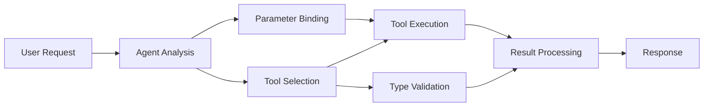

<!--
CO_OP_TRANSLATOR_METADATA:
{
  "original_hash": "91d6061e402489603f2ec8b528cae59b",
  "translation_date": "2025-11-18T18:20:09+00:00",
  "source_file": "04-tool-use/code_samples/04-dotnet-agent-framework.md",
  "language_code": "bg"
}
-->
# 🛠️ Разширено използване на инструменти с GitHub модели (.NET)

## 📋 Цели на обучението

Тази тетрадка демонстрира модели за интеграция на инструменти от корпоративен клас, използвайки Microsoft Agent Framework в .NET с GitHub модели. Ще научите как да изграждате сложни агенти с множество специализирани инструменти, като се възползвате от силната типизация на C# и корпоративните функции на .NET.

### Разширени възможности на инструментите, които ще овладеете

- 🔧 **Архитектура с множество инструменти**: Изграждане на агенти с множество специализирани възможности
- 🎯 **Типово безопасно изпълнение на инструменти**: Използване на проверка по време на компилация в C#
- 📊 **Модели за корпоративни инструменти**: Дизайн на инструменти, готови за производство, и управление на грешки
- 🔗 **Композиция на инструменти**: Комбиниране на инструменти за сложни бизнес процеси

## 🎯 Ползи от архитектурата на инструменти в .NET

### Характеристики на корпоративните инструменти

- **Проверка по време на компилация**: Силната типизация гарантира коректност на параметрите на инструментите
- **Внедряване на зависимости**: Интеграция на IoC контейнер за управление на инструменти
- **Async/Await модели**: Неблокиращо изпълнение на инструменти с правилно управление на ресурсите
- **Структурирано логване**: Вградена интеграция за мониторинг на изпълнението на инструменти

### Модели, готови за производство

- **Управление на изключения**: Комплексно управление на грешки с типизирани изключения
- **Управление на ресурси**: Правилни модели за освобождаване на ресурси и управление на паметта
- **Мониторинг на производителността**: Вградени метрики и броячи за производителност
- **Управление на конфигурацията**: Типово безопасна конфигурация с проверка

## 🔧 Техническа архитектура

### Основни компоненти на инструментите в .NET

- **Microsoft.Extensions.AI**: Унифициран слой за абстракция на инструменти
- **Microsoft.Agents.AI**: Оркестрация на инструменти от корпоративен клас
- **Интеграция с GitHub модели**: Високопроизводителен API клиент с пул за връзки

### Тръбопровод за изпълнение на инструменти



## 🛠️ Категории и модели на инструменти

### 1. **Инструменти за обработка на данни**

- **Валидиране на входни данни**: Силна типизация с анотации на данни
- **Операции за трансформация**: Типово безопасно преобразуване и форматиране на данни
- **Бизнес логика**: Инструменти за специфични за домейна изчисления и анализи
- **Форматиране на изходни данни**: Генериране на структурирани отговори

### 2. **Интеграционни инструменти**

- **API конектори**: Интеграция на RESTful услуги с HttpClient
- **Инструменти за бази данни**: Интеграция на Entity Framework за достъп до данни
- **Операции с файлове**: Сигурни операции с файловата система с валидиране
- **Външни услуги**: Модели за интеграция на услуги от трети страни

### 3. **Помощни инструменти**

- **Обработка на текст**: Утилити за манипулация и форматиране на низове
- **Операции с дата/час**: Изчисления на дата/час, съобразени с културните особености
- **Математически инструменти**: Прецизни изчисления и статистически операции
- **Инструменти за валидиране**: Валидиране на бизнес правила и проверка на данни

Готови ли сте да изградите агенти от корпоративен клас с мощни, типово безопасни възможности за инструменти в .NET? Нека създадем професионални решения! 🏢⚡

## 🚀 Започнете

### Предварителни изисквания

- [.NET 10 SDK](https://dotnet.microsoft.com/download/dotnet/10.0) или по-нова версия
- [GitHub Models API access token](https://docs.github.com/github-models/github-models-at-scale/using-your-own-api-keys-in-github-models)

### Необходими променливи на средата

```bash
# zsh/bash
export GH_TOKEN=<your_github_token>
export GH_ENDPOINT=https://models.github.ai/inference
export GH_MODEL_ID=openai/gpt-5-mini
```

```powershell
# PowerShell
$env:GH_TOKEN = "<your_github_token>"
$env:GH_ENDPOINT = "https://models.github.ai/inference"
$env:GH_MODEL_ID = "openai/gpt-5-mini"
```

### Примерен код

За да изпълните примерния код,

```bash
# zsh/bash
chmod +x ./04-dotnet-agent-framework.cs
./04-dotnet-agent-framework.cs
```

Или използвайки dotnet CLI:

```bash
dotnet run ./04-dotnet-agent-framework.cs
```

Вижте [`04-dotnet-agent-framework.cs`](../../../../04-tool-use/code_samples/04-dotnet-agent-framework.cs) за пълния код.

```csharp
#!/usr/bin/dotnet run

#:package Microsoft.Extensions.AI@10.*
#:package Microsoft.Agents.AI.OpenAI@1.*-*

using System.ClientModel;
using System.ComponentModel;

using Microsoft.Agents.AI;
using Microsoft.Extensions.AI;

using OpenAI;

// Tool Function: Random Destination Generator
// This static method will be available to the agent as a callable tool
// The [Description] attribute helps the AI understand when to use this function
// This demonstrates how to create custom tools for AI agents
[Description("Provides a random vacation destination.")]
static string GetRandomDestination()
{
    // List of popular vacation destinations around the world
    // The agent will randomly select from these options
    var destinations = new List<string>
    {
        "Paris, France",
        "Tokyo, Japan",
        "New York City, USA",
        "Sydney, Australia",
        "Rome, Italy",
        "Barcelona, Spain",
        "Cape Town, South Africa",
        "Rio de Janeiro, Brazil",
        "Bangkok, Thailand",
        "Vancouver, Canada"
    };

    // Generate random index and return selected destination
    // Uses System.Random for simple random selection
    var random = new Random();
    int index = random.Next(destinations.Count);
    return destinations[index];
}

// Extract configuration from environment variables
// Retrieve the GitHub Models API endpoint, defaults to https://models.github.ai/inference if not specified
// Retrieve the model ID, defaults to openai/gpt-5-mini if not specified
// Retrieve the GitHub token for authentication, throws exception if not specified
var github_endpoint = Environment.GetEnvironmentVariable("GH_ENDPOINT") ?? "https://models.github.ai/inference";
var github_model_id = Environment.GetEnvironmentVariable("GH_MODEL_ID") ?? "openai/gpt-5-mini";
var github_token = Environment.GetEnvironmentVariable("GH_TOKEN") ?? throw new InvalidOperationException("GH_TOKEN is not set.");

// Configure OpenAI Client Options
// Create configuration options to point to GitHub Models endpoint
// This redirects OpenAI client calls to GitHub's model inference service
var openAIOptions = new OpenAIClientOptions()
{
    Endpoint = new Uri(github_endpoint)
};

// Initialize OpenAI Client with GitHub Models Configuration
// Create OpenAI client using GitHub token for authentication
// Configure it to use GitHub Models endpoint instead of OpenAI directly
var openAIClient = new OpenAIClient(new ApiKeyCredential(github_token), openAIOptions);

// Define Agent Identity and Comprehensive Instructions
// Agent name for identification and logging purposes
var AGENT_NAME = "TravelAgent";

// Detailed instructions that define the agent's personality, capabilities, and behavior
// This system prompt shapes how the agent responds and interacts with users
var AGENT_INSTRUCTIONS = """
You are a helpful AI Agent that can help plan vacations for customers.

Important: When users specify a destination, always plan for that location. Only suggest random destinations when the user hasn't specified a preference.

When the conversation begins, introduce yourself with this message:
"Hello! I'm your TravelAgent assistant. I can help plan vacations and suggest interesting destinations for you. Here are some things you can ask me:
1. Plan a day trip to a specific location
2. Suggest a random vacation destination
3. Find destinations with specific features (beaches, mountains, historical sites, etc.)
4. Plan an alternative trip if you don't like my first suggestion

What kind of trip would you like me to help you plan today?"

Always prioritize user preferences. If they mention a specific destination like "Bali" or "Paris," focus your planning on that location rather than suggesting alternatives.
""";

// Create AI Agent with Advanced Travel Planning Capabilities
// Initialize complete agent pipeline: OpenAI client → Chat client → AI agent
// Configure agent with name, detailed instructions, and available tools
// This demonstrates the .NET agent creation pattern with full configuration
AIAgent agent = openAIClient
    .GetChatClient(github_model_id)
    .CreateAIAgent(
        name: AGENT_NAME,
        instructions: AGENT_INSTRUCTIONS,
        tools: [AIFunctionFactory.Create(GetRandomDestination)]
    );

// Create New Conversation Thread for Context Management
// Initialize a new conversation thread to maintain context across multiple interactions
// Threads enable the agent to remember previous exchanges and maintain conversational state
// This is essential for multi-turn conversations and contextual understanding
AgentThread thread = agent.GetNewThread();

// Execute Agent: First Travel Planning Request
// Run the agent with an initial request that will likely trigger the random destination tool
// The agent will analyze the request, use the GetRandomDestination tool, and create an itinerary
// Using the thread parameter maintains conversation context for subsequent interactions
await foreach (var update in agent.RunStreamingAsync("Plan me a day trip", thread))
{
    await Task.Delay(10);
    Console.Write(update);
}

Console.WriteLine();

// Execute Agent: Follow-up Request with Context Awareness
// Demonstrate contextual conversation by referencing the previous response
// The agent remembers the previous destination suggestion and will provide an alternative
// This showcases the power of conversation threads and contextual understanding in .NET agents
await foreach (var update in agent.RunStreamingAsync("I don't like that destination. Plan me another vacation.", thread))
{
    await Task.Delay(10);
    Console.Write(update);
}
```

---

<!-- CO-OP TRANSLATOR DISCLAIMER START -->
**Отказ от отговорност**:  
Този документ е преведен с помощта на AI услуга за превод [Co-op Translator](https://github.com/Azure/co-op-translator). Въпреки че се стремим към точност, моля, имайте предвид, че автоматичните преводи може да съдържат грешки или неточности. Оригиналният документ на неговия изходен език трябва да се счита за авторитетен източник. За критична информация се препоръчва професионален човешки превод. Ние не носим отговорност за каквито и да било недоразумения или погрешни интерпретации, произтичащи от използването на този превод.
<!-- CO-OP TRANSLATOR DISCLAIMER END -->