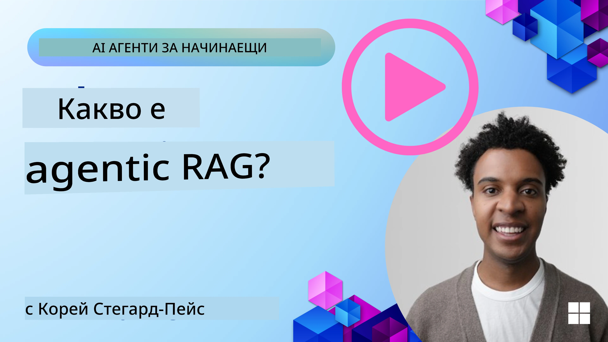
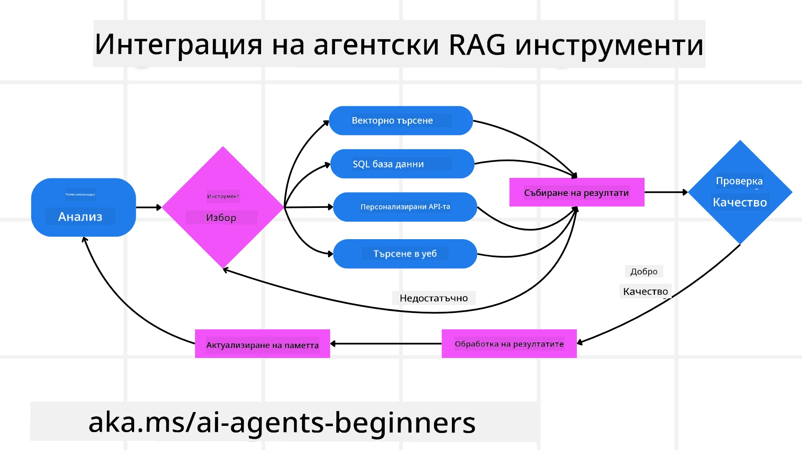
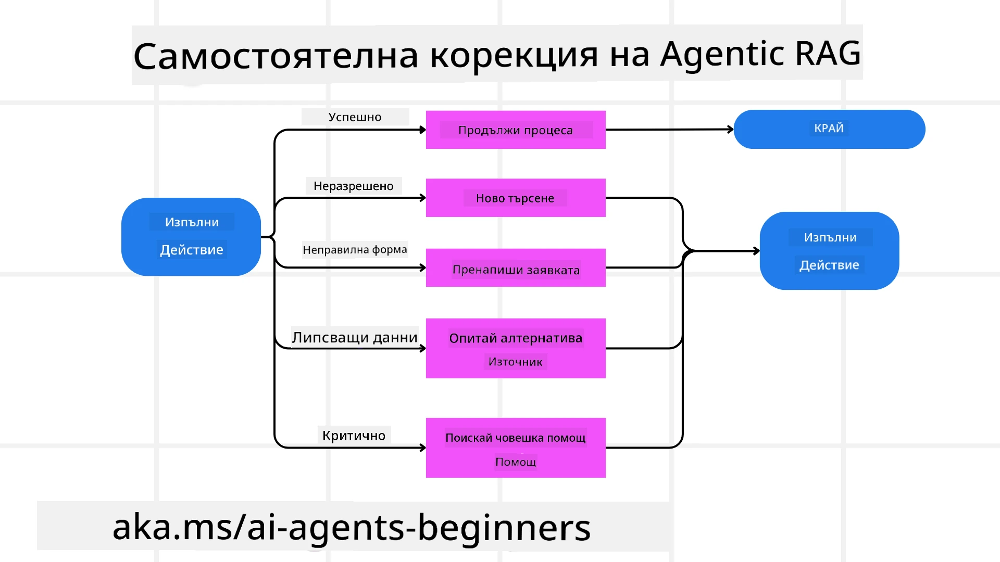

<!--
CO_OP_TRANSLATOR_METADATA:
{
  "original_hash": "0ebf6b2290db55dbf2d10cc49655523b",
  "translation_date": "2025-09-30T07:47:48+00:00",
  "source_file": "05-agentic-rag/README.md",
  "language_code": "bg"
}
-->

> _(Кликнете върху изображението по-горе, за да гледате видеото на този урок)_

# Agentic RAG

Този урок предоставя изчерпателен преглед на Agentic Retrieval-Augmented Generation (Agentic RAG), нововъзникваща парадигма в AI, при която големите езикови модели (LLMs) автономно планират следващите си стъпки, като извличат информация от външни източници. За разлика от статичните модели на извличане и четене, Agentic RAG включва итеративни повиквания към LLM, редуващи се с използване на инструменти или функции и структурирани изходи. Системата оценява резултатите, усъвършенства заявките, извиква допълнителни инструменти, ако е необходимо, и продължава този цикъл, докато не постигне задоволително решение.

## Въведение

Този урок ще обхване:

- **Разбиране на Agentic RAG:** Научете за нововъзникващата парадигма в AI, при която големите езикови модели (LLMs) автономно планират следващите си стъпки, като извличат информация от външни източници на данни.
- **Итеративен стил Maker-Checker:** Разберете цикъла на итеративни повиквания към LLM, редуващи се с използване на инструменти или функции и структурирани изходи, предназначени за подобряване на точността и обработка на неправилни заявки.
- **Практически приложения:** Идентифицирайте сценарии, в които Agentic RAG блести, като среди с приоритет на точността, сложни взаимодействия с бази данни и удължени работни потоци.

## Цели на обучението

След завършване на този урок ще знаете как да/разбирате:

- **Разбиране на Agentic RAG:** Научете за нововъзникващата парадигма в AI, при която големите езикови модели (LLMs) автономно планират следващите си стъпки, като извличат информация от външни източници на данни.
- **Итеративен стил Maker-Checker:** Разберете концепцията за цикъл на итеративни повиквания към LLM, редуващи се с използване на инструменти или функции и структурирани изходи, предназначени за подобряване на точността и обработка на неправилни заявки.
- **Притежаване на процеса на разсъждение:** Разберете способността на системата да притежава процеса си на разсъждение, вземайки решения как да подходи към проблемите, без да разчита на предварително дефинирани пътища.
- **Работен поток:** Разберете как агентният модел независимо решава да извлече доклади за пазарни тенденции, да идентифицира данни за конкуренти, да корелира вътрешни продажбени метрики, да синтезира откритията и да оцени стратегията.
- **Итеративни цикли, интеграция на инструменти и памет:** Научете за зависимостта на системата от модела на взаимодействие в цикъл, поддържайки състояние и памет през стъпките, за да избегне повтарящи се цикли и да взема информирани решения.
- **Обработка на режими на отказ и самокорекция:** Изследвайте устойчивите механизми за самокорекция на системата, включително итерация и повторно запитване, използване на диагностични инструменти и връщане към човешки надзор.
- **Граници на агентността:** Разберете ограниченията на Agentic RAG, съсредоточавайки се върху автономията, специфична за домейна, зависимостта от инфраструктурата и уважението към предпазните мерки.
- **Практически случаи на употреба и стойност:** Идентифицирайте сценарии, в които Agentic RAG блести, като среди с приоритет на точността, сложни взаимодействия с бази данни и удължени работни потоци.
- **Управление, прозрачност и доверие:** Научете за важността на управлението и прозрачността, включително обяснимо разсъждение, контрол на пристрастията и човешки надзор.

## Какво е Agentic RAG?

Agentic Retrieval-Augmented Generation (Agentic RAG) е нововъзникваща парадигма в AI, при която големите езикови модели (LLMs) автономно планират следващите си стъпки, като извличат информация от външни източници. За разлика от статичните модели на извличане и четене, Agentic RAG включва итеративни повиквания към LLM, редуващи се с използване на инструменти или функции и структурирани изходи. Системата оценява резултатите, усъвършенства заявките, извиква допълнителни инструменти, ако е необходимо, и продължава този цикъл, докато не постигне задоволително решение. Този итеративен стил „maker-checker“ подобрява точността, обработва неправилни заявки и гарантира висококачествени резултати.

Системата активно притежава процеса си на разсъждение, пренаписва неуспешни заявки, избира различни методи за извличане и интегрира множество инструменти—като векторно търсене в Azure AI Search, SQL бази данни или персонализирани API—преди да финализира отговора си. Отличителното качество на агентната система е способността й да притежава процеса си на разсъждение. Традиционните реализации на RAG разчитат на предварително дефинирани пътища, но агентната система автономно определя последователността от стъпки въз основа на качеството на информацията, която намира.

## Определение на Agentic Retrieval-Augmented Generation (Agentic RAG)

Agentic Retrieval-Augmented Generation (Agentic RAG) е нововъзникваща парадигма в развитието на AI, при която LLMs не само извличат информация от външни източници на данни, но и автономно планират следващите си стъпки. За разлика от статичните модели на извличане и четене или внимателно скриптирани последователности от подсказки, Agentic RAG включва цикъл от итеративни повиквания към LLM, редуващи се с използване на инструменти или функции и структурирани изходи. На всяка стъпка системата оценява резултатите, които е получила, решава дали да усъвършенства заявките си, извиква допълнителни инструменти, ако е необходимо, и продължава този цикъл, докато постигне задоволително решение.

Този итеративен стил „maker-checker“ е предназначен за подобряване на точността, обработка на неправилни заявки към структурирани бази данни (например NL2SQL) и гарантиране на балансирани, висококачествени резултати. Вместо да разчита единствено на внимателно проектирани вериги от подсказки, системата активно притежава процеса си на разсъждение. Тя може да пренаписва заявки, които се провалят, да избира различни методи за извличане и да интегрира множество инструменти—като векторно търсене в Azure AI Search, SQL бази данни или персонализирани API—преди да финализира отговора си. Това премахва нуждата от прекалено сложни рамки за оркестрация. Вместо това, сравнително прост цикъл от „LLM повикване → използване на инструмент → LLM повикване → …“ може да доведе до сложни и добре обосновани изходи.

## Притежаване на процеса на разсъждение

Отличителното качество, което прави една система „агентна“, е способността й да притежава процеса си на разсъждение. Традиционните реализации на RAG често зависят от предварително дефиниран път, зададен от хората: верига от мисли, която очертава какво да се извлече и кога. Но когато една система е наистина агентна, тя вътрешно решава как да подходи към проблема. Тя не просто изпълнява скрипт; тя автономно определя последователността от стъпки въз основа на качеството на информацията, която намира. 

Например, ако бъде помолена да създаде стратегия за пускане на продукт, тя не разчита единствено на подсказка, която излага целия процес на изследване и вземане на решения. Вместо това, агентният модел независимо решава да:

1. Извлече текущи доклади за пазарни тенденции, използвайки Bing Web Grounding.
2. Идентифицира подходящи данни за конкуренти, използвайки Azure AI Search.
3. Корелира исторически вътрешни продажбени метрики, използвайки Azure SQL Database.
4. Синтезира откритията в цялостна стратегия, оркестрирана чрез Azure OpenAI Service.
5. Оцени стратегията за пропуски или несъответствия, като подтикне нов кръг от извличане, ако е необходимо.

Всички тези стъпки—усъвършенстване на заявки, избор на източници, итерация, докато моделът е „доволен“ от отговора—се решават от модела, а не предварително скриптирани от човек.

## Итеративни цикли, интеграция на инструменти и памет

Агентната система разчита на модела на взаимодействие в цикъл:

- **Първоначално повикване:** Целта на потребителя (т.е. потребителската подсказка) се представя на LLM.
- **Извикване на инструменти:** Ако моделът идентифицира липсваща информация или неясни инструкции, той избира инструмент или метод за извличане—като заявка към векторна база данни (например Azure AI Search Hybrid search върху частни данни) или структурирано SQL повикване—за да събере повече контекст.
- **Оценка и усъвършенстване:** След преглед на върнатите данни, моделът решава дали информацията е достатъчна. Ако не, той усъвършенства заявката, опитва различен инструмент или коригира подхода си.
- **Повторение до удовлетворение:** Този цикъл продължава, докато моделът определи, че има достатъчно яснота и доказателства, за да предостави окончателен, добре обоснован отговор.
- **Памет и състояние:** Тъй като системата поддържа състояние и памет през стъпките, тя може да си припомни предишни опити и техните резултати, избягвайки повтарящи се цикли и вземайки по-информирани решения, докато напредва.

С течение на времето това създава усещане за развиващо се разбиране, позволявайки на модела да навигира сложни, многостъпкови задачи, без да изисква човек постоянно да се намесва или променя подсказката.

## Обработка на режими на отказ и самокорекция

Автономността на Agentic RAG включва и устойчиви механизми за самокорекция. Когато системата попадне в задънени улици—като извличане на нерелевантни документи или срещане на неправилни заявки—тя може:

- **Итерация и повторно запитване:** Вместо да връща отговори с ниска стойност, моделът опитва нови стратегии за търсене, пренаписва заявки към бази данни или разглежда алтернативни набори от данни.
- **Използване на диагностични инструменти:** Системата може да извика допълнителни функции, предназначени да й помогнат да отстрани грешки в стъпките си на разсъждение или да потвърди точността на извлечените данни. Инструменти като Azure AI Tracing ще бъдат важни за осигуряване на устойчиво наблюдение и мониторинг.
- **Връщане към човешки надзор:** За сценарии с висок риск или многократни провали моделът може да маркира несигурност и да поиска човешко ръководство. След като човек предостави корективна обратна връзка, моделът може да включи този урок занапред.

Този итеративен и динамичен подход позволява на модела да се подобрява непрекъснато, гарантирайки, че той не е просто система за еднократна употреба, а такава, която се учи от грешките си по време на дадена сесия.

## Граници на агентността

Въпреки автономността си в рамките на дадена задача, Agentic RAG не е аналог на изкуствения общ интелект. Неговите „агентни“ способности са ограничени до инструментите, източниците на данни и политиките, предоставени от човешките разработчици. Той не може да изобретява свои собствени инструменти или да излиза извън зададените граници на домейна. Вместо това, той превъзхожда в динамично оркестриране на наличните ресурси.

Основни разлики от по-напреднали форми на AI включват:

1. **Автономия, специфична за домейна:** Системите Agentic RAG са фокусирани върху постигането на цели, зададени от потребителя, в известен домейн, използвайки стратегии като пренаписване на заявки или избор на инструменти за подобряване на резултатите.
2. **Зависимост от инфраструктурата:** Способностите на системата зависят от инструментите и данните, интегрирани от разработчиците. Тя не може да надхвърли тези граници без човешка намеса.
3. **Уважение към предпазните мерки:** Етичните насоки, правилата за съответствие и бизнес политиките остават много важни. Свободата на агента винаги е ограничена от мерки за безопасност и механизми за надзор (надяваме се).

## Практически случаи на употреба и стойност

Agentic RAG блести в сценарии, изискващи итеративно усъвършенстване и прецизност:

1. **Среди с приоритет на точността:** При проверки за съответствие, регулаторен анализ или правни изследвания, агентният модел може многократно да проверява факти, да консултира множество източници и да пренаписва заявки, докато произведе добре проверен отговор.
2. **Сложни взаимодействия с бази данни:** При работа със структурирани данни, където заявките често могат да се провалят или да изискват корекция, системата може автономно да усъвършенства заявките си, използвайки Azure SQL или Microsoft Fabric OneLake, гарантирайки, че окончателното извличане съответства на намерението на потребителя.
3. **Удължени работни потоци:** По-дълги сесии могат да се развиват, докато се появява нова информация. Agentic RAG може непрекъснато да включва нови данни, променяйки стратегии, докато научава повече за пространството на проблема.

## Управление, прозрачност и доверие

С развитието на тези системи към по-голяма автономност в разсъжденията, управлението и прозрачността са от решаващо значение:

- **Обяснимо разсъждение:** Моделът може да предостави одитна следа на направените заявки, консултираните източници и стъпките на разсъждение, които е предприел, за да достигне до заключението си. Инструменти като Azure AI Content Safety и Azure AI Tracing / GenAIOps могат да помогнат за поддържане на прозрачност и смекчаване на рисковете.
- **Контрол на пристрастията и балансирано извличане:** Разработчиците могат да настройват стратегии за извличане, за да гарантират, че се разглеждат балансирани, представителни източници на данни, и редовно да одитират изходите, за да откриват пристрастия или изкривени модели, използвайки персонализирани модели за напреднали организации за данни с Azure Machine Learning.
- **Човешки надзор и съответствие:** За чувствителни задачи човешкият пр
- <a href="https://ragaboutit.com/agentic-rag-a-complete-guide-to-agent-based-retrieval-augmented-generation/" target="_blank">Agentic RAG: Пълно ръководство за базирано на агенти извличане с допълнено генериране – Новини от поколението RAG</a>
- <a href="https://huggingface.co/learn/cookbook/agent_rag" target="_blank">Agentic RAG: ускорете вашия RAG с преформулиране на заявки и самостоятелно запитване! Hugging Face Open-Source AI Cookbook</a>
- <a href="https://youtu.be/aQ4yQXeB1Ss?si=2HUqBzHoeB5tR04U" target="_blank">Добавяне на агентски слоеве към RAG</a>
- <a href="https://www.youtube.com/watch?v=zeAyuLc_f3Q&t=244s" target="_blank">Бъдещето на асистентите за знания: Джери Лиу</a>
- <a href="https://www.youtube.com/watch?v=AOSjiXP1jmQ" target="_blank">Как да изградим системи за Agentic RAG</a>
- <a href="https://ignite.microsoft.com/sessions/BRK102?source=sessions" target="_blank">Използване на Azure AI Foundry Agent Service за мащабиране на вашите AI агенти</a>

### Академични статии

- <a href="https://arxiv.org/abs/2303.17651" target="_blank">2303.17651 Self-Refine: Итеративно усъвършенстване със самостоятелна обратна връзка</a>
- <a href="https://arxiv.org/abs/2303.11366" target="_blank">2303.11366 Reflexion: Езикови агенти с вербално обучение чрез подсилване</a>
- <a href="https://arxiv.org/abs/2305.11738" target="_blank">2305.11738 CRITIC: Големите езикови модели могат да се самокоригират чрез интерактивно критикуване с инструменти</a>
- <a href="https://arxiv.org/abs/2501.09136" target="_blank">2501.09136 Agentic Retrieval-Augmented Generation: Преглед на Agentic RAG</a>

## Предишен урок

[Модел за използване на инструменти](../04-tool-use/README.md)

## Следващ урок

[Изграждане на надеждни AI агенти](../06-building-trustworthy-agents/README.md)

---

**Отказ от отговорност**:  
Този документ е преведен с помощта на AI услуга за превод [Co-op Translator](https://github.com/Azure/co-op-translator). Въпреки че се стремим към точност, моля, имайте предвид, че автоматизираните преводи може да съдържат грешки или неточности. Оригиналният документ на неговия роден език трябва да се счита за авторитетен източник. За критична информация се препоръчва професионален човешки превод. Ние не носим отговорност за никакви недоразумения или погрешни интерпретации, произтичащи от използването на този превод.