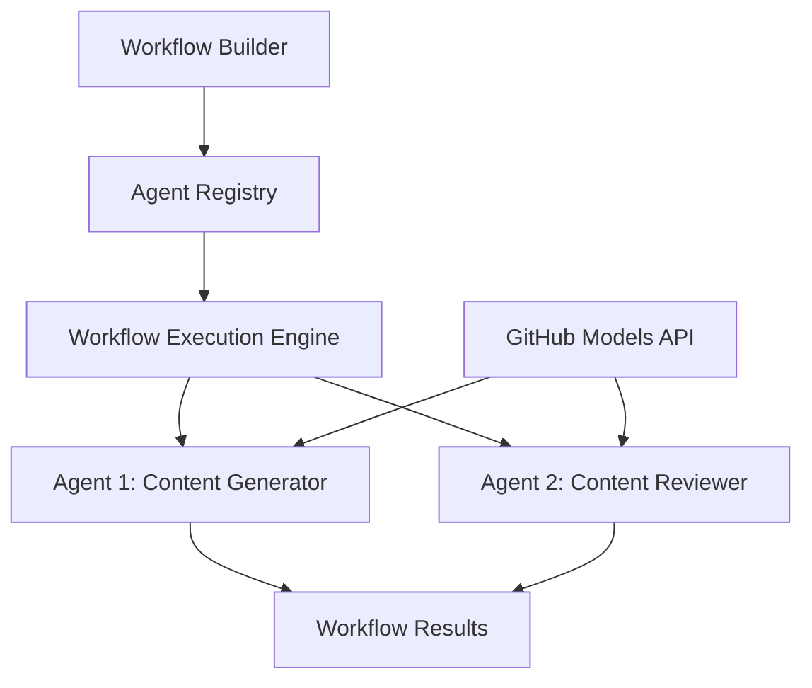

<!--
CO_OP_TRANSLATOR_METADATA:
{
  "original_hash": "034158688d0a45aae06dcbb21b0da5ae",
  "translation_date": "2025-11-11T12:58:41+00:00",
  "source_file": "08-multi-agent/code_samples/workflows-agent-framework/dotNET/01.dotnet-agent-framework-workflow-ghmodel-basic.md",
  "language_code": "bg"
}
-->
# 🔄 Основни работни процеси с GitHub модели (.NET)

## 📋 Урок за оркестрация на работни процеси

Тази тетрадка демонстрира как да изградите сложни **работни процеси с агенти**, използвайки Microsoft Agent Framework за .NET и GitHub модели. Ще научите как да създавате многоетапни бизнес процеси, при които AI агенти си сътрудничат за изпълнение на сложни задачи чрез структурирани модели за оркестрация.

## 🎯 Цели на обучението

### 🏗️ **Основи на архитектурата на работните процеси**
- **Създател на работни процеси**: Проектиране и оркестрация на сложни многоетапни AI процеси
- **Координация на агенти**: Координиране на множество специализирани агенти в рамките на работни процеси
- **Интеграция с GitHub модели**: Използване на услугата за извеждане на AI модели на GitHub в работни процеси
- **Визуален дизайн на работни процеси**: Създаване и визуализиране на структури на работни процеси за по-добро разбиране

### 🔄 **Модели за оркестрация на процеси**
- **Последователна обработка**: Свързване на множество задачи на агенти в логичен ред
- **Управление на състоянието**: Поддържане на контекст и поток от данни между етапите на работния процес
- **Управление на грешки**: Внедряване на надеждно възстановяване от грешки и устойчивост на работния процес
- **Оптимизация на производителността**: Проектиране на ефективни работни процеси за операции в мащаб на предприятието

### 🏢 **Приложения на работни процеси в предприятия**
- **Автоматизация на бизнес процеси**: Автоматизиране на сложни организационни работни процеси
- **Производствена линия за съдържание**: Редакционни работни процеси с етапи на преглед и одобрение
- **Автоматизация на обслужването на клиенти**: Многоетапно разрешаване на клиентски запитвания
- **Работни процеси за обработка на данни**: ETL работни процеси с AI-задвижвана трансформация

## ⚙️ Предварителни условия и настройка

### 📦 **Необходими NuGet пакети**

Тази демонстрация на работен процес използва няколко ключови .NET пакета:

```xml
<!-- Core AI Framework -->
<PackageReference Include="Microsoft.Extensions.AI" Version="9.9.0" />

<!-- Agent Framework (Local Development) -->
<!-- Microsoft.Agents.AI.dll - Core agent abstractions -->
<!-- Microsoft.Agents.AI.OpenAI.dll - OpenAI/GitHub Models integration -->

<!-- Configuration and Environment -->
<PackageReference Include="DotNetEnv" Version="3.1.1" />
```

### 🔑 **Конфигурация на GitHub модели**

**Настройка на средата (.env файл):**
```env
GITHUB_TOKEN=your_github_personal_access_token
GITHUB_ENDPOINT=https://models.inference.ai.azure.com
GITHUB_MODEL_ID=gpt-4o-mini
```

**Достъп до GitHub модели:**
1. Регистрирайте се за GitHub модели (в момента в предварителен преглед)
2. Генерирайте персонален токен за достъп с разрешения за достъп до модели
3. Конфигурирайте променливите на средата, както е показано по-горе

### 🏗️ **Преглед на архитектурата на работния процес**



**Основни компоненти:**
- **WorkflowBuilder**: Основен двигател за оркестрация за проектиране на работни процеси
- **AIAgent**: Индивидуални специализирани агенти с конкретни способности
- **GitHub Models Client**: Интеграция на услугата за извеждане на AI модели
- **Execution Context**: Управлява състоянието и потока от данни между етапите на работния процес

## 🎨 **Модели за дизайн на работни процеси в предприятия**

### 📝 **Работен процес за производство на съдържание**
```
User Request → Content Generation → Quality Review → Final Output
```

### 🔍 **Линия за обработка на документи**
```
Document Input → Analysis → Extraction → Validation → Structured Output
```

### 💼 **Работен процес за бизнес интелигентност**
```
Data Collection → Processing → Analysis → Report Generation → Distribution
```

### 🤝 **Автоматизация на обслужването на клиенти**
```
Customer Inquiry → Classification → Processing → Response Generation → Follow-up
```

## 🏢 **Предимства за предприятията**

### 🎯 **Надеждност и мащабируемост**
- **Детерминирано изпълнение**: Последователни, повторяеми резултати от работния процес
- **Възстановяване от грешки**: Гъвкаво управление на неуспехи на всеки етап от работния процес
- **Мониторинг на производителността**: Проследяване на метрики за изпълнение и възможности за оптимизация
- **Управление на ресурси**: Ефективно разпределение и използване на ресурси на AI модели

### 🔒 **Сигурност и съответствие**
- **Сигурна автентикация**: Автентикация чрез токен на GitHub за достъп до API
- **Одитни следи**: Пълно регистриране на изпълнението на работния процес и точки на вземане на решения
- **Контрол на достъпа**: Гранулирани разрешения за изпълнение и мониторинг на работния процес
- **Поверителност на данните**: Сигурно управление на чувствителна информация в рамките на работните процеси

### 📊 **Наблюдаемост и управление**
- **Визуален дизайн на работни процеси**: Ясно представяне на потоци и зависимости на процесите
- **Мониторинг на изпълнението**: Проследяване в реално време на напредъка и производителността на работния процес
- **Отчитане на грешки**: Подробен анализ на грешки и възможности за отстраняване
- **Анализ на производителността**: Метрики за оптимизация и планиране на капацитета

Да изградим вашия първи AI работен процес, готов за предприятия! 🚀

## 💻 Изпълнение на кода

Пълната имплементация е налична в `01.dotnet-agent-framework-workflow-ghmodel-basic.cs`. Този файл демонстрира:

1. **Конфигурация на средата** - Зареждане на идентификационни данни за GitHub модели от `.env` файл
2. **Настройка на OpenAI клиент** - Конфигуриране на клиента за използване на GitHub Models endpoint
3. **Създаване на агенти** - Дефиниране на специализирани агенти (Front Desk и Concierge)
4. **Създател на работни процеси** - Създаване на многоагентен работен процес с последователна обработка
5. **Изпълнение на работния процес** - Изпълнение на работния процес с поточни резултати

### 🚀 Изпълнение на примера

```bash
# Make the script executable (Unix/Linux/macOS)
chmod +x 01.dotnet-agent-framework-workflow-ghmodel-basic.cs

# Run the workflow
./01.dotnet-agent-framework-workflow-ghmodel-basic.cs
```

Или на Windows:
```powershell
dotnet run 01.dotnet-agent-framework-workflow-ghmodel-basic.cs
```

### 📝 Очакван резултат

Работният процес ще:
1. Приеме вашето запитване за пътуване ("Искам да отида в Париж")
2. Агента Front Desk предоставя първоначална препоръка
3. Агента Concierge преглежда и усъвършенства препоръката
4. Крайният резултат показва пълния поток от разговори

### 🔧 Персонализация

Можете да персонализирате работния процес чрез:
- Промяна на инструкциите на агентите за промяна на тяхното поведение
- Добавяне на повече агенти за създаване на сложни многоетапни работни процеси
- Промяна на съобщението на потребителя за тестване на различни сценарии
- Настройка на връзките в работния процес за създаване на различни модели на изпълнение

---

<!-- CO-OP TRANSLATOR DISCLAIMER START -->
**Отказ от отговорност**:  
Този документ е преведен с помощта на AI услуга за превод [Co-op Translator](https://github.com/Azure/co-op-translator). Въпреки че се стремим към точност, моля, имайте предвид, че автоматизираните преводи може да съдържат грешки или неточности. Оригиналният документ на неговия роден език трябва да се счита за авторитетен източник. За критична информация се препоръчва професионален човешки превод. Не носим отговорност за недоразумения или погрешни интерпретации, произтичащи от използването на този превод.
<!-- CO-OP TRANSLATOR DISCLAIMER END -->