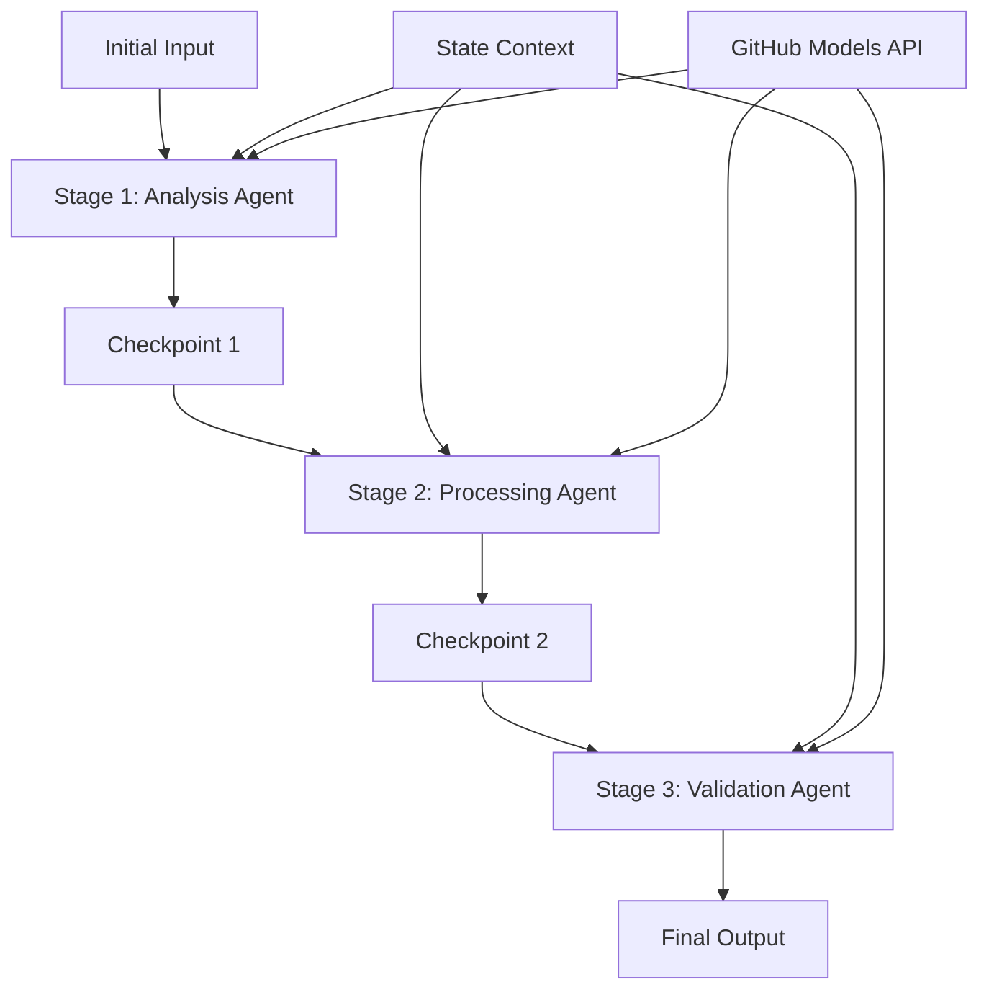

<!--
CO_OP_TRANSLATOR_METADATA:
{
  "original_hash": "1be9c8dcbd79a02d33d2c138684c1394",
  "translation_date": "2025-11-11T14:03:48+00:00",
  "source_file": "08-multi-agent/code_samples/workflows-agent-framework/dotNET/02.dotnet-agent-framework-workflow-ghmodel-sequential.md",
  "language_code": "bg"
}
-->
# ⏩ Последователни работни потоци с GitHub модели (.NET)

## 📋 Напреднал урок за последователна обработка

Тази тетрадка демонстрира **модели на последователни работни потоци** с помощта на Microsoft Agent Framework за .NET и GitHub модели. Ще научите как да изграждате сложни, стъпка по стъпка обработващи потоци, където агентите се изпълняват в определен ред, като всяка стъпка се основава на резултатите от предходната.

## 🎯 Цели на обучението

### 🔄 **Архитектура на последователна обработка**
- **Дизайн на линейни работни потоци**: Създаване на стъпка по стъпка обработващи потоци с ясни зависимости
- **Управление на състоянието**: Поддържане на контекст и поток от данни през етапите на последователния работен процес
- **Интеграция с GitHub модели**: Използване на AI моделите на GitHub в многоетапни .NET работни потоци
- **Модели за корпоративни потоци**: Изграждане на готови за производство системи за последователна обработка

### 🏗️ **Напреднали последователни модели**
- **Етапна обработка**: Реализиране на контролни точки за валидиране между етапите на работния процес
- **Запазване на контекста**: Поддържане на състояние и натрупани знания през всички етапи
- **Разпространение на грешки**: Управление на неуспехи по елегантен начин в последователни вериги за обработка
- **Оптимизация на производителността**: Ефективно последователно изпълнение с минимални разходи

### 🏢 **Корпоративни приложения за последователна обработка**
- **Поток за обработка на документи**: Многоетапен анализ, трансформация и валидиране на документи
- **Работни потоци за осигуряване на качество**: Последователен преглед, валидиране и процеси на одобрение
- **Поток за създаване на съдържание**: Изследване → Писане → Редактиране → Преглед → Публикуване
- **Автоматизация на бизнес процеси**: Многоетапни бизнес потоци с ясни зависимости между етапите

## ⚙️ Предварителни условия и настройка

### 📦 **Необходими NuGet пакети**

Основни пакети за .NET последователни работни потоци:

```xml
<!-- Core AI Framework -->
<PackageReference Include="Microsoft.Extensions.AI" Version="9.9.0" />

<!-- Client Model Abstractions -->
<PackageReference Include="System.ClientModel" Version="1.6.1.0" />

<!-- Azure Identity and Async LINQ Support -->
<PackageReference Include="Azure.Identity" Version="1.15.0" />
<PackageReference Include="System.Linq.Async" Version="6.0.3" />

<!-- Local Agent Framework References -->
<!-- Microsoft.Agents.AI.dll - Core agent abstractions -->
<!-- Microsoft.Agents.AI.OpenAI.dll - GitHub Models integration -->
```

### 🔑 **Конфигурация на GitHub модели**

**Настройка на средата (.env файл):**
```env
GITHUB_TOKEN=your_github_personal_access_token
GITHUB_ENDPOINT=https://models.inference.ai.azure.com
GITHUB_MODEL_ID=gpt-4o-mini
```

**Управление на конфигурацията:**
```csharp
// Load environment variables securely
Env.Load("../../../.env");
var githubToken = Environment.GetEnvironmentVariable("GITHUB_TOKEN");
var githubEndpoint = Environment.GetEnvironmentVariable("GITHUB_ENDPOINT");
var modelId = Environment.GetEnvironmentVariable("GITHUB_MODEL_ID");
```

### 🏗️ **Архитектура на последователния работен процес**



**Основни компоненти:**
- **Последователни агенти**: Специализирани агенти за всеки етап на обработка
- **Контекст на състоянието**: Поддържа натрупани данни и решения през етапите
- **Контролни точки**: Точки за валидиране между етапите за осигуряване на качество и последователност
- **Клиент за GitHub модели**: Консистентен достъп до AI модели през всички етапи на работния процес

## 🎨 **Модели за дизайн на последователни работни потоци**

### 📝 **Поток за обработка на документи**
```
Raw Document → Content Extraction → Analysis → Validation → Structured Output
```

### 🎯 **Работен процес за създаване на съдържание**
```
Brief/Requirements → Research → Content Creation → Review → Final Polish
```

### 🔍 **Поток за осигуряване на качество**
```
Initial Review → Technical Validation → Compliance Check → Final Approval
```

### 💼 **Работен процес за бизнес интелигентност**
```
Data Collection → Processing → Analysis → Report Generation → Distribution
```

## 🏢 **Предимства на корпоративната последователност**

### 🎯 **Надеждност и качество**
- **Детерминирана обработка**: Консистентни, повторяеми резултати чрез структурирани етапи
- **Контролни точки за качество**: Валидиращи точки осигуряват качество на всеки етап
- **Изолация на грешки**: Проблемите в един етап не се разпространяват към следващите
- **Одитни следи**: Пълно проследяване на решенията и трансформациите на всеки етап

### 📈 **Мащабируемост и производителност**
- **Модулен дизайн**: Всеки етап може да бъде оптимизиран независимо
- **Управление на ресурсите**: Ефективно разпределение на ресурсите на AI модела през етапите
- **Оптимизация на състоянието**: Минимален трансфер на състояние между етапите за оптимална производителност
- **Паралелни групи етапи**: Множество последователни работни потоци могат да се изпълняват паралелно

### 🔒 **Сигурност и съответствие**
- **Сигурност на ниво етап**: Различни политики за сигурност за различни етапи на обработка
- **Валидиране на данни**: Осигуряване на целостта на данните и съответствие на всяка контролна точка
- **Контрол на достъпа**: Гранулирани разрешения за различни етапи на работния процес
- **Регулаторно съответствие**: Спазване на регулаторни изисквания чрез структурирана обработка

### 📊 **Мониторинг и анализ**
- **Метрики на ниво етап**: Мониторинг на производителността за всеки етап от работния процес
- **Идентифициране на тесни места**: Откриване и оптимизация на бавни етапи
- **Метрики за качество**: Проследяване на качеството и успеха на всеки етап
- **Оптимизация на процеса**: Непрекъснато подобрение въз основа на анализ на ниво етап

Да изградим надеждни последователни AI потоци за обработка! 🚀

## 💻 Изпълнение на кода

Пълната реализация е налична в `02.dotnet-agent-framework-workflow-ghmodel-sequential.cs`. Този файл демонстрира **триетапен работен процес за анализ на мебели**:

1. **Етап 1 - Агент за продажби**: Анализира изображения на мебели и предоставя предложения за покупка
2. **Етап 2 - Агент за цени**: Осигурява подробни разбивки на цените и бюджетни опции
3. **Етап 3 - Агент за оферти**: Генерира професионален документ с оферта във формат Markdown

### 🏗️ **Архитектура на работния процес**

```
Image Input → Sales Analysis → Price Estimation → Quote Generation → Final Output
```

Всеки агент:
- Получава изхода от предходния етап като контекст
- Надгражда предишния анализ със специализирана експертиза
- Поддържа непрекъснатост на работния процес чрез управление на състоянието

### 🚀 Изпълнение на примера

**Предварителни условия:**
- Поставете изображение на мебели в `../imgs/home.png` (или актуализирайте променливата `imgPath`)
- Конфигурирайте вашия `.env` файл с идентификационни данни за GitHub модели

```bash
# Make the script executable (Unix/Linux/macOS)
chmod +x 02.dotnet-agent-framework-workflow-ghmodel-sequential.cs

# Run the sequential workflow
./02.dotnet-agent-framework-workflow-ghmodel-sequential.cs
```

Или на Windows:
```powershell
dotnet run 02.dotnet-agent-framework-workflow-ghmodel-sequential.cs
```

### 📝 Очакван резултат

Работният процес ще:
1. **Агент за продажби**: Идентифицира мебелни артикули от изображението и предоставя препоръки
2. **Агент за цени**: Добавя подробен анализ на цените с бюджетни нива и препоръки за пазаруване
3. **Агент за оферти**: Генерира форматиран документ с оферта, синтезирайки цялата информация

Крайният резултат ще бъде изчерпателна, професионална оферта за мебели, базирана на анализ на изображението.

### 🔧 Опции за персонализация

**Модифициране на поведението на агентите:**
```csharp
// Adjust agent instructions to change their focus
const string SalesAgentInstructions = "Your custom instructions...";
```

**Промяна на последователния поток:**
```csharp
// Add or reorder workflow stages
var workflow = new WorkflowBuilder(salesagent)
    .AddEdge(salesagent, priceagent)
    .AddEdge(priceagent, quoteagent)
    .AddEdge(quoteagent, newAgent)  // Add another stage
    .Build();
```

**Използване на различен вход:**
```csharp
// Process text instead of images
ChatMessage userMessage = new ChatMessage(ChatRole.User, [
    new TextContent("Analyze pricing for a modern living room set")
]);
```

### 🎯 Приложения в реалния свят

Този последователен модел е идеален за:
- **Електронна търговия**: Анализ на продукти → Ценообразуване → Генериране на оферти
- **Недвижими имоти**: Анализ на имоти → Оценка → Създаване на обяви
- **Застраховане**: Анализ на искове → Оценка → Генериране на оферти
- **Създаване на съдържание**: Изследване → Писане → Редактиране → Публикуване

### 🔍 Разбиране на потока на състоянието

Всеки агент в последователността получава:
- **Оригинален вход**: Първоначалното съобщение от потребителя (изображение + текст)
- **Изходи от предишни агенти**: Всички предишни отговори на агентите в историята на разговора
- **Натрупан контекст**: Пълно състояние, поддържано през целия работен процес

Това позволява сложна многоетапна обработка, при която всеки агент надгражда върху обширен контекст от всички предишни етапи.

---

<!-- CO-OP TRANSLATOR DISCLAIMER START -->
**Отказ от отговорност**:  
Този документ е преведен с помощта на AI услуга за превод [Co-op Translator](https://github.com/Azure/co-op-translator). Въпреки че се стремим към точност, моля, имайте предвид, че автоматизираните преводи може да съдържат грешки или неточности. Оригиналният документ на неговия роден език трябва да се счита за авторитетен източник. За критична информация се препоръчва професионален човешки превод. Не носим отговорност за недоразумения или погрешни интерпретации, произтичащи от използването на този превод.
<!-- CO-OP TRANSLATOR DISCLAIMER END -->