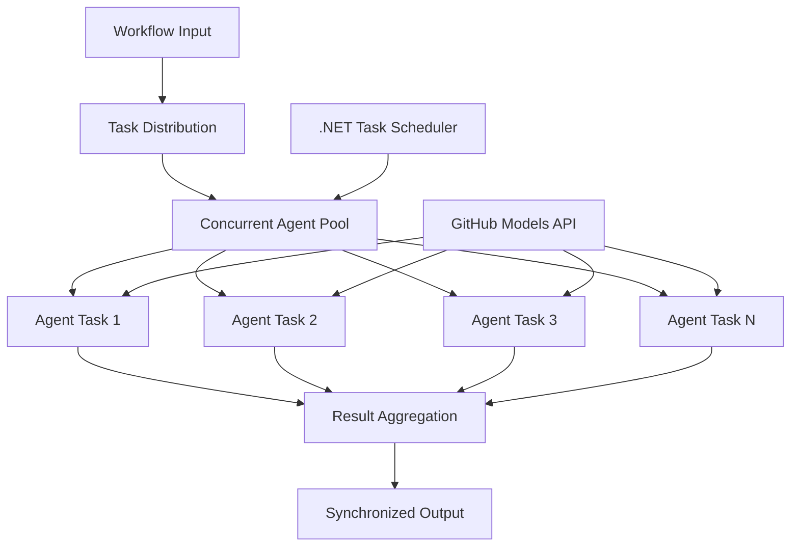

<!--
CO_OP_TRANSLATOR_METADATA:
{
  "original_hash": "b9c6e32c9b5f2fed20b6916984440d88",
  "translation_date": "2025-11-11T13:31:25+00:00",
  "source_file": "08-multi-agent/code_samples/workflows-agent-framework/dotNET/03.dotnet-agent-framework-workflow-ghmodel-concurrent.md",
  "language_code": "bg"
}
-->
# ⚡ Конкурентни работни потоци с GitHub модели (.NET)

## 📋 Урок за високопроизводителна паралелна обработка

Тази тетрадка демонстрира **модели за конкурентни работни потоци**, използвайки Microsoft Agent Framework за .NET и GitHub модели. Ще научите как да изградите високопроизводителни работни потоци за паралелна обработка, които максимизират производителността чрез едновременно изпълнение на множество AI агенти, като същевременно поддържат координация и консистентност на данните.

## 🎯 Цели на обучението

### 🚀 **Основи на конкурентната обработка**
- **Паралелно изпълнение на агенти**: Стартирайте множество AI агенти едновременно за максимална производителност
- **Модели Async/Await**: Използвайте асинхронния програмен модел на .NET за ефективна конкурентност
- **Интеграция с GitHub модели**: Координирайте множество конкурентни заявки към услугата за извеждане на AI модели на GitHub
- **Управление на ресурси**: Ефективно управление на ресурсите на AI моделите при конкурентни операции

### 🏗️ **Разширена архитектура за конкурентност**
- **Паралелизъм, базиран на задачи**: Използвайте библиотеката за паралелни задачи на .NET за оптимално конкурентно изпълнение
- **Модели за синхронизация**: Координирайте конкурентни агенти, като избягвате състезателни условия
- **Баланс на натоварването**: Разпределете работата ефективно върху наличния капацитет за конкурентна обработка
- **Толерантност към грешки**: Управлявайте откази на отделни агенти, без да спирате целия работен поток

### 🏢 **Конкурентни приложения за предприятия**
- **Обработка на документи с голям обем**: Обработвайте множество документи едновременно
- **Анализ на съдържание в реално време**: Конкурентен анализ на входящи потоци от данни
- **Оптимизация на партидната обработка**: Максимизирайте производителността при обработка на големи обеми данни
- **Мултимодален анализ**: Паралелна обработка на различни типове и формати на съдържание

## ⚙️ Предварителни условия и настройка

### 📦 **Необходими NuGet пакети**

Основни пакети за високопроизводителни конкурентни работни потоци:

```xml
<!-- Core AI Framework with Async Support -->
<PackageReference Include="Microsoft.Extensions.AI" Version="9.9.0" />

<!-- Client Model Abstractions for API Communication -->
<PackageReference Include="System.ClientModel" Version="1.6.1.0" />

<!-- Azure Identity and Async LINQ for Advanced Operations -->
<PackageReference Include="Azure.Identity" Version="1.15.0" />
<PackageReference Include="System.Linq.Async" Version="6.0.3" />

<!-- Local Agent Framework References -->
<!-- Microsoft.Agents.AI.dll - Core agent abstractions with async support -->
<!-- Microsoft.Agents.AI.OpenAI.dll - GitHub Models integration with concurrency -->
```

### 🔑 **Конфигурация на GitHub модели**

**Настройка на средата (.env файл):**
```env
GITHUB_TOKEN=your_github_personal_access_token
GITHUB_ENDPOINT=https://models.inference.ai.azure.com
GITHUB_MODEL_ID=gpt-4o-mini
```

**Съображения за конкурентна обработка:**
```csharp
// Configure for concurrent operations
var clientOptions = new OpenAIClientOptions()
{
    Endpoint = new Uri(githubEndpoint),
    // Configure connection pooling for concurrent requests
    NetworkTimeout = TimeSpan.FromMinutes(5)
};
```

### 🏗️ **Архитектура на конкурентния работен поток**



**Основни компоненти:**
- **Библиотека за паралелни задачи**: Вградена поддръжка на .NET за конкурентни операции
- **Пул от агенти**: Множество инстанции на агенти за паралелна обработка
- **Агрегация на резултати**: Координация и обединяване на резултатите от конкурентни агенти
- **Точки за синхронизация**: Осигуряване на консистентност на данните при конкурентни операции

## 🎨 **Модели за дизайн на конкурентни работни потоци**

### 🔍 **Паралелно изследване и анализ**
```
Research Topic → Concurrent Research Agents → Result Synthesis → Final Report
```

### 📊 **Обработка на данни от множество източници**
```
Data Sources → Parallel Processing Agents → Data Integration → Unified Output
```

### 🎭 **Поток за генериране на съдържание**
```
Content Requirements → Concurrent Content Generators → Quality Review → Final Content
```

### 🔄 **Fan-Out/Fan-In обработка**
```
Single Input → Multiple Concurrent Processors → Result Aggregation → Single Output
```

## 🏢 **Предимства за производителността в предприятията**

### ⚡ **Производителност и мащабируемост**
- **Линейно мащабиране на производителността**: Добавете повече конкурентни агенти за увеличаване на производителността
- **Използване на ресурси**: Максимална ефективност на наличния капацитет на AI моделите
- **Намалено време за обработка**: Значително намаляване на времето чрез паралелно изпълнение
- **Еластично мащабиране**: Динамично регулиране на броя на конкурентните агенти според натоварването

### 🛡️ **Надеждност и устойчивост**
- **Изолация на грешки**: Откази на отделни агенти не влияят на другите конкурентни операции
- **Постепенно влошаване**: Системата продължава да работи с намален капацитет на агенти
- **Възстановяване от грешки**: Автоматични механизми за повторение на неуспешни конкурентни операции
- **Разпределение на натоварването**: Равномерно разпределение на работата между наличните агенти

### 📊 **Мониторинг на производителността**
- **Метрики за конкурентно изпълнение**: Проследяване на производителността на всички паралелни операции
- **Анализ на използването на ресурси**: Мониторинг на CPU, памет и мрежова употреба
- **Анализ на производителността**: Измерване на ефективността, постигната чрез конкурентна обработка
- **Откриване на тесни места**: Идентифициране и разрешаване на ограничения в производителността

### 🔧 **Разработка и операции**
- **Асинхронен програмен модел**: Използвайте зрелите модели async/await на .NET
- **Координация на задачи**: Вградени възможности за управление и координация на задачи
- **Обработка на изключения**: Комплексно управление на грешки при конкурентни операции
- **Поддръжка за дебъгване**: Инструменти за дебъгване в Visual Studio за конкурентни работни потоци

Да изградим високопроизводителни конкурентни AI работни потоци с .NET! 🚀

## 💻 Стартиране на кода

Пълната имплементация е налична в `03.dotnet-agent-framework-workflow-ghmodel-concurrent.cs`. Този файл демонстрира **Fan-Out/Fan-In конкурентен работен поток** за планиране на пътувания:

### 🏗️ **Архитектура на работния поток**

```
User Request → ConcurrentStartExecutor → [Researcher Agent || Planner Agent] → ConcurrentAggregationExecutor → Final Output
```

**Основни компоненти:**

1. **ConcurrentStartExecutor**: Изпраща заявката на потребителя до всички агенти едновременно
2. **Researcher Agent**: Анализира дестинации и атракции паралелно
3. **Planner Agent**: Създава подробни планове за пътуване паралелно
4. **ConcurrentAggregationExecutor**: Събира и обединява резултатите от двата агента

### 🎯 **Fan-Out/Fan-In модел**

Този работен поток демонстрира класическия модел **Fan-Out/Fan-In**:
- **Fan-Out**: Едно входящо съобщение се изпраща до множество агенти едновременно
- **Конкурентна обработка**: Множество агенти работят паралелно върху една и съща задача
- **Fan-In**: Резултатите от всички агенти се събират и обединяват в един изход

### 🚀 Стартиране на примера

```bash
# Make the script executable (Unix/Linux/macOS)
chmod +x 03.dotnet-agent-framework-workflow-ghmodel-concurrent.cs

# Run the concurrent workflow
./03.dotnet-agent-framework-workflow-ghmodel-concurrent.cs
```

Или на Windows:
```powershell
dotnet run 03.dotnet-agent-framework-workflow-ghmodel-concurrent.cs
```

### 📝 Очакван резултат

Работният поток ще:
1. **Изпрати заявка**: Изпрати "Планирай пътуване до Сиатъл през декември" до двата агента
2. **Конкурентна обработка**: Двата агента работят едновременно:
   - Изследователят идентифицира атракции и детайли
   - Планировачът създава маршрут и логистика
3. **Агрегация**: Комбинира двата отговора в цялостен изход
4. **Показване на резултати**: Показва обединения план за пътуване с цялата информация

### 🔧 Опции за персонализация

**Добавяне на повече конкурентни агенти:**
```csharp
// Create additional specialized agents
AIAgent budgetAgent = openAIClient.GetChatClient(github_model_id).CreateAIAgent(
    name: "Budget-Agent", instructions: "Calculate travel costs...");

// Add to fan-out
var workflow = new WorkflowBuilder(startExecutor)
    .AddFanOutEdge(startExecutor, targets: [researcherAgent, plannerAgent, budgetAgent])
    .AddFanInEdge(aggregationExecutor, sources: [researcherAgent, plannerAgent, budgetAgent])
    .WithOutputFrom(aggregationExecutor)
    .Build();

// Update aggregation count
if (this._messages.Count == 3) { ... }
```

**Модифициране на инструкциите за агенти:**
```csharp
const string ResearcherAgentInstructions = "Your custom instructions for research...";
const string PlanAgentInstructions = "Your custom instructions for planning...";
```

**Промяна на задачата:**
```csharp
StreamingRun run = await InProcessExecution.StreamAsync(
    workflow, 
    "Plan a European vacation for 2 weeks in summer"
);
```

### 🎯 Приложения в реалния свят

Този конкурентен модел е идеален за:
- **Създаване на съдържание**: Множество автори, които създават различни секции едновременно
- **Преглед на код**: Множество рецензенти, които анализират кода от различни перспективи
- **Пазарни изследвания**: Паралелен анализ на различни пазарни сегменти
- **Обработка на документи**: Конкурентно извличане, анализ и валидиране
- **Многоперспективен анализ**: Получаване на разнообразни гледни точки върху една и съща входяща информация

### 🔍 Разбиране на персонализирани изпълнители

**ConcurrentStartExecutor:**
- Имплементира `IMessageHandler<string>` за приемане на входящи низове
- Изпраща съобщения до всички свързани агенти
- Изпраща `TurnToken` за задействане на конкурентна обработка

**ConcurrentAggregationExecutor:**
- Имплементира `IMessageHandler<ChatMessage>` за получаване на отговори от агенти
- Събира съобщения по безопасен за нишки начин
- Агрегира, когато всички очаквани отговори пристигнат
- Извежда крайния резултат чрез `context.YieldOutputAsync()`

### ⚡ Предимства за производителността

**Конкурентно срещу последователно:**
- Последователно: Agent1 (30s) → Agent2 (30s) = **60 секунди общо**
- Конкурентно: Agent1 (30s) || Agent2 (30s) = **30 секунди общо**

**Подобрение на производителността**: До N× по-бързо за N конкурентни агенти (в зависимост от натоварването и ресурсите)

### 🛡️ Обработка на грешки

Работният поток обработва откази на отделни агенти безпроблемно:
- Ако един агент се провали, другите продължават обработката
- Агрегаторът може да имплементира логика за таймаут
- Частични резултати могат да бъдат върнати, ако е необходимо

### 📊 Разширени функции

**Динамичен брой агенти:**
Модифицирайте логиката за агрегация, за да поддържа променлив брой агенти:

```csharp
private int _expectedAgentCount;
private readonly List<ChatMessage> _messages = [];

public async ValueTask HandleAsync(ChatMessage message, IWorkflowContext context)
{
    this._messages.Add(message);
    if (this._messages.Count == _expectedAgentCount)
    {
        // Process aggregation
    }
}
```

Този модел за конкурентни работни потоци е от съществено значение за изграждането на високопроизводителни, мащабируеми AI агентни системи!

---

<!-- CO-OP TRANSLATOR DISCLAIMER START -->
**Отказ от отговорност**:  
Този документ е преведен с помощта на AI услуга за превод [Co-op Translator](https://github.com/Azure/co-op-translator). Въпреки че се стремим към точност, моля, имайте предвид, че автоматизираните преводи може да съдържат грешки или неточности. Оригиналният документ на неговия роден език трябва да се счита за авторитетен източник. За критична информация се препоръчва професионален човешки превод. Ние не носим отговорност за каквито и да е недоразумения или погрешни интерпретации, произтичащи от използването на този превод.
<!-- CO-OP TRANSLATOR DISCLAIMER END -->