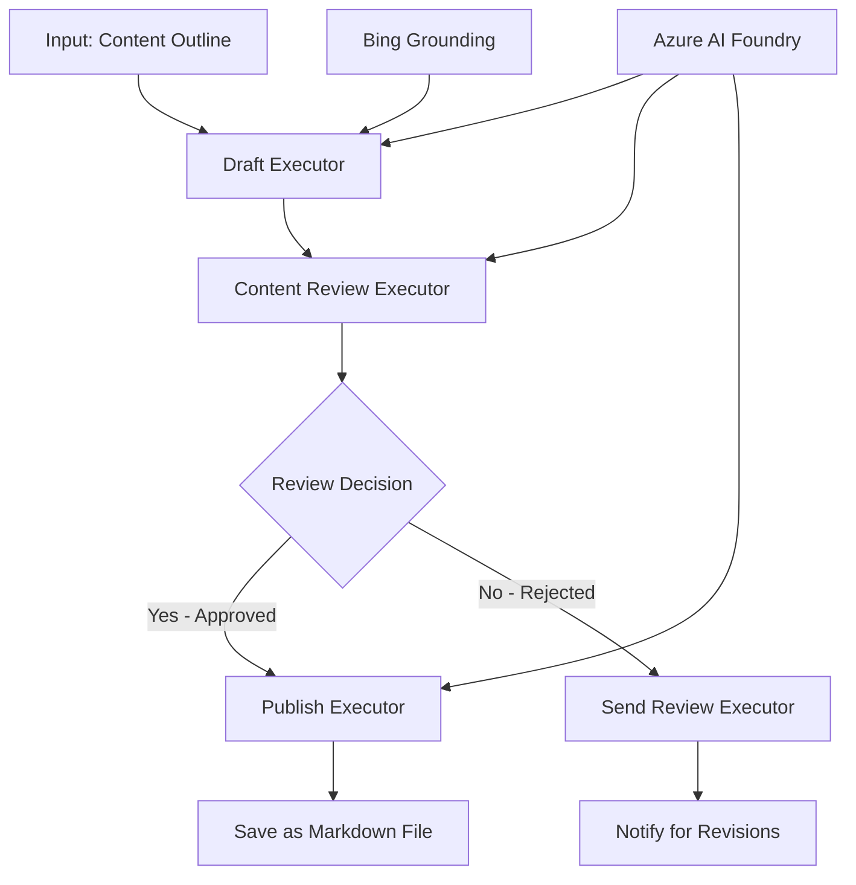

<!--
CO_OP_TRANSLATOR_METADATA:
{
  "original_hash": "8abd335151cee553293b637ee3d80d10",
  "translation_date": "2025-11-11T12:30:17+00:00",
  "source_file": "08-multi-agent/code_samples/workflows-agent-framework/dotNET/04.dotnet-agent-framework-workflow-aifoundry-condition.md",
  "language_code": "bg"
}
-->
# 🔀 Условни работни потоци с Azure AI Foundry (.NET)

## 📋 Урок за интелигентни работни потоци, базирани на решения

Този notebook демонстрира **условни модели на работни потоци**, използвайки Azure AI Foundry и Microsoft Agent Framework за .NET. Ще научите как да изграждате сложни, базирани на решения работни потоци, които интелигентно насочват обработката въз основа на AI анализ, бизнес правила и динамични условия за автоматизация на корпоративно ниво.

## 🎯 Цели на обучението

### 🧠 **Архитектура за интелигентни решения**
- **Реализация на условна логика**: Изграждане на сложни дървета за решения с множество точки на разклонение
- **AI-задвижвано насочване**: Използване на модели на Azure AI Foundry за интелигентни решения за насочване
- **Динамична адаптация на работния поток**: Промяна на поведението на работния поток въз основа на анализ в реално време и условия
- **Интеграция на бизнес правила**: Включване на бизнес логика и изисквания за съответствие в работните потоци

### 🔀 **Разширени условни модели**
- **Вземане на решения по множество критерии**: Оценка на множество фактори за решения за насочване
- **Контекстуално обработване**: Вземане на решения въз основа на натрупания контекст и история на работния поток
- **Адаптивна модификация на работния поток**: Динамично коригиране на пътищата за обработка въз основа на условия в реално време
- **Интеграция на двигатели за правила**: Реализация на сложни двигатели за бизнес правила в работните потоци

### 🏢 **Условни приложения за предприятия**
- **Класификация и насочване на документи**: Автоматично класифициране и насочване на документи към подходящи работни потоци
- **Триаж на клиентско обслужване**: Интелигентно насочване на клиентски запитвания към специализирани екипи за обработка
- **Обработка на съответствие и риск**: Прилагане на различни процеси за валидиране и преглед въз основа на оценка на риска
- **Работни потоци за осигуряване на качество**: Насочване на съдържание през подходящи процеси за преглед въз основа на качествени метрики

## ⚙️ Предварителни условия и настройка

### 📦 **Необходими NuGet пакети**

Разширени пакети за обработка на условни работни потоци:

```xml
<!-- Core AI Framework -->
<PackageReference Include="Microsoft.Extensions.AI" Version="9.9.0" />

<!-- Azure AI Agents with Persistent State -->
<PackageReference Include="Azure.AI.Agents.Persistent" Version="1.2.0-beta.5" />

<!-- Azure Identity and Utilities -->
<PackageReference Include="Azure.Identity" Version="1.15.0" />
<PackageReference Include="System.Linq.Async" Version="6.0.3" />
<PackageReference Include="DotNetEnv" Version="3.1.1" />

<!-- Local Workflow Framework References -->
<!-- Microsoft.Agents.Workflows.dll - Advanced workflow orchestration -->
<!-- Microsoft.Agents.AI.AzureAI.dll - Azure AI Foundry integration -->
<!-- Microsoft.Agents.AI.dll - Core agent abstractions -->
```

### 🔑 **Конфигурация на Azure AI Foundry**

**Необходими ресурси в Azure:**
- Работно пространство на Azure AI Foundry с модели за условна обработка
- Абонамент за Azure с подходящи квоти за изчисления и разрешения
- Разположени AI модели за вземане на решения и анализ на съдържание
- (Опционално) Връзка с Bing Search API за възможности за grounding

**Конфигурация на средата (.env файл):**
```env
# Azure AI Foundry Configuration
AZURE_AI_PROJECT_ENDPOINT=https://your-project.cognitiveservices.azure.com/
BING_CONNECTION_ID=your-bing-connection-id
```

**Настройка на автентикация:**
```csharp
// Azure CLI or Managed Identity authentication
using Azure.Identity;
var credential = new AzureCliCredential();

// Load environment configuration
DotNetEnv.Env.Load("../../../.env");
```

### 🏗️ **Архитектура на условния работен поток**



**Основни компоненти:**
- **Draft Executor**: AI агент, който създава първоначални чернови от контури
- **Content Review Executor**: AI агент, който оценява качеството и съответствието на черновите
- **Conditional Routing**: Логика за решения, която насочва въз основа на резултатите от прегледа
- **Пътища за публикуване/преглед**: Отделни пътища за обработка за одобрено и отхвърлено съдържание
- **Управление на състоянието**: Поддържа контекста на съдържанието и прегледа през целия работен поток

## 🎨 **Модели за дизайн на условни работни потоци**

### 📋 **Производство на съдържание с качествени порти**
```
Outline → Draft Creation → Quality Review → {Approve: Publish | Reject: Revise}
```

### 🎯 **Обработка на документи, базирана на риск**
```
Document → Risk Assessment → {Low: Standard | High: Enhanced Review}
```

### 🔍 **Интелигентно насочване на клиентско обслужване**
```
Customer Query → Analysis → {Simple: FAQ Bot | Complex: Human Agent}
```

### 💼 **Работни потоци, водени от съответствие**
```
Content → Compliance Check → {Pass: Publish | Fail: Legal Review}
```

## 🏢 **Предимства на условните приложения за предприятия**

### 🎯 **Интелигентна автоматизация**
- **Интелигентно вземане на решения**: AI-задвижвани решения за насочване въз основа на анализ на съдържание и контекст
- **Адаптивна обработка**: Работни потоци, които автоматично се адаптират към променящи се условия
- **Прилагане на бизнес правила**: Автоматично приложение на сложна бизнес логика и политики
- **Контекстуално насочване**: Решения, базирани на пълната история на работния поток и натрупания контекст

### 📈 **Оперативно съвършенство**
- **Оптимизирано разпределение на ресурси**: Насочване на работа към най-подходящите специалисти и процеси
- **Намалена ръчна намеса**: Автоматизираното вземане на решения минимизира нуждата от човешко насочване
- **По-бързо време за разрешаване**: Директно насочване към подходяща експертиза и възможности за обработка
- **Последователно приложение**: Унифицирано приложение на бизнес правила и критерии за решения

### 🛡️ **Управление на риска и съответствие**
- **Автоматизирана оценка на риска**: AI-задвижвана оценка на съдържание и нива на риск
- **Прилагане на съответствие**: Автоматично насочване през необходимите регулаторни процеси
- **Приложение на протоколи за сигурност**: Усилени мерки за сигурност, приложени въз основа на оценка на риска
- **Поддържане на одитна следа**: Пълна документация на решенията за насочване и обосновката им

### 📊 **Анализи и непрекъснато подобрение**
- **Анализи на решенията**: Проследяване на ефективността и точността на решенията за насочване
- **Разпознаване на модели**: Идентифициране на тенденции и модели в решенията за насочване с течение на времето
- **Оптимизация на производителността**: Непрекъснато подобрение на критериите за решения и ефективността на насочване
- **Бизнес интелигентност**: Прозрения за характеристиките на съдържанието и изискванията за обработка

### 🔧 **Техническо съвършенство**
- **Управление на устойчиво състояние**: Поддържане на сложни състояния през изпълнението на работния поток
- **Скалируема архитектура**: Обработка на голям обем условни изисквания за обработка
- **Възможности за интеграция**: Безпроблемна интеграция със съществуващи бизнес системи и процеси
- **Мониторинг и наблюдаемост**: Цялостно проследяване на производителността и решенията на работния поток

Да изградим интелигентни, базирани на решения корпоративни работни потоци с .NET! 🚀

## 💻 Изпълнение на кода

Пълната реализация е налична в `04.dotnet-agent-framework-workflow-aifoundry-condition.cs`. Това демонстрира **работен поток за производство на съдържание с качествени порти**:

### 🏗️ **Архитектура на работния поток**

```
Content Outline → Draft Creation → Quality Review → Conditional Routing:
                                                      ├─ Approved (>200 words) → Publish
                                                      └─ Rejected (<200 words) → Review Notification
```

**Агенти в работния поток:**
1. **Evangelist Agent**: Създава чернови на уроци от контури с Bing grounding
2. **Content Reviewer Agent**: Оценява качеството на черновите (брой думи, пълнота)
3. **Publisher Agent**: Запазва одобрено съдържание като Markdown файлове с времеви печат

**Персонализирани изпълнители:**
1. **DraftExecutor**: Организира създаването на чернови
2. **ContentReviewExecutor**: Извършва оценка на качеството
3. **PublishExecutor**: Обработва публикуването на одобрено съдържание
4. **SendReviewExecutor**: Управлява известия за отхвърлено съдържание

### 🚀 Изпълнение на примера

**Предварителни условия:**
- Конфигурирано работно пространство на Azure AI Foundry
- Автентикация чрез Azure CLI (`az login`)
- (Опционално) Връзка с Bing Search за grounding

```bash
# Make the script executable (Unix/Linux/macOS)
chmod +x 04.dotnet-agent-framework-workflow-aifoundry-condition.cs

# Run the conditional workflow
./04.dotnet-agent-framework-workflow-aifoundry-condition.cs
```

Или на Windows:
```powershell
dotnet run 04.dotnet-agent-framework-workflow-aifoundry-condition.cs
```

### 📝 Очакван резултат

Работният поток ще:
1. **Създаде агенти**: Инициализира три специализирани агента на Azure AI Foundry
2. **Генерира чернова**: Evangelist агент създава чернова на урок от контур
3. **Прегледа съдържанието**: Content Reviewer оценява качеството на черновата
4. **Условно насочване**:
   - **Ако е одобрено (>200 думи)**: Publish executor запазва като Markdown файл
   - **Ако е отхвърлено (<200 думи)**: Send review notification
5. **Показва резултати**: Показва крайния резултат от работния поток

### 🔧 Опции за персонализация

**Модифициране на критериите за преглед:**
```csharp
const string ContentReviewerInstructions = @"
You are a content reviewer...
1. Check if content is more than 500 words (instead of 200)
2. Verify technical accuracy
3. Ensure proper formatting
...";
```

**Добавяне на повече условни пътища:**
```csharp
var workflow = new WorkflowBuilder(draftExecutor)
    .AddEdge(draftExecutor, contentReviewerExecutor)
    .AddEdge(contentReviewerExecutor, publishExecutor, condition: GetCondition("Excellent"))
    .AddEdge(contentReviewerExecutor, editExecutor, condition: GetCondition("Good"))
    .AddEdge(contentReviewerExecutor, sendReviewerExecutor, condition: GetCondition("Poor"))
    .Build();
```

**Промяна на изискванията за съдържание:**
```csharp
string OUTLINE_Content = @"
# Your Custom Topic
## Section 1
https://your-reference-url
## Section 2
...
";
```

### 🎯 Приложения в реалния свят

Този модел на условен работен поток е идеален за:
- **Системи за управление на съдържание**: Автоматизирани редакционни работни потоци с качествени порти
- **Обработка на документи**: Насочване на документи въз основа на класификация и съответствие
- **Клиентска поддръжка**: Интелигентно насочване на билети въз основа на сложност и спешност
- **Юридически преглед**: Насочване на договори въз основа на оценка на риска и стойност
- **HR процеси**: Насочване на кандидатури през подходящи процеси за скрининг

### 🔍 Разбиране на условната логика

**Функция за условие:**
```csharp
public Func<object?, bool> GetCondition(string expectedResult) =>
    reviewResult => reviewResult is ReviewResult review && review.Result == expectedResult;
```

Тази функция създава предикат, който:
1. Проверява дали резултатът е от тип `ReviewResult`
2. Сравнява свойството `Result` с очакваната стойност
3. Връща true/false за определяне на насочването

**Ръбове на работния поток с условия:**
```csharp
.AddEdge(contentReviewerExecutor, publishExecutor, condition: GetCondition("Yes"))
.AddEdge(contentReviewerExecutor, sendReviewerExecutor, condition: GetCondition("No"))
```

### 📊 Разширени функции

**Валидиране на JSON схема:**
Работният поток използва JSON схеми за осигуряване на структурирани отговори:

```csharp
// Define response structure
public class ReviewResult
{
    [JsonPropertyName("review_result")]
    public string Result { get; set; } = string.Empty;
    
    [JsonPropertyName("reason")]
    public string Reason { get; set; } = string.Empty;
    
    [JsonPropertyName("draft_content")]
    public string DraftContent { get; set; } = string.Empty;
}

// Apply to agent
ResponseFormat = ChatResponseFormat.ForJsonSchema(
    AIJsonUtilities.CreateJsonSchema(typeof(ReviewResult)), 
    "ReviewResult", 
    "Review Result From DraftContent"
)
```

**Интеграция с Bing Grounding:**
Evangelist агент използва Bing grounding за достъп до информация в реално време:

```csharp
var bingGroundingConfig = new BingGroundingSearchConfiguration(bing_conn_id);
BingGroundingToolDefinition bingGroundingTool = new(
    new BingGroundingSearchToolParameters([bingGroundingConfig])
);
```

Това позволява на агента да следва URL адреси в контура и да извлича актуална информация.

### 🛡️ Обработка на грешки

Работният поток включва надеждна обработка на грешки за отхвърлено съдържание:
- Провалите при преглед задействат алтернативния път
- Известията предоставят ясни причини за отхвърляне
- Съдържанието се запазва за ревизия

### 🔄 Разширяване на работния поток

**Добавяне на цикъл за ревизия:**
Създаване на обратна връзка, която автоматично преработва съдържание:

```csharp
.AddEdge(contentReviewerExecutor, publishExecutor, condition: GetCondition("Yes"))
.AddEdge(contentReviewerExecutor, draftExecutor, condition: GetCondition("No")) // Loop back
```

**Реализация на многостепенен преглед:**
Добавяне на множество етапи на преглед с различни критерии:

```csharp
.AddEdge(draftExecutor, technicalReviewer)
.AddEdge(technicalReviewer, editorialReviewer, condition: GetCondition("TechPass"))
.AddEdge(editorialReviewer, publishExecutor, condition: GetCondition("EditPass"))
```

Този модел на условен работен поток предоставя основата за изграждане на сложни, интелигентни системи за автоматизация на корпоративно ниво! 🚀

---

<!-- CO-OP TRANSLATOR DISCLAIMER START -->
**Отказ от отговорност**:  
Този документ е преведен с помощта на AI услуга за превод [Co-op Translator](https://github.com/Azure/co-op-translator). Въпреки че се стремим към точност, моля, имайте предвид, че автоматизираните преводи може да съдържат грешки или неточности. Оригиналният документ на неговия роден език трябва да се счита за авторитетен източник. За критична информация се препоръчва професионален човешки превод. Не носим отговорност за каквито и да било недоразумения или погрешни интерпретации, произтичащи от използването на този превод.
<!-- CO-OP TRANSLATOR DISCLAIMER END -->