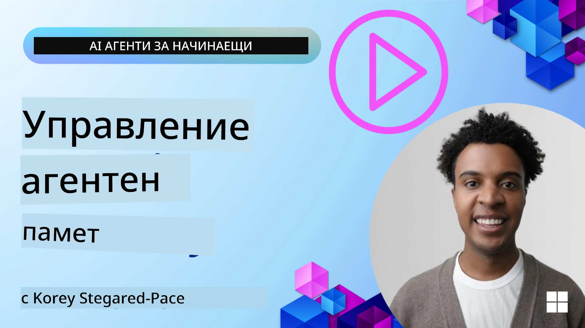

<!--
CO_OP_TRANSLATOR_METADATA:
{
  "original_hash": "a1d90991499ad697c4ad24decaf36968",
  "translation_date": "2025-12-09T12:48:05+00:00",
  "source_file": "13-agent-memory/README.md",
  "language_code": "bg"
}
-->
# Памет за AI агенти 

Когато обсъждаме уникалните предимства на създаването на AI агенти, основно се говори за две неща: способността да използват инструменти за изпълнение на задачи и способността да се подобряват с времето. Паметта е в основата на създаването на самоусъвършенстващи се агенти, които могат да предоставят по-добри преживявания за нашите потребители.

В този урок ще разгледаме какво представлява паметта за AI агенти и как можем да я управляваме и използваме за полза на нашите приложения.

## Въведение

Този урок ще обхване:

• **Разбиране на паметта на AI агенти**: Какво представлява паметта и защо е от съществено значение за агентите.

• **Имплементиране и съхраняване на памет**: Практически методи за добавяне на памет към вашите AI агенти, с фокус върху краткосрочна и дългосрочна памет.

• **Създаване на самоусъвършенстващи се AI агенти**: Как паметта позволява на агентите да се учат от минали взаимодействия и да се подобряват с времето.

## Налични имплементации

Този урок включва два подробни тетрадкови урока:

• **[13-agent-memory.ipynb](./13-agent-memory.ipynb)**: Имплементира памет с Mem0 и Azure AI Search с рамката Semantic Kernel.

• **[13-agent-memory-cognee.ipynb](./13-agent-memory-cognee.ipynb)**: Имплементира структурирана памет с Cognee, автоматично изграждаща граф на знания, подкрепен от ембединг, визуализираща графа и интелигентно извличане.

## Цели на обучението

След завършване на този урок ще знаете как да:

• **Разграничавате различните видове памет на AI агенти**, включително работна, краткосрочна и дългосрочна памет, както и специализирани форми като персонална и епизодична памет.

• **Имплементирате и управлявате краткосрочна и дългосрочна памет за AI агенти** с помощта на рамката Semantic Kernel, използвайки инструменти като Mem0, Cognee, Whiteboard memory и интеграция с Azure AI Search.

• **Разбирате принципите зад самоусъвършенстващите се AI агенти** и как стабилните системи за управление на паметта допринасят за непрекъснато учене и адаптация.

## Разбиране на паметта на AI агенти

В основата си, **паметта за AI агенти се отнася до механизмите, които им позволяват да запазват и извикват информация**. Тази информация може да включва конкретни детайли за разговор, предпочитания на потребителя, минали действия или дори научени модели.

Без памет AI приложенията често са без състояние, което означава, че всяко взаимодействие започва от нулата. Това води до повтарящо се и разочароващо потребителско преживяване, при което агентът "забравя" предишния контекст или предпочитания.

### Защо паметта е важна?

Интелигентността на агента е дълбоко свързана със способността му да извиква и използва минала информация. Паметта позволява на агентите да бъдат:

• **Рефлективни**: Да се учат от минали действия и резултати.

• **Интерактивни**: Да поддържат контекст в рамките на текущ разговор.

• **Проактивни и реактивни**: Да предвиждат нужди или да реагират адекватно въз основа на исторически данни.

• **Автономни**: Да работят по-независимо, използвайки съхранени знания.

Целта на имплементирането на памет е да направи агентите по-**надеждни и способни**.

### Видове памет

#### Работна памет

Мислете за това като за лист хартия, който агентът използва по време на една задача или мисловен процес. Тя съдържа непосредствената информация, необходима за изчисляване на следващата стъпка.

За AI агенти работната памет често улавя най-важната информация от разговор, дори ако пълната история на чата е дълга или съкратена. Тя се фокусира върху извличането на ключови елементи като изисквания, предложения, решения и действия.

**Пример за работна памет**

В агент за резервации на пътувания работната памет може да улови текущото искане на потребителя, като например "Искам да резервирам пътуване до Париж". Това конкретно изискване се задържа в непосредствения контекст на агента, за да насочи текущото взаимодействие.

#### Краткосрочна памет

Този тип памет задържа информация за продължителността на един разговор или сесия. Това е контекстът на текущия чат, който позволява на агента да се позовава на предишни обръщения в диалога.

**Пример за краткосрочна памет**

Ако потребителят попита: "Колко би струвал полет до Париж?" и след това продължи с "А какво ще кажете за настаняване там?", краткосрочната памет гарантира, че агентът знае, че "там" се отнася за "Париж" в рамките на същия разговор.

#### Дългосрочна памет

Това е информация, която се запазва през множество разговори или сесии. Тя позволява на агентите да запомнят предпочитания на потребителя, исторически взаимодействия или общи знания за дълги периоди. Това е важно за персонализацията.

**Пример за дългосрочна памет**

Дългосрочната памет може да съхранява, че "Бен обича ски и дейности на открито, харесва кафе с изглед към планината и иска да избягва напреднали ски писти поради предишна травма". Тази информация, научена от предишни взаимодействия, влияе върху препоръките в бъдещи сесии за планиране на пътувания, правейки ги силно персонализирани.

#### Персонална памет

Този специализиран тип памет помага на агента да развие последователна "личност" или "персона". Тя позволява на агента да запомня детайли за себе си или за своята роля, правейки взаимодействията по-плавни и фокусирани.

**Пример за персонална памет**

Ако агентът за пътувания е проектиран да бъде "експерт по планиране на ски", персоналната памет може да подсили тази роля, влияейки върху отговорите му, за да съответстват на тона и знанията на експерт.

#### Работен/епизодичен спомен

Тази памет съхранява последователността от стъпки, които агентът предприема по време на сложна задача, включително успехи и неуспехи. Това е като да помниш конкретни "епизоди" или минали преживявания, за да се учиш от тях.

**Пример за епизодична памет**

Ако агентът се е опитал да резервира конкретен полет, но това е било неуспешно поради липса на наличност, епизодичната памет може да запише този неуспех, позволявайки на агента да опита алтернативни полети или да информира потребителя за проблема по по-информиран начин при следващ опит.

#### Памет за обекти

Това включва извличане и запомняне на конкретни обекти (като хора, места или неща) и събития от разговори. Това позволява на агента да изгради структурирано разбиране за ключовите елементи, които са обсъждани.

**Пример за памет за обекти**

От разговор за минало пътуване, агентът може да извлече "Париж", "Айфеловата кула" и "вечеря в ресторант Le Chat Noir" като обекти. В бъдещо взаимодействие агентът може да си спомни "Le Chat Noir" и да предложи да направи нова резервация там.

#### Структуриран RAG (Извличане с допълнено генериране)

Докато RAG е по-широка техника, "Структуриран RAG" се подчертава като мощна технология за памет. Той извлича плътна, структурирана информация от различни източници (разговори, имейли, изображения) и я използва за подобряване на прецизността, извличането и скоростта на отговорите. За разлика от класическия RAG, който разчита само на семантична прилика, Структурираният RAG работи със структурата на информацията.

**Пример за структуриран RAG**

Вместо просто да съвпада с ключови думи, Структурираният RAG може да анализира детайли за полет (дестинация, дата, час, авиокомпания) от имейл и да ги съхрани по структуриран начин. Това позволява точни запитвания като "Кой полет резервирах за Париж във вторник?"

## Имплементиране и съхраняване на памет

Имплементирането на памет за AI агенти включва систематичен процес на **управление на паметта**, който включва генериране, съхраняване, извличане, интегриране, актуализиране и дори "забравяне" (или изтриване) на информация. Извличането е особено важен аспект.

### Специализирани инструменти за памет

#### Mem0

Един от начините за съхраняване и управление на паметта на агента е чрез специализирани инструменти като Mem0. Mem0 работи като слой за постоянна памет, позволявайки на агентите да си припомнят релевантни взаимодействия, да съхраняват предпочитания на потребителя и фактически контекст и да се учат от успехи и неуспехи с времето. Идеята тук е, че агенти без състояние се превръщат в агенти със състояние.

Той работи чрез **двуфазен процес на памет: извличане и актуализация**. Първо, съобщенията, добавени към нишката на агента, се изпращат към услугата Mem0, която използва голям езиков модел (LLM), за да обобщи историята на разговора и да извлече нови спомени. След това, фаза на актуализация, управлявана от LLM, определя дали да добави, модифицира или изтрие тези спомени, съхранявайки ги в хибридно хранилище за данни, което може да включва векторни, графови и ключ-стойност бази данни. Тази система също така поддържа различни видове памет и може да включва графова памет за управление на взаимоотношенията между обектите.

#### Cognee

Друг мощен подход е използването на **Cognee**, отворен код за семантична памет за AI агенти, който трансформира структурирани и неструктурирани данни в запитваеми графове на знания, подкрепени от ембединг. Cognee предоставя **двойна архитектура за съхранение**, комбинираща векторно търсене по прилика с графови взаимоотношения, позволявайки на агентите да разбират не само каква информация е подобна, но и как концепциите са свързани помежду си.

Той превъзхожда в **хибридно извличане**, което съчетава векторна прилика, графова структура и разсъждения на LLM - от сурово извличане на части до въпроси, осъзнаващи графа. Системата поддържа **жива памет**, която се развива и расте, като същевременно остава запитваема като един свързан граф, поддържащ както краткосрочен контекст на сесията, така и дългосрочна постоянна памет.

Тетрадковият урок за Cognee ([13-agent-memory-cognee.ipynb](./13-agent-memory-cognee.ipynb)) демонстрира изграждането на този унифициран слой памет, с практически примери за въвеждане на разнообразни източници на данни, визуализиране на графа на знания и запитвания с различни стратегии за търсене, съобразени с конкретните нужди на агента.

### Съхраняване на памет с RAG

Освен специализирани инструменти за памет като Mem0, можете да използвате надеждни услуги за търсене като **Azure AI Search като бекенд за съхраняване и извличане на спомени**, особено за структуриран RAG.

Това ви позволява да основавате отговорите на агента на вашите собствени данни, осигурявайки по-релевантни и точни отговори. Azure AI Search може да се използва за съхраняване на потребителски спомени за пътувания, продуктови каталози или всякакви други специфични за домейна знания.

Azure AI Search поддържа възможности като **Структуриран RAG**, който превъзхожда в извличането и съхраняването на плътна, структурирана информация от големи набори от данни като истории на разговори, имейли или дори изображения. Това осигурява "свръхчовешка прецизност и извличане" в сравнение с традиционните подходи за текстово разделяне и ембединг.

## Създаване на самоусъвършенстващи се AI агенти

Често срещан модел за самоусъвършенстващи се агенти включва въвеждането на **"знание агент"**. Този отделен агент наблюдава основния разговор между потребителя и основния агент. Неговата роля е да:

1. **Идентифицира ценна информация**: Да определи дали някоя част от разговора си струва да бъде запазена като общо знание или конкретно потребителско предпочитание.

2. **Извлича и обобщава**: Да извлече същественото знание или предпочитание от разговора.

3. **Съхранява в база знания**: Да запази извлечената информация, често в база данни с вектори, за да може да бъде извлечена по-късно.

4. **Допълва бъдещи запитвания**: Когато потребителят започне ново запитване, знание агентът извлича релевантна съхранена информация и я добавя към запитването на потребителя, предоставяйки важен контекст на основния агент (подобно на RAG).

### Оптимизации за памет

• **Управление на латентността**: За да се избегне забавяне на взаимодействията с потребителя, може да се използва по-евтин, по-бърз модел първоначално, за да се провери бързо дали информацията е ценна за съхранение или извличане, като по-сложният процес на извличане/съхранение се активира само при необходимост.

• **Поддръжка на база знания**: За растяща база знания, по-рядко използваната информация може да бъде преместена в "студено съхранение", за да се управляват разходите.

## Имате още въпроси относно паметта на агенти?

Присъединете се към [Azure AI Foundry Discord](https://aka.ms/ai-agents/discord), за да се срещнете с други обучаващи се, да присъствате на часове за въпроси и отговори и да получите отговори на вашите въпроси за AI агенти.

---

<!-- CO-OP TRANSLATOR DISCLAIMER START -->
**Отказ от отговорност**:  
Този документ е преведен с помощта на AI услуга за превод [Co-op Translator](https://github.com/Azure/co-op-translator). Въпреки че се стремим към точност, моля, имайте предвид, че автоматизираните преводи може да съдържат грешки или неточности. Оригиналният документ на неговия роден език трябва да се счита за авторитетен източник. За критична информация се препоръчва професионален човешки превод. Не носим отговорност за недоразумения или погрешни интерпретации, произтичащи от използването на този превод.
<!-- CO-OP TRANSLATOR DISCLAIMER END -->