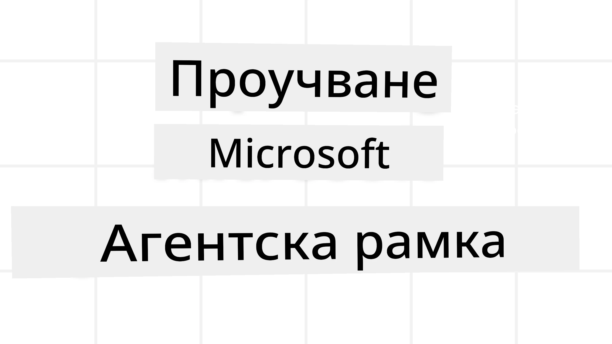
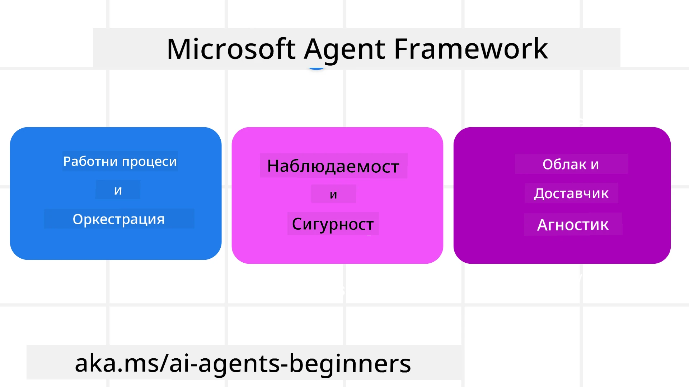
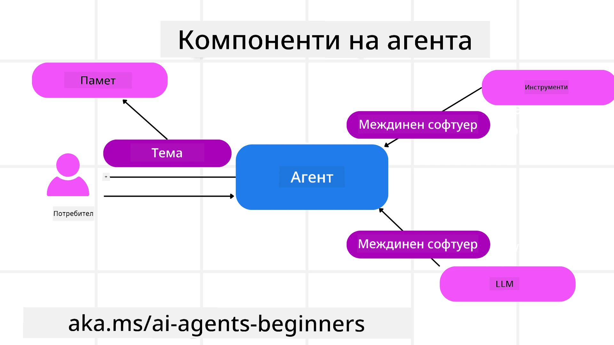

<!--
CO_OP_TRANSLATOR_METADATA:
{
  "original_hash": "19c4dab375acbc733855cc7f2f04edbc",
  "translation_date": "2025-10-02T08:13:13+00:00",
  "source_file": "14-microsoft-agent-framework/README.md",
  "language_code": "bg"
}
-->
# Изследване на Microsoft Agent Framework



### Въведение

Този урок ще обхване:

- Разбиране на Microsoft Agent Framework: Основни характеристики и стойност  
- Изследване на ключовите концепции на Microsoft Agent Framework
- Сравнение на MAF със Semantic Kernel и AutoGen: Ръководство за миграция

## Цели на обучението

След завършване на този урок ще можете:

- Да изграждате готови за производство AI агенти с помощта на Microsoft Agent Framework
- Да прилагате основните характеристики на Microsoft Agent Framework към вашите агентни случаи на употреба
- Да мигрирате и интегрирате съществуващи агентни рамки и инструменти  

## Примери за код

Примери за код за [Microsoft Agent Framework (MAF)](https://aka.ms/ai-agents-beginners/agent-framewrok) могат да бъдат намерени в това хранилище под файловете `xx-python-agent-framework` и `xx-dotnet-agent-framework`.

## Разбиране на Microsoft Agent Framework



[Microsoft Agent Framework (MAF)](https://aka.ms/ai-agents-beginners/agent-framewrok) се основава на опита и наученото от Semantic Kernel и AutoGen. Той предлага гъвкавост за справяне с разнообразни агентни случаи на употреба както в производствени, така и в изследователски среди, включително:

- **Оркестрация на последователни агенти** в сценарии, където са необходими стъпка по стъпка работни потоци.
- **Едновременна оркестрация** в сценарии, където агентите трябва да изпълняват задачи едновременно.
- **Оркестрация на групов чат** в сценарии, където агентите могат да си сътрудничат върху една задача.
- **Оркестрация на предаване** в сценарии, където агентите предават задачата един на друг, докато подзадачите се изпълняват.
- **Магнитна оркестрация** в сценарии, където мениджър агент създава и модифицира списък със задачи и координира подагентите за изпълнение на задачата.

За да достави AI агенти в производство, MAF включва и функции за:

- **Наблюдаемост** чрез използването на OpenTelemetry, където всяко действие на AI агента, включително извикване на инструменти, стъпки на оркестрация, потоци на разсъждение и мониторинг на производителността, се проследява чрез табла на Azure AI Foundry.
- **Сигурност** чрез хостване на агентите нативно в Azure AI Foundry, което включва контроли за сигурност като ролево базиран достъп, обработка на лични данни и вградена безопасност на съдържанието.
- **Издръжливост** като нишките и работните потоци на агентите могат да се паузират, възобновяват и възстановяват от грешки, което позволява по-дълги процеси.
- **Контрол** чрез поддръжка на работни потоци с човешка намеса, където задачите се маркират като изискващи одобрение от човек.

Microsoft Agent Framework също така е насочен към интероперативност чрез:

- **Независимост от облака** - Агентите могат да работят в контейнери, на място и в различни облаци.
- **Независимост от доставчика** - Агентите могат да бъдат създавани чрез предпочитания от вас SDK, включително Azure OpenAI и OpenAI.
- **Интеграция на отворени стандарти** - Агентите могат да използват протоколи като Agent-to-Agent (A2A) и Model Context Protocol (MCP) за откриване и използване на други агенти и инструменти.
- **Плъгини и конектори** - Възможност за свързване с услуги за данни и памет като Microsoft Fabric, SharePoint, Pinecone и Qdrant.

Нека разгледаме как тези функции се прилагат към някои от основните концепции на Microsoft Agent Framework.

## Основни концепции на Microsoft Agent Framework

### Агенти



**Създаване на агенти**

Създаването на агент се извършва чрез дефиниране на услугата за извеждане (LLM Provider), набор от инструкции, които AI агентът трябва да следва, и зададено `име`:

```python
agent = AzureOpenAIChatClient(credential=AzureCliCredential()).create_agent( instructions="You are good at recommending trips to customers based on their preferences.", name="TripRecommender" )
```

Горният пример използва `Azure OpenAI`, но агентите могат да бъдат създавани с помощта на различни услуги, включително `Azure AI Foundry Agent Service`:

```python
AzureAIAgentClient(async_credential=credential).create_agent( name="HelperAgent", instructions="You are a helpful assistant." ) as agent
```

OpenAI `Responses`, `ChatCompletion` APIs

```python
agent = OpenAIResponsesClient().create_agent( name="WeatherBot", instructions="You are a helpful weather assistant.", )
```

```python
agent = OpenAIChatClient().create_agent( name="HelpfulAssistant", instructions="You are a helpful assistant.", )
```

или отдалечени агенти, използващи протокола A2A:

```python
agent = A2AAgent( name=agent_card.name, description=agent_card.description, agent_card=agent_card, url="https://your-a2a-agent-host" )
```

**Изпълнение на агенти**

Агентите се изпълняват чрез методите `.run` или `.run_stream` за отговори без поточно предаване или с поточно предаване.

```python
result = await agent.run("What are good places to visit in Amsterdam?")
print(result.text)
```

```python
async for update in agent.run_stream("What are the good places to visit in Amsterdam?"):
    if update.text:
        print(update.text, end="", flush=True)

```

Всяко изпълнение на агент може също да има опции за персонализиране на параметри като `max_tokens`, които агентът използва, `tools`, които агентът може да извиква, и дори самия `model`, използван от агента.

Това е полезно в случаи, когато са необходими специфични модели или инструменти за изпълнение на задачата на потребителя.

**Инструменти**

Инструментите могат да бъдат дефинирани както при дефиниране на агента:

```python
def get_attractions( location: Annotated[str, Field(description="The location to get the top tourist attractions for")], ) -> str: """Get the top tourist attractions for a given location.""" return f"The top attractions for {location} are." 


# When creating a ChatAgent directly 

agent = ChatAgent( chat_client=OpenAIChatClient(), instructions="You are a helpful assistant", tools=[get_attractions]

```

така и при изпълнение на агента:

```python

result1 = await agent.run( "What's the best place to visit in Seattle?", tools=[get_attractions] # Tool provided for this run only )
```

**Нишки на агента**

Нишките на агента се използват за обработка на многократни разговори. Нишките могат да бъдат създадени чрез:

- Използване на `get_new_thread()`, което позволява нишката да се запази във времето
- Автоматично създаване на нишка при изпълнение на агент, като нишката съществува само по време на текущото изпълнение.

За да създадете нишка, кодът изглежда така:

```python
# Create a new thread. 
thread = agent.get_new_thread() # Run the agent with the thread. 
response = await agent.run("Hello, I am here to help you book travel. Where would you like to go?", thread=thread)

```

След това можете да сериализирате нишката, за да я съхраните за по-късна употреба:

```python
# Create a new thread. 
thread = agent.get_new_thread() 

# Run the agent with the thread. 

response = await agent.run("Hello, how are you?", thread=thread) 

# Serialize the thread for storage. 

serialized_thread = await thread.serialize() 

# Deserialize the thread state after loading from storage. 

resumed_thread = await agent.deserialize_thread(serialized_thread)
```

**Междинен софтуер на агента**

Агентите взаимодействат с инструменти и LLMs, за да изпълнят задачите на потребителя. В определени сценарии искаме да изпълним или проследим действия между тези взаимодействия. Междинният софтуер на агента ни позволява да направим това чрез:

*Междинен софтуер за функции*

Този междинен софтуер ни позволява да изпълним действие между агента и функцията/инструмента, който ще извика. Пример за това е, когато искате да направите логване на извикването на функцията.

В кода по-долу `next` определя дали следващият междинен софтуер или самата функция трябва да бъде извикана.

```python
async def logging_function_middleware(
    context: FunctionInvocationContext,
    next: Callable[[FunctionInvocationContext], Awaitable[None]],
) -> None:
    """Function middleware that logs function execution."""
    # Pre-processing: Log before function execution
    print(f"[Function] Calling {context.function.name}")

    # Continue to next middleware or function execution
    await next(context)

    # Post-processing: Log after function execution
    print(f"[Function] {context.function.name} completed")
```

*Междинен софтуер за чат*

Този междинен софтуер ни позволява да изпълним или логнем действие между агента и заявките към LLM.

Това съдържа важна информация като `messages`, които се изпращат към AI услугата.

```python
async def logging_chat_middleware(
    context: ChatContext,
    next: Callable[[ChatContext], Awaitable[None]],
) -> None:
    """Chat middleware that logs AI interactions."""
    # Pre-processing: Log before AI call
    print(f"[Chat] Sending {len(context.messages)} messages to AI")

    # Continue to next middleware or AI service
    await next(context)

    # Post-processing: Log after AI response
    print("[Chat] AI response received")

```

**Памет на агента**

Както беше разгледано в урока `Agentic Memory`, паметта е важен елемент за позволяване на агента да работи в различни контексти. MAF предлага няколко различни типа памет:

*Памет в RAM*

Това е паметта, съхранявана в нишките по време на изпълнението на приложението.

```python
# Create a new thread. 
thread = agent.get_new_thread() # Run the agent with the thread. 
response = await agent.run("Hello, I am here to help you book travel. Where would you like to go?", thread=thread)
```

*Постоянни съобщения*

Тази памет се използва за съхраняване на историята на разговорите между различни сесии. Тя се дефинира чрез `chat_message_store_factory`:

```python
from agent_framework import ChatMessageStore

# Create a custom message store
def create_message_store():
    return ChatMessageStore()

agent = ChatAgent(
    chat_client=OpenAIChatClient(),
    instructions="You are a Travel assistant.",
    chat_message_store_factory=create_message_store
)

```

*Динамична памет*

Тази памет се добавя към контекста преди изпълнението на агентите. Тези памети могат да бъдат съхранявани във външни услуги като mem0:

```python
from agent_framework.mem0 import Mem0Provider

# Using Mem0 for advanced memory capabilities
memory_provider = Mem0Provider(
    api_key="your-mem0-api-key",
    user_id="user_123",
    application_id="my_app"
)

agent = ChatAgent(
    chat_client=OpenAIChatClient(),
    instructions="You are a helpful assistant with memory.",
    context_providers=memory_provider
)

```

**Наблюдаемост на агента**

Наблюдаемостта е важна за изграждането на надеждни и поддържани агентни системи. MAF се интегрира с OpenTelemetry, за да предостави проследяване и измервания за по-добра наблюдаемост.

```python
from agent_framework.observability import get_tracer, get_meter

tracer = get_tracer()
meter = get_meter()
with tracer.start_as_current_span("my_custom_span"):
    # do something
    pass
counter = meter.create_counter("my_custom_counter")
counter.add(1, {"key": "value"})
```

### Работни потоци

MAF предлага работни потоци, които са предварително дефинирани стъпки за изпълнение на задача и включват AI агенти като компоненти в тези стъпки.

Работните потоци се състоят от различни компоненти, които позволяват по-добър контрол на потока. Те също така позволяват **оркестрация на множество агенти** и **съхраняване на състоянията на работния поток**.

Основните компоненти на работния поток са:

**Изпълнители**

Изпълнителите получават входни съобщения, изпълняват своите задачи и след това произвеждат изходно съобщение. Това придвижва работния поток към завършване на по-голямата задача. Изпълнителите могат да бъдат AI агенти или персонализирана логика.

**Ръбове**

Ръбовете се използват за дефиниране на потока от съобщения в работния поток. Те могат да бъдат:

*Директни ръбове* - Прости едно към едно връзки между изпълнители:

```python
from agent_framework import WorkflowBuilder

builder = WorkflowBuilder()
builder.add_edge(source_executor, target_executor)
builder.set_start_executor(source_executor)
workflow = builder.build()
```

*Условни ръбове* - Активират се след изпълнение на определено условие. Например, когато хотелските стаи не са налични, изпълнител може да предложи други опции.

*Ръбове switch-case* - Насочват съобщения към различни изпълнители въз основа на дефинирани условия. Например, ако клиентът има приоритетен достъп, задачите му ще бъдат обработени чрез друг работен поток.

*Ръбове fan-out* - Изпращат едно съобщение към множество цели.

*Ръбове fan-in* - Събират множество съобщения от различни изпълнители и ги изпращат към една цел.

**Събития**

За по-добра наблюдаемост на работните потоци, MAF предлага вградени събития за изпълнение, включително:

- `WorkflowStartedEvent` - Започва изпълнението на работния поток
- `WorkflowOutputEvent` - Работният поток произвежда изход
- `WorkflowErrorEvent` - Работният поток среща грешка
- `ExecutorInvokeEvent` - Изпълнителят започва обработка
- `ExecutorCompleteEvent` - Изпълнителят завършва обработка
- `RequestInfoEvent` - Издава се заявка

## Миграция от други рамки (Semantic Kernel и AutoGen)

### Разлики между MAF и Semantic Kernel

**Опростено създаване на агенти**

Semantic Kernel изисква създаване на Kernel инстанция за всеки агент. MAF използва опростен подход чрез разширения за основните доставчици.

```python
agent = AzureOpenAIChatClient(credential=AzureCliCredential()).create_agent( instructions="You are good at reccomending trips to customers based on their preferences.", name="TripRecommender" )
```

**Създаване на нишки на агенти**

Semantic Kernel изисква ръчно създаване на нишки. В MAF агентът директно получава нишка.

```python
thread = agent.get_new_thread() # Run the agent with the thread. 
```

**Регистрация на инструменти**

В Semantic Kernel инструментите се регистрират към Kernel, който след това се предава на агента. В MAF инструментите се регистрират директно по време на процеса на създаване на агента.

```python
agent = ChatAgent( chat_client=OpenAIChatClient(), instructions="You are a helpful assistant", tools=[get_attractions]
```

### Разлики между MAF и AutoGen

**Екипи срещу работни потоци**

`Teams` са структурата за събития при дейности, задвижвани от събития, с агенти в AutoGen. MAF използва `Workflows`, които насочват данни към изпълнители чрез архитектура, базирана на граф.

**Създаване на инструменти**

AutoGen използва `FunctionTool`, за да обвие функции, които агентите да извикват. MAF използва @ai_function, който работи подобно, но също така автоматично извежда схемите за всяка функция.

**Поведение на агента**

Агентите са агенти за единичен завой по подразбиране в AutoGen, освен ако `max_tool_iterations` не е зададено на по-висока стойност. В MAF `ChatAgent` е многозавоен по подразбиране, което означава, че ще продължи да извиква инструменти, докато задачата на потребителя не бъде завършена.

## Примери за код

Примери за код за Microsoft Agent Framework могат да бъдат намерени в това хранилище под файловете `xx-python-agent-framework` и `xx-dotnet-agent-framework`.

## Имате още въпроси относно Microsoft Agent Framework?

Присъединете се към [Azure AI Foundry Discord](https://aka.ms/ai-agents/discord), за да се срещнете с други обучаващи се, да присъствате на часове за консултации и да получите отговори на вашите въпроси относно AI агентите.

---

**Отказ от отговорност**:  
Този документ е преведен с помощта на AI услуга за превод [Co-op Translator](https://github.com/Azure/co-op-translator). Въпреки че се стремим към точност, моля, имайте предвид, че автоматизираните преводи може да съдържат грешки или неточности. Оригиналният документ на неговия изходен език трябва да се счита за авторитетен източник. За критична информация се препоръчва професионален превод от човек. Не носим отговорност за каквито и да било недоразумения или погрешни интерпретации, произтичащи от използването на този превод.