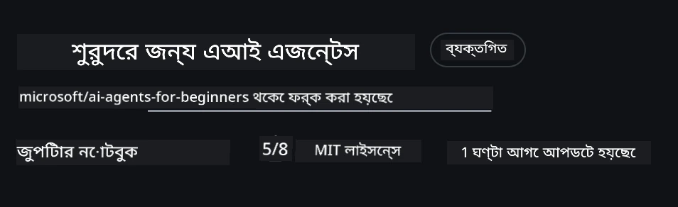
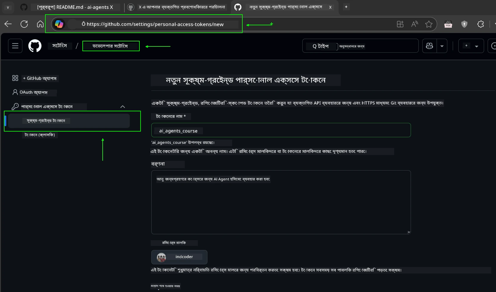
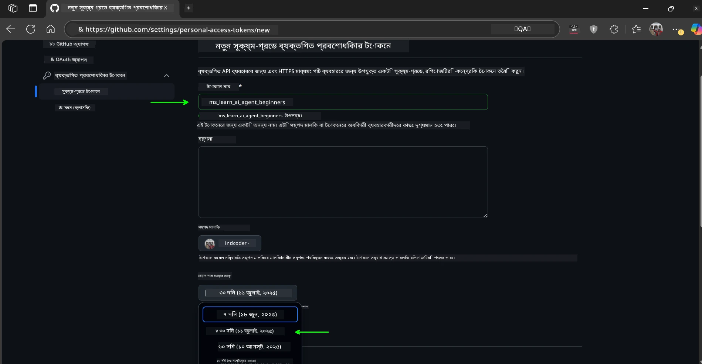
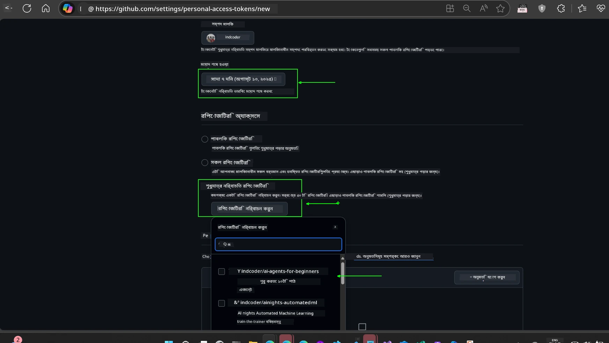
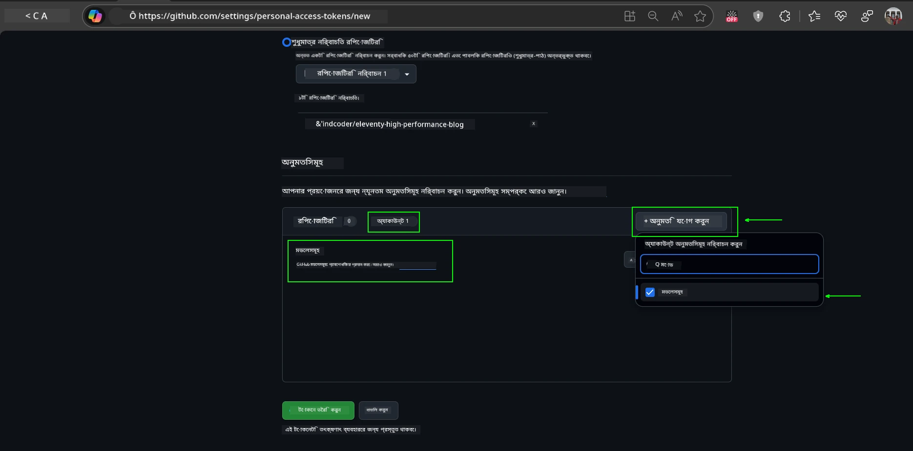
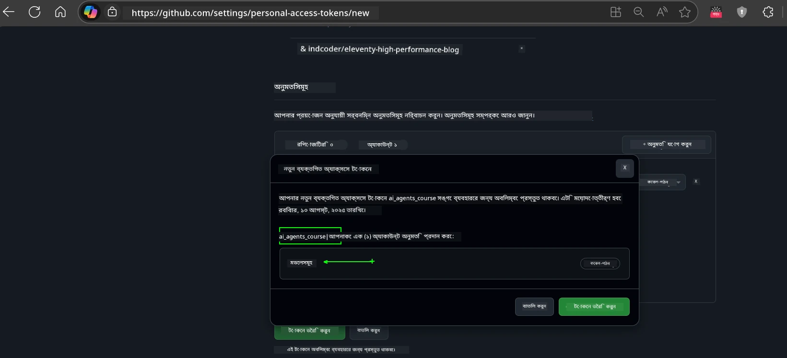
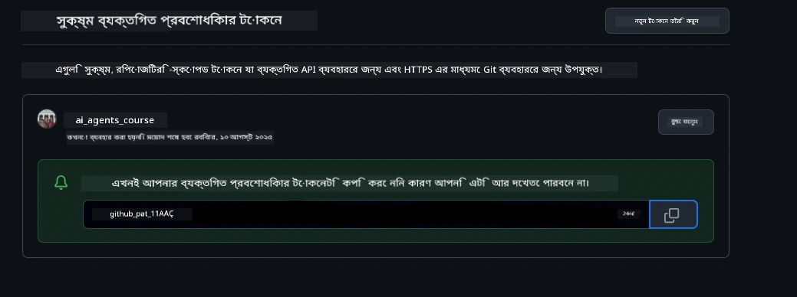
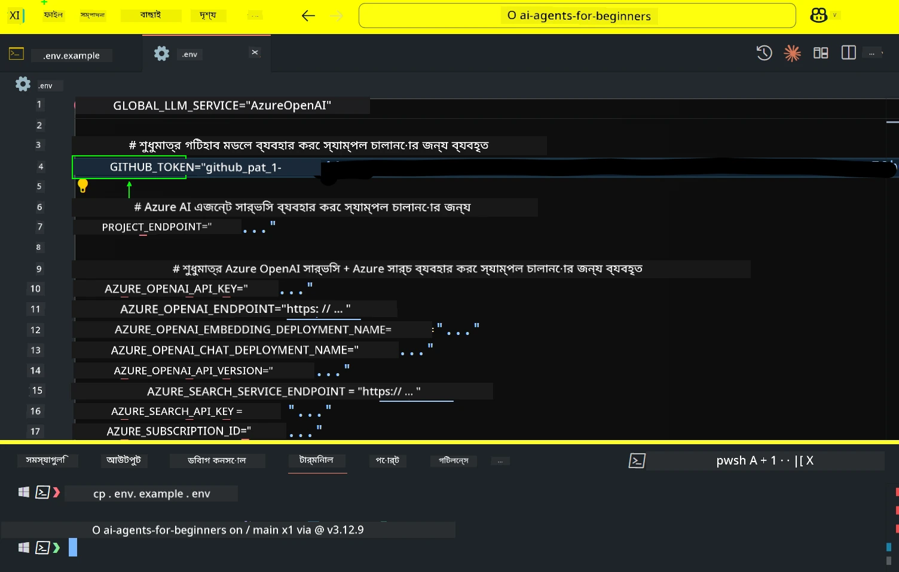
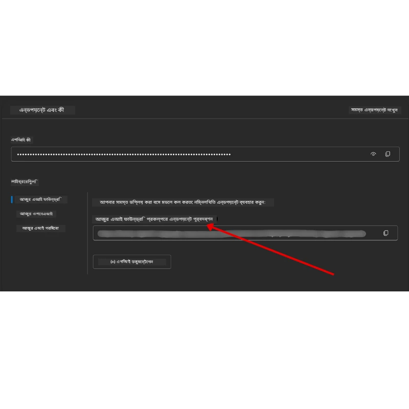

<!--
CO_OP_TRANSLATOR_METADATA:
{
  "original_hash": "63b1a8f6e840df15934935b728e569f0",
  "translation_date": "2025-12-03T14:07:06+00:00",
  "source_file": "00-course-setup/README.md",
  "language_code": "bn"
}
-->
# কোর্স সেটআপ

## পরিচিতি

এই পাঠে আমরা এই কোর্সের কোড নমুনাগুলি কীভাবে চালাতে হয় তা আলোচনা করব।

## অন্যান্য শিক্ষার্থীদের সাথে যোগ দিন এবং সাহায্য নিন

আপনার রিপোজিটরি ক্লোন করার আগে, [AI Agents For Beginners Discord চ্যানেলে](https://aka.ms/ai-agents/discord) যোগ দিন। এখানে আপনি সেটআপে সাহায্য পেতে পারেন, কোর্স সম্পর্কিত যেকোনো প্রশ্ন করতে পারেন, এবং অন্যান্য শিক্ষার্থীদের সাথে সংযোগ স্থাপন করতে পারেন।

## এই রিপোজিটরি ক্লোন বা ফর্ক করুন

শুরু করতে, অনুগ্রহ করে GitHub রিপোজিটরি ক্লোন বা ফর্ক করুন। এটি আপনার নিজের কোর্স উপকরণের একটি সংস্করণ তৈরি করবে যাতে আপনি কোড চালাতে, পরীক্ষা করতে এবং পরিবর্তন করতে পারেন!

এটি করতে <a href="https://github.com/microsoft/ai-agents-for-beginners/fork" target="_blank">রিপোজিটরি ফর্ক করুন</a> লিঙ্কে ক্লিক করুন।

এখন আপনার এই কোর্সের ফর্ক করা সংস্করণটি নিম্নলিখিত লিঙ্কে থাকবে:



### শ্যালো ক্লোন (ওয়ার্কশপ / Codespaces এর জন্য সুপারিশকৃত)

  >সম্পূর্ণ রিপোজিটরি ডাউনলোড করলে এটি বড় (~৩ জিবি) হতে পারে। যদি আপনি শুধুমাত্র ওয়ার্কশপে অংশগ্রহণ করেন বা কিছু নির্দিষ্ট পাঠের ফোল্ডার প্রয়োজন হয়, তাহলে শ্যালো ক্লোন (বা স্পার্স ক্লোন) ব্যবহার করলে ইতিহাস এবং/অথবা ব্লব ডাউনলোড এড়িয়ে যেতে পারবেন।

#### দ্রুত শ্যালো ক্লোন — সর্বনিম্ন ইতিহাস, সব ফাইল

নিচের কমান্ডে `<your-username>` পরিবর্তন করে আপনার ফর্ক URL (অথবা আপস্ট্রিম URL) ব্যবহার করুন।

শুধুমাত্র সর্বশেষ কমিট ইতিহাস ক্লোন করতে (ছোট ডাউনলোড):

```bash|powershell
git clone --depth 1 https://github.com/<your-username>/ai-agents-for-beginners.git
```

নির্দিষ্ট একটি ব্রাঞ্চ ক্লোন করতে:

```bash|powershell
git clone --depth 1 --branch <branch-name> https://github.com/<your-username>/ai-agents-for-beginners.git
```

#### আংশিক (স্পার্স) ক্লোন — সর্বনিম্ন ব্লব + শুধুমাত্র নির্বাচিত ফোল্ডার

এটি আংশিক ক্লোন এবং স্পার্স-চেকআউট ব্যবহার করে (Git 2.25+ প্রয়োজন এবং আংশিক ক্লোন সমর্থন সহ আধুনিক Git সুপারিশকৃত):

```bash|powershell
git clone --depth 1 --filter=blob:none --sparse https://github.com/<your-username>/ai-agents-for-beginners.git
```

রিপোজিটরি ফোল্ডারে প্রবেশ করুন:

```bash|powershell
cd ai-agents-for-beginners
```

তারপর আপনি কোন ফোল্ডার চান তা নির্দিষ্ট করুন (নিচের উদাহরণে দুটি ফোল্ডার দেখানো হয়েছে):

```bash|powershell
git sparse-checkout set 00-course-setup 01-intro-to-ai-agents
```

ক্লোন এবং ফাইল যাচাই করার পরে, যদি শুধুমাত্র ফাইল প্রয়োজন হয় এবং জায়গা মুক্ত করতে চান (কোনো git ইতিহাস ছাড়াই), তাহলে রিপোজিটরি মেটাডেটা মুছে ফেলুন (💀অপ্রত্যাবর্তনযোগ্য — আপনি সমস্ত Git কার্যকারিতা হারাবেন: কোনো কমিট, পুল, পুশ বা ইতিহাস অ্যাক্সেস থাকবে না)।

```bash
# জেডএসএইচ/ব্যাশ
rm -rf .git
```

```powershell
# পাওয়ারশেল
Remove-Item -Recurse -Force .git
```

#### GitHub Codespaces ব্যবহার করা (স্থানীয় বড় ডাউনলোড এড়াতে সুপারিশকৃত)

- [GitHub UI](https://github.com/codespaces) এর মাধ্যমে এই রিপোজিটরির জন্য একটি নতুন Codespace তৈরি করুন।  

- নতুন তৈরি করা Codespace এর টার্মিনালে, উপরের শ্যালো/স্পার্স ক্লোন কমান্ডগুলির একটি চালান যাতে শুধুমাত্র প্রয়োজনীয় পাঠের ফোল্ডারগুলি Codespace ওয়ার্কস্পেসে আনা যায়।
- ঐচ্ছিক: Codespaces এর ভিতরে ক্লোন করার পরে, অতিরিক্ত জায়গা পুনরুদ্ধার করতে .git মুছে ফেলুন (উপরের মুছে ফেলার কমান্ডগুলি দেখুন)।
- নোট: যদি আপনি রিপোজিটরি সরাসরি Codespaces এ খুলতে চান (অতিরিক্ত ক্লোন ছাড়া), মনে রাখবেন Codespaces ডেভকন্টেইনার পরিবেশ তৈরি করবে এবং প্রয়োজনের চেয়ে বেশি প্রভিশন করতে পারে। একটি নতুন Codespace এর ভিতরে শ্যালো ক্লোন করা ডিস্ক ব্যবহারে আরও নিয়ন্ত্রণ দেয়।

#### টিপস

- যদি আপনি সম্পাদনা/কমিট করতে চান, তাহলে সবসময় ক্লোন URL আপনার ফর্ক দিয়ে প্রতিস্থাপন করুন।
- যদি পরে আরও ইতিহাস বা ফাইল প্রয়োজন হয়, তাহলে সেগুলি ফেচ করতে পারেন বা স্পার্স-চেকআউট সামঞ্জস্য করতে পারেন যাতে অতিরিক্ত ফোল্ডার অন্তর্ভুক্ত হয়।

## কোড চালানো

এই কোর্সে Jupyter Notebooks এর একটি সিরিজ রয়েছে যা আপনাকে AI Agents তৈরি করার হাতে-কলম অভিজ্ঞতা দেবে।

কোড নমুনাগুলি ব্যবহার করে:

**GitHub অ্যাকাউন্ট প্রয়োজন - বিনামূল্যে**:

1) Semantic Kernel Agent Framework + GitHub Models Marketplace। লেবেল করা হয়েছে (semantic-kernel.ipynb)
2) AutoGen Framework + GitHub Models Marketplace। লেবেল করা হয়েছে (autogen.ipynb)

**Azure সাবস্ক্রিপশন প্রয়োজন**:

3) Azure AI Foundry + Azure AI Agent Service। লেবেল করা হয়েছে (azureaiagent.ipynb)

আমরা আপনাকে তিনটি ধরণের উদাহরণ চেষ্টা করার জন্য উৎসাহিত করি যাতে আপনি দেখতে পারেন কোনটি আপনার জন্য সবচেয়ে ভালো কাজ করে।

আপনি যেটি বেছে নেবেন, সেটি নির্ধারণ করবে নিচের সেটআপ ধাপগুলি:

## প্রয়োজনীয়তা

- Python 3.12+
  - **NOTE**: যদি আপনার Python3.12 ইনস্টল না থাকে, নিশ্চিত করুন যে আপনি এটি ইনস্টল করেছেন। তারপর requirements.txt ফাইল থেকে সঠিক সংস্করণগুলি ইনস্টল করতে python3.12 ব্যবহার করে আপনার venv তৈরি করুন।
  
    >উদাহরণ

    Python venv ডিরেক্টরি তৈরি করুন:

    ```bash|powershell
    python -m venv venv
    ```

    তারপর venv পরিবেশ সক্রিয় করুন:

    ```bash
    # জেডএসএইচ/বাশ
    source venv/bin/activate
    ```
  
    ```dos
    # Command Prompt for Windows
    venv\Scripts\activate
    ```

- .NET 10+: .NET ব্যবহার করে নমুনা কোডগুলির জন্য, নিশ্চিত করুন যে আপনি [.NET 10 SDK](https://dotnet.microsoft.com/download/dotnet/10.0) বা পরবর্তী সংস্করণ ইনস্টল করেছেন। তারপর আপনার ইনস্টল করা .NET SDK সংস্করণ পরীক্ষা করুন:

    ```bash|powershell
    dotnet --list-sdks
    ```

- একটি GitHub অ্যাকাউন্ট - GitHub Models Marketplace অ্যাক্সেসের জন্য
- Azure সাবস্ক্রিপশন - Azure AI Foundry অ্যাক্সেসের জন্য
- Azure AI Foundry অ্যাকাউন্ট - Azure AI Agent Service অ্যাক্সেসের জন্য

আমরা এই রিপোজিটরির মূল অংশে একটি `requirements.txt` ফাইল অন্তর্ভুক্ত করেছি যা কোড নমুনাগুলি চালানোর জন্য প্রয়োজনীয় সমস্ত Python প্যাকেজগুলি ধারণ করে।

আপনার টার্মিনালে রিপোজিটরির মূল অংশে নিম্নলিখিত কমান্ড চালিয়ে সেগুলি ইনস্টল করতে পারেন:

```bash|powershell
pip install -r requirements.txt
```

আমরা Python ভার্চুয়াল পরিবেশ তৈরি করার সুপারিশ করি যাতে কোনো দ্বন্দ্ব বা সমস্যা এড়ানো যায়।

## VSCode সেটআপ

নিশ্চিত করুন যে আপনি VSCode এ সঠিক Python সংস্করণ ব্যবহার করছেন।


## GitHub Models ব্যবহার করে নমুনাগুলির জন্য সেটআপ 

### ধাপ ১: আপনার GitHub Personal Access Token (PAT) সংগ্রহ করুন

এই কোর্স GitHub Models Marketplace ব্যবহার করে, যা আপনাকে বিনামূল্যে Large Language Models (LLMs) অ্যাক্সেস দেয় যা আপনি AI Agents তৈরি করতে ব্যবহার করবেন।

GitHub Models ব্যবহার করতে, আপনাকে একটি [GitHub Personal Access Token](https://docs.github.com/en/authentication/keeping-your-account-and-data-secure/managing-your-personal-access-tokens) তৈরি করতে হবে।

এটি আপনার GitHub অ্যাকাউন্টে <a href="https://github.com/settings/personal-access-tokens" target="_blank">Personal Access Tokens settings</a> এ গিয়ে করা যেতে পারে।

অনুগ্রহ করে [Principle of Least Privilege](https://docs.github.com/en/get-started/learning-to-code/storing-your-secrets-safely) অনুসরণ করুন যখন আপনি আপনার টোকেন তৈরি করবেন। এর অর্থ হলো আপনি টোকেনকে শুধুমাত্র সেই অনুমতিগুলি দিন যা এই কোর্সের কোড নমুনাগুলি চালানোর জন্য প্রয়োজন।

1. **Developer settings** এ গিয়ে বাম পাশে `Fine-grained tokens` অপশনটি নির্বাচন করুন।

   

   তারপর `Generate new token` নির্বাচন করুন।

   

2. আপনার টোকেনের জন্য একটি বর্ণনামূলক নাম লিখুন যা এর উদ্দেশ্য প্রতিফলিত করে, যাতে এটি পরে সহজে চিহ্নিত করা যায়।

    🔐 টোকেনের মেয়াদ সুপারিশ

    সুপারিশকৃত মেয়াদ: ৩০ দিন
    আরও নিরাপদ অবস্থানের জন্য, আপনি একটি ছোট সময়কাল বেছে নিতে পারেন—যেমন ৭ দিন 🛡️
    এটি একটি ব্যক্তিগত লক্ষ্য নির্ধারণ করার এবং কোর্স সম্পন্ন করার একটি চমৎকার উপায় 🚀।

    

3. টোকেনের স্কোপ আপনার এই রিপোজিটরির ফর্কে সীমাবদ্ধ করুন।

    

4. টোকেনের অনুমতিগুলি সীমিত করুন: **Permissions** এর অধীনে **Account** ট্যাবে ক্লিক করুন এবং "+ Add permissions" বোতামে ক্লিক করুন। একটি ড্রপডাউন প্রদর্শিত হবে। অনুগ্রহ করে **Models** অনুসন্ধান করুন এবং এর জন্য বক্সটি চেক করুন।

    

5. টোকেন তৈরি করার আগে প্রয়োজনীয় অনুমতিগুলি যাচাই করুন। 

6. টোকেন তৈরি করার আগে নিশ্চিত করুন যে আপনি এটি একটি নিরাপদ স্থানে সংরক্ষণ করতে প্রস্তুত, যেমন একটি পাসওয়ার্ড ম্যানেজার ভল্ট, কারণ এটি তৈরি করার পরে আবার দেখানো হবে না। 

আপনার নতুন তৈরি করা টোকেনটি কপি করুন। এখন এটি এই কোর্সে অন্তর্ভুক্ত `.env` ফাইলে যোগ করুন।

### ধাপ ২: আপনার `.env` ফাইল তৈরি করুন

আপনার টার্মিনালে নিম্নলিখিত কমান্ড চালিয়ে `.env` ফাইল তৈরি করুন।

```bash
# জেডএসএইচ/বাশ
cp .env.example .env
```

```powershell
# পাওয়ারশেল
Copy-Item .env.example .env
```

এটি উদাহরণ ফাইলটি কপি করবে এবং আপনার ডিরেক্টরিতে একটি `.env` তৈরি করবে যেখানে আপনি পরিবেশ ভেরিয়েবলগুলির জন্য মানগুলি পূরণ করবেন।

আপনার টোকেনটি কপি করে `.env` ফাইলটি আপনার পছন্দের টেক্সট এডিটরে খুলুন এবং `GITHUB_TOKEN` ফিল্ডে আপনার টোকেনটি পেস্ট করুন।



এখন আপনি এই কোর্সের কোড নমুনাগুলি চালাতে সক্ষম হবেন।

## Azure AI Foundry এবং Azure AI Agent Service ব্যবহার করে নমুনাগুলির জন্য সেটআপ

### ধাপ ১: আপনার Azure প্রকল্পের এন্ডপয়েন্ট সংগ্রহ করুন

Azure AI Foundry এ একটি হাব এবং প্রকল্প তৈরি করার ধাপগুলি অনুসরণ করুন এখানে: [Hub resources overview](https://learn.microsoft.com/azure/ai-foundry/concepts/ai-resources)

আপনার প্রকল্প তৈরি করার পরে, আপনাকে আপনার প্রকল্পের সংযোগ স্ট্রিং সংগ্রহ করতে হবে।

এটি Azure AI Foundry পোর্টালের **Overview** পৃষ্ঠায় গিয়ে করা যেতে পারে।



### ধাপ ২: আপনার `.env` ফাইল তৈরি করুন

আপনার টার্মিনালে নিম্নলিখিত কমান্ড চালিয়ে `.env` ফাইল তৈরি করুন।

```bash
# জেডএসএইচ/ব্যাশ
cp .env.example .env
```

```powershell
# পাওয়ারশেল
Copy-Item .env.example .env
```

এটি উদাহরণ ফাইলটি কপি করবে এবং আপনার ডিরেক্টরিতে একটি `.env` তৈরি করবে যেখানে আপনি পরিবেশ ভেরিয়েবলগুলির জন্য মানগুলি পূরণ করবেন।

আপনার টোকেনটি কপি করে `.env` ফাইলটি আপনার পছন্দের টেক্সট এডিটরে খুলুন এবং `PROJECT_ENDPOINT` ফিল্ডে আপনার টোকেনটি পেস্ট করুন।

### ধাপ ৩: Azure এ সাইন ইন করুন

নিরাপত্তার সেরা অনুশীলন হিসাবে, আমরা [keyless authentication](https://learn.microsoft.com/azure/developer/ai/keyless-connections?tabs=csharp%2Cazure-cli?WT.mc_id=academic-105485-koreyst) ব্যবহার করব Microsoft Entra ID এর মাধ্যমে Azure OpenAI এ প্রমাণীকরণ করতে।

পরবর্তী ধাপে, একটি টার্মিনাল খুলুন এবং `az login --use-device-code` চালিয়ে আপনার Azure অ্যাকাউন্টে সাইন ইন করুন।

আপনার লগইন সম্পন্ন হলে, টার্মিনালে আপনার সাবস্ক্রিপশন নির্বাচন করুন।

## অতিরিক্ত পরিবেশ ভেরিয়েবল - Azure Search এবং Azure OpenAI 

Agentic RAG পাঠ - পাঠ ৫ - এর জন্য কিছু নমুনা রয়েছে যা Azure Search এবং Azure OpenAI ব্যবহার করে।

যদি আপনি এই নমুনাগুলি চালাতে চান, তাহলে আপনাকে `.env` ফাইলে নিম্নলিখিত পরিবেশ ভেরিয়েবলগুলি যোগ করতে হবে:

### Overview Page (Project)

- `AZURE_SUBSCRIPTION_ID` - আপনার প্রকল্পের **Overview** পৃষ্ঠায় **Project details** চেক করুন।

- `AZURE_AI_PROJECT_NAME` - আপনার প্রকল্পের **Overview** পৃষ্ঠার শীর্ষে দেখুন।

- `AZURE_OPENAI_SERVICE` - **Overview** পৃষ্ঠার **Included capabilities** ট্যাবে **Azure OpenAI Service** এর জন্য এটি খুঁজুন।

### Management Center

- `AZURE_OPENAI_RESOURCE_GROUP` - **Management Center** এর **Overview** পৃষ্ঠায় **Project properties** এ যান।

- `GLOBAL_LLM_SERVICE` - **Connected resources** এর অধীনে **Azure AI Services** সংযোগের নাম খুঁজুন। যদি তালিকাভুক্ত না থাকে, তাহলে **Azure portal** এ আপনার রিসোর্স গ্রুপের অধীনে AI Services রিসোর্সের নাম চেক করুন।

### Models + Endpoints Page

- `AZURE_OPENAI_EMBEDDING_DEPLOYMENT_NAME` - আপনার এমবেডিং মডেল (যেমন, `text-embedding-ada-002`) নির্বাচন করুন এবং মডেল বিবরণ থেকে **Deployment name** নোট করুন।

- `AZURE_OPENAI_CHAT_DEPLOYMENT_NAME` - আপনার চ্যাট মডেল (যেমন, `gpt-4o-mini`) নির্বাচন করুন এবং মডেল বিবরণ থেকে **Deployment name** নোট করুন।

### Azure Portal

- `AZURE_OPENAI_ENDPOINT` - **Azure AI services** খুঁজুন, এটি ক্লিক করুন, তারপর **Resource Management**, **Keys and Endpoint** এ যান, "Azure OpenAI endpoints" এ স্ক্রল করুন এবং "Language APIs" এর জন্য এটি কপি করুন।

- `AZURE_OPENAI_API_KEY` - একই স্ক্রিন থেকে KEY 1 বা KEY 2 কপি করুন।

- `AZURE_SEARCH_SERVICE_ENDPOINT` - আপনার **Azure AI Search** রিসোর্স খুঁজুন, এটি ক্লিক করুন এবং **Overview** দেখুন।

- `AZURE_SEARCH_API_KEY` - তারপর **Settings** এ যান এবং **Keys** এ গিয়ে প্রাথমিক বা মাধ্যমিক অ্যাডমিন কী কপি করুন।

### External Webpage

- `AZURE_OPENAI_API_VERSION` - [API version lifecycle](https://learn.microsoft.com/azure/ai-services/openai/api-version-deprecation#latest-ga-api-release) পৃষ্ঠায় **Latest GA API release** এর অধীনে যান।

### Keyless authentication সেটআপ

আপনার ক্রেডেনশিয়ালগুলি হার্ডকোড করার পরিবর্তে, আমরা Azure OpenAI এর সাথে একটি keyless সংযোগ ব্যবহার করব। এটি করতে, আমরা `DefaultAzureCredential` ইমপোর্ট করব এবং পরে `DefaultAzureCredential` ফাংশন কল করব ক্রেডেনশিয়াল পেতে।

```python
# পাইথন
from azure.identity import DefaultAzureCredential, InteractiveBrowserCredential
```

## কোথাও আটকে গেছেন?
যদি এই সেটআপ চালানোর সময় কোনো সমস্যা হয়, আমাদের <a href="https://discord.gg/kzRShWzttr" target="_blank">Azure AI Community Discord</a> এ যোগ দিন অথবা <a href="https://github.com/microsoft/ai-agents-for-beginners/issues?WT.mc_id=academic-105485-koreyst" target="_blank">একটি সমস্যা তৈরি করুন</a>।

## পরবর্তী পাঠ

আপনি এখন এই কোর্সের কোড চালানোর জন্য প্রস্তুত। AI এজেন্টদের জগৎ সম্পর্কে আরও শিখতে শুভ কামনা!

[AI এজেন্ট এবং এজেন্ট ব্যবহারের ক্ষেত্রে পরিচিতি](../01-intro-to-ai-agents/README.md)

---

<!-- CO-OP TRANSLATOR DISCLAIMER START -->
**অস্বীকৃতি**:  
এই নথিটি AI অনুবাদ পরিষেবা [Co-op Translator](https://github.com/Azure/co-op-translator) ব্যবহার করে অনুবাদ করা হয়েছে। আমরা যথাসাধ্য সঠিক অনুবাদের চেষ্টা করি, তবে অনুগ্রহ করে মনে রাখবেন যে স্বয়ংক্রিয় অনুবাদে ত্রুটি বা অসঙ্গতি থাকতে পারে। নথিটির মূল ভাষায় লেখা সংস্করণটিকে প্রামাণিক উৎস হিসেবে বিবেচনা করা উচিত। গুরুত্বপূর্ণ তথ্যের জন্য, পেশাদার মানব অনুবাদ সুপারিশ করা হয়। এই অনুবাদ ব্যবহারের ফলে সৃষ্ট কোনো ভুল বোঝাবুঝি বা ভুল ব্যাখ্যার জন্য আমরা দায়ী নই।
<!-- CO-OP TRANSLATOR DISCLAIMER END -->