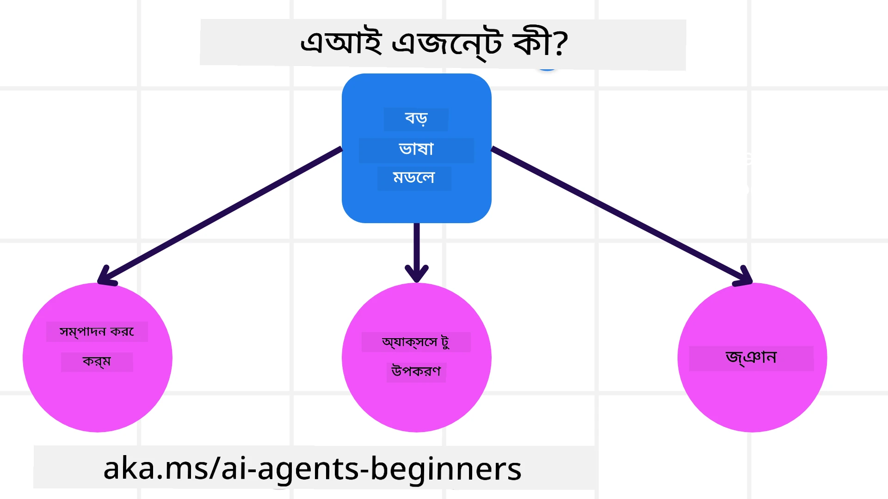
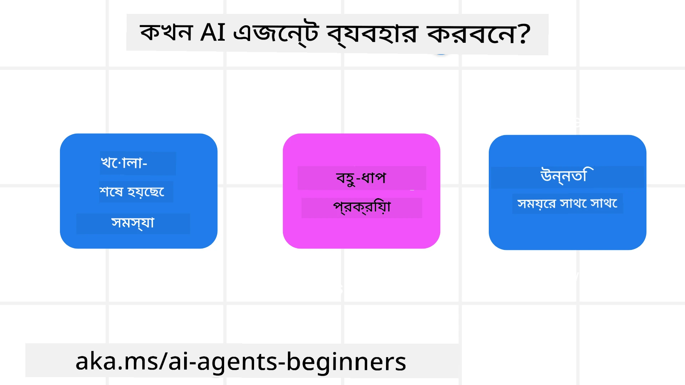

<!--
CO_OP_TRANSLATOR_METADATA:
{
  "original_hash": "cdd28bc00816d2773bb2b5968d782abc",
  "translation_date": "2025-11-11T11:03:47+00:00",
  "source_file": "01-intro-to-ai-agents/README.md",
  "language_code": "bn"
}
-->

> _(উপরের ছবিতে ক্লিক করে এই পাঠের ভিডিও দেখুন)_

# AI এজেন্ট এবং এজেন্ট ব্যবহারের ক্ষেত্রে পরিচিতি

"AI এজেন্টস ফর বিগিনার্স" কোর্সে আপনাকে স্বাগতম! এই কোর্সটি AI এজেন্ট তৈরি করার জন্য মৌলিক জ্ঞান এবং প্রয়োগযোগ্য উদাহরণ প্রদান করে।

<a href="https://discord.gg/kzRShWzttr" target="_blank">Azure AI Discord Community</a>-তে যোগ দিন, যেখানে আপনি অন্যান্য শিক্ষার্থী এবং AI এজেন্ট নির্মাতাদের সাথে পরিচিত হতে পারবেন এবং এই কোর্স সম্পর্কিত আপনার যেকোনো প্রশ্ন করতে পারবেন।

এই কোর্স শুরু করার জন্য, আমরা প্রথমে AI এজেন্ট কী এবং আমরা কীভাবে সেগুলো আমাদের তৈরি করা অ্যাপ্লিকেশন এবং ওয়ার্কফ্লোতে ব্যবহার করতে পারি তা আরও ভালোভাবে বুঝতে চেষ্টা করব।

## পরিচিতি

এই পাঠে আলোচনা করা হবে:

- AI এজেন্ট কী এবং এর বিভিন্ন প্রকার কী কী?
- কোন কোন ক্ষেত্রে AI এজেন্ট সবচেয়ে ভালো কাজ করে এবং কীভাবে তারা আমাদের সাহায্য করতে পারে?
- এজেন্টিক সলিউশন ডিজাইন করার সময় কিছু মৌলিক উপাদান কী কী?

## শেখার লক্ষ্য
এই পাঠ শেষ করার পর, আপনি:

- AI এজেন্টের ধারণা এবং অন্যান্য AI সমাধানের সাথে এর পার্থক্য বুঝতে পারবেন।
- AI এজেন্টকে সবচেয়ে কার্যকরভাবে প্রয়োগ করতে পারবেন।
- ব্যবহারকারী এবং গ্রাহকদের জন্য উৎপাদনশীলভাবে এজেন্টিক সলিউশন ডিজাইন করতে পারবেন।

## AI এজেন্ট এবং AI এজেন্টের প্রকারভেদ সংজ্ঞায়িত করা

### AI এজেন্ট কী?

AI এজেন্ট হলো **সিস্টেম**, যা **লার্জ ল্যাঙ্গুয়েজ মডেল (LLMs)**-কে **কর্ম সম্পাদন** করতে সক্ষম করে, তাদের ক্ষমতা বাড়িয়ে LLMs-কে **টুলস** এবং **জ্ঞান** প্রদান করে।

এই সংজ্ঞাকে ছোট ছোট অংশে ভাগ করা যাক:

- **সিস্টেম** - এজেন্টকে শুধুমাত্র একটি একক উপাদান হিসেবে নয়, বরং অনেক উপাদানের একটি সিস্টেম হিসেবে ভাবা গুরুত্বপূর্ণ। AI এজেন্টের মৌলিক উপাদানগুলো হলো:
  - **পরিবেশ** - নির্ধারিত স্থান যেখানে AI এজেন্ট কাজ করছে। উদাহরণস্বরূপ, যদি আমাদের একটি ট্রাভেল বুকিং AI এজেন্ট থাকে, তাহলে পরিবেশ হতে পারে সেই ট্রাভেল বুকিং সিস্টেম যা AI এজেন্ট কাজ সম্পন্ন করতে ব্যবহার করে।
  - **সেন্সর** - পরিবেশে তথ্য থাকে এবং প্রতিক্রিয়া প্রদান করে। AI এজেন্ট সেন্সর ব্যবহার করে পরিবেশের বর্তমান অবস্থার তথ্য সংগ্রহ এবং ব্যাখ্যা করে। ট্রাভেল বুকিং এজেন্টের উদাহরণে, ট্রাভেল বুকিং সিস্টেম হোটেলের প্রাপ্যতা বা ফ্লাইটের মূল্য সম্পর্কে তথ্য প্রদান করতে পারে।
  - **অ্যাকচুয়েটর** - AI এজেন্ট যখন পরিবেশের বর্তমান অবস্থা গ্রহণ করে, তখন নির্ধারিত কাজের জন্য এজেন্ট সিদ্ধান্ত নেয় যে পরিবেশ পরিবর্তন করতে কী পদক্ষেপ নেওয়া উচিত। ট্রাভেল বুকিং এজেন্টের ক্ষেত্রে, এটি ব্যবহারকারীর জন্য একটি উপলব্ধ রুম বুক করা হতে পারে।

**লার্জ ল্যাঙ্গুয়েজ মডেল** - এজেন্টের ধারণা LLMs তৈরি হওয়ার আগেও ছিল। LLMs ব্যবহার করে AI এজেন্ট তৈরি করার সুবিধা হলো তাদের মানব ভাষা এবং ডেটা ব্যাখ্যা করার ক্ষমতা। এই ক্ষমতা LLMs-কে পরিবেশগত তথ্য ব্যাখ্যা করতে এবং পরিবেশ পরিবর্তনের জন্য একটি পরিকল্পনা নির্ধারণ করতে সক্ষম করে।

**কর্ম সম্পাদন** - AI এজেন্ট সিস্টেমের বাইরে, LLMs শুধুমাত্র ব্যবহারকারীর প্রম্পটের ভিত্তিতে বিষয়বস্তু বা তথ্য তৈরি করার ক্ষেত্রে সীমাবদ্ধ। AI এজেন্ট সিস্টেমের মধ্যে, LLMs ব্যবহারকারীর অনুরোধ ব্যাখ্যা করে এবং তাদের পরিবেশে উপলব্ধ টুলস ব্যবহার করে কাজ সম্পন্ন করতে পারে।

**টুলস অ্যাক্সেস** - LLMs-এর কাছে কী টুলস থাকবে তা নির্ধারিত হয় ১) যে পরিবেশে এটি কাজ করছে এবং ২) AI এজেন্টের ডেভেলপার দ্বারা। আমাদের ট্রাভেল এজেন্ট উদাহরণে, এজেন্টের টুলস বুকিং সিস্টেমে উপলব্ধ অপারেশন দ্বারা সীমাবদ্ধ এবং/অথবা ডেভেলপার এজেন্টের টুলস অ্যাক্সেস ফ্লাইটে সীমিত করতে পারেন।

**মেমরি+জ্ঞান** - মেমরি কথোপকথনের প্রসঙ্গে স্বল্পমেয়াদী হতে পারে। দীর্ঘমেয়াদে, পরিবেশ দ্বারা প্রদত্ত তথ্যের বাইরে, AI এজেন্ট অন্যান্য সিস্টেম, পরিষেবা, টুলস এবং এমনকি অন্যান্য এজেন্ট থেকে জ্ঞান পুনরুদ্ধার করতে পারে। ট্রাভেল এজেন্ট উদাহরণে, এই জ্ঞান হতে পারে গ্রাহক ডাটাবেসে থাকা ব্যবহারকারীর ট্রাভেল পছন্দ সম্পর্কে তথ্য।

### এজেন্টের বিভিন্ন প্রকার

এখন যেহেতু আমরা AI এজেন্টের একটি সাধারণ সংজ্ঞা পেয়েছি, আসুন কিছু নির্দিষ্ট এজেন্ট প্রকার এবং কীভাবে সেগুলো একটি ট্রাভেল বুকিং AI এজেন্টে প্রয়োগ করা যেতে পারে তা দেখি।

| **এজেন্টের প্রকার**           | **বর্ণনা**                                                                                                                       | **উদাহরণ**                                                                                                                                                                                                                   |
| ----------------------------- | ------------------------------------------------------------------------------------------------------------------------------------- | ----------------------------------------------------------------------------------------------------------------------------------------------------------------------------------------------------------------------------- |
| **সিম্পল রিফ্লেক্স এজেন্ট**      | পূর্বনির্ধারিত নিয়মের ভিত্তিতে তাৎক্ষণিক পদক্ষেপ গ্রহণ করে।                                                                                  | ট্রাভেল এজেন্ট ইমেলের প্রসঙ্গ ব্যাখ্যা করে এবং ট্রাভেল সংক্রান্ত অভিযোগ কাস্টমার সার্ভিসে পাঠায়।                                                                                                                          |
| **মডেল-ভিত্তিক রিফ্লেক্স এজেন্ট** | বিশ্বের একটি মডেলের ভিত্তিতে এবং সেই মডেলের পরিবর্তনের উপর ভিত্তি করে পদক্ষেপ গ্রহণ করে।                                                              | ট্রাভেল এজেন্ট ঐতিহাসিক মূল্য ডেটার অ্যাক্সেসের ভিত্তিতে উল্লেখযোগ্য মূল্য পরিবর্তন সহ রুটগুলোকে অগ্রাধিকার দেয়।                                                                                                             |
| **গোল-ভিত্তিক এজেন্ট**         | নির্দিষ্ট লক্ষ্য অর্জনের জন্য পরিকল্পনা তৈরি করে এবং লক্ষ্য ব্যাখ্যা করে তা অর্জনের জন্য পদক্ষেপ নির্ধারণ করে।                                  | ট্রাভেল এজেন্ট বর্তমান অবস্থান থেকে গন্তব্যে পৌঁছানোর জন্য প্রয়োজনীয় ট্রাভেল ব্যবস্থা (গাড়ি, পাবলিক ট্রানজিট, ফ্লাইট) নির্ধারণ করে একটি যাত্রা বুক করে।                                                                                |
| **ইউটিলিটি-ভিত্তিক এজেন্ট**      | পছন্দগুলো বিবেচনা করে এবং লক্ষ্য অর্জনের জন্য ট্রেডঅফগুলো সংখ্যাগতভাবে মূল্যায়ন করে।                                               | ট্রাভেল এজেন্ট ট্রাভেল বুক করার সময় সুবিধা বনাম খরচের মধ্যে ভারসাম্য বজায় রেখে ইউটিলিটি সর্বাধিক করে।                                                                                                                                          |
| **লার্নিং এজেন্ট**           | প্রতিক্রিয়ার ভিত্তিতে এবং পদক্ষেপগুলো সামঞ্জস্য করে সময়ের সাথে উন্নতি করে।                                                        | ট্রাভেল এজেন্ট পোস্ট-ট্রিপ সার্ভে থেকে গ্রাহকের প্রতিক্রিয়া ব্যবহার করে ভবিষ্যতের বুকিংয়ে সমন্বয় করে উন্নতি করে।                                                                                                               |
| **হায়ারারকিকাল এজেন্ট**       | একটি স্তরযুক্ত সিস্টেমে একাধিক এজেন্ট বৈশিষ্ট্যযুক্ত, যেখানে উচ্চ-স্তরের এজেন্টগুলো কাজগুলোকে উপ-কার্যে বিভক্ত করে নিম্ন-স্তরের এজেন্টগুলোকে সম্পন্ন করতে দেয়। | ট্রাভেল এজেন্ট একটি ট্রিপ বাতিল করার কাজকে উপ-কার্যে বিভক্ত করে (যেমন নির্দিষ্ট বুকিং বাতিল করা) এবং নিম্ন-স্তরের এজেন্টগুলোকে সেগুলো সম্পন্ন করতে দেয়, যা উচ্চ-স্তরের এজেন্টকে রিপোর্ট করে।                                     |
| **মাল্টি-এজেন্ট সিস্টেম (MAS)** | এজেন্টগুলো স্বাধীনভাবে কাজ সম্পন্ন করে, হয় সহযোগিতামূলক বা প্রতিযোগিতামূলকভাবে।                                                           | সহযোগিতামূলক: একাধিক এজেন্ট নির্দিষ্ট ট্রাভেল পরিষেবা যেমন হোটেল, ফ্লাইট এবং বিনোদন বুক করে। প্রতিযোগিতামূলক: একাধিক এজেন্ট একটি শেয়ার্ড হোটেল বুকিং ক্যালেন্ডার পরিচালনা করে এবং গ্রাহকদের হোটেলে বুক করার জন্য প্রতিযোগিতা করে। |

## AI এজেন্ট কখন ব্যবহার করবেন

আগের অংশে, আমরা ট্রাভেল এজেন্ট ব্যবহার-কেসটি ব্যবহার করেছি বিভিন্ন ট্রাভেল বুকিং পরিস্থিতিতে বিভিন্ন প্রকারের এজেন্ট কীভাবে ব্যবহার করা যেতে পারে তা ব্যাখ্যা করতে। আমরা এই অ্যাপ্লিকেশনটি পুরো কোর্স জুড়ে ব্যবহার করব।

আসুন AI এজেন্টের জন্য সবচেয়ে ভালো ব্যবহারের ক্ষেত্রে দেখি:

- **ওপেন-এন্ডেড সমস্যা** - LLM-কে একটি কাজ সম্পন্ন করার জন্য প্রয়োজনীয় পদক্ষেপ নির্ধারণ করতে দেওয়া, কারণ এটি সবসময় একটি ওয়ার্কফ্লোতে হার্ডকোড করা সম্ভব নয়।
- **মাল্টি-স্টেপ প্রক্রিয়া** - এমন কাজ যা একটি স্তরের জটিলতা প্রয়োজন যেখানে AI এজেন্টকে একক শট রিট্রিভালের পরিবর্তে একাধিক টার্নে টুলস বা তথ্য ব্যবহার করতে হয়।  
- **সময়ের সাথে উন্নতি** - এমন কাজ যেখানে এজেন্ট তার পরিবেশ বা ব্যবহারকারীদের কাছ থেকে প্রতিক্রিয়া গ্রহণ করে সময়ের সাথে উন্নতি করতে পারে, যাতে আরও ভালো ইউটিলিটি প্রদান করা যায়।

আমরা AI এজেন্ট ব্যবহার করার আরও বিবেচনা "ট্রাস্টওয়ার্দি AI এজেন্ট তৈরি" পাঠে আলোচনা করব।

## এজেন্টিক সলিউশনের মৌলিক বিষয়

### এজেন্ট ডেভেলপমেন্ট

AI এজেন্ট সিস্টেম ডিজাইন করার প্রথম ধাপ হলো টুলস, অ্যাকশন এবং আচরণ সংজ্ঞায়িত করা। এই কোর্সে, আমরা **Azure AI Agent Service** ব্যবহার করে আমাদের এজেন্ট সংজ্ঞায়িত করার উপর ফোকাস করব। এটি নিম্নলিখিত বৈশিষ্ট্য প্রদান করে:

- OpenAI, Mistral, এবং Llama-এর মতো ওপেন মডেল নির্বাচন
- Tripadvisor-এর মতো প্রদানকারীদের মাধ্যমে লাইসেন্সকৃত ডেটা ব্যবহার
- স্ট্যান্ডার্ডাইজড OpenAPI 3.0 টুলস ব্যবহার

### এজেন্টিক প্যাটার্ন

LLMs-এর সাথে যোগাযোগ প্রম্পটের মাধ্যমে হয়। AI এজেন্টের আধা-স্বায়ত্তশাসিত প্রকৃতির কারণে, পরিবেশে পরিবর্তনের পরে LLM-কে ম্যানুয়ালি পুনরায় প্রম্পট করা সবসময় সম্ভব বা প্রয়োজনীয় নয়। আমরা **এজেন্টিক প্যাটার্ন** ব্যবহার করি যা আমাদের LLM-কে একাধিক ধাপে আরও স্কেলযোগ্য উপায়ে প্রম্পট করতে দেয়।

এই কোর্সটি কিছু বর্তমান জনপ্রিয় এজেন্টিক প্যাটার্নে বিভক্ত।

### এজেন্টিক ফ্রেমওয়ার্ক

এজেন্টিক ফ্রেমওয়ার্ক ডেভেলপারদের কোডের মাধ্যমে এজেন্টিক প্যাটার্ন বাস্তবায়ন করতে দেয়। এই ফ্রেমওয়ার্কগুলো টেমপ্লেট, প্লাগইন এবং টুলস প্রদান করে যা AI এজেন্টের আরও ভালো সহযোগিতা সক্ষম করে। এই সুবিধাগুলো AI এজেন্ট সিস্টেমের আরও ভালো পর্যবেক্ষণ এবং সমস্যা সমাধানের ক্ষমতা প্রদান করে।

এই কোর্সে, আমরা গবেষণা-চালিত AutoGen ফ্রেমওয়ার্ক এবং Semantic Kernel-এর প্রোডাকশন-রেডি এজেন্ট ফ্রেমওয়ার্ক অন্বেষণ করব।

## নমুনা কোড

- Python: [Agent Framework](./code_samples/01-python-agent-framework.ipynb)
- .NET: [Agent Framework](./code_samples/01-dotnet-agent-framework.md)

## AI এজেন্ট সম্পর্কে আরও প্রশ্ন আছে?

[Azure AI Foundry Discord](https://aka.ms/ai-agents/discord)-এ যোগ দিন, যেখানে আপনি অন্যান্য শিক্ষার্থীদের সাথে পরিচিত হতে পারবেন, অফিস আওয়ার্সে অংশ নিতে পারবেন এবং আপনার AI এজেন্ট সম্পর্কিত প্রশ্নের উত্তর পেতে পারবেন।

## পূর্ববর্তী পাঠ

[কোর্স সেটআপ](../00-course-setup/README.md)

## পরবর্তী পাঠ

[এজেন্টিক ফ্রেমওয়ার্ক অন্বেষণ](../02-explore-agentic-frameworks/README.md)

---

<!-- CO-OP TRANSLATOR DISCLAIMER START -->
**অস্বীকৃতি**:  
এই নথিটি AI অনুবাদ পরিষেবা [Co-op Translator](https://github.com/Azure/co-op-translator) ব্যবহার করে অনুবাদ করা হয়েছে। আমরা যথাসাধ্য সঠিকতার জন্য চেষ্টা করি, তবে অনুগ্রহ করে মনে রাখবেন যে স্বয়ংক্রিয় অনুবাদে ত্রুটি বা অসঙ্গতি থাকতে পারে। এর মূল ভাষায় থাকা নথিটিকে প্রামাণিক উৎস হিসেবে বিবেচনা করা উচিত। গুরুত্বপূর্ণ তথ্যের জন্য, পেশাদার মানব অনুবাদ সুপারিশ করা হয়। এই অনুবাদ ব্যবহারের ফলে কোনো ভুল বোঝাবুঝি বা ভুল ব্যাখ্যা হলে আমরা দায়বদ্ধ থাকব না।
<!-- CO-OP TRANSLATOR DISCLAIMER END -->