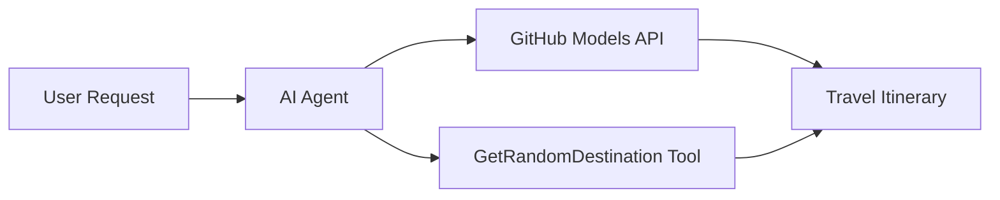

<!--
CO_OP_TRANSLATOR_METADATA:
{
  "original_hash": "5f351412e934f0833c8c821a0a60efaf",
  "translation_date": "2025-11-13T11:43:11+00:00",
  "source_file": "01-intro-to-ai-agents/code_samples/01-dotnet-agent-framework.md",
  "language_code": "bn"
}
-->
# 🌍 মাইক্রোসফট এজেন্ট ফ্রেমওয়ার্ক (.NET) দিয়ে এআই ট্রাভেল এজেন্ট

## 📋 পরিস্থিতির সংক্ষিপ্ত বিবরণ

এই উদাহরণটি দেখায় কীভাবে মাইক্রোসফট এজেন্ট ফ্রেমওয়ার্ক ব্যবহার করে একটি বুদ্ধিমান ভ্রমণ পরিকল্পনা এজেন্ট তৈরি করা যায়। এজেন্টটি স্বয়ংক্রিয়ভাবে বিশ্বের বিভিন্ন স্থানের জন্য ব্যক্তিগতকৃত দিনভিত্তিক ভ্রমণ পরিকল্পনা তৈরি করতে পারে।

### প্রধান বৈশিষ্ট্যসমূহ:

- 🎲 **এলোমেলো গন্তব্য নির্বাচন**: ছুটির স্থান বাছাই করার জন্য একটি কাস্টম টুল ব্যবহার করে
- 🗺️ **বুদ্ধিমান ভ্রমণ পরিকল্পনা**: বিস্তারিত দিনভিত্তিক ভ্রমণসূচি তৈরি করে
- 🔄 **রিয়েল-টাইম স্ট্রিমিং**: তাৎক্ষণিক এবং স্ট্রিমিং উভয় ধরনের প্রতিক্রিয়া সমর্থন করে
- 🛠️ **কাস্টম টুল ইন্টিগ্রেশন**: এজেন্টের ক্ষমতা বাড়ানোর পদ্ধতি প্রদর্শন করে

## 🔧 প্রযুক্তিগত স্থাপত্য

### মূল প্রযুক্তি

- **মাইক্রোসফট এজেন্ট ফ্রেমওয়ার্ক**: এআই এজেন্ট ডেভেলপমেন্টের জন্য সর্বশেষ .NET ইমপ্লিমেন্টেশন
- **GitHub মডেল ইন্টিগ্রেশন**: GitHub-এর এআই মডেল ইনফারেন্স সার্ভিস ব্যবহার করে
- **OpenAI API সামঞ্জস্যতা**: কাস্টম এন্ডপয়েন্ট সহ OpenAI ক্লায়েন্ট লাইব্রেরি ব্যবহার করে
- **নিরাপদ কনফিগারেশন**: পরিবেশ-ভিত্তিক API কী ব্যবস্থাপনা

### প্রধান উপাদান

1. **AIAgent**: প্রধান এজেন্ট অর্কেস্ট্রেটর যা কথোপকথনের প্রবাহ পরিচালনা করে
2. **কাস্টম টুলস**: এজেন্টের জন্য উপলব্ধ `GetRandomDestination()` ফাংশন
3. **চ্যাট ক্লায়েন্ট**: GitHub মডেল-সমর্থিত কথোপকথন ইন্টারফেস
4. **স্ট্রিমিং সাপোর্ট**: রিয়েল-টাইম প্রতিক্রিয়া তৈরির ক্ষমতা

### ইন্টিগ্রেশন প্যাটার্ন



## 🚀 শুরু করার উপায়

### প্রয়োজনীয়তা

- [.NET 10 SDK](https://dotnet.microsoft.com/download/dotnet/10.0) বা তার উপরে
- [GitHub মডেল API অ্যাক্সেস টোকেন](https://docs.github.com/github-models/github-models-at-scale/using-your-own-api-keys-in-github-models)

### প্রয়োজনীয় পরিবেশ ভেরিয়েবল

```bash
# zsh/bash
export GH_TOKEN=<your_github_token>
export GH_ENDPOINT=https://models.github.ai/inference
export GH_MODEL_ID=openai/gpt-5-mini
```

```powershell
# PowerShell
$env:GH_TOKEN = "<your_github_token>"
$env:GH_ENDPOINT = "https://models.github.ai/inference"
$env:GH_MODEL_ID = "openai/gpt-5-mini"
```

### নমুনা কোড

কোড উদাহরণ চালানোর জন্য,

```bash
# zsh/bash
chmod +x ./01-dotnet-agent-framework.cs
./01-dotnet-agent-framework.cs
```

অথবা dotnet CLI ব্যবহার করে:

```bash
dotnet run ./01-dotnet-agent-framework.cs
```

সম্পূর্ণ কোডের জন্য দেখুন [`01-dotnet-agent-framework.cs`](../../../../01-intro-to-ai-agents/code_samples/01-dotnet-agent-framework.cs)।

```csharp
#!/usr/bin/dotnet run

#:package Microsoft.Extensions.AI@9.*
#:package Microsoft.Agents.AI.OpenAI@1.*-*

using System.ClientModel;
using System.ComponentModel;

using Microsoft.Agents.AI;
using Microsoft.Extensions.AI;

using OpenAI;

// Tool Function: Random Destination Generator
// This static method will be available to the agent as a callable tool
// The [Description] attribute helps the AI understand when to use this function
// This demonstrates how to create custom tools for AI agents
[Description("Provides a random vacation destination.")]
static string GetRandomDestination()
{
    // List of popular vacation destinations around the world
    // The agent will randomly select from these options
    var destinations = new List<string>
    {
        "Paris, France",
        "Tokyo, Japan",
        "New York City, USA",
        "Sydney, Australia",
        "Rome, Italy",
        "Barcelona, Spain",
        "Cape Town, South Africa",
        "Rio de Janeiro, Brazil",
        "Bangkok, Thailand",
        "Vancouver, Canada"
    };

    // Generate random index and return selected destination
    // Uses System.Random for simple random selection
    var random = new Random();
    int index = random.Next(destinations.Count);
    return destinations[index];
}

// Extract configuration from environment variables
// Retrieve the GitHub Models API endpoint, defaults to https://models.github.ai/inference if not specified
// Retrieve the model ID, defaults to openai/gpt-5-mini if not specified
// Retrieve the GitHub token for authentication, throws exception if not specified
var github_endpoint = Environment.GetEnvironmentVariable("GH_ENDPOINT") ?? "https://models.github.ai/inference";
var github_model_id = Environment.GetEnvironmentVariable("GH_MODEL_ID") ?? "openai/gpt-5-mini";
var github_token = Environment.GetEnvironmentVariable("GH_TOKEN") ?? throw new InvalidOperationException("GH_TOKEN is not set.");

// Configure OpenAI Client Options
// Create configuration options to point to GitHub Models endpoint
// This redirects OpenAI client calls to GitHub's model inference service
var openAIOptions = new OpenAIClientOptions()
{
    Endpoint = new Uri(github_endpoint)
};

// Initialize OpenAI Client with GitHub Models Configuration
// Create OpenAI client using GitHub token for authentication
// Configure it to use GitHub Models endpoint instead of OpenAI directly
var openAIClient = new OpenAIClient(new ApiKeyCredential(github_token), openAIOptions);

// Create AI Agent with Travel Planning Capabilities
// Initialize OpenAI client, get chat client for specified model, and create AI agent
// Configure agent with travel planning instructions and random destination tool
// The agent can now plan trips using the GetRandomDestination function
AIAgent agent = openAIClient
    .GetChatClient(github_model_id)
    .CreateAIAgent(
        instructions: "You are a helpful AI Agent that can help plan vacations for customers at random destinations",
        tools: [AIFunctionFactory.Create(GetRandomDestination)]
    );

// Execute Agent: Plan a Day Trip
// Run the agent with streaming enabled for real-time response display
// Shows the agent's thinking and response as it generates the content
// Provides better user experience with immediate feedback
await foreach (var update in agent.RunStreamingAsync("Plan me a day trip"))
{
    await Task.Delay(10);
    Console.Write(update);
}
```

## 🎓 মূল শিক্ষা

1. **এজেন্ট স্থাপত্য**: মাইক্রোসফট এজেন্ট ফ্রেমওয়ার্ক .NET-এ এআই এজেন্ট তৈরি করার জন্য একটি পরিষ্কার, টাইপ-সেফ পদ্ধতি প্রদান করে
2. **টুল ইন্টিগ্রেশন**: `[Description]` অ্যাট্রিবিউট দিয়ে সজ্জিত ফাংশনগুলি এজেন্টের জন্য উপলব্ধ টুল হয়ে যায়
3. **কনফিগারেশন ব্যবস্থাপনা**: পরিবেশ ভেরিয়েবল এবং নিরাপদ শংসাপত্র পরিচালনা .NET-এর সেরা অনুশীলন অনুসরণ করে
4. **OpenAI সামঞ্জস্যতা**: GitHub মডেল ইন্টিগ্রেশন OpenAI-সামঞ্জস্যপূর্ণ API-এর মাধ্যমে নির্বিঘ্নে কাজ করে

## 🔗 অতিরিক্ত সম্পদ

- [মাইক্রোসফট এজেন্ট ফ্রেমওয়ার্ক ডকুমেন্টেশন](https://learn.microsoft.com/agent-framework)
- [GitHub মডেল মার্কেটপ্লেস](https://github.com/marketplace?type=models)
- [Microsoft.Extensions.AI](https://learn.microsoft.com/dotnet/ai/microsoft-extensions-ai)
- [.NET সিঙ্গেল ফাইল অ্যাপস](https://devblogs.microsoft.com/dotnet/announcing-dotnet-run-app)

---

<!-- CO-OP TRANSLATOR DISCLAIMER START -->
**অস্বীকৃতি**:  
এই নথিটি AI অনুবাদ পরিষেবা [Co-op Translator](https://github.com/Azure/co-op-translator) ব্যবহার করে অনুবাদ করা হয়েছে। আমরা যথাসম্ভব সঠিক অনুবাদের চেষ্টা করি, তবে অনুগ্রহ করে মনে রাখবেন যে স্বয়ংক্রিয় অনুবাদে ত্রুটি বা অসঙ্গতি থাকতে পারে। নথিটির মূল ভাষায় থাকা সংস্করণটিকে প্রামাণিক উৎস হিসেবে বিবেচনা করা উচিত। গুরুত্বপূর্ণ তথ্যের জন্য, পেশাদার মানব অনুবাদ সুপারিশ করা হয়। এই অনুবাদ ব্যবহারের ফলে সৃষ্ট কোনো ভুল বোঝাবুঝি বা ভুল ব্যাখ্যার জন্য আমরা দায়ী নই।
<!-- CO-OP TRANSLATOR DISCLAIMER END -->