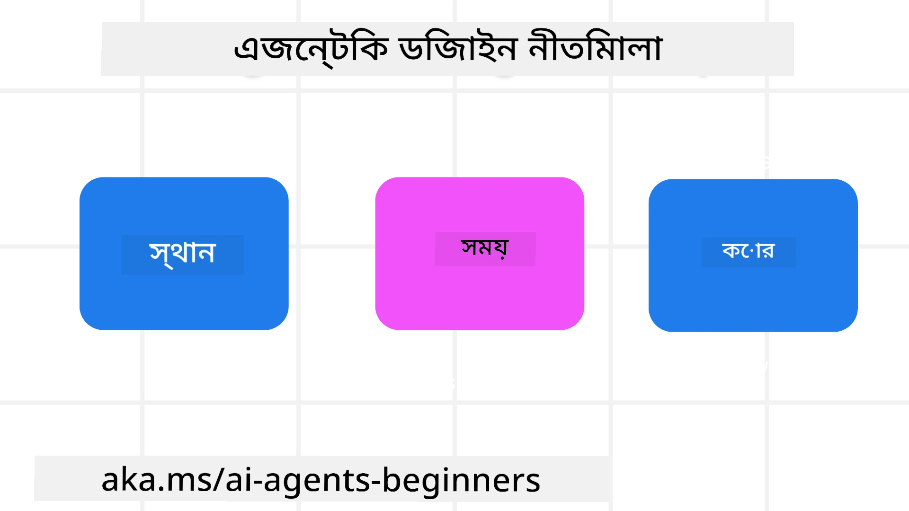

<!--
CO_OP_TRANSLATOR_METADATA:
{
  "original_hash": "d71524fe83a23829ae7a23b4031aaac8",
  "translation_date": "2025-11-13T11:47:01+00:00",
  "source_file": "03-agentic-design-patterns/README.md",
  "language_code": "bn"
}
-->

> _(উপরের ছবিতে ক্লিক করে এই পাঠের ভিডিও দেখুন)_
# এআই এজেন্টিক ডিজাইন নীতিমালা

## ভূমিকা

এআই এজেন্টিক সিস্টেম তৈরি করার অনেক উপায় রয়েছে। জেনারেটিভ এআই ডিজাইনে অস্পষ্টতা একটি বৈশিষ্ট্য এবং ত্রুটি নয়, তাই প্রকৌশলীদের জন্য কোথা থেকে শুরু করবেন তা নির্ধারণ করা কখনও কখনও কঠিন হয়ে পড়ে। আমরা একটি মানব-কেন্দ্রিক ইউএক্স ডিজাইন নীতিমালা তৈরি করেছি যা ডেভেলপারদের গ্রাহক-কেন্দ্রিক এজেন্টিক সিস্টেম তৈরি করতে সাহায্য করবে, যা তাদের ব্যবসায়িক প্রয়োজন মেটাবে। এই ডিজাইন নীতিমালাগুলি একটি নির্ধারিত আর্কিটেকচার নয়, বরং একটি সূচনা পয়েন্ট যা দলগুলো এজেন্ট অভিজ্ঞতা সংজ্ঞায়িত এবং তৈরি করার সময় ব্যবহার করতে পারে।

সাধারণভাবে, এজেন্টদের উচিত:

- মানুষের ক্ষমতাগুলি প্রসারিত এবং স্কেল করা (ব্রেইনস্টর্মিং, সমস্যা সমাধান, অটোমেশন ইত্যাদি)
- জ্ঞান ঘাটতি পূরণ করা (জ্ঞান ক্ষেত্র সম্পর্কে দ্রুত ধারণা দেওয়া, অনুবাদ ইত্যাদি)
- সহযোগিতা সহজতর করা এবং সমর্থন করা, যেভাবে আমরা ব্যক্তিগতভাবে অন্যদের সাথে কাজ করতে পছন্দ করি
- আমাদের আরও ভালো সংস্করণে পরিণত করা (যেমন, জীবন কোচ/কাজের পরিচালক, আমাদের আবেগ নিয়ন্ত্রণ এবং মননশীলতার দক্ষতা শেখানো, স্থিতিস্থাপকতা তৈরি করা ইত্যাদি)

## এই পাঠে যা আলোচনা করা হবে

- এজেন্টিক ডিজাইন নীতিমালা কী
- এই নীতিমালা বাস্তবায়নের সময় অনুসরণ করার জন্য কিছু নির্দেশিকা
- ডিজাইন নীতিমালাগুলি ব্যবহারের কিছু উদাহরণ

## শেখার লক্ষ্য

এই পাঠ শেষ করার পর, আপনি সক্ষম হবেন:

1. এজেন্টিক ডিজাইন নীতিমালা কী তা ব্যাখ্যা করতে
2. এজেন্টিক ডিজাইন নীতিমালা ব্যবহারের নির্দেশিকা ব্যাখ্যা করতে
3. এজেন্টিক ডিজাইন নীতিমালা ব্যবহার করে একটি এজেন্ট তৈরি করতে বুঝতে

## এজেন্টিক ডিজাইন নীতিমালা

### এজেন্ট (স্পেস)

এটি সেই পরিবেশ যেখানে এজেন্ট কাজ করে। এই নীতিমালাগুলি শারীরিক এবং ডিজিটাল জগতে এজেন্ট ডিজাইন করার পদ্ধতি নির্দেশ করে।

- **সংযোগ তৈরি করা, ভেঙে ফেলা নয়** – মানুষকে অন্য মানুষ, ঘটনা এবং কার্যকরী জ্ঞানের সাথে সংযুক্ত করতে সাহায্য করা, যাতে সহযোগিতা এবং সংযোগ সম্ভব হয়।
  - এজেন্ট ঘটনা, জ্ঞান এবং মানুষকে সংযুক্ত করতে সাহায্য করে।
  - এজেন্ট মানুষকে আরও কাছাকাছি নিয়ে আসে। এটি মানুষকে প্রতিস্থাপন বা ছোট করে দেখানোর জন্য ডিজাইন করা হয়নি।
- **সহজে প্রবেশযোগ্য কিন্তু মাঝে মাঝে অদৃশ্য** – এজেন্ট প্রধানত পটভূমিতে কাজ করে এবং কেবল তখনই আমাদের সতর্ক করে যখন এটি প্রাসঙ্গিক এবং উপযুক্ত।
  - এজেন্ট যেকোনো ডিভাইস বা প্ল্যাটফর্মে অনুমোদিত ব্যবহারকারীদের জন্য সহজে আবিষ্কারযোগ্য এবং প্রবেশযোগ্য।
  - এজেন্ট মাল্টিমোডাল ইনপুট এবং আউটপুট (শব্দ, ভয়েস, টেক্সট ইত্যাদি) সমর্থন করে।
  - এজেন্ট ব্যবহারকারীর প্রয়োজনীয়তা বুঝে সামনের এবং পেছনের দৃশ্যের মধ্যে নির্বিঘ্নে স্থানান্তর করতে পারে; সক্রিয় এবং প্রতিক্রিয়াশীল অবস্থার মধ্যে পরিবর্তন করতে পারে।
  - এজেন্ট অদৃশ্য রূপে কাজ করতে পারে, তবে এর পটভূমি প্রক্রিয়ার পথ এবং অন্যান্য এজেন্টের সাথে সহযোগিতা ব্যবহারকারীর কাছে স্বচ্ছ এবং নিয়ন্ত্রণযোগ্য।

### এজেন্ট (সময়)

এটি এজেন্ট কীভাবে সময়ের সাথে কাজ করে তা নির্দেশ করে। এই নীতিমালাগুলি অতীত, বর্তমান এবং ভবিষ্যতের সাথে এজেন্টের মিথস্ক্রিয়া ডিজাইন করার পদ্ধতি নির্দেশ করে।

- **অতীত**: ইতিহাসের প্রতিফলন যা অবস্থা এবং প্রেক্ষাপট উভয়ই অন্তর্ভুক্ত করে।
  - এজেন্ট শুধুমাত্র ঘটনা, মানুষ বা অবস্থার বিশ্লেষণের বাইরে আরও সমৃদ্ধ ঐতিহাসিক ডেটার উপর ভিত্তি করে আরও প্রাসঙ্গিক ফলাফল প্রদান করে।
  - এজেন্ট অতীতের ঘটনাগুলির সাথে সংযোগ তৈরি করে এবং বর্তমান পরিস্থিতিতে জড়িত হতে সক্রিয়ভাবে স্মৃতির প্রতিফলন করে।
- **বর্তমান**: নোটিফিকেশনের চেয়ে বেশি প্রেরণা।
  - এজেন্ট মানুষের সাথে মিথস্ক্রিয়ার জন্য একটি ব্যাপক পদ্ধতির প্রতিফলন করে। যখন একটি ঘটনা ঘটে, এজেন্ট স্থির নোটিফিকেশন বা অন্যান্য স্থির আনুষ্ঠানিকতার বাইরে যায়। এজেন্ট প্রবাহকে সহজ করতে পারে বা ব্যবহারকারীর মনোযোগ সঠিক মুহূর্তে নির্দেশ করার জন্য গতিশীল সংকেত তৈরি করতে পারে।
  - এজেন্ট প্রাসঙ্গিক পরিবেশ, সামাজিক এবং সাংস্কৃতিক পরিবর্তন এবং ব্যবহারকারীর উদ্দেশ্যের সাথে সামঞ্জস্য রেখে তথ্য সরবরাহ করে।
  - এজেন্টের মিথস্ক্রিয়া ধীরে ধীরে, দীর্ঘমেয়াদে ব্যবহারকারীদের ক্ষমতায়ন করতে জটিলতায় বিকশিত হতে পারে।
- **ভবিষ্যৎ**: অভিযোজন এবং বিকাশ।
  - এজেন্ট বিভিন্ন ডিভাইস, প্ল্যাটফর্ম এবং মোডালিটিতে অভিযোজিত হয়।
  - এজেন্ট ব্যবহারকারীর আচরণ, অ্যাক্সেসিবিলিটি প্রয়োজনীয়তা অনুযায়ী অভিযোজিত হয় এবং এটি স্বাধীনভাবে কাস্টমাইজযোগ্য।
  - এজেন্ট ব্যবহারকারীর সাথে ক্রমাগত মিথস্ক্রিয়ার মাধ্যমে গঠিত হয় এবং বিকশিত হয়।

### এজেন্ট (কোর)

এজেন্ট ডিজাইনের মূল উপাদানগুলো।

- **অনিশ্চয়তাকে গ্রহণ করুন কিন্তু বিশ্বাস স্থাপন করুন**।
  - এজেন্টের একটি নির্দিষ্ট স্তরের অনিশ্চয়তা প্রত্যাশিত। অনিশ্চয়তা এজেন্ট ডিজাইনের একটি মূল উপাদান।
  - বিশ্বাস এবং স্বচ্ছতা এজেন্ট ডিজাইনের ভিত্তি।
  - এজেন্ট কখন চালু/বন্ধ থাকবে তা মানুষের নিয়ন্ত্রণে থাকে এবং এজেন্টের অবস্থা সবসময় স্পষ্টভাবে দৃশ্যমান।

## এই নীতিমালা বাস্তবায়নের নির্দেশিকা

উপরের ডিজাইন নীতিমালা ব্যবহার করার সময়, নিম্নলিখিত নির্দেশিকা অনুসরণ করুন:

1. **স্বচ্ছতা**: ব্যবহারকারীকে জানান যে এআই জড়িত, এটি কীভাবে কাজ করে (অতীতের ক্রিয়াকলাপ সহ), এবং কীভাবে প্রতিক্রিয়া জানাতে এবং সিস্টেমটি পরিবর্তন করতে হয়।
2. **নিয়ন্ত্রণ**: ব্যবহারকারীকে সিস্টেম এবং এর বৈশিষ্ট্যগুলি কাস্টমাইজ, পছন্দ নির্ধারণ এবং ব্যক্তিগতকরণ করার ক্ষমতা দিন (ভুলে যাওয়ার ক্ষমতাসহ)।
3. **সামঞ্জস্যতা**: ডিভাইস এবং এন্ডপয়েন্ট জুড়ে সামঞ্জস্যপূর্ণ, মাল্টি-মোডাল অভিজ্ঞতার লক্ষ্য রাখুন। যেখানে সম্ভব পরিচিত UI/UX উপাদান ব্যবহার করুন (যেমন, ভয়েস ইন্টারঅ্যাকশনের জন্য মাইক্রোফোন আইকন) এবং গ্রাহকের জ্ঞানীয় চাপ যতটা সম্ভব কমান (যেমন, সংক্ষিপ্ত প্রতিক্রিয়া, ভিজ্যুয়াল এইড এবং 'আরও জানুন' বিষয়বস্তু লক্ষ্য করুন)।

## এই নীতিমালা এবং নির্দেশিকা ব্যবহার করে একটি ট্রাভেল এজেন্ট ডিজাইন করার পদ্ধতি

ধরা যাক আপনি একটি ট্রাভেল এজেন্ট ডিজাইন করছেন, এখানে কীভাবে আপনি ডিজাইন নীতিমালা এবং নির্দেশিকা ব্যবহার করতে পারেন:

1. **স্বচ্ছতা** – ব্যবহারকারীকে জানান যে ট্রাভেল এজেন্ট একটি এআই-সক্ষম এজেন্ট। কীভাবে শুরু করবেন তার জন্য কিছু মৌলিক নির্দেশনা দিন (যেমন, একটি “হ্যালো” বার্তা, নমুনা প্রম্পট)। এটি পণ্য পৃষ্ঠায় স্পষ্টভাবে নথিভুক্ত করুন। ব্যবহারকারী অতীতে যে প্রম্পটগুলো জিজ্ঞাসা করেছে তার তালিকা দেখান। প্রতিক্রিয়া জানানোর পদ্ধতি স্পষ্ট করুন (থাম্বস আপ এবং ডাউন, ফিডব্যাক পাঠানোর বোতাম ইত্যাদি)। এজেন্টের কোনো ব্যবহার বা বিষয়বস্তু সীমাবদ্ধতা থাকলে তা স্পষ্টভাবে উল্লেখ করুন।
2. **নিয়ন্ত্রণ** – নিশ্চিত করুন যে ব্যবহারকারী কীভাবে এজেন্টটি তৈরি হওয়ার পরে এটি পরিবর্তন করতে পারে তা স্পষ্ট। যেমন সিস্টেম প্রম্পট। ব্যবহারকারীকে এজেন্টের বিস্তারিততা, এর লেখার শৈলী এবং এজেন্ট কী বিষয়ে কথা বলবে না তা নির্ধারণ করার সুযোগ দিন। ব্যবহারকারীকে সংশ্লিষ্ট ফাইল বা ডেটা, প্রম্পট এবং অতীত কথোপকথন দেখতে এবং মুছতে দিন।
3. **সামঞ্জস্যতা** – নিশ্চিত করুন যে শেয়ার প্রম্পট, ফাইল বা ছবি যোগ করা এবং কাউকে বা কিছু ট্যাগ করার আইকনগুলো মানসম্মত এবং সহজে চেনা যায়। এজেন্টের সাথে ফাইল আপলোড/শেয়ার করার জন্য পেপারক্লিপ আইকন এবং গ্রাফিক্স আপলোডের জন্য ইমেজ আইকন ব্যবহার করুন।

## নমুনা কোড

- পাইথন: [এজেন্ট ফ্রেমওয়ার্ক](./code_samples/03-python-agent-framework.ipynb)
- .NET: [এজেন্ট ফ্রেমওয়ার্ক](./code_samples/03-dotnet-agent-framework.md)

## এআই এজেন্টিক ডিজাইন প্যাটার্ন সম্পর্কে আরও প্রশ্ন আছে?

[Azure AI Foundry Discord](https://aka.ms/ai-agents/discord)-এ যোগ দিন, যেখানে আপনি অন্যান্য শিক্ষার্থীদের সাথে দেখা করতে পারবেন, অফিস আওয়ার্সে অংশ নিতে পারবেন এবং আপনার এআই এজেন্ট সম্পর্কিত প্রশ্নের উত্তর পেতে পারবেন।

## অতিরিক্ত সম্পদ

- <a href="https://openai.com" target="_blank">এজেন্টিক এআই সিস্টেম পরিচালনার জন্য অনুশীলন | OpenAI</a>
- <a href="https://microsoft.com" target="_blank">HAX টুলকিট প্রকল্প - মাইক্রোসফট রিসার্চ</a>
- <a href="https://responsibleaitoolbox.ai" target="_blank">রেসপন্সিবল এআই টুলবক্স</a>

## পূর্ববর্তী পাঠ

[এজেন্টিক ফ্রেমওয়ার্ক অন্বেষণ](../02-explore-agentic-frameworks/README.md)

## পরবর্তী পাঠ

[টুল ব্যবহারের ডিজাইন প্যাটার্ন](../04-tool-use/README.md)

---

<!-- CO-OP TRANSLATOR DISCLAIMER START -->
**অস্বীকৃতি**:  
এই নথিটি AI অনুবাদ পরিষেবা [Co-op Translator](https://github.com/Azure/co-op-translator) ব্যবহার করে অনুবাদ করা হয়েছে। আমরা যথাসম্ভব সঠিক অনুবাদের চেষ্টা করি, তবে দয়া করে মনে রাখবেন যে স্বয়ংক্রিয় অনুবাদে ত্রুটি বা অসঙ্গতি থাকতে পারে। নথিটির মূল ভাষায় থাকা সংস্করণটিকে প্রামাণিক উৎস হিসেবে বিবেচনা করা উচিত। গুরুত্বপূর্ণ তথ্যের জন্য, পেশাদার মানব অনুবাদ সুপারিশ করা হয়। এই অনুবাদ ব্যবহারের ফলে সৃষ্ট কোনো ভুল বোঝাবুঝি বা ভুল ব্যাখ্যার জন্য আমরা দায়ী নই।
<!-- CO-OP TRANSLATOR DISCLAIMER END -->