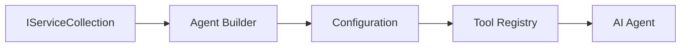

<!--
CO_OP_TRANSLATOR_METADATA:
{
  "original_hash": "bcc874e190347bd6a095aed56dc16de8",
  "translation_date": "2025-11-13T11:48:08+00:00",
  "source_file": "03-agentic-design-patterns/code_samples/03-dotnet-agent-framework.md",
  "language_code": "bn"
}
-->
# 🎨 GitHub মডেল (.NET) সহ Agentic ডিজাইন প্যাটার্ন

## 📋 শেখার লক্ষ্য

এই উদাহরণটি Microsoft Agent Framework ব্যবহার করে .NET-এ GitHub মডেল ইন্টিগ্রেশনের মাধ্যমে বুদ্ধিমান এজেন্ট তৈরি করার জন্য এন্টারপ্রাইজ-গ্রেড ডিজাইন প্যাটার্নগুলি প্রদর্শন করে। আপনি এমন পেশাদার প্যাটার্ন এবং স্থাপত্যগত পদ্ধতি শিখবেন যা এজেন্টকে প্রোডাকশন-রেডি, রক্ষণাবেক্ষণযোগ্য এবং স্কেলযোগ্য করে তোলে।

### এন্টারপ্রাইজ ডিজাইন প্যাটার্ন

- 🏭 **ফ্যাক্টরি প্যাটার্ন**: ডিপেনডেন্সি ইনজেকশন সহ এজেন্ট তৈরির মানকরণ
- 🔧 **বিল্ডার প্যাটার্ন**: ফ্লুয়েন্ট এজেন্ট কনফিগারেশন এবং সেটআপ
- 🧵 **থ্রেড-সেফ প্যাটার্ন**: সমান্তরাল কথোপকথন ব্যবস্থাপনা
- 📋 **রিপোজিটরি প্যাটার্ন**: টুল এবং সক্ষমতা ব্যবস্থাপনার সংগঠিত পদ্ধতি

## 🎯 .NET-নির্দিষ্ট স্থাপত্যগত সুবিধা

### এন্টারপ্রাইজ বৈশিষ্ট্য

- **স্ট্রং টাইপিং**: কম্পাইল-টাইম যাচাইকরণ এবং IntelliSense সাপোর্ট
- **ডিপেনডেন্সি ইনজেকশন**: বিল্ট-ইন DI কন্টেইনার ইন্টিগ্রেশন
- **কনফিগারেশন ব্যবস্থাপনা**: IConfiguration এবং Options প্যাটার্ন
- **Async/Await**: প্রথম-শ্রেণীর অ্যাসিঙ্ক্রোনাস প্রোগ্রামিং সাপোর্ট

### প্রোডাকশন-রেডি প্যাটার্ন

- **লগিং ইন্টিগ্রেশন**: ILogger এবং স্ট্রাকচার্ড লগিং সাপোর্ট
- **হেলথ চেক**: বিল্ট-ইন মনিটরিং এবং ডায়াগনস্টিকস
- **কনফিগারেশন যাচাইকরণ**: ডেটা অ্যানোটেশন সহ স্ট্রং টাইপিং
- **এরর হ্যান্ডলিং**: স্ট্রাকচার্ড এক্সসেপশন ব্যবস্থাপনা

## 🔧 টেকনিক্যাল স্থাপত্য

### মূল .NET উপাদান

- **Microsoft.Extensions.AI**: একীভূত AI সার্ভিস অ্যাবস্ট্রাকশন
- **Microsoft.Agents.AI**: এন্টারপ্রাইজ এজেন্ট অর্কেস্ট্রেশন ফ্রেমওয়ার্ক
- **GitHub মডেল ইন্টিগ্রেশন**: উচ্চ-প্রদর্শন API ক্লায়েন্ট প্যাটার্ন
- **কনফিগারেশন সিস্টেম**: appsettings.json এবং পরিবেশ ইন্টিগ্রেশন

### ডিজাইন প্যাটার্ন বাস্তবায়ন



## 🏗️ প্রদর্শিত এন্টারপ্রাইজ প্যাটার্ন

### 1. **ক্রিয়েশনাল প্যাটার্ন**

- **এজেন্ট ফ্যাক্টরি**: ধারাবাহিক কনফিগারেশন সহ কেন্দ্রীভূত এজেন্ট তৈরি
- **বিল্ডার প্যাটার্ন**: জটিল এজেন্ট কনফিগারেশনের জন্য ফ্লুয়েন্ট API
- **সিঙ্গেলটন প্যাটার্ন**: শেয়ার করা রিসোর্স এবং কনফিগারেশন ব্যবস্থাপনা
- **ডিপেনডেন্সি ইনজেকশন**: লুজ কাপলিং এবং টেস্টেবিলিটি

### 2. **বিহেভিরাল প্যাটার্ন**

- **স্ট্র্যাটেজি প্যাটার্ন**: পরিবর্তনযোগ্য টুল এক্সিকিউশন স্ট্র্যাটেজি
- **কমান্ড প্যাটার্ন**: এজেন্ট অপারেশন এনক্যাপসুলেশন সহ undo/redo
- **অবজারভার প্যাটার্ন**: ইভেন্ট-চালিত এজেন্ট লাইফসাইকেল ব্যবস্থাপনা
- **টেমপ্লেট মেথড**: এজেন্ট এক্সিকিউশন ওয়ার্কফ্লো মানকরণ

### 3. **স্ট্রাকচারাল প্যাটার্ন**

- **অ্যাডাপ্টার প্যাটার্ন**: GitHub মডেল API ইন্টিগ্রেশন লেয়ার
- **ডেকোরেটর প্যাটার্ন**: এজেন্ট সক্ষমতা বৃদ্ধি
- **ফ্যাসাড প্যাটার্ন**: সরলীকৃত এজেন্ট ইন্টারঅ্যাকশন ইন্টারফেস
- **প্রক্সি প্যাটার্ন**: পারফরম্যান্সের জন্য লেজি লোডিং এবং ক্যাশিং

## 📚 .NET ডিজাইন নীতিমালা

### SOLID নীতিমালা

- **সিঙ্গেল রেসপন্সিবিলিটি**: প্রতিটি কম্পোনেন্টের একটি স্পষ্ট উদ্দেশ্য
- **ওপেন/ক্লোজড**: পরিবর্তন ছাড়াই সম্প্রসারণযোগ্য
- **লিসকভ সাবস্টিটিউশন**: ইন্টারফেস-ভিত্তিক টুল ইমপ্লিমেন্টেশন
- **ইন্টারফেস সেগ্রিগেশন**: ফোকাসড, সংহত ইন্টারফেস
- **ডিপেনডেন্সি ইনভার্সন**: অ্যাবস্ট্রাকশন নির্ভর, কনক্রিশন নয়

### ক্লিন আর্কিটেকচার

- **ডোমেইন লেয়ার**: মূল এজেন্ট এবং টুল অ্যাবস্ট্রাকশন
- **অ্যাপ্লিকেশন লেয়ার**: এজেন্ট অর্কেস্ট্রেশন এবং ওয়ার্কফ্লো
- **ইনফ্রাস্ট্রাকচার লেয়ার**: GitHub মডেল ইন্টিগ্রেশন এবং বাহ্যিক সার্ভিস
- **প্রেজেন্টেশন লেয়ার**: ব্যবহারকারী ইন্টারঅ্যাকশন এবং রেসপন্স ফরম্যাটিং

## 🔒 এন্টারপ্রাইজ বিবেচনা

### নিরাপত্তা

- **ক্রেডেনশিয়াল ব্যবস্থাপনা**: IConfiguration সহ নিরাপদ API কী হ্যান্ডলিং
- **ইনপুট যাচাইকরণ**: স্ট্রং টাইপিং এবং ডেটা অ্যানোটেশন যাচাইকরণ
- **আউটপুট স্যানিটাইজেশন**: নিরাপদ রেসপন্স প্রসেসিং এবং ফিল্টারিং
- **অডিট লগিং**: ব্যাপক অপারেশন ট্র্যাকিং

### পারফরম্যান্স

- **অ্যাসিঙ্ক প্যাটার্ন**: নন-ব্লকিং I/O অপারেশন
- **কানেকশন পুলিং**: দক্ষ HTTP ক্লায়েন্ট ব্যবস্থাপনা
- **ক্যাশিং**: পারফরম্যান্স উন্নতির জন্য রেসপন্স ক্যাশিং
- **রিসোর্স ব্যবস্থাপনা**: সঠিক ডিসপোজাল এবং ক্লিনআপ প্যাটার্ন

### স্কেলেবিলিটি

- **থ্রেড সেফটি**: সমান্তরাল এজেন্ট এক্সিকিউশন সাপোর্ট
- **রিসোর্স পুলিং**: দক্ষ রিসোর্স ব্যবহার
- **লোড ব্যবস্থাপনা**: রেট লিমিটিং এবং ব্যাকপ্রেশার হ্যান্ডলিং
- **মনিটরিং**: পারফরম্যান্স মেট্রিক এবং হেলথ চেক

## 🚀 প্রোডাকশন ডিপ্লয়মেন্ট

- **কনফিগারেশন ব্যবস্থাপনা**: পরিবেশ-নির্দিষ্ট সেটিংস
- **লগিং স্ট্র্যাটেজি**: করেলেশন ID সহ স্ট্রাকচার্ড লগিং
- **এরর হ্যান্ডলিং**: গ্লোবাল এক্সসেপশন হ্যান্ডলিং সহ সঠিক পুনরুদ্ধার
- **মনিটরিং**: অ্যাপ্লিকেশন ইনসাইট এবং পারফরম্যান্স কাউন্টার
- **টেস্টিং**: ইউনিট টেস্ট, ইন্টিগ্রেশন টেস্ট এবং লোড টেস্টিং প্যাটার্ন

এন্টারপ্রাইজ-গ্রেড বুদ্ধিমান এজেন্ট তৈরি করতে প্রস্তুত .NET দিয়ে? চলুন কিছু শক্তিশালী স্থাপত্য তৈরি করি! 🏢✨

## 🚀 শুরু করা

### প্রয়োজনীয়তা

- [.NET 10 SDK](https://dotnet.microsoft.com/download/dotnet/10.0) বা তার বেশি
- [GitHub মডেল API অ্যাক্সেস টোকেন](https://docs.github.com/github-models/github-models-at-scale/using-your-own-api-keys-in-github-models)

### প্রয়োজনীয় পরিবেশ ভেরিয়েবল

```bash
# zsh/bash
export GH_TOKEN=<your_github_token>
export GH_ENDPOINT=https://models.github.ai/inference
export GH_MODEL_ID=openai/gpt-5-mini
```

```powershell
# PowerShell
$env:GH_TOKEN = "<your_github_token>"
$env:GH_ENDPOINT = "https://models.github.ai/inference"
$env:GH_MODEL_ID = "openai/gpt-5-mini"
```

### নমুনা কোড

কোড উদাহরণ চালানোর জন্য,

```bash
# zsh/bash
chmod +x ./03-dotnet-agent-framework.cs
./03-dotnet-agent-framework.cs
```

অথবা dotnet CLI ব্যবহার করে:

```bash
dotnet run ./03-dotnet-agent-framework.cs
```

সম্পূর্ণ কোডের জন্য দেখুন [`03-dotnet-agent-framework.cs`](../../../../03-agentic-design-patterns/code_samples/03-dotnet-agent-framework.cs)।

```csharp
#!/usr/bin/dotnet run

#:package Microsoft.Extensions.AI@10.*
#:package Microsoft.Agents.AI.OpenAI@1.*-*

using System.ClientModel;
using System.ComponentModel;

using Microsoft.Agents.AI;
using Microsoft.Extensions.AI;

using OpenAI;

// Tool Function: Random Destination Generator
// This static method will be available to the agent as a callable tool
// The [Description] attribute helps the AI understand when to use this function
// This demonstrates how to create custom tools for AI agents
[Description("Provides a random vacation destination.")]
static string GetRandomDestination()
{
    // List of popular vacation destinations around the world
    // The agent will randomly select from these options
    var destinations = new List<string>
    {
        "Paris, France",
        "Tokyo, Japan",
        "New York City, USA",
        "Sydney, Australia",
        "Rome, Italy",
        "Barcelona, Spain",
        "Cape Town, South Africa",
        "Rio de Janeiro, Brazil",
        "Bangkok, Thailand",
        "Vancouver, Canada"
    };

    // Generate random index and return selected destination
    // Uses System.Random for simple random selection
    var random = new Random();
    int index = random.Next(destinations.Count);
    return destinations[index];
}

// Extract configuration from environment variables
// Retrieve the GitHub Models API endpoint, defaults to https://models.github.ai/inference if not specified
// Retrieve the model ID, defaults to openai/gpt-5-mini if not specified
// Retrieve the GitHub token for authentication, throws exception if not specified
var github_endpoint = Environment.GetEnvironmentVariable("GH_ENDPOINT") ?? "https://models.github.ai/inference";
var github_model_id = Environment.GetEnvironmentVariable("GH_MODEL_ID") ?? "openai/gpt-5-mini";
var github_token = Environment.GetEnvironmentVariable("GH_TOKEN") ?? throw new InvalidOperationException("GH_TOKEN is not set.");

// Configure OpenAI Client Options
// Create configuration options to point to GitHub Models endpoint
// This redirects OpenAI client calls to GitHub's model inference service
var openAIOptions = new OpenAIClientOptions()
{
    Endpoint = new Uri(github_endpoint)
};

// Initialize OpenAI Client with GitHub Models Configuration
// Create OpenAI client using GitHub token for authentication
// Configure it to use GitHub Models endpoint instead of OpenAI directly
var openAIClient = new OpenAIClient(new ApiKeyCredential(github_token), openAIOptions);

// Define Agent Identity and Comprehensive Instructions
// Agent name for identification and logging purposes
var AGENT_NAME = "TravelAgent";

// Detailed instructions that define the agent's personality, capabilities, and behavior
// This system prompt shapes how the agent responds and interacts with users
var AGENT_INSTRUCTIONS = """
You are a helpful AI Agent that can help plan vacations for customers.

Important: When users specify a destination, always plan for that location. Only suggest random destinations when the user hasn't specified a preference.

When the conversation begins, introduce yourself with this message:
"Hello! I'm your TravelAgent assistant. I can help plan vacations and suggest interesting destinations for you. Here are some things you can ask me:
1. Plan a day trip to a specific location
2. Suggest a random vacation destination
3. Find destinations with specific features (beaches, mountains, historical sites, etc.)
4. Plan an alternative trip if you don't like my first suggestion

What kind of trip would you like me to help you plan today?"

Always prioritize user preferences. If they mention a specific destination like "Bali" or "Paris," focus your planning on that location rather than suggesting alternatives.
""";

// Create AI Agent with Advanced Travel Planning Capabilities
// Initialize complete agent pipeline: OpenAI client → Chat client → AI agent
// Configure agent with name, detailed instructions, and available tools
// This demonstrates the .NET agent creation pattern with full configuration
AIAgent agent = openAIClient
    .GetChatClient(github_model_id)
    .CreateAIAgent(
        name: AGENT_NAME,
        instructions: AGENT_INSTRUCTIONS,
        tools: [AIFunctionFactory.Create(GetRandomDestination)]
    );

// Create New Conversation Thread for Context Management
// Initialize a new conversation thread to maintain context across multiple interactions
// Threads enable the agent to remember previous exchanges and maintain conversational state
// This is essential for multi-turn conversations and contextual understanding
AgentThread thread = agent.GetNewThread();

// Execute Agent: First Travel Planning Request
// Run the agent with an initial request that will likely trigger the random destination tool
// The agent will analyze the request, use the GetRandomDestination tool, and create an itinerary
// Using the thread parameter maintains conversation context for subsequent interactions
await foreach (var update in agent.RunStreamingAsync("Plan me a day trip", thread))
{
    await Task.Delay(10);
    Console.Write(update);
}

Console.WriteLine();

// Execute Agent: Follow-up Request with Context Awareness
// Demonstrate contextual conversation by referencing the previous response
// The agent remembers the previous destination suggestion and will provide an alternative
// This showcases the power of conversation threads and contextual understanding in .NET agents
await foreach (var update in agent.RunStreamingAsync("I don't like that destination. Plan me another vacation.", thread))
{
    await Task.Delay(10);
    Console.Write(update);
}
```

---

<!-- CO-OP TRANSLATOR DISCLAIMER START -->
**অস্বীকৃতি**:  
এই নথিটি AI অনুবাদ পরিষেবা [Co-op Translator](https://github.com/Azure/co-op-translator) ব্যবহার করে অনুবাদ করা হয়েছে। আমরা যথাসাধ্য সঠিক অনুবাদের চেষ্টা করি, তবে দয়া করে মনে রাখবেন যে স্বয়ংক্রিয় অনুবাদে ত্রুটি বা অসঙ্গতি থাকতে পারে। নথিটির মূল ভাষায় থাকা সংস্করণটিকে প্রামাণিক উৎস হিসেবে বিবেচনা করা উচিত। গুরুত্বপূর্ণ তথ্যের জন্য, পেশাদার মানব অনুবাদ সুপারিশ করা হয়। এই অনুবাদ ব্যবহারের ফলে সৃষ্ট কোনো ভুল বোঝাবুঝি বা ভুল ব্যাখ্যার জন্য আমরা দায়ী নই।
<!-- CO-OP TRANSLATOR DISCLAIMER END -->