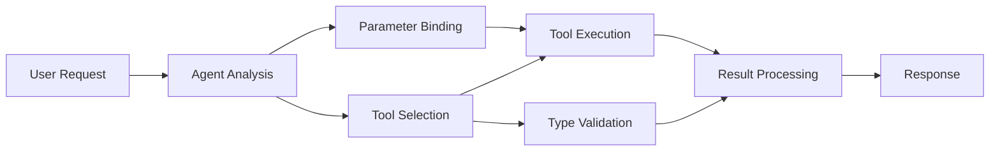

<!--
CO_OP_TRANSLATOR_METADATA:
{
  "original_hash": "91d6061e402489603f2ec8b528cae59b",
  "translation_date": "2025-11-18T17:05:11+00:00",
  "source_file": "04-tool-use/code_samples/04-dotnet-agent-framework.md",
  "language_code": "bn"
}
-->
# 🛠️ GitHub মডেলের সাথে উন্নত টুল ব্যবহারের কৌশল (.NET)

## 📋 শেখার লক্ষ্যসমূহ

এই নোটবুকটি Microsoft Agent Framework ব্যবহার করে .NET-এ GitHub মডেলের সাথে এন্টারপ্রাইজ-গ্রেড টুল ইন্টিগ্রেশন প্যাটার্ন প্রদর্শন করে। আপনি একাধিক বিশেষায়িত টুল সহ উন্নত এজেন্ট তৈরি করতে শিখবেন, যেখানে C#-এর শক্তিশালী টাইপিং এবং .NET-এর এন্টারপ্রাইজ বৈশিষ্ট্যগুলো কাজে লাগানো হবে।

### উন্নত টুলের সক্ষমতা যা আপনি আয়ত্ত করবেন

- 🔧 **মাল্টি-টুল আর্কিটেকচার**: একাধিক বিশেষায়িত ক্ষমতা সহ এজেন্ট তৈরি
- 🎯 **টাইপ-সেফ টুল এক্সিকিউশন**: C#-এর কম্পাইল-টাইম যাচাইকরণ ব্যবহার
- 📊 **এন্টারপ্রাইজ টুল প্যাটার্ন**: প্রোডাকশন-রেডি টুল ডিজাইন এবং ত্রুটি পরিচালনা
- 🔗 **টুল কম্পোজিশন**: জটিল ব্যবসায়িক কার্যপ্রবাহের জন্য টুল সমন্বয়

## 🎯 .NET টুল আর্কিটেকচারের সুবিধা

### এন্টারপ্রাইজ টুল বৈশিষ্ট্য

- **কম্পাইল-টাইম যাচাইকরণ**: শক্তিশালী টাইপিং টুল প্যারামিটারের সঠিকতা নিশ্চিত করে
- **ডিপেনডেন্সি ইনজেকশন**: টুল ব্যবস্থাপনার জন্য IoC কন্টেইনার ইন্টিগ্রেশন
- **অ্যাসিঙ্ক/অ্যাওয়েট প্যাটার্ন**: সঠিক রিসোর্স ব্যবস্থাপনার সাথে নন-ব্লকিং টুল এক্সিকিউশন
- **স্ট্রাকচার্ড লগিং**: টুল এক্সিকিউশন পর্যবেক্ষণের জন্য বিল্ট-ইন লগিং ইন্টিগ্রেশন

### প্রোডাকশন-রেডি প্যাটার্ন

- **এক্সসেপশন হ্যান্ডলিং**: টাইপড এক্সসেপশন সহ বিস্তৃত ত্রুটি ব্যবস্থাপনা
- **রিসোর্স ব্যবস্থাপনা**: সঠিক ডিসপোজাল প্যাটার্ন এবং মেমোরি ব্যবস্থাপনা
- **পারফরম্যান্স মনিটরিং**: বিল্ট-ইন মেট্রিক্স এবং পারফরম্যান্স কাউন্টার
- **কনফিগারেশন ব্যবস্থাপনা**: যাচাইকরণ সহ টাইপ-সেফ কনফিগারেশন

## 🔧 টেকনিক্যাল আর্কিটেকচার

### মূল .NET টুল উপাদান

- **Microsoft.Extensions.AI**: ইউনিফাইড টুল অ্যাবস্ট্রাকশন লেয়ার
- **Microsoft.Agents.AI**: এন্টারপ্রাইজ-গ্রেড টুল অর্কেস্ট্রেশন
- **GitHub মডেল ইন্টিগ্রেশন**: উচ্চ-দক্ষতার API ক্লায়েন্ট কনেকশন পুলিং সহ

### টুল এক্সিকিউশন পাইপলাইন



## 🛠️ টুল ক্যাটাগরি এবং প্যাটার্ন

### 1. **ডেটা প্রসেসিং টুল**

- **ইনপুট যাচাইকরণ**: ডেটা অ্যানোটেশন সহ শক্তিশালী টাইপিং
- **ট্রান্সফর্ম অপারেশন**: টাইপ-সেফ ডেটা রূপান্তর এবং ফরম্যাটিং
- **ব্যবসায়িক লজিক**: ডোমেইন-নির্দিষ্ট গণনা এবং বিশ্লেষণ টুল
- **আউটপুট ফরম্যাটিং**: কাঠামোবদ্ধ প্রতিক্রিয়া তৈরি

### 2. **ইন্টিগ্রেশন টুল**

- **API কানেক্টর**: HttpClient সহ RESTful সার্ভিস ইন্টিগ্রেশন
- **ডেটাবেস টুল**: ডেটা অ্যাক্সেসের জন্য Entity Framework ইন্টিগ্রেশন
- **ফাইল অপারেশন**: যাচাইকরণ সহ নিরাপদ ফাইল সিস্টেম অপারেশন
- **বাহ্যিক পরিষেবা**: তৃতীয় পক্ষের পরিষেবা ইন্টিগ্রেশন প্যাটার্ন

### 3. **ইউটিলিটি টুল**

- **টেক্সট প্রসেসিং**: স্ট্রিং ম্যানিপুলেশন এবং ফরম্যাটিং ইউটিলিটি
- **তারিখ/সময় অপারেশন**: কালচার-অবগত তারিখ/সময় গণনা
- **গাণিতিক টুল**: সুনির্দিষ্ট গণনা এবং পরিসংখ্যান অপারেশন
- **যাচাইকরণ টুল**: ব্যবসায়িক নিয়ম যাচাইকরণ এবং ডেটা যাচাইকরণ

এখন কি এন্টারপ্রাইজ-গ্রেড এজেন্ট তৈরি করতে প্রস্তুত, যেখানে শক্তিশালী, টাইপ-সেফ টুল ক্ষমতা রয়েছে .NET-এ? চলুন পেশাদার-গ্রেড সমাধান তৈরি করি! 🏢⚡

## 🚀 শুরু করা যাক

### প্রয়োজনীয়তা

- [.NET 10 SDK](https://dotnet.microsoft.com/download/dotnet/10.0) বা তার উপরে
- [GitHub মডেল API অ্যাক্সেস টোকেন](https://docs.github.com/github-models/github-models-at-scale/using-your-own-api-keys-in-github-models)

### প্রয়োজনীয় পরিবেশ ভেরিয়েবল

```bash
# zsh/bash
export GH_TOKEN=<your_github_token>
export GH_ENDPOINT=https://models.github.ai/inference
export GH_MODEL_ID=openai/gpt-5-mini
```

```powershell
# PowerShell
$env:GH_TOKEN = "<your_github_token>"
$env:GH_ENDPOINT = "https://models.github.ai/inference"
$env:GH_MODEL_ID = "openai/gpt-5-mini"
```

### নমুনা কোড

কোড উদাহরণ চালানোর জন্য,

```bash
# zsh/bash
chmod +x ./04-dotnet-agent-framework.cs
./04-dotnet-agent-framework.cs
```

অথবা dotnet CLI ব্যবহার করে:

```bash
dotnet run ./04-dotnet-agent-framework.cs
```

সম্পূর্ণ কোডের জন্য দেখুন [`04-dotnet-agent-framework.cs`](../../../../04-tool-use/code_samples/04-dotnet-agent-framework.cs)।

```csharp
#!/usr/bin/dotnet run

#:package Microsoft.Extensions.AI@10.*
#:package Microsoft.Agents.AI.OpenAI@1.*-*

using System.ClientModel;
using System.ComponentModel;

using Microsoft.Agents.AI;
using Microsoft.Extensions.AI;

using OpenAI;

// Tool Function: Random Destination Generator
// This static method will be available to the agent as a callable tool
// The [Description] attribute helps the AI understand when to use this function
// This demonstrates how to create custom tools for AI agents
[Description("Provides a random vacation destination.")]
static string GetRandomDestination()
{
    // List of popular vacation destinations around the world
    // The agent will randomly select from these options
    var destinations = new List<string>
    {
        "Paris, France",
        "Tokyo, Japan",
        "New York City, USA",
        "Sydney, Australia",
        "Rome, Italy",
        "Barcelona, Spain",
        "Cape Town, South Africa",
        "Rio de Janeiro, Brazil",
        "Bangkok, Thailand",
        "Vancouver, Canada"
    };

    // Generate random index and return selected destination
    // Uses System.Random for simple random selection
    var random = new Random();
    int index = random.Next(destinations.Count);
    return destinations[index];
}

// Extract configuration from environment variables
// Retrieve the GitHub Models API endpoint, defaults to https://models.github.ai/inference if not specified
// Retrieve the model ID, defaults to openai/gpt-5-mini if not specified
// Retrieve the GitHub token for authentication, throws exception if not specified
var github_endpoint = Environment.GetEnvironmentVariable("GH_ENDPOINT") ?? "https://models.github.ai/inference";
var github_model_id = Environment.GetEnvironmentVariable("GH_MODEL_ID") ?? "openai/gpt-5-mini";
var github_token = Environment.GetEnvironmentVariable("GH_TOKEN") ?? throw new InvalidOperationException("GH_TOKEN is not set.");

// Configure OpenAI Client Options
// Create configuration options to point to GitHub Models endpoint
// This redirects OpenAI client calls to GitHub's model inference service
var openAIOptions = new OpenAIClientOptions()
{
    Endpoint = new Uri(github_endpoint)
};

// Initialize OpenAI Client with GitHub Models Configuration
// Create OpenAI client using GitHub token for authentication
// Configure it to use GitHub Models endpoint instead of OpenAI directly
var openAIClient = new OpenAIClient(new ApiKeyCredential(github_token), openAIOptions);

// Define Agent Identity and Comprehensive Instructions
// Agent name for identification and logging purposes
var AGENT_NAME = "TravelAgent";

// Detailed instructions that define the agent's personality, capabilities, and behavior
// This system prompt shapes how the agent responds and interacts with users
var AGENT_INSTRUCTIONS = """
You are a helpful AI Agent that can help plan vacations for customers.

Important: When users specify a destination, always plan for that location. Only suggest random destinations when the user hasn't specified a preference.

When the conversation begins, introduce yourself with this message:
"Hello! I'm your TravelAgent assistant. I can help plan vacations and suggest interesting destinations for you. Here are some things you can ask me:
1. Plan a day trip to a specific location
2. Suggest a random vacation destination
3. Find destinations with specific features (beaches, mountains, historical sites, etc.)
4. Plan an alternative trip if you don't like my first suggestion

What kind of trip would you like me to help you plan today?"

Always prioritize user preferences. If they mention a specific destination like "Bali" or "Paris," focus your planning on that location rather than suggesting alternatives.
""";

// Create AI Agent with Advanced Travel Planning Capabilities
// Initialize complete agent pipeline: OpenAI client → Chat client → AI agent
// Configure agent with name, detailed instructions, and available tools
// This demonstrates the .NET agent creation pattern with full configuration
AIAgent agent = openAIClient
    .GetChatClient(github_model_id)
    .CreateAIAgent(
        name: AGENT_NAME,
        instructions: AGENT_INSTRUCTIONS,
        tools: [AIFunctionFactory.Create(GetRandomDestination)]
    );

// Create New Conversation Thread for Context Management
// Initialize a new conversation thread to maintain context across multiple interactions
// Threads enable the agent to remember previous exchanges and maintain conversational state
// This is essential for multi-turn conversations and contextual understanding
AgentThread thread = agent.GetNewThread();

// Execute Agent: First Travel Planning Request
// Run the agent with an initial request that will likely trigger the random destination tool
// The agent will analyze the request, use the GetRandomDestination tool, and create an itinerary
// Using the thread parameter maintains conversation context for subsequent interactions
await foreach (var update in agent.RunStreamingAsync("Plan me a day trip", thread))
{
    await Task.Delay(10);
    Console.Write(update);
}

Console.WriteLine();

// Execute Agent: Follow-up Request with Context Awareness
// Demonstrate contextual conversation by referencing the previous response
// The agent remembers the previous destination suggestion and will provide an alternative
// This showcases the power of conversation threads and contextual understanding in .NET agents
await foreach (var update in agent.RunStreamingAsync("I don't like that destination. Plan me another vacation.", thread))
{
    await Task.Delay(10);
    Console.Write(update);
}
```

---

<!-- CO-OP TRANSLATOR DISCLAIMER START -->
**অস্বীকৃতি**:  
এই নথিটি AI অনুবাদ পরিষেবা [Co-op Translator](https://github.com/Azure/co-op-translator) ব্যবহার করে অনুবাদ করা হয়েছে। আমরা যথাসম্ভব সঠিক অনুবাদের চেষ্টা করি, তবে দয়া করে মনে রাখবেন যে স্বয়ংক্রিয় অনুবাদে ত্রুটি বা অসঙ্গতি থাকতে পারে। নথিটির মূল ভাষায় থাকা সংস্করণটিকে প্রামাণিক উৎস হিসেবে বিবেচনা করা উচিত। গুরুত্বপূর্ণ তথ্যের জন্য, পেশাদার মানব অনুবাদ সুপারিশ করা হয়। এই অনুবাদ ব্যবহারের ফলে সৃষ্ট কোনো ভুল বোঝাবুঝি বা ভুল ব্যাখ্যার জন্য আমরা দায়ী নই।
<!-- CO-OP TRANSLATOR DISCLAIMER END -->