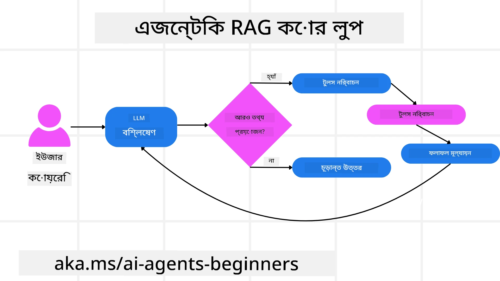
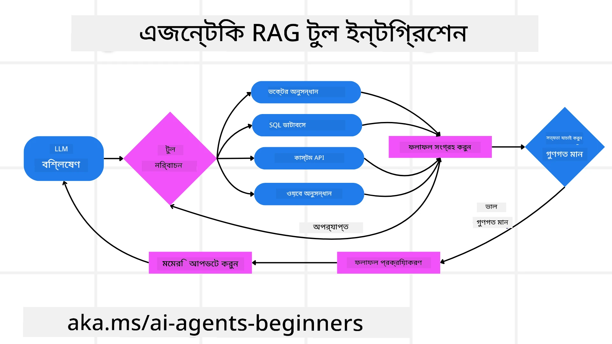
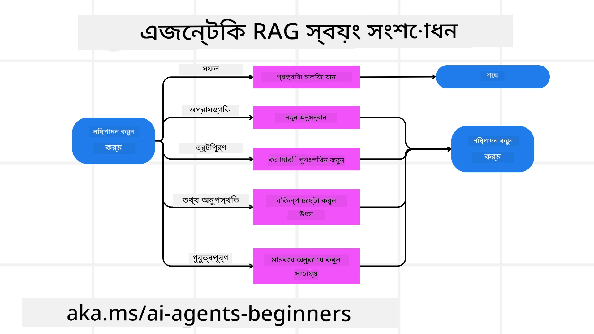

<!--
CO_OP_TRANSLATOR_METADATA:
{
  "original_hash": "0ebf6b2290db55dbf2d10cc49655523b",
  "translation_date": "2025-09-30T06:39:51+00:00",
  "source_file": "05-agentic-rag/README.md",
  "language_code": "bn"
}
-->

> _(উপরের ছবিতে ক্লিক করে এই পাঠের ভিডিও দেখুন)_

# Agentic RAG

এই পাঠটি Agentic Retrieval-Augmented Generation (Agentic RAG)-এর একটি বিস্তৃত পর্যালোচনা প্রদান করে। এটি একটি উদীয়মান AI পদ্ধতি যেখানে বড় ভাষার মডেল (LLMs) স্বয়ংক্রিয়ভাবে তাদের পরবর্তী পদক্ষেপ পরিকল্পনা করে এবং বাহ্যিক উৎস থেকে তথ্য সংগ্রহ করে। স্থির retrieval-then-read প্যাটার্নের বিপরীতে, Agentic RAG-এ LLM-এর পুনরাবৃত্তি কল, টুল বা ফাংশন কল এবং কাঠামোগত আউটপুটের সাথে মিশ্রিত থাকে। সিস্টেমটি ফলাফল মূল্যায়ন করে, প্রশ্নগুলি পরিমার্জন করে, প্রয়োজনে অতিরিক্ত টুল ব্যবহার করে এবং একটি সন্তোষজনক সমাধান না পাওয়া পর্যন্ত এই চক্রটি চালিয়ে যায়।

## পরিচিতি

এই পাঠে আলোচনা করা হবে:

- **Agentic RAG বোঝা:** AI-এর একটি উদীয়মান পদ্ধতি সম্পর্কে জানুন যেখানে বড় ভাষার মডেল (LLMs) স্বয়ংক্রিয়ভাবে তাদের পরবর্তী পদক্ষেপ পরিকল্পনা করে এবং বাহ্যিক ডেটা উৎস থেকে তথ্য সংগ্রহ করে।
- **Iterative Maker-Checker স্টাইল বোঝা:** LLM-এর পুনরাবৃত্তি কলের লুপ, টুল বা ফাংশন কল এবং কাঠামোগত আউটপুটের সাথে মিশ্রিত, যা সঠিকতা উন্নত করতে এবং ত্রুটিপূর্ণ প্রশ্ন পরিচালনা করতে ডিজাইন করা হয়েছে।
- **প্রায়োগিক প্রয়োগ অন্বেষণ:** Agentic RAG-এর উজ্জ্বল উদাহরণ চিহ্নিত করুন, যেমন সঠিকতা-প্রথম পরিবেশ, জটিল ডেটাবেস ইন্টারঅ্যাকশন এবং দীর্ঘায়িত কর্মপ্রবাহ।

## শেখার লক্ষ্য

এই পাঠ শেষ করার পরে, আপনি জানবেন বা বুঝবেন:

- **Agentic RAG বোঝা:** AI-এর একটি উদীয়মান পদ্ধতি সম্পর্কে জানুন যেখানে বড় ভাষার মডেল (LLMs) স্বয়ংক্রিয়ভাবে তাদের পরবর্তী পদক্ষেপ পরিকল্পনা করে এবং বাহ্যিক ডেটা উৎস থেকে তথ্য সংগ্রহ করে।
- **Iterative Maker-Checker স্টাইল:** LLM-এর পুনরাবৃত্তি কলের লুপের ধারণা বোঝা, টুল বা ফাংশন কল এবং কাঠামোগত আউটপুটের সাথে মিশ্রিত, যা সঠিকতা উন্নত করতে এবং ত্রুটিপূর্ণ প্রশ্ন পরিচালনা করতে ডিজাইন করা হয়েছে।
- **যুক্তি প্রক্রিয়ার মালিকানা:** সিস্টেমের যুক্তি প্রক্রিয়ার মালিকানা নেওয়ার ক্ষমতা বোঝা, পূর্বনির্ধারিত পথের উপর নির্ভর না করে সমস্যাগুলির কাছে কীভাবে পৌঁছানো যায় তা সিদ্ধান্ত নেওয়া।
- **কর্মপ্রবাহ:** একটি Agentic মডেল কীভাবে স্বাধীনভাবে বাজার প্রবণতা রিপোর্ট সংগ্রহ, প্রতিযোগী ডেটা চিহ্নিত, অভ্যন্তরীণ বিক্রয় মেট্রিকের সাথে সম্পর্ক স্থাপন, ফলাফল সংশ্লেষণ এবং কৌশল মূল্যায়ন করে তা বোঝা।
- **পুনরাবৃত্তি লুপ, টুল ইন্টিগ্রেশন এবং মেমরি:** লুপড ইন্টারঅ্যাকশন প্যাটার্নের উপর সিস্টেমের নির্ভরতা সম্পর্কে জানুন, পুনরাবৃত্তি লুপ এড়াতে এবং তথ্যপূর্ণ সিদ্ধান্ত নিতে ধাপগুলির মধ্যে রাজ্য এবং মেমরি বজায় রাখা।
- **ব্যর্থতার মোড পরিচালনা এবং স্ব-সংশোধন:** সিস্টেমের শক্তিশালী স্ব-সংশোধন প্রক্রিয়া অন্বেষণ করুন, যার মধ্যে পুনরাবৃত্তি এবং পুনরায় প্রশ্ন করা, ডায়াগনস্টিক টুল ব্যবহার করা এবং মানব তত্ত্বাবধানে ফিরে যাওয়া অন্তর্ভুক্ত।
- **Agentic ক্ষমতার সীমাবদ্ধতা:** Agentic RAG-এর সীমাবদ্ধতা বোঝা, ডোমেন-নির্দিষ্ট স্বায়ত্তশাসন, অবকাঠামো নির্ভরতা এবং গার্ডরেলগুলির প্রতি সম্মানের উপর ফোকাস করা।
- **প্রায়োগিক ব্যবহার এবং মূল্য:** Agentic RAG-এর উজ্জ্বল উদাহরণ চিহ্নিত করুন, যেমন সঠিকতা-প্রথম পরিবেশ, জটিল ডেটাবেস ইন্টারঅ্যাকশন এবং দীর্ঘায়িত কর্মপ্রবাহ।
- **শাসন, স্বচ্ছতা এবং বিশ্বাস:** শাসন এবং স্বচ্ছতার গুরুত্ব সম্পর্কে জানুন, যার মধ্যে যুক্তিযুক্ত ব্যাখ্যা, পক্ষপাত নিয়ন্ত্রণ এবং মানব তত্ত্বাবধান অন্তর্ভুক্ত।

## Agentic RAG কী?

Agentic Retrieval-Augmented Generation (Agentic RAG) একটি উদীয়মান AI পদ্ধতি যেখানে বড় ভাষার মডেল (LLMs) স্বয়ংক্রিয়ভাবে তাদের পরবর্তী পদক্ষেপ পরিকল্পনা করে এবং বাহ্যিক উৎস থেকে তথ্য সংগ্রহ করে। স্থির retrieval-then-read প্যাটার্নের বিপরীতে, Agentic RAG-এ LLM-এর পুনরাবৃত্তি কল, টুল বা ফাংশন কল এবং কাঠামোগত আউটপুটের সাথে মিশ্রিত থাকে। সিস্টেমটি ফলাফল মূল্যায়ন করে, প্রশ্নগুলি পরিমার্জন করে, প্রয়োজনে অতিরিক্ত টুল ব্যবহার করে এবং একটি সন্তোষজনক সমাধান না পাওয়া পর্যন্ত এই চক্রটি চালিয়ে যায়। এই পুনরাবৃত্তি "maker-checker" স্টাইল সঠিকতা উন্নত করে, ত্রুটিপূর্ণ প্রশ্ন পরিচালনা করে এবং উচ্চ-মানের ফলাফল নিশ্চিত করে।

সিস্টেমটি সক্রিয়ভাবে তার যুক্তি প্রক্রিয়ার মালিকানা গ্রহণ করে, ব্যর্থ প্রশ্নগুলি পুনরায় লেখে, বিভিন্ন retrieval পদ্ধতি বেছে নেয় এবং একাধিক টুল একত্রিত করে—যেমন Azure AI Search-এ vector search, SQL ডেটাবেস বা কাস্টম API—তার উত্তর চূড়ান্ত করার আগে। একটি Agentic সিস্টেমের স্বতন্ত্র গুণ হল তার যুক্তি প্রক্রিয়ার মালিকানা নেওয়ার ক্ষমতা। ঐতিহ্যবাহী RAG বাস্তবায়ন পূর্বনির্ধারিত পথের উপর নির্ভর করে, কিন্তু একটি Agentic সিস্টেম তথ্যের গুণমানের উপর ভিত্তি করে পদক্ষেপগুলির ক্রম স্বয়ংক্রিয়ভাবে নির্ধারণ করে।

## Agentic Retrieval-Augmented Generation (Agentic RAG) সংজ্ঞা

Agentic Retrieval-Augmented Generation (Agentic RAG) AI উন্নয়নের একটি উদীয়মান পদ্ধতি যেখানে LLMs শুধুমাত্র বাহ্যিক ডেটা উৎস থেকে তথ্য সংগ্রহ করে না, বরং স্বয়ংক্রিয়ভাবে তাদের পরবর্তী পদক্ষেপ পরিকল্পনা করে। স্থির retrieval-then-read প্যাটার্ন বা সাবধানে স্ক্রিপ্ট করা prompt sequences-এর বিপরীতে, Agentic RAG-এ LLM-এর পুনরাবৃত্তি কল, টুল বা ফাংশন কল এবং কাঠামোগত আউটপুটের সাথে মিশ্রিত থাকে। প্রতিটি ধাপে, সিস্টেমটি প্রাপ্ত ফলাফলগুলি মূল্যায়ন করে, তার প্রশ্নগুলি পরিমার্জন করার সিদ্ধান্ত নেয়, প্রয়োজনে অতিরিক্ত টুল ব্যবহার করে এবং একটি সন্তোষজনক সমাধান না পাওয়া পর্যন্ত এই চক্রটি চালিয়ে যায়।

এই পুনরাবৃত্তি "maker-checker" স্টাইল অপারেশন সঠিকতা উন্নত করতে, ত্রুটিপূর্ণ প্রশ্ন পরিচালনা করতে এবং সুষম, উচ্চ-মানের ফলাফল নিশ্চিত করতে ডিজাইন করা হয়েছে। সাবধানে প্রকৌশলযুক্ত prompt chains-এর উপর নির্ভর করার পরিবর্তে, সিস্টেমটি সক্রিয়ভাবে তার যুক্তি প্রক্রিয়ার মালিকানা গ্রহণ করে। এটি ব্যর্থ প্রশ্নগুলি পুনরায় লেখার ক্ষমতা রাখে, বিভিন্ন retrieval পদ্ধতি বেছে নেয় এবং একাধিক টুল একত্রিত করে—যেমন Azure AI Search-এ vector search, SQL ডেটাবেস বা কাস্টম API—তার উত্তর চূড়ান্ত করার আগে। এটি অত্যন্ত জটিল orchestration frameworks-এর প্রয়োজনীয়তা দূর করে। পরিবর্তে, একটি তুলনামূলকভাবে সহজ লুপ "LLM call → tool use → LLM call → …" জটিল এবং ভাল-ভিত্তিক আউটপুট প্রদান করতে পারে।

## যুক্তি প্রক্রিয়ার মালিকানা

যে গুণটি একটি সিস্টেমকে "agentic" করে তোলে তা হল তার যুক্তি প্রক্রিয়ার মালিকানা নেওয়ার ক্ষমতা। ঐতিহ্যবাহী RAG বাস্তবায়ন প্রায়ই মডেলের জন্য একটি পথ পূর্বনির্ধারণ করতে মানুষের উপর নির্ভর করে: একটি chain-of-thought যা কী retrieve করতে হবে এবং কখন করতে হবে তা নির্দেশ করে।
কিন্তু যখন একটি সিস্টেম সত্যিই agentic হয়, এটি অভ্যন্তরীণভাবে সমস্যার কাছে পৌঁছানোর উপায় সিদ্ধান্ত নেয়। এটি শুধুমাত্র একটি স্ক্রিপ্ট কার্যকর করছে না; এটি তথ্যের গুণমানের উপর ভিত্তি করে পদক্ষেপগুলির ক্রম স্বয়ংক্রিয়ভাবে নির্ধারণ করছে।
উদাহরণস্বরূপ, যদি এটি একটি পণ্য লঞ্চ কৌশল তৈরি করতে বলা হয়, এটি পুরো গবেষণা এবং সিদ্ধান্ত গ্রহণ কর্মপ্রবাহটি স্পষ্টভাবে বর্ণনা করে এমন একটি prompt-এর উপর নির্ভর করে না। পরিবর্তে, Agentic মডেল স্বাধীনভাবে সিদ্ধান্ত নেয়:

1. Bing Web Grounding ব্যবহার করে বর্তমান বাজার প্রবণতা রিপোর্ট retrieve করা।
2. Azure AI Search ব্যবহার করে প্রাসঙ্গিক প্রতিযোগী ডেটা চিহ্নিত করা।
3. Azure SQL Database ব্যবহার করে ঐতিহাসিক অভ্যন্তরীণ বিক্রয় মেট্রিকের সাথে সম্পর্ক স্থাপন করা।
4. Azure OpenAI Service-এর মাধ্যমে সমন্বিত কৌশল তৈরি করা।
5. কৌশলটির ফাঁক বা অসঙ্গতি মূল্যায়ন করা, প্রয়োজনে পুনরায় retrieval-এর জন্য অনুরোধ করা।
এই সমস্ত পদক্ষেপ—প্রশ্ন পরিমার্জন, উৎস নির্বাচন, উত্তর নিয়ে "সন্তুষ্ট" হওয়া পর্যন্ত পুনরাবৃত্তি—মডেল দ্বারা সিদ্ধান্ত নেওয়া হয়, মানুষের দ্বারা পূর্বনির্ধারিত নয়।

## পুনরাবৃত্তি লুপ, টুল ইন্টিগ্রেশন এবং মেমরি

একটি Agentic সিস্টেম একটি লুপড ইন্টারঅ্যাকশন প্যাটার্নের উপর নির্ভর করে:

- **প্রাথমিক কল:** ব্যবহারকারীর লক্ষ্য (অর্থাৎ ব্যবহারকারীর prompt) LLM-এ উপস্থাপন করা হয়।
- **টুল ব্যবহার:** যদি মডেল অনুপস্থিত তথ্য বা অস্পষ্ট নির্দেশনা চিহ্নিত করে, এটি একটি টুল বা retrieval পদ্ধতি নির্বাচন করে—যেমন একটি vector database query (উদাহরণস্বরূপ Azure AI Search Hybrid search ব্যক্তিগত ডেটার উপর) বা একটি কাঠামোগত SQL কল—আরও প্রসঙ্গ সংগ্রহ করতে।
- **মূল্যায়ন ও পরিমার্জন:** ফেরত দেওয়া ডেটা পর্যালোচনা করার পরে, মডেল সিদ্ধান্ত নেয় যে তথ্যটি যথেষ্ট কিনা। যদি না হয়, এটি প্রশ্নটি পরিমার্জন করে, একটি ভিন্ন টুল চেষ্টা করে বা তার পদ্ধতি সামঞ্জস্য করে।
- **সন্তুষ্ট না হওয়া পর্যন্ত পুনরাবৃত্তি:** এই চক্রটি চলতে থাকে যতক্ষণ না মডেলটি চূড়ান্ত, ভাল-যুক্তিযুক্ত উত্তর দেওয়ার জন্য পর্যাপ্ত স্পষ্টতা এবং প্রমাণ রয়েছে বলে মনে করে।
- **মেমরি ও রাজ্য:** যেহেতু সিস্টেমটি ধাপগুলির মধ্যে রাজ্য এবং মেমরি বজায় রাখে, এটি পূর্বের প্রচেষ্টা এবং তাদের ফলাফলগুলি মনে রাখতে পারে, পুনরাবৃত্তি লুপ এড়াতে এবং আরও তথ্যপূর্ণ সিদ্ধান্ত নিতে পারে।

সময়ের সাথে সাথে, এটি একটি বিকাশমান বোঝার অনুভূতি তৈরি করে, মডেলটিকে জটিল, বহু-ধাপের কাজগুলি পরিচালনা করতে সক্ষম করে তোলে, যেখানে মানুষের ক্রমাগত হস্তক্ষেপ বা prompt পুনর্গঠন প্রয়োজন হয় না।

## ব্যর্থতার মোড পরিচালনা এবং স্ব-সংশোধন

Agentic RAG-এর স্বায়ত্তশাসন শক্তিশালী স্ব-সংশোধন প্রক্রিয়াগুলিও অন্তর্ভুক্ত করে। যখন সিস্টেমটি dead ends-এ পৌঁছায়—যেমন অপ্রাসঙ্গিক ডকুমেন্ট retrieve করা বা ত্রুটিপূর্ণ প্রশ্নের সম্মুখীন হওয়া—তখন এটি:

- **পুনরাবৃত্তি এবং পুনরায় প্রশ্ন করা:** নিম্ন-মূল্যের উত্তর দেওয়ার পরিবর্তে, মডেল নতুন অনুসন্ধান কৌশল চেষ্টা করে, ডেটাবেস প্রশ্নগুলি পুনরায় লেখে বা বিকল্প ডেটা সেটগুলি দেখে।
- **ডায়াগনস্টিক টুল ব্যবহার:** সিস্টেমটি তার যুক্তি ধাপগুলি ডিবাগ করতে বা retrieve করা ডেটার সঠিকতা নিশ্চিত করতে ডিজাইন করা অতিরিক্ত ফাংশন ব্যবহার করতে পারে। Azure AI Tracing-এর মতো টুল robust observability এবং monitoring সক্ষম করতে গুরুত্বপূর্ণ হবে।
- **মানব তত্ত্বাবধানে ফিরে যাওয়া:** উচ্চ-ঝুঁকিপূর্ণ বা বারবার ব্যর্থ হওয়া পরিস্থিতিতে, মডেলটি অনিশ্চয়তা চিহ্নিত করতে পারে এবং মানব নির্দেশনা অনুরোধ করতে পারে। একবার মানুষ সংশোধনমূলক প্রতিক্রিয়া প্রদান করলে, মডেলটি সেই পাঠটি ভবিষ্যতে অন্তর্ভুক্ত করতে পারে।

এই পুনরাবৃত্তি এবং গতিশীল পদ্ধতি মডেলটিকে ক্রমাগত উন্নতি করতে দেয়, নিশ্চিত করে যে এটি শুধুমাত্র একটি এক-বারের সিস্টেম নয় বরং একটি সিস্টেম যা একটি প্রদত্ত সেশনের সময় তার ভুল থেকে শিখে।

## Agentic ক্ষমতার সীমাবদ্ধতা

একটি কাজের মধ্যে তার স্বায়ত্তশাসন সত্ত্বেও, Agentic RAG কৃত্রিম সাধারণ বুদ্ধিমত্তার সমতুল্য নয়। তার "agentic" ক্ষমতা মানব বিকাশকারীদের দ্বারা প্রদত্ত টুল, ডেটা উৎস এবং নীতিগুলির মধ্যে সীমাবদ্ধ। এটি নিজস্ব টুল উদ্ভাবন করতে পারে না বা সেট করা ডোমেন সীমার বাইরে যেতে পারে না। বরং, এটি হাতে থাকা সম্পদগুলি গতিশীলভাবে পরিচালনা করতে দক্ষ।

উন্নত AI ফর্মগুলির সাথে মূল পার্থক্যগুলির মধ্যে রয়েছে:

1. **ডোমেন-নির্দিষ্ট স্বায়ত্তশাসন:** Agentic RAG সিস্টেমগুলি একটি পরিচিত ডোমেনের মধ্যে ব্যবহারকারীর সংজ্ঞায়িত লক্ষ্য অর্জনে মনোনিবেশ করে, ফলাফল উন্নত করতে query rewriting বা tool selection-এর মতো কৌশল ব্যবহার করে।
2. **অবকাঠামো-নির্ভর:** সিস্টেমের ক্ষমতা বিকাশকারীদের দ্বারা সংহত টুল এবং ডেটার উপর নির্ভর করে। এটি মানব হস্তক্ষেপ ছাড়া এই সীমার বাইরে যেতে পারে না।
3. **গার্ডরেলের প্রতি সম্মান:** নৈতিক নির্দেশিকা, সম্মতি নিয়ম এবং ব্যবসায়িক নীতিগুলি খুবই গুরুত্বপূর্ণ। এজেন্টের স্বাধীনতা সর্বদা নিরাপত্তা ব্যবস্থা এবং তত্ত্বাবধান প্রক্রিয়াগুলির দ্বারা সীমাবদ্ধ থাকে (আশা করি?)।

## প্রায়োগিক ব্যবহার এবং মূল্য

Agentic RAG পুনরাবৃত্তি পরিমার্জন এবং নির্ভুলতার প্রয়োজনীয় পরিস্থিতিতে উজ্জ্বল:

1. **সঠিকতা-প্রথম পরিবেশ:** সম্মতি পরীক্ষা, নিয়ন্ত্রক বিশ্লেষণ বা আইনি গবেষণায়, Agentic মডেল বারবার তথ্য যাচাই করতে পারে, একাধিক উৎস পরামর্শ করতে পারে এবং একটি সম্পূর্ণ যাচাই করা উত্তর তৈরি না হওয়া পর্যন্ত প্রশ্নগুলি পুনরায় লেখতে পারে।
2. **জটিল ডেটাবেস ইন্টারঅ্যাকশন:** কাঠামোগত ডেটার সাথে কাজ করার সময় যেখানে প্রশ্নগুলি প্রায়ই ব্যর্থ হতে পারে বা সমন্বয়ের প্রয়োজন হতে পারে, সিস্টেমটি Azure SQL বা Microsoft Fabric OneLake ব্যবহার করে তার প্রশ্নগুলি স্বয়ংক্রিয়ভাবে পরিমার্জন করতে পারে, নিশ্চিত করে যে চূড়ান্ত retrieval ব্যবহারকারীর উদ্দেশ্যের সাথে সামঞ্জস্যপূর্ণ।
3. **দীর্ঘায়িত কর্মপ্রবাহ:** নতুন তথ্য প্রকাশিত হওয়ার সাথে সাথে দীর্ঘ-চলমান সেশনগুলি বিকশিত হতে পারে। Agentic RAG ক্রমাগত নতুন ডেটা অন্তর্ভুক্ত করতে পারে, সমস্যার ক্ষেত্র সম্পর্কে আরও জানতে পারার সাথে সাথে কৌশল পরিবর্তন করতে পারে।

## শাসন, স্বচ্ছতা এবং বিশ্বাস

যেহেতু এই সিস্টেমগুলি তাদের যুক্তিতে আরও স্বায়ত্তশাসিত হয়ে উঠছে, শাসন এবং স্বচ্ছতা অত্যন্ত গুরুত্বপূর্ণ:

- **যুক্তিযুক্ত ব্যাখ্যা:** মডেলটি তার তৈরি করা প্রশ্ন, পরামর্শ করা উৎস এবং তার সিদ্ধান্তে পৌঁছানোর জন্য নেওয়া যুক্তি ধাপগুলির একটি অডিট ট্রেইল প্রদান করতে পারে। Azure AI Content Safety এবং Azure AI Tracing / GenAIOps-এর মতো টুল স্বচ্ছতা বজায় রাখতে এবং ঝুঁকি কমাতে সাহায্য করতে পারে।
- **পক্ষপাত নিয়ন্ত্রণ এবং সুষম retrieval:** বিকাশকারীরা retrieval কৌশলগুলি টিউন করতে পারে যাতে সুষম, প্রতিনিধিত্বমূলক ডেটা উৎসগুলি বিবেচনা করা হয় এবং Azure Machine Learning ব্যবহার করে উন্নত ডেটা বিজ্ঞান সংস্থাগুলির জন্য কাস্টম মডেল ব্যবহার করে আউটপুটগুলি নিয়মিত অডিট করতে পারে যাতে পক্ষপাত বা skewed patterns সনাক্ত করা যায়।
- **মানব তত্ত্বাবধান এবং সম্মতি:** সংবেদনশীল কাজের জন্য, মানব পর্যালোচনা অপরিহার্য। Agentic RAG উচ্চ-ঝুঁকিপূর্ণ সিদ্ধান্তে মানব বিচারের বিকল্প নয়—এটি আরও সম্পূর্ণ যাচাই করা বিকল্পগুলি প্রদান করে এটি উন্নত করে।

যে টুলগুলি ক্রিয়াগুলির একটি পরিষ্কার রেকর্ড প্রদান করে তা অপরিহার্য। এগুলি ছাড়া, একটি বহু-ধাপ
- <a href="https://ragaboutit.com/agentic-rag-a-complete-guide-to-agent-based-retrieval-augmented-generation/" target="_blank">Agentic RAG: এজেন্ট-ভিত্তিক রিট্রিভাল অগমেন্টেড জেনারেশনের সম্পূর্ণ গাইড – জেনারেশন RAG থেকে খবর</a>
- <a href="https://huggingface.co/learn/cookbook/agent_rag" target="_blank">Agentic RAG: আপনার RAG-কে কোয়েরি পুনর্গঠন এবং সেলফ-কোয়েরি দিয়ে টার্বোচার্জ করুন! Hugging Face ওপেন-সোর্স AI কুকবুক</a>
- <a href="https://youtu.be/aQ4yQXeB1Ss?si=2HUqBzHoeB5tR04U" target="_blank">RAG-এ এজেন্টিক লেয়ার যোগ করা</a>
- <a href="https://www.youtube.com/watch?v=zeAyuLc_f3Q&t=244s" target="_blank">জ্ঞান সহায়তার ভবিষ্যৎ: জেরি লিউ</a>
- <a href="https://www.youtube.com/watch?v=AOSjiXP1jmQ" target="_blank">কিভাবে এজেন্টিক RAG সিস্টেম তৈরি করবেন</a>
- <a href="https://ignite.microsoft.com/sessions/BRK102?source=sessions" target="_blank">আপনার AI এজেন্টকে স্কেল করতে Azure AI Foundry Agent Service ব্যবহার করা</a>

### একাডেমিক পেপার

- <a href="https://arxiv.org/abs/2303.17651" target="_blank">2303.17651 Self-Refine: সেলফ-ফিডব্যাক দিয়ে পুনরাবৃত্তি পরিমার্জন</a>
- <a href="https://arxiv.org/abs/2303.11366" target="_blank">2303.11366 Reflexion: ভাষাগত এজেন্টদের সাথে মৌখিক রিইনফোর্সমেন্ট লার্নিং</a>
- <a href="https://arxiv.org/abs/2305.11738" target="_blank">2305.11738 CRITIC: বড় ভাষার মডেল টুল-ইন্টারঅ্যাকটিভ সমালোচনার মাধ্যমে নিজেকে সংশোধন করতে পারে</a>
- <a href="https://arxiv.org/abs/2501.09136" target="_blank">2501.09136 Agentic Retrieval-Augmented Generation: এজেন্টিক RAG-এর উপর একটি সার্ভে</a>

## পূর্ববর্তী পাঠ

[টুল ব্যবহারের ডিজাইন প্যাটার্ন](../04-tool-use/README.md)

## পরবর্তী পাঠ

[বিশ্বস্ত AI এজেন্ট তৈরি করা](../06-building-trustworthy-agents/README.md)

---

**অস্বীকৃতি**:  
এই নথিটি AI অনুবাদ পরিষেবা [Co-op Translator](https://github.com/Azure/co-op-translator) ব্যবহার করে অনুবাদ করা হয়েছে। আমরা যথাসাধ্য সঠিকতার জন্য চেষ্টা করি, তবে অনুগ্রহ করে মনে রাখবেন যে স্বয়ংক্রিয় অনুবাদে ত্রুটি বা অসঙ্গতি থাকতে পারে। মূল ভাষায় থাকা নথিটিকে প্রামাণিক উৎস হিসেবে বিবেচনা করা উচিত। গুরুত্বপূর্ণ তথ্যের জন্য, পেশাদার মানব অনুবাদ সুপারিশ করা হয়। এই অনুবাদ ব্যবহারের ফলে কোনো ভুল বোঝাবুঝি বা ভুল ব্যাখ্যা হলে আমরা দায়বদ্ধ থাকব না।