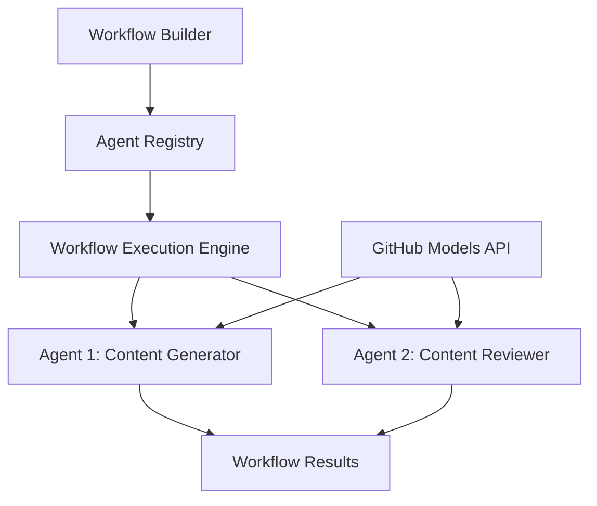

<!--
CO_OP_TRANSLATOR_METADATA:
{
  "original_hash": "034158688d0a45aae06dcbb21b0da5ae",
  "translation_date": "2025-11-11T12:45:02+00:00",
  "source_file": "08-multi-agent/code_samples/workflows-agent-framework/dotNET/01.dotnet-agent-framework-workflow-ghmodel-basic.md",
  "language_code": "bn"
}
-->
# 🔄 GitHub মডেল (.NET) ব্যবহার করে বেসিক এজেন্ট ওয়ার্কফ্লো

## 📋 ওয়ার্কফ্লো অর্কেস্ট্রেশন টিউটোরিয়াল

এই নোটবুকটি Microsoft Agent Framework for .NET এবং GitHub মডেল ব্যবহার করে উন্নত **এজেন্ট ওয়ার্কফ্লো** তৈরি করার পদ্ধতি প্রদর্শন করে। আপনি শিখবেন কীভাবে AI এজেন্টদের সহযোগিতার মাধ্যমে জটিল কাজ সম্পন্ন করতে এবং কাঠামোগত অর্কেস্ট্রেশন প্যাটার্নের মাধ্যমে বহু-ধাপের ব্যবসায়িক প্রক্রিয়া তৈরি করতে হয়।

## 🎯 শেখার লক্ষ্য

### 🏗️ **ওয়ার্কফ্লো আর্কিটেকচার মৌলিক বিষয়**
- **ওয়ার্কফ্লো বিল্ডার**: জটিল বহু-ধাপের AI প্রক্রিয়া ডিজাইন এবং পরিচালনা করুন
- **এজেন্ট সমন্বয়**: ওয়ার্কফ্লোতে একাধিক বিশেষায়িত এজেন্ট সমন্বয় করুন
- **GitHub মডেল ইন্টিগ্রেশন**: ওয়ার্কফ্লোতে GitHub-এর AI মডেল ইনফারেন্স সার্ভিস ব্যবহার করুন
- **ভিজ্যুয়াল ওয়ার্কফ্লো ডিজাইন**: ওয়ার্কফ্লো কাঠামো তৈরি এবং বোঝার জন্য ভিজ্যুয়ালাইজ করুন

### 🔄 **প্রক্রিয়া অর্কেস্ট্রেশন প্যাটার্ন**
- **সিকোয়েন্সিয়াল প্রসেসিং**: লজিক্যাল ক্রমে একাধিক এজেন্ট টাস্ক চেইন করুন
- **স্টেট ম্যানেজমেন্ট**: ওয়ার্কফ্লো ধাপগুলির মধ্যে প্রসঙ্গ এবং ডেটা প্রবাহ বজায় রাখুন
- **এরর হ্যান্ডলিং**: শক্তিশালী ত্রুটি পুনরুদ্ধার এবং ওয়ার্কফ্লো স্থিতিস্থাপকতা বাস্তবায়ন করুন
- **পারফরম্যান্স অপ্টিমাইজেশন**: এন্টারপ্রাইজ-স্কেল অপারেশনের জন্য দক্ষ ওয়ার্কফ্লো ডিজাইন করুন

### 🏢 **এন্টারপ্রাইজ ওয়ার্কফ্লো অ্যাপ্লিকেশন**
- **ব্যবসায়িক প্রক্রিয়া অটোমেশন**: জটিল সাংগঠনিক ওয়ার্কফ্লো অটোমেট করুন
- **কন্টেন্ট প্রোডাকশন পাইপলাইন**: পর্যালোচনা এবং অনুমোদন ধাপ সহ সম্পাদকীয় ওয়ার্কফ্লো
- **কাস্টমার সার্ভিস অটোমেশন**: বহু-ধাপের গ্রাহক অনুসন্ধান সমাধান
- **ডেটা প্রসেসিং ওয়ার্কফ্লো**: AI-চালিত রূপান্তর সহ ETL ওয়ার্কফ্লো

## ⚙️ প্রয়োজনীয়তা এবং সেটআপ

### 📦 **প্রয়োজনীয় NuGet প্যাকেজ**

এই ওয়ার্কফ্লো প্রদর্শনীতে বেশ কয়েকটি গুরুত্বপূর্ণ .NET প্যাকেজ ব্যবহার করা হয়েছে:

```xml
<!-- Core AI Framework -->
<PackageReference Include="Microsoft.Extensions.AI" Version="9.9.0" />

<!-- Agent Framework (Local Development) -->
<!-- Microsoft.Agents.AI.dll - Core agent abstractions -->
<!-- Microsoft.Agents.AI.OpenAI.dll - OpenAI/GitHub Models integration -->

<!-- Configuration and Environment -->
<PackageReference Include="DotNetEnv" Version="3.1.1" />
```

### 🔑 **GitHub মডেল কনফিগারেশন**

**পরিবেশ সেটআপ (.env ফাইল):**
```env
GITHUB_TOKEN=your_github_personal_access_token
GITHUB_ENDPOINT=https://models.inference.ai.azure.com
GITHUB_MODEL_ID=gpt-4o-mini
```

**GitHub মডেল অ্যাক্সেস:**
1. GitHub মডেলের জন্য সাইন আপ করুন (বর্তমানে প্রিভিউতে)
2. মডেল অ্যাক্সেস অনুমতির সাথে একটি ব্যক্তিগত অ্যাক্সেস টোকেন তৈরি করুন
3. উপরে দেখানো হিসাবে পরিবেশ ভেরিয়েবল কনফিগার করুন

### 🏗️ **ওয়ার্কফ্লো আর্কিটেকচার ওভারভিউ**



**মূল উপাদান:**
- **WorkflowBuilder**: ওয়ার্কফ্লো ডিজাইন করার জন্য প্রধান অর্কেস্ট্রেশন ইঞ্জিন
- **AIAgent**: নির্দিষ্ট ক্ষমতা সহ পৃথক বিশেষায়িত এজেন্ট
- **GitHub Models Client**: AI মডেল ইনফারেন্স সার্ভিস ইন্টিগ্রেশন
- **Execution Context**: ওয়ার্কফ্লো ধাপগুলির মধ্যে স্টেট এবং ডেটা প্রবাহ পরিচালনা করে

## 🎨 **এন্টারপ্রাইজ ওয়ার্কফ্লো ডিজাইন প্যাটার্ন**

### 📝 **কন্টেন্ট প্রোডাকশন ওয়ার্কফ্লো**
```
User Request → Content Generation → Quality Review → Final Output
```

### 🔍 **ডকুমেন্ট প্রসেসিং পাইপলাইন**
```
Document Input → Analysis → Extraction → Validation → Structured Output
```

### 💼 **বিজনেস ইন্টেলিজেন্স ওয়ার্কফ্লো**
```
Data Collection → Processing → Analysis → Report Generation → Distribution
```

### 🤝 **কাস্টমার সার্ভিস অটোমেশন**
```
Customer Inquiry → Classification → Processing → Response Generation → Follow-up
```

## 🏢 **এন্টারপ্রাইজ সুবিধা**

### 🎯 **বিশ্বস্ততা এবং স্কেলযোগ্যতা**
- **ডিটারমিনিস্টিক এক্সিকিউশন**: ধারাবাহিক, পুনরাবৃত্তিযোগ্য ওয়ার্কফ্লো ফলাফল
- **এরর রিকভারি**: ওয়ার্কফ্লো ধাপের যেকোনো ত্রুটি সুন্দরভাবে পরিচালনা
- **পারফরম্যান্স মনিটরিং**: এক্সিকিউশন মেট্রিক এবং অপ্টিমাইজেশনের সুযোগ ট্র্যাক করুন
- **রিসোর্স ম্যানেজমেন্ট**: AI মডেল রিসোর্সের দক্ষ বরাদ্দ এবং ব্যবহার

### 🔒 **নিরাপত্তা এবং সম্মতি**
- **নিরাপদ প্রমাণীকরণ**: API অ্যাক্সেসের জন্য GitHub টোকেন-ভিত্তিক প্রমাণীকরণ
- **অডিট ট্রেইল**: ওয়ার্কফ্লো এক্সিকিউশন এবং সিদ্ধান্ত পয়েন্টের সম্পূর্ণ লগিং
- **অ্যাক্সেস কন্ট্রোল**: ওয়ার্কফ্লো এক্সিকিউশন এবং মনিটরিংয়ের জন্য গ্রানুলার অনুমতি
- **ডেটা প্রাইভেসি**: ওয়ার্কফ্লো জুড়ে সংবেদনশীল তথ্যের নিরাপদ পরিচালনা

### 📊 **অবজারভেবিলিটি এবং ম্যানেজমেন্ট**
- **ভিজ্যুয়াল ওয়ার্কফ্লো ডিজাইন**: প্রক্রিয়া প্রবাহ এবং নির্ভরতার স্পষ্ট উপস্থাপনা
- **এক্সিকিউশন মনিটরিং**: ওয়ার্কফ্লো অগ্রগতি এবং পারফরম্যান্সের রিয়েল-টাইম ট্র্যাকিং
- **এরর রিপোর্টিং**: বিস্তারিত ত্রুটি বিশ্লেষণ এবং ডিবাগিং ক্ষমতা
- **পারফরম্যান্স অ্যানালিটিক্স**: অপ্টিমাইজেশন এবং ক্ষমতা পরিকল্পনার জন্য মেট্রিক

চলুন আপনার প্রথম এন্টারপ্রাইজ-রেডি AI ওয়ার্কফ্লো তৈরি করি! 🚀

## 💻 কোড চালানো

সম্পূর্ণ বাস্তবায়ন `01.dotnet-agent-framework-workflow-ghmodel-basic.cs` ফাইলে উপলব্ধ। এই ফাইলটি প্রদর্শন করে:

1. **পরিবেশ কনফিগারেশন** - `.env` ফাইল থেকে GitHub মডেল ক্রেডেনশিয়াল লোড করা
2. **OpenAI ক্লায়েন্ট সেটআপ** - GitHub মডেল এন্ডপয়েন্ট ব্যবহার করার জন্য ক্লায়েন্ট কনফিগার করা
3. **এজেন্ট তৈরি** - বিশেষায়িত এজেন্ট সংজ্ঞায়িত করা (ফ্রন্ট ডেস্ক এবং কনসিয়ার্জ)
4. **ওয়ার্কফ্লো বিল্ডার** - সিকোয়েন্সিয়াল প্রসেসিং সহ বহু-এজেন্ট ওয়ার্কফ্লো তৈরি করা
5. **ওয়ার্কফ্লো এক্সিকিউশন** - স্ট্রিমিং ফলাফলের সাথে ওয়ার্কফ্লো চালানো

### 🚀 উদাহরণ চালানো

```bash
# Make the script executable (Unix/Linux/macOS)
chmod +x 01.dotnet-agent-framework-workflow-ghmodel-basic.cs

# Run the workflow
./01.dotnet-agent-framework-workflow-ghmodel-basic.cs
```

অথবা Windows-এ:
```powershell
dotnet run 01.dotnet-agent-framework-workflow-ghmodel-basic.cs
```

### 📝 প্রত্যাশিত আউটপুট

ওয়ার্কফ্লোটি:
1. আপনার ভ্রমণের গন্তব্য অনুরোধ গ্রহণ করবে ("আমি প্যারিস যেতে চাই")
2. ফ্রন্ট ডেস্ক এজেন্ট একটি প্রাথমিক সুপারিশ প্রদান করবে
3. কনসিয়ার্জ এজেন্ট সুপারিশটি পর্যালোচনা এবং পরিমার্জন করবে
4. চূড়ান্ত আউটপুট সম্পূর্ণ কথোপকথন স্ট্রিম প্রদর্শন করবে

### 🔧 কাস্টমাইজেশন

আপনি ওয়ার্কফ্লোটি কাস্টমাইজ করতে পারেন:
- এজেন্টের নির্দেশনা পরিবর্তন করে তাদের আচরণ পরিবর্তন করুন
- আরও এজেন্ট যোগ করে জটিল বহু-ধাপের ওয়ার্কফ্লো তৈরি করুন
- ব্যবহারকারীর বার্তা পরিবর্তন করে বিভিন্ন পরিস্থিতি পরীক্ষা করুন
- ওয়ার্কফ্লো এজগুলি সামঞ্জস্য করে বিভিন্ন এক্সিকিউশন প্যাটার্ন তৈরি করুন

---

<!-- CO-OP TRANSLATOR DISCLAIMER START -->
**অস্বীকৃতি**:  
এই নথিটি AI অনুবাদ পরিষেবা [Co-op Translator](https://github.com/Azure/co-op-translator) ব্যবহার করে অনুবাদ করা হয়েছে। আমরা যথাসাধ্য সঠিকতার জন্য চেষ্টা করি, তবে অনুগ্রহ করে মনে রাখবেন যে স্বয়ংক্রিয় অনুবাদে ত্রুটি বা অসঙ্গতি থাকতে পারে। মূল ভাষায় থাকা নথিটিকে প্রামাণিক উৎস হিসেবে বিবেচনা করা উচিত। গুরুত্বপূর্ণ তথ্যের জন্য, পেশাদার মানব অনুবাদ সুপারিশ করা হয়। এই অনুবাদ ব্যবহারের ফলে কোনো ভুল বোঝাবুঝি বা ভুল ব্যাখ্যার জন্য আমরা দায়ী থাকব না।
<!-- CO-OP TRANSLATOR DISCLAIMER END -->