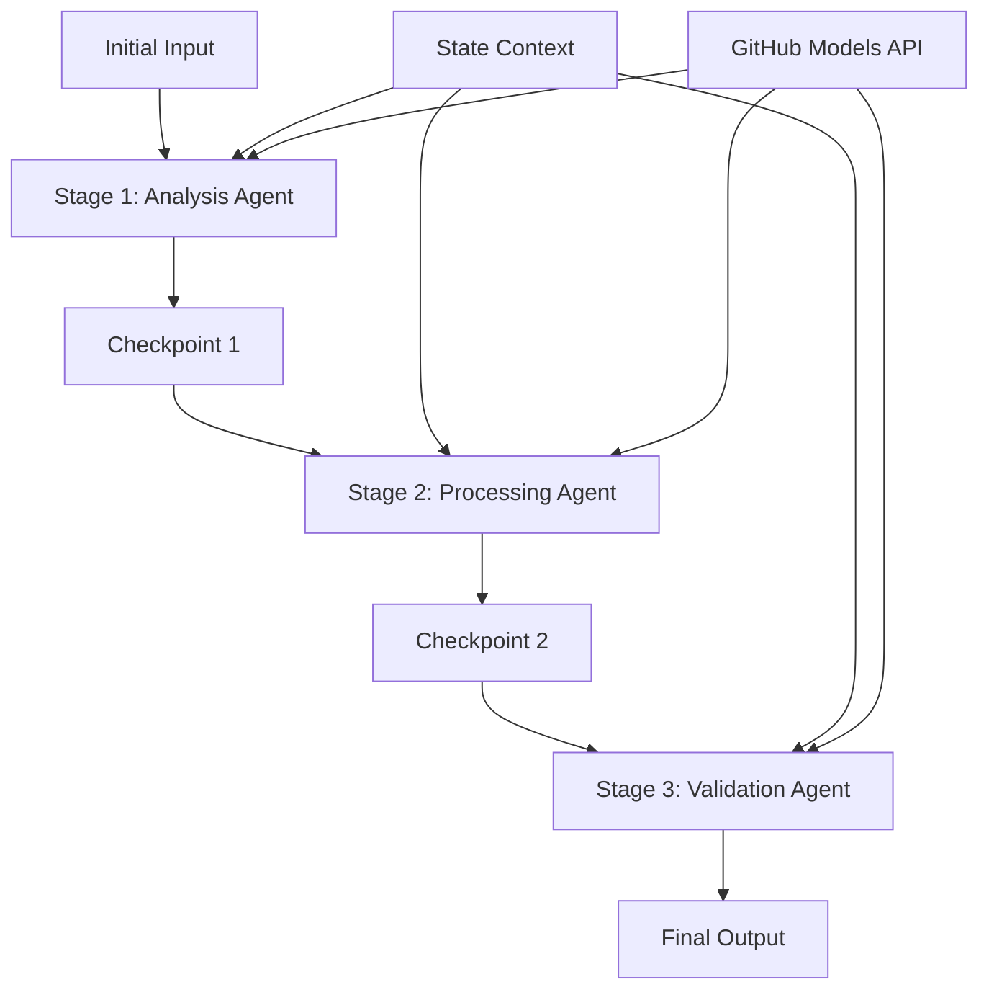

<!--
CO_OP_TRANSLATOR_METADATA:
{
  "original_hash": "1be9c8dcbd79a02d33d2c138684c1394",
  "translation_date": "2025-11-11T13:46:52+00:00",
  "source_file": "08-multi-agent/code_samples/workflows-agent-framework/dotNET/02.dotnet-agent-framework-workflow-ghmodel-sequential.md",
  "language_code": "bn"
}
-->
# ⏩ GitHub মডেল (.NET) ব্যবহার করে ধারাবাহিক এজেন্ট ওয়ার্কফ্লো

## 📋 উন্নত ধারাবাহিক প্রসেসিং টিউটোরিয়াল

এই নোটবুকটি Microsoft Agent Framework for .NET এবং GitHub মডেল ব্যবহার করে **ধারাবাহিক ওয়ার্কফ্লো প্যাটার্ন** প্রদর্শন করে। আপনি শিখবেন কীভাবে উন্নত, ধাপে ধাপে প্রসেসিং পাইপলাইন তৈরি করতে হয় যেখানে এজেন্টরা নির্দিষ্ট ক্রমে কার্য সম্পাদন করে, এবং প্রতিটি ধাপ পূর্ববর্তী ধাপের ফলাফলের উপর ভিত্তি করে তৈরি হয়।

## 🎯 শেখার লক্ষ্য

### 🔄 **ধারাবাহিক প্রসেসিং আর্কিটেকচার**
- **লিনিয়ার ওয়ার্কফ্লো ডিজাইন**: স্পষ্ট নির্ভরতার সাথে ধাপে ধাপে প্রসেসিং পাইপলাইন তৈরি করুন
- **স্টেট ম্যানেজমেন্ট**: ধারাবাহিক ওয়ার্কফ্লো ধাপগুলির মধ্যে প্রসঙ্গ এবং ডেটা প্রবাহ বজায় রাখুন
- **GitHub মডেল ইন্টিগ্রেশন**: .NET ওয়ার্কফ্লোতে GitHub-এর AI মডেল ব্যবহার করুন
- **এন্টারপ্রাইজ পাইপলাইন প্যাটার্ন**: প্রোডাকশন-রেডি ধারাবাহিক প্রসেসিং সিস্টেম তৈরি করুন

### 🏗️ **উন্নত ধারাবাহিক প্যাটার্ন**
- **স্টেজ-গেট প্রসেসিং**: ওয়ার্কফ্লো ধাপগুলির মধ্যে যাচাইকরণ চেকপয়েন্ট বাস্তবায়ন করুন
- **প্রসঙ্গ সংরক্ষণ**: সমস্ত ধাপ জুড়ে স্টেট এবং জমাকৃত জ্ঞান বজায় রাখুন
- **ত্রুটি প্রচার**: ধারাবাহিক প্রসেসিং চেইনে ব্যর্থতাগুলি দক্ষতার সাথে পরিচালনা করুন
- **পারফরম্যান্স অপ্টিমাইজেশন**: সর্বনিম্ন ওভারহেড সহ দক্ষ ধারাবাহিক কার্য সম্পাদন

### 🏢 **এন্টারপ্রাইজ ধারাবাহিক অ্যাপ্লিকেশন**
- **ডকুমেন্ট প্রসেসিং পাইপলাইন**: বহু-ধাপের ডকুমেন্ট বিশ্লেষণ, রূপান্তর এবং যাচাইকরণ
- **গুণমান নিশ্চিতকরণ ওয়ার্কফ্লো**: ধারাবাহিক পর্যালোচনা, যাচাইকরণ এবং অনুমোদন প্রক্রিয়া
- **কন্টেন্ট প্রোডাকশন পাইপলাইন**: গবেষণা → লেখা → সম্পাদনা → পর্যালোচনা → প্রকাশনা
- **ব্যবসায়িক প্রক্রিয়া অটোমেশন**: স্পষ্ট ধাপ নির্ভরতার সাথে বহু-ধাপের ব্যবসায়িক ওয়ার্কফ্লো

## ⚙️ প্রয়োজনীয়তা এবং সেটআপ

### 📦 **প্রয়োজনীয় NuGet প্যাকেজ**

.NET ধারাবাহিক ওয়ার্কফ্লো জন্য প্রয়োজনীয় প্যাকেজ:

```xml
<!-- Core AI Framework -->
<PackageReference Include="Microsoft.Extensions.AI" Version="9.9.0" />

<!-- Client Model Abstractions -->
<PackageReference Include="System.ClientModel" Version="1.6.1.0" />

<!-- Azure Identity and Async LINQ Support -->
<PackageReference Include="Azure.Identity" Version="1.15.0" />
<PackageReference Include="System.Linq.Async" Version="6.0.3" />

<!-- Local Agent Framework References -->
<!-- Microsoft.Agents.AI.dll - Core agent abstractions -->
<!-- Microsoft.Agents.AI.OpenAI.dll - GitHub Models integration -->
```

### 🔑 **GitHub মডেল কনফিগারেশন**

**পরিবেশ সেটআপ (.env ফাইল):**
```env
GITHUB_TOKEN=your_github_personal_access_token
GITHUB_ENDPOINT=https://models.inference.ai.azure.com
GITHUB_MODEL_ID=gpt-4o-mini
```

**কনফিগারেশন ম্যানেজমেন্ট:**
```csharp
// Load environment variables securely
Env.Load("../../../.env");
var githubToken = Environment.GetEnvironmentVariable("GITHUB_TOKEN");
var githubEndpoint = Environment.GetEnvironmentVariable("GITHUB_ENDPOINT");
var modelId = Environment.GetEnvironmentVariable("GITHUB_MODEL_ID");
```

### 🏗️ **ধারাবাহিক ওয়ার্কফ্লো আর্কিটেকচার**



**মূল উপাদান:**
- **ধারাবাহিক এজেন্ট**: প্রতিটি প্রসেসিং ধাপের জন্য বিশেষায়িত এজেন্ট
- **স্টেট প্রসঙ্গ**: সমস্ত ধাপ জুড়ে জমাকৃত ডেটা এবং সিদ্ধান্ত বজায় রাখে
- **চেকপয়েন্ট**: প্রতিটি ধাপের মধ্যে যাচাইকরণ পয়েন্ট গুণমান এবং সামঞ্জস্য নিশ্চিত করতে
- **GitHub মডেল ক্লায়েন্ট**: সমস্ত ওয়ার্কফ্লো ধাপে ধারাবাহিক AI মডেল অ্যাক্সেস

## 🎨 **ধারাবাহিক ওয়ার্কফ্লো ডিজাইন প্যাটার্ন**

### 📝 **ডকুমেন্ট প্রসেসিং পাইপলাইন**
```
Raw Document → Content Extraction → Analysis → Validation → Structured Output
```

### 🎯 **কন্টেন্ট ক্রিয়েশন ওয়ার্কফ্লো**
```
Brief/Requirements → Research → Content Creation → Review → Final Polish
```

### 🔍 **গুণমান নিশ্চিতকরণ পাইপলাইন**
```
Initial Review → Technical Validation → Compliance Check → Final Approval
```

### 💼 **ব্যবসায়িক বুদ্ধিমত্তা ওয়ার্কফ্লো**
```
Data Collection → Processing → Analysis → Report Generation → Distribution
```

## 🏢 **এন্টারপ্রাইজ ধারাবাহিক সুবিধা**

### 🎯 **বিশ্বাসযোগ্যতা এবং গুণমান**
- **নির্ধারিত প্রসেসিং**: গঠিত ধাপগুলির মাধ্যমে ধারাবাহিক, পুনরাবৃত্তি ফলাফল
- **গুণমান গেট**: প্রতিটি ধাপে যাচাইকরণ চেকপয়েন্ট গুণমান নিশ্চিত করে
- **ত্রুটি বিচ্ছিন্নতা**: একটি ধাপে সমস্যা পরবর্তী ধাপে ছড়ায় না
- **অডিট ট্রেইল**: প্রতিটি ধাপে সিদ্ধান্ত এবং রূপান্তরের সম্পূর্ণ ট্র্যাকিং

### 📈 **স্কেলযোগ্যতা এবং পারফরম্যান্স**
- **মডুলার ডিজাইন**: প্রতিটি ধাপ স্বাধীনভাবে অপ্টিমাইজ করা যায়
- **রিসোর্স ম্যানেজমেন্ট**: ধাপগুলির মধ্যে AI মডেল রিসোর্সের দক্ষ বরাদ্দ
- **স্টেট অপ্টিমাইজেশন**: সর্বোত্তম পারফরম্যান্সের জন্য ধাপগুলির মধ্যে সর্বনিম্ন স্টেট ট্রান্সফার
- **প্যারালাল স্টেজ গ্রুপ**: একাধিক ধারাবাহিক ওয়ার্কফ্লো সমান্তরালভাবে চালানো যায়

### 🔒 **নিরাপত্তা এবং সম্মতি**
- **স্টেজ-লেভেল নিরাপত্তা**: বিভিন্ন প্রসেসিং ধাপের জন্য বিভিন্ন নিরাপত্তা নীতি
- **ডেটা যাচাইকরণ**: প্রতিটি চেকপয়েন্টে ডেটার অখণ্ডতা এবং সম্মতি নিশ্চিত করুন
- **অ্যাক্সেস কন্ট্রোল**: বিভিন্ন ওয়ার্কফ্লো ধাপের জন্য গ্রানুলার অনুমতি
- **নিয়ন্ত্রক সম্মতি**: গঠিত প্রসেসিংয়ের মাধ্যমে নিয়ন্ত্রক প্রয়োজনীয়তা পূরণ করুন

### 📊 **মনিটরিং এবং অ্যানালিটিক্স**
- **স্টেজ-লেভেল মেট্রিকস**: প্রতিটি ওয়ার্কফ্লো ধাপের পারফরম্যান্স মনিটরিং
- **বটলনেক শনাক্তকরণ**: ধীর ধাপগুলি চিহ্নিত এবং অপ্টিমাইজ করুন
- **গুণমান মেট্রিকস**: প্রতিটি ধাপে গুণমান এবং সাফল্যের হার ট্র্যাক করুন
- **প্রক্রিয়া অপ্টিমাইজেশন**: স্টেজ-লেভেল অ্যানালিটিক্সের উপর ভিত্তি করে ক্রমাগত উন্নতি

চলুন শক্তিশালী ধারাবাহিক AI প্রসেসিং পাইপলাইন তৈরি করি! 🚀

## 💻 কোড চালানো

সম্পূর্ণ বাস্তবায়ন `02.dotnet-agent-framework-workflow-ghmodel-sequential.cs` ফাইলে উপলব্ধ। এই ফাইলটি **তিন-ধাপের আসবাব বিশ্লেষণ ওয়ার্কফ্লো** প্রদর্শন করে:

1. **স্টেজ 1 - সেলস এজেন্ট**: আসবাবের ছবি বিশ্লেষণ করে এবং কেনার পরামর্শ প্রদান করে
2. **স্টেজ 2 - প্রাইস এজেন্ট**: বিস্তারিত মূল্য বিশ্লেষণ এবং বাজেট বিকল্প প্রদান করে
3. **স্টেজ 3 - কোট এজেন্ট**: Markdown ফরম্যাটে একটি পেশাদার কোট ডকুমেন্ট তৈরি করে

### 🏗️ **ওয়ার্কফ্লো আর্কিটেকচার**

```
Image Input → Sales Analysis → Price Estimation → Quote Generation → Final Output
```

প্রতিটি এজেন্ট:
- পূর্ববর্তী ধাপের আউটপুট প্রসঙ্গ হিসাবে গ্রহণ করে
- পূর্ববর্তী বিশ্লেষণের উপর ভিত্তি করে বিশেষজ্ঞ দক্ষতা যোগ করে
- স্টেট ম্যানেজমেন্টের মাধ্যমে ওয়ার্কফ্লো ধারাবাহিকতা বজায় রাখে

### 🚀 উদাহরণ চালানো

**প্রয়োজনীয়তা:**
- একটি আসবাবের ছবি `../imgs/home.png` এ রাখুন (অথবা `imgPath` ভেরিয়েবল আপডেট করুন)
- আপনার `.env` ফাইলটি GitHub মডেল ক্রেডেনশিয়াল দিয়ে কনফিগার করুন

```bash
# Make the script executable (Unix/Linux/macOS)
chmod +x 02.dotnet-agent-framework-workflow-ghmodel-sequential.cs

# Run the sequential workflow
./02.dotnet-agent-framework-workflow-ghmodel-sequential.cs
```

অথবা Windows-এ:
```powershell
dotnet run 02.dotnet-agent-framework-workflow-ghmodel-sequential.cs
```

### 📝 প্রত্যাশিত আউটপুট

ওয়ার্কফ্লোটি:
1. **সেলস এজেন্ট**: ছবির আসবাব চিহ্নিত করে এবং সুপারিশ প্রদান করে
2. **প্রাইস এজেন্ট**: বিস্তারিত মূল্য বিশ্লেষণ যোগ করে বাজেট স্তর এবং কেনাকাটার সুপারিশ সহ
3. **কোট এজেন্ট**: সমস্ত তথ্য সংশ্লেষিত করে একটি ফরম্যাটেড কোট ডকুমেন্ট তৈরি করে

চূড়ান্ত আউটপুটটি একটি ব্যাপক, পেশাদার আসবাব কোট হবে যা ছবির বিশ্লেষণের উপর ভিত্তি করে।

### 🔧 কাস্টমাইজেশন অপশন

**এজেন্টের আচরণ পরিবর্তন করুন:**
```csharp
// Adjust agent instructions to change their focus
const string SalesAgentInstructions = "Your custom instructions...";
```

**ধারাবাহিক প্রবাহ পরিবর্তন করুন:**
```csharp
// Add or reorder workflow stages
var workflow = new WorkflowBuilder(salesagent)
    .AddEdge(salesagent, priceagent)
    .AddEdge(priceagent, quoteagent)
    .AddEdge(quoteagent, newAgent)  // Add another stage
    .Build();
```

**ভিন্ন ইনপুট ব্যবহার করুন:**
```csharp
// Process text instead of images
ChatMessage userMessage = new ChatMessage(ChatRole.User, [
    new TextContent("Analyze pricing for a modern living room set")
]);
```

### 🎯 বাস্তব জীবনের অ্যাপ্লিকেশন

এই ধারাবাহিক প্যাটার্নটি আদর্শ:
- **ই-কমার্স**: পণ্য বিশ্লেষণ → মূল্য নির্ধারণ → কোট তৈরি
- **রিয়েল এস্টেট**: সম্পত্তি বিশ্লেষণ → মূল্যায়ন → তালিকা তৈরি
- **ইনস্যুরেন্স**: দাবি বিশ্লেষণ → মূল্যায়ন → কোট তৈরি
- **কন্টেন্ট ক্রিয়েশন**: গবেষণা → লেখা → সম্পাদনা → প্রকাশনা

### 🔍 স্টেট ফ্লো বোঝা

ধারাবাহিকতায় প্রতিটি এজেন্ট গ্রহণ করে:
- **মূল ইনপুট**: প্রাথমিক ব্যবহারকারীর বার্তা (ছবি + টেক্সট)
- **পূর্ববর্তী এজেন্ট আউটপুট**: কথোপকথনের ইতিহাসে সমস্ত পূর্ববর্তী এজেন্টের প্রতিক্রিয়া
- **জমাকৃত প্রসঙ্গ**: ওয়ার্কফ্লো জুড়ে বজায় রাখা সম্পূর্ণ স্টেট

এটি উন্নত বহু-ধাপের প্রসেসিং সক্ষম করে যেখানে প্রতিটি এজেন্ট পূর্ববর্তী ধাপগুলির সম্পূর্ণ প্রসঙ্গের উপর ভিত্তি করে তৈরি করে।

---

<!-- CO-OP TRANSLATOR DISCLAIMER START -->
**অস্বীকৃতি**:  
এই নথিটি AI অনুবাদ পরিষেবা [Co-op Translator](https://github.com/Azure/co-op-translator) ব্যবহার করে অনুবাদ করা হয়েছে। আমরা যথাসাধ্য সঠিকতার জন্য চেষ্টা করি, তবে অনুগ্রহ করে মনে রাখবেন যে স্বয়ংক্রিয় অনুবাদে ত্রুটি বা অসঙ্গতি থাকতে পারে। মূল ভাষায় থাকা নথিটিকে প্রামাণিক উৎস হিসেবে বিবেচনা করা উচিত। গুরুত্বপূর্ণ তথ্যের জন্য, পেশাদার মানব অনুবাদ সুপারিশ করা হয়। এই অনুবাদ ব্যবহারের ফলে কোনো ভুল বোঝাবুঝি বা ভুল ব্যাখ্যার জন্য আমরা দায়ী নই।
<!-- CO-OP TRANSLATOR DISCLAIMER END -->