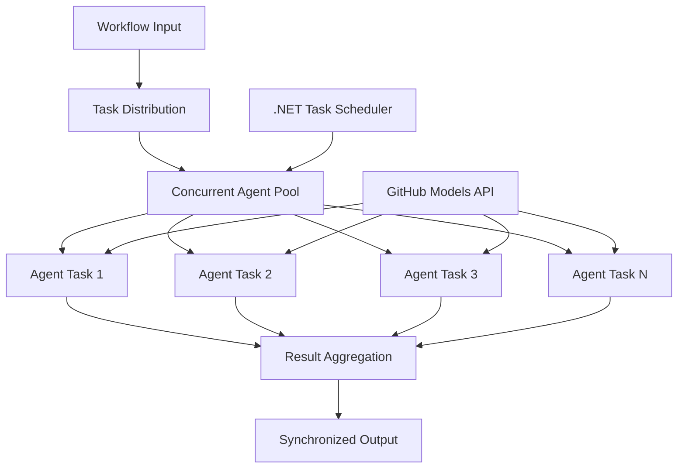

<!--
CO_OP_TRANSLATOR_METADATA:
{
  "original_hash": "b9c6e32c9b5f2fed20b6916984440d88",
  "translation_date": "2025-11-11T13:13:05+00:00",
  "source_file": "08-multi-agent/code_samples/workflows-agent-framework/dotNET/03.dotnet-agent-framework-workflow-ghmodel-concurrent.md",
  "language_code": "bn"
}
-->
# ⚡ GitHub মডেল ব্যবহার করে .NET-এ সমান্তরাল এজেন্ট ওয়ার্কফ্লো

## 📋 উচ্চ-প্রদর্শনশীল সমান্তরাল প্রসেসিং টিউটোরিয়াল

এই নোটবুকটি Microsoft Agent Framework for .NET এবং GitHub মডেল ব্যবহার করে **সমান্তরাল ওয়ার্কফ্লো প্যাটার্ন** প্রদর্শন করে। আপনি শিখবেন কীভাবে উচ্চ-প্রদর্শনশীল, সমান্তরাল প্রসেসিং ওয়ার্কফ্লো তৈরি করতে হয় যা একাধিক AI এজেন্ট একসাথে চালিয়ে throughput সর্বাধিক করে, সমন্বয় এবং ডেটার সামঞ্জস্য বজায় রেখে।

## 🎯 শেখার লক্ষ্যসমূহ

### 🚀 **সমান্তরাল প্রসেসিং এর মৌলিক বিষয়**
- **সমান্তরাল এজেন্ট এক্সিকিউশন**: সর্বোচ্চ কার্যক্ষমতার জন্য একাধিক AI এজেন্ট একসাথে চালান
- **Async/Await প্যাটার্ন**: .NET এর async প্রোগ্রামিং মডেল ব্যবহার করে দক্ষ সমান্তরালতা অর্জন
- **GitHub মডেল ইন্টিগ্রেশন**: GitHub এর AI মডেল ইনফারেন্স সার্ভিসে একাধিক সমান্তরাল কল সমন্বয় করুন
- **রিসোর্স ম্যানেজমেন্ট**: সমান্তরাল অপারেশনের সময় AI মডেল রিসোর্স দক্ষতার সাথে পরিচালনা করুন

### 🏗️ **উন্নত সমান্তরাল স্থাপত্য**
- **টাস্ক-ভিত্তিক সমান্তরালতা**: .NET Task Parallel Library ব্যবহার করে সর্বোত্তম সমান্তরাল এক্সিকিউশন
- **সিঙ্ক্রোনাইজেশন প্যাটার্ন**: রেস কন্ডিশন এড়িয়ে সমান্তরাল এজেন্ট সমন্বয় করুন
- **লোড ব্যালেন্সিং**: উপলব্ধ সমান্তরাল প্রসেসিং ক্ষমতার মধ্যে কাজ দক্ষতার সাথে বিতরণ করুন
- **ফল্ট টলারেন্স**: পুরো ওয়ার্কফ্লো বন্ধ না করে পৃথক এজেন্ট ব্যর্থতা পরিচালনা করুন

### 🏢 **এন্টারপ্রাইজ সমান্তরাল অ্যাপ্লিকেশন**
- **উচ্চ-ভলিউম ডকুমেন্ট প্রসেসিং**: একাধিক ডকুমেন্ট একসাথে প্রসেস করুন
- **রিয়েল-টাইম কন্টেন্ট অ্যানালাইসিস**: আসন্ন ডেটা স্ট্রিমের সমান্তরাল বিশ্লেষণ
- **ব্যাচ প্রসেসিং অপ্টিমাইজেশন**: বড় স্কেলের ডেটা প্রসেসিং অপারেশনের জন্য throughput সর্বাধিক করুন
- **মাল্টি-মোডাল অ্যানালাইসিস**: বিভিন্ন কন্টেন্ট টাইপ এবং ফরম্যাটের সমান্তরাল প্রসেসিং

## ⚙️ প্রয়োজনীয়তা এবং সেটআপ

### 📦 **প্রয়োজনীয় NuGet প্যাকেজসমূহ**

উচ্চ-প্রদর্শনশীল সমান্তরাল ওয়ার্কফ্লোর জন্য প্রয়োজনীয় প্যাকেজসমূহ:

```xml
<!-- Core AI Framework with Async Support -->
<PackageReference Include="Microsoft.Extensions.AI" Version="9.9.0" />

<!-- Client Model Abstractions for API Communication -->
<PackageReference Include="System.ClientModel" Version="1.6.1.0" />

<!-- Azure Identity and Async LINQ for Advanced Operations -->
<PackageReference Include="Azure.Identity" Version="1.15.0" />
<PackageReference Include="System.Linq.Async" Version="6.0.3" />

<!-- Local Agent Framework References -->
<!-- Microsoft.Agents.AI.dll - Core agent abstractions with async support -->
<!-- Microsoft.Agents.AI.OpenAI.dll - GitHub Models integration with concurrency -->
```

### 🔑 **GitHub মডেল কনফিগারেশন**

**পরিবেশ সেটআপ (.env ফাইল):**
```env
GITHUB_TOKEN=your_github_personal_access_token
GITHUB_ENDPOINT=https://models.inference.ai.azure.com
GITHUB_MODEL_ID=gpt-4o-mini
```

**সমান্তরাল প্রসেসিং বিবেচনা:**
```csharp
// Configure for concurrent operations
var clientOptions = new OpenAIClientOptions()
{
    Endpoint = new Uri(githubEndpoint),
    // Configure connection pooling for concurrent requests
    NetworkTimeout = TimeSpan.FromMinutes(5)
};
```

### 🏗️ **সমান্তরাল ওয়ার্কফ্লো স্থাপত্য**



**মূল উপাদানসমূহ:**
- **Task Parallel Library**: .NET এর বিল্ট-ইন সমান্তরাল অপারেশন সাপোর্ট
- **Agent Pool**: সমান্তরাল প্রসেসিংয়ের জন্য একাধিক এজেন্ট ইনস্ট্যান্স
- **Result Aggregation**: সমান্তরাল এজেন্ট ফলাফল সমন্বয় এবং একত্রিতকরণ
- **Synchronization Points**: সমান্তরাল অপারেশনের মধ্যে ডেটার সামঞ্জস্য নিশ্চিত করুন

## 🎨 **সমান্তরাল ওয়ার্কফ্লো ডিজাইন প্যাটার্ন**

### 🔍 **সমান্তরাল গবেষণা এবং বিশ্লেষণ**
```
Research Topic → Concurrent Research Agents → Result Synthesis → Final Report
```

### 📊 **মাল্টি-সোর্স ডেটা প্রসেসিং**
```
Data Sources → Parallel Processing Agents → Data Integration → Unified Output
```

### 🎭 **কন্টেন্ট জেনারেশন পাইপলাইন**
```
Content Requirements → Concurrent Content Generators → Quality Review → Final Content
```

### 🔄 **Fan-Out/Fan-In প্রসেসিং**
```
Single Input → Multiple Concurrent Processors → Result Aggregation → Single Output
```

## 🏢 **এন্টারপ্রাইজ পারফরম্যান্স সুবিধা**

### ⚡ **থ্রুপুট এবং স্কেলেবিলিটি**
- **লিনিয়ার পারফরম্যান্স স্কেলিং**: থ্রুপুট বাড়ানোর জন্য আরও সমান্তরাল এজেন্ট যোগ করুন
- **রিসোর্স ব্যবহার**: উপলব্ধ AI মডেল ক্ষমতার সর্বাধিক দক্ষতা
- **প্রসেসিং সময় হ্রাস**: সমান্তরাল এক্সিকিউশন দ্বারা উল্লেখযোগ্য সময় হ্রাস
- **ইলাস্টিক স্কেলিং**: ওয়ার্কলোডের উপর ভিত্তি করে সমান্তরাল এজেন্ট সংখ্যা গতিশীলভাবে সামঞ্জস্য করুন

### 🛡️ **বিশ্বাসযোগ্যতা এবং স্থিতিস্থাপকতা**
- **ফল্ট আইসোলেশন**: পৃথক এজেন্ট ব্যর্থতা অন্যান্য সমান্তরাল অপারেশনে প্রভাব ফেলে না
- **গ্রেসফুল ডিগ্রেডেশন**: সিস্টেম কম এজেন্ট ক্ষমতা নিয়ে কাজ চালিয়ে যায়
- **এরর রিকভারি**: ব্যর্থ সমান্তরাল অপারেশনের জন্য স্বয়ংক্রিয় পুনরায় চেষ্টা ব্যবস্থা
- **লোড ডিস্ট্রিবিউশন**: উপলব্ধ এজেন্টদের মধ্যে কাজের সমান বিতরণ

### 📊 **পারফরম্যান্স মনিটরিং**
- **সমান্তরাল এক্সিকিউশন মেট্রিকস**: সমস্ত সমান্তরাল অপারেশনের পারফরম্যান্স ট্র্যাক করুন
- **রিসোর্স ব্যবহার বিশ্লেষণ**: CPU, মেমরি এবং নেটওয়ার্ক ব্যবহার পর্যবেক্ষণ করুন
- **থ্রুপুট বিশ্লেষণ**: সমান্তরাল প্রসেসিং থেকে দক্ষতা লাভ পরিমাপ করুন
- **বটলনেক ডিটেকশন**: পারফরম্যান্স সীমাবদ্ধতা সনাক্ত এবং সমাধান করুন

### 🔧 **ডেভেলপমেন্ট এবং অপারেশনস**
- **Async প্রোগ্রামিং মডেল**: .NET এর পরিপক্ক async/await প্যাটার্ন ব্যবহার করুন
- **টাস্ক সমন্বয়**: বিল্ট-ইন টাস্ক ম্যানেজমেন্ট এবং সমন্বয় ক্ষমতা
- **এক্সেপশন হ্যান্ডলিং**: সমান্তরাল অপারেশনের জন্য ব্যাপক ত্রুটি পরিচালনা
- **ডিবাগিং সাপোর্ট**: সমান্তরাল ওয়ার্কফ্লোর জন্য Visual Studio ডিবাগিং টুল

চলুন .NET দিয়ে উচ্চ-প্রদর্শনশীল সমান্তরাল AI ওয়ার্কফ্লো তৈরি করি! 🚀

## 💻 কোড চালানো

সম্পূর্ণ বাস্তবায়ন `03.dotnet-agent-framework-workflow-ghmodel-concurrent.cs` ফাইলে উপলব্ধ। এই ফাইলটি একটি **Fan-Out/Fan-In সমান্তরাল ওয়ার্কফ্লো** প্রদর্শন করে ভ্রমণ পরিকল্পনার জন্য:

### 🏗️ **ওয়ার্কফ্লো স্থাপত্য**

```
User Request → ConcurrentStartExecutor → [Researcher Agent || Planner Agent] → ConcurrentAggregationExecutor → Final Output
```

**মূল উপাদানসমূহ:**

1. **ConcurrentStartExecutor**: ব্যবহারকারীর অনুরোধ একসাথে সমস্ত এজেন্টে সম্প্রচার করে
2. **Researcher Agent**: গন্তব্য এবং আকর্ষণগুলি সমান্তরালভাবে বিশ্লেষণ করে
3. **Planner Agent**: বিস্তারিত ভ্রমণ পরিকল্পনা সমান্তরালভাবে তৈরি করে
4. **ConcurrentAggregationExecutor**: উভয় এজেন্টের ফলাফল সংগ্রহ এবং একত্রিত করে

### 🎯 **Fan-Out/Fan-In প্যাটার্ন**

এই ওয়ার্কফ্লোটি ক্লাসিক **Fan-Out/Fan-In** প্যাটার্ন প্রদর্শন করে:
- **Fan-Out**: একটি ইনপুট বার্তা একসাথে একাধিক এজেন্টে সম্প্রচার করা হয়
- **সমান্তরাল প্রসেসিং**: একাধিক এজেন্ট একই কাজ সমান্তরালভাবে সম্পন্ন করে
- **Fan-In**: সমস্ত এজেন্টের ফলাফল সংগ্রহ এবং একত্রিত করে একটি আউটপুট তৈরি করা হয়

### 🚀 উদাহরণ চালানো

```bash
# Make the script executable (Unix/Linux/macOS)
chmod +x 03.dotnet-agent-framework-workflow-ghmodel-concurrent.cs

# Run the concurrent workflow
./03.dotnet-agent-framework-workflow-ghmodel-concurrent.cs
```

অথবা Windows-এ:
```powershell
dotnet run 03.dotnet-agent-framework-workflow-ghmodel-concurrent.cs
```

### 📝 প্রত্যাশিত আউটপুট

ওয়ার্কফ্লোটি:
1. **অনুরোধ সম্প্রচার**: "ডিসেম্বরে সিয়াটলে একটি ভ্রমণ পরিকল্পনা করুন" উভয় এজেন্টে পাঠাবে
2. **সমান্তরাল প্রসেসিং**: উভয় এজেন্ট একসাথে কাজ করবে:
   - গবেষক আকর্ষণ এবং বিশদ সনাক্ত করবে
   - পরিকল্পনাকারী সময়সূচী এবং লজিস্টিক তৈরি করবে
3. **এগ্রিগেশন**: উভয় প্রতিক্রিয়া একত্রিত করে ব্যাপক আউটপুট তৈরি করবে
4. **ফলাফল প্রদর্শন**: সমস্ত তথ্য সহ একত্রিত ভ্রমণ পরিকল্পনা দেখাবে

### 🔧 কাস্টমাইজেশন অপশন

**আরও সমান্তরাল এজেন্ট যোগ করুন:**
```csharp
// Create additional specialized agents
AIAgent budgetAgent = openAIClient.GetChatClient(github_model_id).CreateAIAgent(
    name: "Budget-Agent", instructions: "Calculate travel costs...");

// Add to fan-out
var workflow = new WorkflowBuilder(startExecutor)
    .AddFanOutEdge(startExecutor, targets: [researcherAgent, plannerAgent, budgetAgent])
    .AddFanInEdge(aggregationExecutor, sources: [researcherAgent, plannerAgent, budgetAgent])
    .WithOutputFrom(aggregationExecutor)
    .Build();

// Update aggregation count
if (this._messages.Count == 3) { ... }
```

**এজেন্ট নির্দেশনা পরিবর্তন করুন:**
```csharp
const string ResearcherAgentInstructions = "Your custom instructions for research...";
const string PlanAgentInstructions = "Your custom instructions for planning...";
```

**কাজ পরিবর্তন করুন:**
```csharp
StreamingRun run = await InProcessExecution.StreamAsync(
    workflow, 
    "Plan a European vacation for 2 weeks in summer"
);
```

### 🎯 বাস্তব জীবনের প্রয়োগ

এই সমান্তরাল প্যাটার্নটি আদর্শ:
- **কন্টেন্ট তৈরি**: একাধিক লেখক একসাথে বিভিন্ন অংশ তৈরি করছে
- **কোড রিভিউ**: একাধিক রিভিউয়ার বিভিন্ন দৃষ্টিকোণ থেকে কোড বিশ্লেষণ করছে
- **বাজার গবেষণা**: বিভিন্ন বাজার সেগমেন্টের সমান্তরাল বিশ্লেষণ
- **ডকুমেন্ট প্রসেসিং**: সমান্তরালভাবে এক্সট্রাকশন, বিশ্লেষণ এবং যাচাইকরণ
- **মাল্টি-পার্সপেক্টিভ অ্যানালাইসিস**: একই ইনপুটে বিভিন্ন দৃষ্টিভঙ্গি পাওয়া

### 🔍 কাস্টম এক্সিকিউটর বুঝুন

**ConcurrentStartExecutor:**
- `IMessageHandler<string>` ইমপ্লিমেন্ট করে স্ট্রিং ইনপুট গ্রহণ করতে
- বার্তাগুলি সমস্ত সংযুক্ত এজেন্টে সম্প্রচার করে
- সমান্তরাল প্রসেসিং ট্রিগার করতে `TurnToken` পাঠায়

**ConcurrentAggregationExecutor:**
- `IMessageHandler<ChatMessage>` ইমপ্লিমেন্ট করে এজেন্ট প্রতিক্রিয়া গ্রহণ করতে
- থ্রেড-সেফ পদ্ধতিতে বার্তাগুলি সংগ্রহ করে
- সমস্ত প্রত্যাশিত প্রতিক্রিয়া পৌঁছালে এগ্রিগেট করে
- `context.YieldOutputAsync()` ব্যবহার করে চূড়ান্ত আউটপুট প্রদান করে

### ⚡ পারফরম্যান্স সুবিধা

**সমান্তরাল বনাম সিকোয়েন্সিয়াল:**
- সিকোয়েন্সিয়াল: Agent1 (30s) → Agent2 (30s) = **মোট 60 সেকেন্ড**
- সমান্তরাল: Agent1 (30s) || Agent2 (30s) = **মোট 30 সেকেন্ড**

**থ্রুপুট উন্নতি**: N সমান্তরাল এজেন্টের জন্য N× দ্রুত (ওয়ার্কলোড এবং রিসোর্সের উপর নির্ভর করে)

### 🛡️ ত্রুটি পরিচালনা

ওয়ার্কফ্লোটি পৃথক এজেন্ট ব্যর্থতা দক্ষতার সাথে পরিচালনা করে:
- যদি একটি এজেন্ট ব্যর্থ হয়, অন্যরা প্রসেসিং চালিয়ে যায়
- এগ্রিগেটর টাইমআউট লজিক ইমপ্লিমেন্ট করতে পারে
- প্রয়োজন হলে আংশিক ফলাফল প্রদান করা যেতে পারে

### 📊 উন্নত বৈশিষ্ট্য

**ডাইনামিক এজেন্ট সংখ্যা:**
এগ্রিগেশন লজিক পরিবর্তন করে পরিবর্তনশীল এজেন্ট সংখ্যা সমর্থন করুন:

```csharp
private int _expectedAgentCount;
private readonly List<ChatMessage> _messages = [];

public async ValueTask HandleAsync(ChatMessage message, IWorkflowContext context)
{
    this._messages.Add(message);
    if (this._messages.Count == _expectedAgentCount)
    {
        // Process aggregation
    }
}
```

এই সমান্তরাল ওয়ার্কফ্লো প্যাটার্নটি উচ্চ-প্রদর্শনশীল, স্কেলযোগ্য AI এজেন্ট সিস্টেম তৈরি করার জন্য অপরিহার্য!

---

<!-- CO-OP TRANSLATOR DISCLAIMER START -->
**অস্বীকৃতি**:  
এই নথিটি AI অনুবাদ পরিষেবা [Co-op Translator](https://github.com/Azure/co-op-translator) ব্যবহার করে অনুবাদ করা হয়েছে। আমরা যথাসাধ্য সঠিকতার জন্য চেষ্টা করি, তবে অনুগ্রহ করে মনে রাখবেন যে স্বয়ংক্রিয় অনুবাদে ত্রুটি বা অসঙ্গতি থাকতে পারে। নথিটির মূল ভাষায় থাকা আসল সংস্করণকে প্রামাণিক উৎস হিসেবে বিবেচনা করা উচিত। গুরুত্বপূর্ণ তথ্যের জন্য, পেশাদার মানব অনুবাদ সুপারিশ করা হয়। এই অনুবাদ ব্যবহারের ফলে কোনো ভুল বোঝাবুঝি বা ভুল ব্যাখ্যার জন্য আমরা দায়ী থাকব না।
<!-- CO-OP TRANSLATOR DISCLAIMER END -->