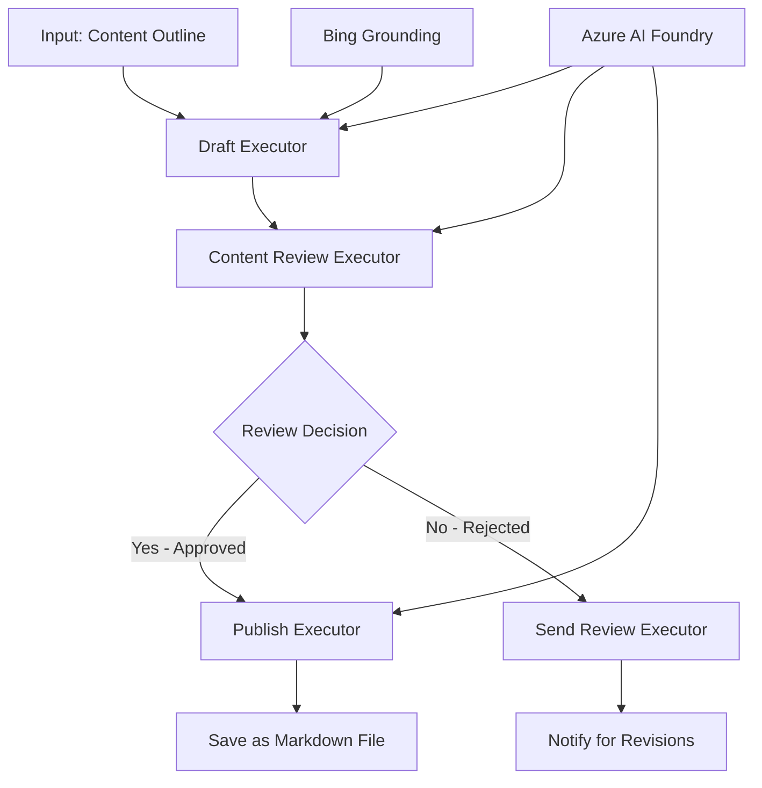

<!--
CO_OP_TRANSLATOR_METADATA:
{
  "original_hash": "8abd335151cee553293b637ee3d80d10",
  "translation_date": "2025-11-11T12:09:17+00:00",
  "source_file": "08-multi-agent/code_samples/workflows-agent-framework/dotNET/04.dotnet-agent-framework-workflow-aifoundry-condition.md",
  "language_code": "bn"
}
-->
# 🔀 Azure AI Foundry (.NET) ব্যবহার করে শর্তাধীন এজেন্ট ওয়ার্কফ্লো

## 📋 বুদ্ধিমান সিদ্ধান্ত-ভিত্তিক ওয়ার্কফ্লো টিউটোরিয়াল

এই নোটবুকটি Azure AI Foundry এবং Microsoft Agent Framework for .NET ব্যবহার করে **শর্তাধীন ওয়ার্কফ্লো প্যাটার্ন** প্রদর্শন করে। আপনি শিখবেন কীভাবে উন্নত, সিদ্ধান্ত-চালিত ওয়ার্কফ্লো তৈরি করতে হয় যা AI বিশ্লেষণ, ব্যবসায়িক নিয়ম এবং গতিশীল শর্তের উপর ভিত্তি করে প্রক্রিয়াকরণকে বুদ্ধিমত্তার সাথে রুট করে এন্টারপ্রাইজ-গ্রেড অটোমেশনের জন্য।

## 🎯 শেখার লক্ষ্যসমূহ

### 🧠 **বুদ্ধিমান সিদ্ধান্ত স্থাপত্য**
- **শর্তাধীন লজিক বাস্তবায়ন**: একাধিক শাখা পয়েন্ট সহ জটিল সিদ্ধান্ত গাছ তৈরি করুন
- **AI-চালিত রাউটিং**: বুদ্ধিমান রাউটিং সিদ্ধান্ত নিতে Azure AI Foundry মডেল ব্যবহার করুন
- **গতিশীল ওয়ার্কফ্লো অভিযোজন**: রানটাইম বিশ্লেষণ এবং শর্তের উপর ভিত্তি করে ওয়ার্কফ্লো আচরণ পরিবর্তন করুন
- **এন্টারপ্রাইজ নিয়ম সংহতকরণ**: ওয়ার্কফ্লোতে ব্যবসায়িক লজিক এবং সম্মতি প্রয়োজনীয়তা অন্তর্ভুক্ত করুন

### 🔀 **উন্নত শর্তাধীন প্যাটার্ন**
- **বহু-মাপক সিদ্ধান্ত গ্রহণ**: রাউটিং সিদ্ধান্তের জন্য একাধিক কারণ মূল্যায়ন করুন
- **প্রসঙ্গ-সচেতন প্রক্রিয়াকরণ**: জমা হওয়া ওয়ার্কফ্লো প্রসঙ্গ এবং ইতিহাসের উপর ভিত্তি করে সিদ্ধান্ত নিন
- **অভিযোজিত ওয়ার্কফ্লো পরিবর্তন**: রিয়েল-টাইম শর্তের উপর ভিত্তি করে প্রক্রিয়াকরণ পথগুলি গতিশীলভাবে সামঞ্জস্য করুন
- **নিয়ম ইঞ্জিন সংহতকরণ**: ওয়ার্কফ্লোতে উন্নত ব্যবসায়িক নিয়ম ইঞ্জিন বাস্তবায়ন করুন

### 🏢 **এন্টারপ্রাইজ শর্তাধীন অ্যাপ্লিকেশন**
- **ডকুমেন্ট শ্রেণীবিভাগ এবং রাউটিং**: ডকুমেন্টগুলি স্বয়ংক্রিয়ভাবে শ্রেণীবদ্ধ করুন এবং উপযুক্ত ওয়ার্কফ্লোতে রুট করুন
- **কাস্টমার সার্ভিস ট্রায়েজ**: গ্রাহকের অনুসন্ধানগুলি বিশেষ পরিচালনা দলের কাছে বুদ্ধিমত্তার সাথে রুট করুন
- **সম্মতি এবং ঝুঁকি প্রক্রিয়াকরণ**: ঝুঁকি মূল্যায়নের উপর ভিত্তি করে বিভিন্ন যাচাইকরণ এবং পর্যালোচনা প্রক্রিয়া প্রয়োগ করুন
- **গুণমান নিশ্চিতকরণ ওয়ার্কফ্লো**: গুণমান মেট্রিকের উপর ভিত্তি করে বিষয়বস্তুটি উপযুক্ত পর্যালোচনা প্রক্রিয়ার মাধ্যমে রুট করুন

## ⚙️ প্রয়োজনীয়তা এবং সেটআপ

### 📦 **প্রয়োজনীয় NuGet প্যাকেজ**

শর্তাধীন ওয়ার্কফ্লো প্রক্রিয়াকরণের জন্য উন্নত প্যাকেজ:

```xml
<!-- Core AI Framework -->
<PackageReference Include="Microsoft.Extensions.AI" Version="9.9.0" />

<!-- Azure AI Agents with Persistent State -->
<PackageReference Include="Azure.AI.Agents.Persistent" Version="1.2.0-beta.5" />

<!-- Azure Identity and Utilities -->
<PackageReference Include="Azure.Identity" Version="1.15.0" />
<PackageReference Include="System.Linq.Async" Version="6.0.3" />
<PackageReference Include="DotNetEnv" Version="3.1.1" />

<!-- Local Workflow Framework References -->
<!-- Microsoft.Agents.Workflows.dll - Advanced workflow orchestration -->
<!-- Microsoft.Agents.AI.AzureAI.dll - Azure AI Foundry integration -->
<!-- Microsoft.Agents.AI.dll - Core agent abstractions -->
```

### 🔑 **Azure AI Foundry কনফিগারেশন**

**প্রয়োজনীয় Azure রিসোর্স:**
- শর্তাধীন প্রক্রিয়াকরণ মডেল সহ Azure AI Foundry ওয়ার্কস্পেস
- উপযুক্ত কম্পিউট কোটাস এবং অনুমতি সহ Azure সাবস্ক্রিপশন
- সিদ্ধান্ত গ্রহণ এবং বিষয়বস্তু বিশ্লেষণের জন্য স্থাপন করা AI মডেল
- (ঐচ্ছিক) Bing Search API সংযোগ গ্রাউন্ডিং ক্ষমতার জন্য

**পরিবেশ কনফিগারেশন (.env ফাইল):**
```env
# Azure AI Foundry Configuration
AZURE_AI_PROJECT_ENDPOINT=https://your-project.cognitiveservices.azure.com/
BING_CONNECTION_ID=your-bing-connection-id
```

**প্রমাণীকরণ সেটআপ:**
```csharp
// Azure CLI or Managed Identity authentication
using Azure.Identity;
var credential = new AzureCliCredential();

// Load environment configuration
DotNetEnv.Env.Load("../../../.env");
```

### 🏗️ **শর্তাধীন ওয়ার্কফ্লো স্থাপত্য**



**মূল উপাদানসমূহ:**
- **Draft Executor**: AI এজেন্ট যা আউটলাইন থেকে প্রাথমিক বিষয়বস্তু ড্রাফ্ট তৈরি করে
- **Content Review Executor**: AI এজেন্ট যা ড্রাফ্টের গুণমান এবং সম্মতি মূল্যায়ন করে
- **Conditional Routing**: পর্যালোচনা ফলাফলের উপর ভিত্তি করে সিদ্ধান্ত লজিক যা রুট করে
- **Publish/Review Paths**: অনুমোদিত বনাম প্রত্যাখ্যাত বিষয়বস্তু জন্য পৃথক প্রক্রিয়াকরণ পথ
- **State Management**: ওয়ার্কফ্লো জুড়ে বিষয়বস্তু এবং পর্যালোচনা প্রসঙ্গ বজায় রাখে

## 🎨 **শর্তাধীন ওয়ার্কফ্লো ডিজাইন প্যাটার্ন**

### 📋 **গুণমান গেট সহ বিষয়বস্তু উৎপাদন**
```
Outline → Draft Creation → Quality Review → {Approve: Publish | Reject: Revise}
```

### 🎯 **ঝুঁকি-ভিত্তিক ডকুমেন্ট প্রক্রিয়াকরণ**
```
Document → Risk Assessment → {Low: Standard | High: Enhanced Review}
```

### 🔍 **বুদ্ধিমান গ্রাহক পরিষেবা রাউটিং**
```
Customer Query → Analysis → {Simple: FAQ Bot | Complex: Human Agent}
```

### 💼 **সম্মতি-চালিত ওয়ার্কফ্লো**
```
Content → Compliance Check → {Pass: Publish | Fail: Legal Review}
```

## 🏢 **এন্টারপ্রাইজ শর্তাধীন সুবিধা**

### 🎯 **বুদ্ধিমান অটোমেশন**
- **স্মার্ট সিদ্ধান্ত গ্রহণ**: বিষয়বস্তু বিশ্লেষণ এবং প্রসঙ্গের উপর ভিত্তি করে AI-চালিত রাউটিং সিদ্ধান্ত
- **অভিযোজিত প্রক্রিয়াকরণ**: পরিবর্তনশীল শর্তের উপর ভিত্তি করে স্বয়ংক্রিয়ভাবে সামঞ্জস্য করা ওয়ার্কফ্লো
- **ব্যবসায়িক নিয়ম প্রয়োগ**: জটিল ব্যবসায়িক লজিক এবং নীতিগুলি স্বয়ংক্রিয়ভাবে প্রয়োগ করা
- **প্রসঙ্গ-সচেতন রাউটিং**: সম্পূর্ণ ওয়ার্কফ্লো ইতিহাস এবং জমা হওয়া প্রসঙ্গের উপর ভিত্তি করে সিদ্ধান্ত

### 📈 **অপারেশনাল উৎকর্ষতা**
- **সম্পদ বরাদ্দ অপ্টিমাইজেশন**: কাজকে সবচেয়ে উপযুক্ত বিশেষজ্ঞ এবং প্রক্রিয়াগুলিতে রুট করুন
- **হস্তক্ষেপ কমানো**: স্বয়ংক্রিয় সিদ্ধান্ত গ্রহণ মানুষের রাউটিংয়ের প্রয়োজন কমায়
- **দ্রুত সমাধানের সময়**: উপযুক্ত দক্ষতা এবং প্রক্রিয়াকরণ ক্ষমতার জন্য সরাসরি রাউটিং
- **একসঙ্গত প্রয়োগ**: ব্যবসায়িক নিয়ম এবং সিদ্ধান্তের মানদণ্ডের অভিন্ন প্রয়োগ

### 🛡️ **ঝুঁকি ব্যবস্থাপনা এবং সম্মতি**
- **স্বয়ংক্রিয় ঝুঁকি মূল্যায়ন**: বিষয়বস্তু এবং পরিস্থিতির ঝুঁকি স্তরের AI-চালিত মূল্যায়ন
- **সম্মতি প্রয়োগ**: প্রয়োজনীয় নিয়ন্ত্রক প্রক্রিয়ার মাধ্যমে স্বয়ংক্রিয় রাউটিং
- **নিরাপত্তা প্রোটোকল প্রয়োগ**: ঝুঁকি মূল্যায়নের উপর ভিত্তি করে উন্নত নিরাপত্তা ব্যবস্থা প্রয়োগ
- **অডিট ট্রেইল রক্ষণাবেক্ষণ**: রাউটিং সিদ্ধান্ত এবং যুক্তির সম্পূর্ণ ডকুমেন্টেশন

### 📊 **বিশ্লেষণ এবং ক্রমাগত উন্নতি**
- **সিদ্ধান্ত বিশ্লেষণ**: রাউটিং সিদ্ধান্তের কার্যকারিতা এবং সঠিকতা ট্র্যাক করুন
- **প্যাটার্ন স্বীকৃতি**: সময়ের সাথে রাউটিং সিদ্ধান্তে প্রবণতা এবং প্যাটার্ন চিহ্নিত করুন
- **কর্মক্ষমতা অপ্টিমাইজেশন**: সিদ্ধান্তের মানদণ্ড এবং রাউটিং দক্ষতার ক্রমাগত উন্নতি
- **ব্যবসায়িক বুদ্ধিমত্তা**: বিষয়বস্তু বৈশিষ্ট্য এবং প্রক্রিয়াকরণ প্রয়োজনীয়তার অন্তর্দৃষ্টি

### 🔧 **প্রযুক্তিগত উৎকর্ষতা**
- **স্থায়ী রাষ্ট্র ব্যবস্থাপনা**: ওয়ার্কফ্লো কার্যকর করার সময় জটিল রাষ্ট্র বজায় রাখুন
- **স্কেলযোগ্য স্থাপত্য**: উচ্চ-ভলিউম শর্তাধীন প্রক্রিয়াকরণ প্রয়োজনীয়তা পরিচালনা করুন
- **ইন্টিগ্রেশন ক্ষমতা**: বিদ্যমান ব্যবসায়িক সিস্টেম এবং প্রক্রিয়ার সাথে নির্বিঘ্ন সংহতকরণ
- **মনিটরিং এবং পর্যবেক্ষণযোগ্যতা**: ওয়ার্কফ্লো কর্মক্ষমতা এবং সিদ্ধান্তের ব্যাপক ট্র্যাকিং

.NET ব্যবহার করে বুদ্ধিমান, সিদ্ধান্ত-চালিত এন্টারপ্রাইজ ওয়ার্কফ্লো তৈরি করি! 🚀

## 💻 কোড চালানো

সম্পূর্ণ বাস্তবায়ন `04.dotnet-agent-framework-workflow-aifoundry-condition.cs` এ উপলব্ধ। এটি **গুণমান গেট সহ বিষয়বস্তু উৎপাদন ওয়ার্কফ্লো** প্রদর্শন করে:

### 🏗️ **ওয়ার্কফ্লো স্থাপত্য**

```
Content Outline → Draft Creation → Quality Review → Conditional Routing:
                                                      ├─ Approved (>200 words) → Publish
                                                      └─ Rejected (<200 words) → Review Notification
```

**ওয়ার্কফ্লোতে এজেন্ট:**
1. **Evangelist Agent**: Bing গ্রাউন্ডিং সহ টিউটোরিয়াল ড্রাফ্ট তৈরি করে
2. **Content Reviewer Agent**: ড্রাফ্টের গুণমান মূল্যায়ন করে (শব্দ সংখ্যা, সম্পূর্ণতা)
3. **Publisher Agent**: অনুমোদিত বিষয়বস্তু টাইমস্ট্যাম্পযুক্ত Markdown ফাইল হিসাবে সংরক্ষণ করে

**কাস্টম এক্সিকিউটর:**
1. **DraftExecutor**: ড্রাফ্ট তৈরির সমন্বয় করে
2. **ContentReviewExecutor**: গুণমান মূল্যায়ন করে
3. **PublishExecutor**: অনুমোদিত বিষয়বস্তু প্রকাশ পরিচালনা করে
4. **SendReviewExecutor**: প্রত্যাখ্যাত বিষয়বস্তু বিজ্ঞপ্তি পরিচালনা করে

### 🚀 উদাহরণ চালানো

**প্রয়োজনীয়তা:**
- কনফিগার করা Azure AI Foundry ওয়ার্কস্পেস
- Azure CLI প্রমাণীকরণ (`az login`)
- (ঐচ্ছিক) গ্রাউন্ডিংয়ের জন্য Bing Search সংযোগ

```bash
# Make the script executable (Unix/Linux/macOS)
chmod +x 04.dotnet-agent-framework-workflow-aifoundry-condition.cs

# Run the conditional workflow
./04.dotnet-agent-framework-workflow-aifoundry-condition.cs
```

অথবা Windows-এ:
```powershell
dotnet run 04.dotnet-agent-framework-workflow-aifoundry-condition.cs
```

### 📝 প্রত্যাশিত আউটপুট

ওয়ার্কফ্লোটি:
1. **এজেন্ট তৈরি করুন**: তিনটি বিশেষায়িত Azure AI Foundry এজেন্ট আরম্ভ করুন
2. **ড্রাফ্ট তৈরি করুন**: Evangelist এজেন্ট আউটলাইন থেকে টিউটোরিয়াল ড্রাফ্ট তৈরি করে
3. **বিষয়বস্তু পর্যালোচনা করুন**: Content Reviewer ড্রাফ্টের গুণমান মূল্যায়ন করে
4. **শর্তাধীন রাউটিং**:
   - **যদি অনুমোদিত হয় (>200 শব্দ)**: PublishExecutor Markdown ফাইল হিসাবে সংরক্ষণ করে
   - **যদি প্রত্যাখ্যাত হয় (<200 শব্দ)**: SendReviewExecutor পর্যালোচনা বিজ্ঞপ্তি পাঠায়
5. **ফলাফল প্রদর্শন করুন**: চূড়ান্ত ওয়ার্কফ্লো ফলাফল দেখান

### 🔧 কাস্টমাইজেশন অপশন

**পর্যালোচনা মানদণ্ড পরিবর্তন করুন:**
```csharp
const string ContentReviewerInstructions = @"
You are a content reviewer...
1. Check if content is more than 500 words (instead of 200)
2. Verify technical accuracy
3. Ensure proper formatting
...";
```

**আরও শর্তাধীন পথ যোগ করুন:**
```csharp
var workflow = new WorkflowBuilder(draftExecutor)
    .AddEdge(draftExecutor, contentReviewerExecutor)
    .AddEdge(contentReviewerExecutor, publishExecutor, condition: GetCondition("Excellent"))
    .AddEdge(contentReviewerExecutor, editExecutor, condition: GetCondition("Good"))
    .AddEdge(contentReviewerExecutor, sendReviewerExecutor, condition: GetCondition("Poor"))
    .Build();
```

**বিষয়বস্তু প্রয়োজনীয়তা পরিবর্তন করুন:**
```csharp
string OUTLINE_Content = @"
# Your Custom Topic
## Section 1
https://your-reference-url
## Section 2
...
";
```

### 🎯 বাস্তব-জীবনের অ্যাপ্লিকেশন

এই শর্তাধীন ওয়ার্কফ্লো প্যাটার্নটি আদর্শ:
- **বিষয়বস্তু ব্যবস্থাপনা সিস্টেম**: গুণমান গেট সহ স্বয়ংক্রিয় সম্পাদকীয় ওয়ার্কফ্লো
- **ডকুমেন্ট প্রক্রিয়াকরণ**: শ্রেণীবিভাগ এবং সম্মতির উপর ভিত্তি করে ডকুমেন্ট রুট করুন
- **গ্রাহক সহায়তা**: জটিলতা এবং জরুরিতার উপর ভিত্তি করে বুদ্ধিমান টিকিট রাউটিং
- **আইনি পর্যালোচনা**: ঝুঁকি মূল্যায়ন এবং মানের উপর ভিত্তি করে চুক্তি রুট করুন
- **মানব সম্পদ প্রক্রিয়া**: উপযুক্ত স্ক্রিনিং ওয়ার্কফ্লো মাধ্যমে আবেদন রুট করুন

### 🔍 শর্তাধীন লজিক বোঝা

**শর্ত ফাংশন:**
```csharp
public Func<object?, bool> GetCondition(string expectedResult) =>
    reviewResult => reviewResult is ReviewResult review && review.Result == expectedResult;
```

এই ফাংশন একটি পূর্বানুমান তৈরি করে যা:
1. চেক করে যে ফলাফলটি `ReviewResult` টাইপের কিনা
2. `Result` প্রপার্টিকে প্রত্যাশিত মানের সাথে তুলনা করে
3. রাউটিং নির্ধারণ করতে সত্য/মিথ্যা প্রদান করে

**শর্ত সহ ওয়ার্কফ্লো এজ:**
```csharp
.AddEdge(contentReviewerExecutor, publishExecutor, condition: GetCondition("Yes"))
.AddEdge(contentReviewerExecutor, sendReviewerExecutor, condition: GetCondition("No"))
```

### 📊 উন্নত বৈশিষ্ট্য

**JSON স্কিমা যাচাইকরণ:**
ওয়ার্কফ্লোটি কাঠামোগত প্রতিক্রিয়া নিশ্চিত করতে JSON স্কিমা ব্যবহার করে:

```csharp
// Define response structure
public class ReviewResult
{
    [JsonPropertyName("review_result")]
    public string Result { get; set; } = string.Empty;
    
    [JsonPropertyName("reason")]
    public string Reason { get; set; } = string.Empty;
    
    [JsonPropertyName("draft_content")]
    public string DraftContent { get; set; } = string.Empty;
}

// Apply to agent
ResponseFormat = ChatResponseFormat.ForJsonSchema(
    AIJsonUtilities.CreateJsonSchema(typeof(ReviewResult)), 
    "ReviewResult", 
    "Review Result From DraftContent"
)
```

**Bing গ্রাউন্ডিং সংহতকরণ:**
Evangelist এজেন্ট Bing গ্রাউন্ডিং ব্যবহার করে রিয়েল-টাইম তথ্য অ্যাক্সেস করে:

```csharp
var bingGroundingConfig = new BingGroundingSearchConfiguration(bing_conn_id);
BingGroundingToolDefinition bingGroundingTool = new(
    new BingGroundingSearchToolParameters([bingGroundingConfig])
);
```

এটি এজেন্টকে আউটলাইনে URL অনুসরণ করতে এবং বর্তমান তথ্য বের করতে সক্ষম করে।

### 🛡️ ত্রুটি পরিচালনা

ওয়ার্কফ্লোটি প্রত্যাখ্যাত বিষয়বস্তু জন্য শক্তিশালী ত্রুটি পরিচালনা অন্তর্ভুক্ত করে:
- পর্যালোচনা ব্যর্থতা বিকল্প পথ ট্রিগার করে
- বিজ্ঞপ্তিগুলি স্পষ্ট প্রত্যাখ্যান কারণ প্রদান করে
- বিষয়বস্তু সংশোধনের জন্য সংরক্ষিত থাকে

### 🔄 ওয়ার্কফ্লো প্রসারিত করা

**একটি সংশোধন লুপ যোগ করুন:**
স্বয়ংক্রিয়ভাবে বিষয়বস্তু পুনরায় ড্রাফ্ট করার জন্য একটি প্রতিক্রিয়া লুপ তৈরি করুন:

```csharp
.AddEdge(contentReviewerExecutor, publishExecutor, condition: GetCondition("Yes"))
.AddEdge(contentReviewerExecutor, draftExecutor, condition: GetCondition("No")) // Loop back
```

**একাধিক স্তরের পর্যালোচনা বাস্তবায়ন করুন:**
বিভিন্ন মানদণ্ড সহ একাধিক পর্যালোচনা পর্যায় যোগ করুন:

```csharp
.AddEdge(draftExecutor, technicalReviewer)
.AddEdge(technicalReviewer, editorialReviewer, condition: GetCondition("TechPass"))
.AddEdge(editorialReviewer, publishExecutor, condition: GetCondition("EditPass"))
```

এই শর্তাধীন ওয়ার্কফ্লো প্যাটার্নটি উন্নত, বুদ্ধিমান এন্টারপ্রাইজ অটোমেশন সিস্টেম তৈরি করার জন্য ভিত্তি প্রদান করে! 🚀

---

<!-- CO-OP TRANSLATOR DISCLAIMER START -->
**অস্বীকৃতি**:  
এই নথিটি AI অনুবাদ পরিষেবা [Co-op Translator](https://github.com/Azure/co-op-translator) ব্যবহার করে অনুবাদ করা হয়েছে। আমরা যথাসাধ্য সঠিকতার জন্য চেষ্টা করি, তবে অনুগ্রহ করে সচেতন থাকুন যে স্বয়ংক্রিয় অনুবাদে ত্রুটি বা অসঙ্গতি থাকতে পারে। মূল ভাষায় থাকা নথিটিকে প্রামাণিক উৎস হিসেবে বিবেচনা করা উচিত। গুরুত্বপূর্ণ তথ্যের জন্য, পেশাদার মানব অনুবাদ সুপারিশ করা হয়। এই অনুবাদ ব্যবহারের ফলে কোনো ভুল বোঝাবুঝি বা ভুল ব্যাখ্যা হলে আমরা দায়বদ্ধ থাকব না।
<!-- CO-OP TRANSLATOR DISCLAIMER END -->