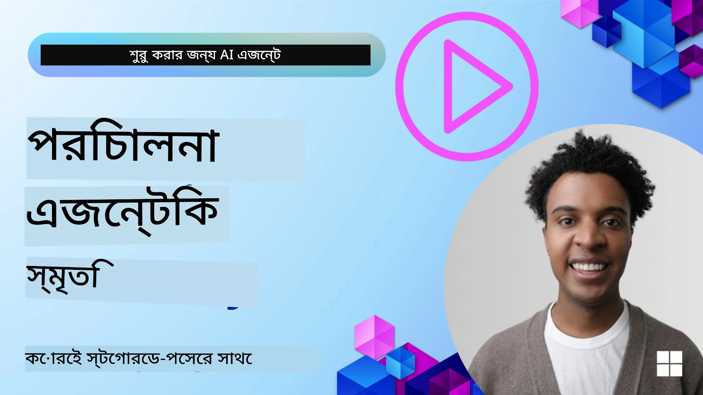

<!--
CO_OP_TRANSLATOR_METADATA:
{
  "original_hash": "a1d90991499ad697c4ad24decaf36968",
  "translation_date": "2025-12-09T12:06:26+00:00",
  "source_file": "13-agent-memory/README.md",
  "language_code": "bn"
}
-->
# এআই এজেন্টদের জন্য মেমোরি

এআই এজেন্ট তৈরি করার বিশেষ সুবিধাগুলি নিয়ে আলোচনা করতে গেলে দুটি বিষয় প্রধানত উঠে আসে: টুল ব্যবহার করে কাজ সম্পন্ন করার ক্ষমতা এবং সময়ের সাথে সাথে উন্নতি করার ক্ষমতা। মেমোরি হলো এমন একটি ভিত্তি যা স্ব-উন্নতিশীল এজেন্ট তৈরি করতে সাহায্য করে, যা আমাদের ব্যবহারকারীদের জন্য আরও ভালো অভিজ্ঞতা তৈরি করতে পারে।

এই পাঠে, আমরা দেখব এআই এজেন্টদের জন্য মেমোরি কী এবং কীভাবে এটি পরিচালনা ও আমাদের অ্যাপ্লিকেশনের জন্য ব্যবহার করা যায়।

## পরিচিতি

এই পাঠে আলোচনা করা হবে:

• **এআই এজেন্ট মেমোরি বোঝা**: মেমোরি কী এবং এটি এজেন্টদের জন্য কেন গুরুত্বপূর্ণ।

• **মেমোরি প্রয়োগ ও সংরক্ষণ**: আপনার এআই এজেন্টে মেমোরি যোগ করার বাস্তব পদ্ধতি, বিশেষত স্বল্পমেয়াদী ও দীর্ঘমেয়াদী মেমোরির উপর জোর দিয়ে।

• **এআই এজেন্টদের স্ব-উন্নতিশীল করা**: কীভাবে মেমোরি এজেন্টদের অতীতের ইন্টারঅ্যাকশন থেকে শিখতে এবং সময়ের সাথে উন্নতি করতে সাহায্য করে।

## উপলব্ধ প্রয়োগসমূহ

এই পাঠে দুটি বিস্তৃত নোটবুক টিউটোরিয়াল অন্তর্ভুক্ত রয়েছে:

• **[13-agent-memory.ipynb](./13-agent-memory.ipynb)**: মেমোরি প্রয়োগ করে Mem0 এবং Azure AI Search ব্যবহার করে Semantic Kernel ফ্রেমওয়ার্কের মাধ্যমে।

• **[13-agent-memory-cognee.ipynb](./13-agent-memory-cognee.ipynb)**: Cognee ব্যবহার করে কাঠামোগত মেমোরি প্রয়োগ করে, যা এমবেডিং দ্বারা সমর্থিত একটি নলেজ গ্রাফ স্বয়ংক্রিয়ভাবে তৈরি করে, গ্রাফ ভিজুয়ালাইজ করে এবং বুদ্ধিমান রিট্রিভাল সক্ষম করে।

## শেখার লক্ষ্য

এই পাঠ শেষ করার পর, আপনি জানতে পারবেন:

• **এআই এজেন্ট মেমোরির বিভিন্ন প্রকারের মধ্যে পার্থক্য করতে**, যেমন ওয়ার্কিং, স্বল্পমেয়াদী, দীর্ঘমেয়াদী মেমোরি এবং বিশেষায়িত ফর্ম যেমন পারসোনা ও এপিসোডিক মেমোরি।

• **এআই এজেন্টদের জন্য স্বল্পমেয়াদী ও দীর্ঘমেয়াদী মেমোরি প্রয়োগ ও পরিচালনা করতে**, Semantic Kernel ফ্রেমওয়ার্ক ব্যবহার করে, Mem0, Cognee, Whiteboard মেমোরি এবং Azure AI Search এর মতো টুল কাজে লাগিয়ে।

• **স্ব-উন্নতিশীল এআই এজেন্টদের পেছনের নীতিগুলি বুঝতে** এবং কীভাবে শক্তিশালী মেমোরি ম্যানেজমেন্ট সিস্টেম ধারাবাহিক শেখা ও অভিযোজনকে সহায়তা করে।

## এআই এজেন্ট মেমোরি বোঝা

মূলত, **এআই এজেন্টদের জন্য মেমোরি বলতে বোঝায় এমন প্রক্রিয়া যা তাদের তথ্য সংরক্ষণ ও পুনরুদ্ধার করতে সক্ষম করে**। এই তথ্য হতে পারে কথোপকথনের নির্দিষ্ট বিবরণ, ব্যবহারকারীর পছন্দ, অতীতের কাজ, বা এমনকি শেখা প্যাটার্ন।

মেমোরি ছাড়া, এআই অ্যাপ্লিকেশনগুলো সাধারণত স্টেটলেস হয়, অর্থাৎ প্রতিটি ইন্টারঅ্যাকশন নতুন করে শুরু হয়। এর ফলে একটি পুনরাবৃত্তিমূলক এবং হতাশাজনক ব্যবহারকারীর অভিজ্ঞতা তৈরি হয় যেখানে এজেন্ট পূর্ববর্তী প্রসঙ্গ বা পছন্দ "ভুলে যায়"।

### মেমোরি কেন গুরুত্বপূর্ণ?

একটি এজেন্টের বুদ্ধিমত্তা তার অতীতের তথ্য মনে রাখা এবং ব্যবহার করার ক্ষমতার সাথে গভীরভাবে সম্পর্কিত। মেমোরি এজেন্টদের হতে সাহায্য করে:

• **প্রতিফলিত**: অতীতের কাজ এবং ফলাফল থেকে শেখা।

• **ইন্টারঅ্যাকটিভ**: চলমান কথোপকথনের প্রসঙ্গ বজায় রাখা।

• **প্রোঅ্যাকটিভ এবং রিঅ্যাকটিভ**: ঐতিহাসিক তথ্যের ভিত্তিতে প্রয়োজন অনুমান করা বা সঠিকভাবে প্রতিক্রিয়া জানানো।

• **স্বায়ত্তশাসিত**: সংরক্ষিত জ্ঞান ব্যবহার করে আরও স্বাধীনভাবে কাজ করা।

মেমোরি প্রয়োগের লক্ষ্য হলো এজেন্টদের আরও **বিশ্বস্ত এবং সক্ষম** করে তোলা।

### মেমোরির প্রকারভেদ

#### ওয়ার্কিং মেমোরি

এটি এমন একটি স্ক্র্যাচ পেপারের মতো যা একটি এজেন্ট একটি একক চলমান কাজ বা চিন্তাপ্রক্রিয়ার সময় ব্যবহার করে। এটি তাৎক্ষণিক তথ্য ধারণ করে যা পরবর্তী ধাপ গণনা করতে প্রয়োজন।

এআই এজেন্টদের ক্ষেত্রে, ওয়ার্কিং মেমোরি সাধারণত কথোপকথনের সবচেয়ে প্রাসঙ্গিক তথ্য ধারণ করে, এমনকি যদি পুরো চ্যাট ইতিহাস দীর্ঘ বা সংক্ষিপ্ত হয়। এটি মূল উপাদান যেমন প্রয়োজনীয়তা, প্রস্তাবনা, সিদ্ধান্ত এবং কর্মগুলি বের করে আনে।

**ওয়ার্কিং মেমোরি উদাহরণ**

একটি ভ্রমণ বুকিং এজেন্টে, ওয়ার্কিং মেমোরি ব্যবহারকারীর বর্তমান অনুরোধ ধারণ করতে পারে, যেমন "আমি প্যারিসে একটি ট্রিপ বুক করতে চাই"। এই নির্দিষ্ট প্রয়োজনটি এজেন্টের তাৎক্ষণিক প্রসঙ্গে থাকে বর্তমান ইন্টারঅ্যাকশন পরিচালনার জন্য।

#### স্বল্পমেয়াদী মেমোরি

এই ধরনের মেমোরি একটি একক কথোপকথন বা সেশনের সময় তথ্য ধরে রাখে। এটি বর্তমান চ্যাটের প্রসঙ্গ, যা এজেন্টকে সংলাপের পূর্ববর্তী পালাগুলিতে ফিরে যেতে সক্ষম করে।

**স্বল্পমেয়াদী মেমোরি উদাহরণ**

যদি একজন ব্যবহারকারী জিজ্ঞাসা করেন, "প্যারিসে একটি ফ্লাইটের খরচ কত হবে?" এবং তারপর অনুসরণ করেন "সেখানে থাকার জায়গার কী অবস্থা?", স্বল্পমেয়াদী মেমোরি নিশ্চিত করে যে এজেন্ট জানে "সেখানে" মানে "প্যারিস" একই কথোপকথনের মধ্যে।

#### দীর্ঘমেয়াদী মেমোরি

এটি এমন তথ্য যা একাধিক কথোপকথন বা সেশনের মধ্যে টিকে থাকে। এটি এজেন্টকে ব্যবহারকারীর পছন্দ, ঐতিহাসিক ইন্টারঅ্যাকশন বা সাধারণ জ্ঞান দীর্ঘ সময় ধরে মনে রাখতে সাহায্য করে। এটি ব্যক্তিগতকরণের জন্য গুরুত্বপূর্ণ।

**দীর্ঘমেয়াদী মেমোরি উদাহরণ**

একটি দীর্ঘমেয়াদী মেমোরি হয়তো সংরক্ষণ করতে পারে যে "বেন স্কিইং এবং আউটডোর কার্যকলাপ পছন্দ করেন, মাউন্টেন ভিউ সহ কফি পছন্দ করেন এবং অতীতের আঘাতের কারণে উন্নত স্কি স্লোপ এড়িয়ে চলতে চান"। এই তথ্য, পূর্ববর্তী ইন্টারঅ্যাকশন থেকে শেখা, ভবিষ্যতের ভ্রমণ পরিকল্পনা সেশনে সুপারিশগুলিকে অত্যন্ত ব্যক্তিগতকৃত করে তোলে।

#### পারসোনা মেমোরি

এই বিশেষায়িত মেমোরি প্রকারটি একটি এজেন্টকে একটি ধারাবাহিক "ব্যক্তিত্ব" বা "পারসোনা" তৈরি করতে সাহায্য করে। এটি এজেন্টকে নিজের সম্পর্কে বা তার উদ্দেশ্য ভূমিকা সম্পর্কে বিস্তারিত মনে রাখতে সাহায্য করে, যা ইন্টারঅ্যাকশনকে আরও তরল এবং মনোযোগী করে তোলে।

**পারসোনা মেমোরি উদাহরণ**

যদি ভ্রমণ এজেন্টটি একটি "বিশেষজ্ঞ স্কি পরিকল্পনাকারী" হিসেবে ডিজাইন করা হয়, পারসোনা মেমোরি এই ভূমিকা জোরদার করতে পারে, যা তার প্রতিক্রিয়াগুলিকে একজন বিশেষজ্ঞের টোন এবং জ্ঞানের সাথে সামঞ্জস্যপূর্ণ করে তোলে।

#### ওয়ার্কফ্লো/এপিসোডিক মেমোরি

এই মেমোরি একটি জটিল কাজের সময় এজেন্ট যে ধাপগুলি নেয়, সেগুলির ক্রম সংরক্ষণ করে, যার মধ্যে সাফল্য এবং ব্যর্থতাগুলি অন্তর্ভুক্ত। এটি অতীতের নির্দিষ্ট "পর্ব" বা অভিজ্ঞতাগুলি মনে রাখার মতো।

**এপিসোডিক মেমোরি উদাহরণ**

যদি এজেন্ট একটি নির্দিষ্ট ফ্লাইট বুক করার চেষ্টা করে কিন্তু এটি অনুপলব্ধতার কারণে ব্যর্থ হয়, এপিসোডিক মেমোরি এই ব্যর্থতাটি রেকর্ড করতে পারে, যা এজেন্টকে বিকল্প ফ্লাইট চেষ্টা করতে বা পরবর্তী প্রচেষ্টায় ব্যবহারকারীকে আরও তথ্যপূর্ণভাবে সমস্যাটি জানাতে সাহায্য করে।

#### এন্টিটি মেমোরি

এটি কথোপকথন থেকে নির্দিষ্ট সত্তা (যেমন ব্যক্তি, স্থান বা বস্তু) এবং ঘটনাগুলি বের করে এবং মনে রাখার সাথে সম্পর্কিত। এটি এজেন্টকে আলোচিত মূল উপাদানগুলির একটি কাঠামোগত বোঝাপড়া তৈরি করতে সাহায্য করে।

**এন্টিটি মেমোরি উদাহরণ**

একটি অতীত ভ্রমণ সম্পর্কে কথোপকথন থেকে, এজেন্ট "প্যারিস," "আইফেল টাওয়ার," এবং "ল্য শা নোয়া রেস্টুরেন্টে ডিনার" এর মতো সত্তাগুলি বের করতে পারে। ভবিষ্যতের ইন্টারঅ্যাকশনে, এজেন্ট "ল্য শা নোয়া" মনে করতে পারে এবং সেখানে একটি নতুন রিজার্ভেশন করার প্রস্তাব দিতে পারে।

#### স্ট্রাকচার্ড RAG (রিট্রিভাল অগমেন্টেড জেনারেশন)

যদিও RAG একটি বিস্তৃত কৌশল, "স্ট্রাকচার্ড RAG" একটি শক্তিশালী মেমোরি প্রযুক্তি হিসেবে হাইলাইট করা হয়েছে। এটি বিভিন্ন উৎস (কথোপকথন, ইমেইল, ছবি) থেকে ঘন, কাঠামোগত তথ্য বের করে এবং প্রতিক্রিয়ার নির্ভুলতা, রিকল এবং গতি উন্নত করতে ব্যবহার করে। ক্লাসিক RAG যা শুধুমাত্র সেমান্টিক সাদৃশ্যের উপর নির্ভর করে, তার বিপরীতে স্ট্রাকচার্ড RAG তথ্যের অন্তর্নিহিত কাঠামোর সাথে কাজ করে।

**স্ট্রাকচার্ড RAG উদাহরণ**

শুধু কীওয়ার্ড মেলানোর পরিবর্তে, স্ট্রাকচার্ড RAG একটি ইমেইল থেকে ফ্লাইটের বিস্তারিত (গন্তব্য, তারিখ, সময়, এয়ারলাইন) বিশ্লেষণ করতে পারে এবং কাঠামোগতভাবে সংরক্ষণ করতে পারে। এটি সুনির্দিষ্ট প্রশ্নের উত্তর দিতে সক্ষম করে, যেমন "মঙ্গলবার আমি প্যারিসে কোন ফ্লাইট বুক করেছিলাম?" 

## মেমোরি প্রয়োগ ও সংরক্ষণ

এআই এজেন্টদের জন্য মেমোরি প্রয়োগ একটি **মেমোরি ম্যানেজমেন্ট** প্রক্রিয়া জড়িত, যা তথ্য তৈরি, সংরক্ষণ, পুনরুদ্ধার, একীভূত, আপডেট এবং এমনকি "ভুলে যাওয়া" (বা মুছে ফেলা) অন্তর্ভুক্ত করে। পুনরুদ্ধার একটি বিশেষভাবে গুরুত্বপূর্ণ দিক।

### বিশেষায়িত মেমোরি টুল

#### Mem0

এজেন্ট মেমোরি সংরক্ষণ এবং পরিচালনার একটি উপায় হলো Mem0 এর মতো বিশেষায়িত টুল ব্যবহার করা। Mem0 একটি স্থায়ী মেমোরি স্তর হিসেবে কাজ করে, যা এজেন্টকে প্রাসঙ্গিক ইন্টারঅ্যাকশন মনে রাখতে, ব্যবহারকারীর পছন্দ এবং বাস্তব প্রসঙ্গ সংরক্ষণ করতে এবং সময়ের সাথে সাফল্য ও ব্যর্থতা থেকে শিখতে সক্ষম করে।

---

<!-- CO-OP TRANSLATOR DISCLAIMER START -->
**অস্বীকৃতি**:  
এই নথিটি AI অনুবাদ পরিষেবা [Co-op Translator](https://github.com/Azure/co-op-translator) ব্যবহার করে অনুবাদ করা হয়েছে। আমরা যথাসাধ্য সঠিকতার জন্য চেষ্টা করি, তবে অনুগ্রহ করে মনে রাখবেন যে স্বয়ংক্রিয় অনুবাদে ত্রুটি বা অসঙ্গতি থাকতে পারে। মূল ভাষায় থাকা নথিটিকে প্রামাণিক উৎস হিসেবে বিবেচনা করা উচিত। গুরুত্বপূর্ণ তথ্যের জন্য, পেশাদার মানব অনুবাদ সুপারিশ করা হয়। এই অনুবাদ ব্যবহারের ফলে কোনো ভুল বোঝাবুঝি বা ভুল ব্যাখ্যা হলে আমরা দায়বদ্ধ থাকব না।
<!-- CO-OP TRANSLATOR DISCLAIMER END -->