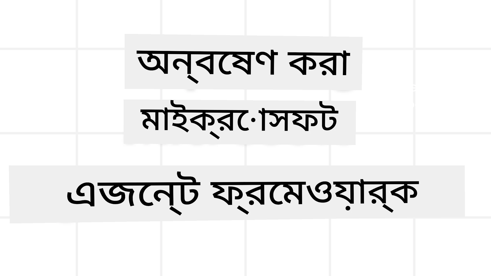
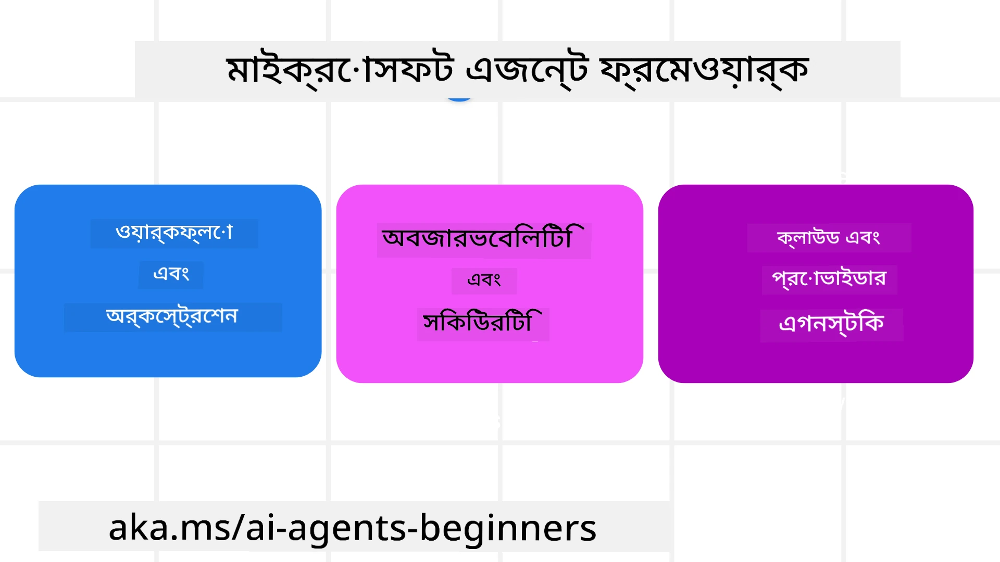
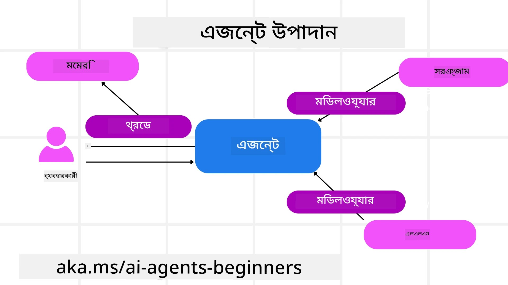

<!--
CO_OP_TRANSLATOR_METADATA:
{
  "original_hash": "19c4dab375acbc733855cc7f2f04edbc",
  "translation_date": "2025-10-02T14:03:00+00:00",
  "source_file": "14-microsoft-agent-framework/README.md",
  "language_code": "bn"
}
-->
# মাইক্রোসফট এজেন্ট ফ্রেমওয়ার্ক অন্বেষণ



### পরিচিতি

এই পাঠে আলোচনা করা হবে:

- মাইক্রোসফট এজেন্ট ফ্রেমওয়ার্ক বোঝা: মূল বৈশিষ্ট্য এবং মূল্য  
- মাইক্রোসফট এজেন্ট ফ্রেমওয়ার্কের মূল ধারণাগুলি অন্বেষণ করা  
- MAF এবং Semantic Kernel ও AutoGen এর তুলনা: মাইগ্রেশন গাইড  

## শেখার লক্ষ্য

এই পাঠ শেষ করার পরে, আপনি জানতে পারবেন:

- মাইক্রোসফট এজেন্ট ফ্রেমওয়ার্ক ব্যবহার করে প্রোডাকশন রেডি AI এজেন্ট তৈরি করা  
- আপনার এজেন্টিক ব্যবহারের ক্ষেত্রে মাইক্রোসফট এজেন্ট ফ্রেমওয়ার্কের মূল বৈশিষ্ট্য প্রয়োগ করা  
- বিদ্যমান এজেন্টিক ফ্রেমওয়ার্ক এবং টুলগুলিকে মাইগ্রেট এবং ইন্টিগ্রেট করা  

## কোড নমুনা

[মাইক্রোসফট এজেন্ট ফ্রেমওয়ার্ক (MAF)](https://aka.ms/ai-agents-beginners/agent-framewrok) এর কোড নমুনাগুলি এই রিপোজিটরিতে `xx-python-agent-framework` এবং `xx-dotnet-agent-framework` ফাইলগুলির মধ্যে পাওয়া যাবে।

## মাইক্রোসফট এজেন্ট ফ্রেমওয়ার্ক বোঝা



[মাইক্রোসফট এজেন্ট ফ্রেমওয়ার্ক (MAF)](https://aka.ms/ai-agents-beginners/agent-framewrok) Semantic Kernel এবং AutoGen থেকে প্রাপ্ত অভিজ্ঞতা এবং শিক্ষা ভিত্তিক। এটি প্রোডাকশন এবং গবেষণা পরিবেশে দেখা বিভিন্ন এজেন্টিক ব্যবহারের ক্ষেত্রে নমনীয়তা প্রদান করে, যার মধ্যে রয়েছে:

- **Sequential Agent orchestration** এমন পরিস্থিতিতে যেখানে ধাপে ধাপে কাজের প্রবাহ প্রয়োজন।
- **Concurrent orchestration** এমন পরিস্থিতিতে যেখানে এজেন্টদের একই সময়ে কাজ সম্পন্ন করতে হয়।
- **Group chat orchestration** এমন পরিস্থিতিতে যেখানে এজেন্টরা একসাথে একটি কাজের উপর সহযোগিতা করতে পারে।
- **Handoff Orchestration** এমন পরিস্থিতিতে যেখানে এজেন্টরা একে অপরের কাছে কাজ হস্তান্তর করে যখন উপ-কাজগুলি সম্পন্ন হয়।
- **Magnetic Orchestration** এমন পরিস্থিতিতে যেখানে একটি ম্যানেজার এজেন্ট কাজের তালিকা তৈরি এবং সংশোধন করে এবং উপ-এজেন্টদের সমন্বয় করে কাজ সম্পন্ন করে।

প্রোডাকশনে AI এজেন্ট সরবরাহ করার জন্য, MAF অন্তর্ভুক্ত করেছে:

- **Observability** OpenTelemetry ব্যবহার করে যেখানে AI এজেন্টের প্রতিটি ক্রিয়া, যেমন টুল আহ্বান, অর্কেস্ট্রেশন ধাপ, যুক্তি প্রবাহ এবং Azure AI Foundry ড্যাশবোর্ডের মাধ্যমে কর্মক্ষমতা পর্যবেক্ষণ।
- **Security** Azure AI Foundry-তে এজেন্টদের নেটিভভাবে হোস্ট করে যা রোল-ভিত্তিক অ্যাক্সেস, ব্যক্তিগত ডেটা পরিচালনা এবং বিল্ট-ইন কন্টেন্ট সেফটির মতো নিরাপত্তা নিয়ন্ত্রণ অন্তর্ভুক্ত করে।
- **Durability** এজেন্ট থ্রেড এবং ওয়ার্কফ্লোগুলি বিরতি, পুনরায় শুরু এবং ত্রুটি থেকে পুনরুদ্ধার করতে পারে যা দীর্ঘমেয়াদী প্রক্রিয়াকে সক্ষম করে।
- **Control** যেখানে মানব-ইন-দ্য-লুপ ওয়ার্কফ্লো সমর্থিত হয় যেখানে কাজগুলি মানব অনুমোদনের প্রয়োজন হিসাবে চিহ্নিত করা হয়।

মাইক্রোসফট এজেন্ট ফ্রেমওয়ার্ক আন্তঃপরিচালনযোগ্য হওয়ার উপরও মনোযোগ কেন্দ্রীভূত করেছে:

- **Being Cloud-agnostic** - এজেন্টগুলি কন্টেইনারে, অন-প্রিম এবং বিভিন্ন ক্লাউডে চালানো যেতে পারে।
- **Being Provider-agnostic** - এজেন্টগুলি আপনার পছন্দের SDK ব্যবহার করে তৈরি করা যেতে পারে, যেমন Azure OpenAI এবং OpenAI।
- **Integrating Open Standards** - এজেন্টগুলি Agent-to-Agent (A2A) এবং Model Context Protocol (MCP) এর মতো প্রোটোকল ব্যবহার করে অন্যান্য এজেন্ট এবং টুল আবিষ্কার এবং ব্যবহার করতে পারে।
- **Plugins and Connectors** - Microsoft Fabric, SharePoint, Pinecone এবং Qdrant-এর মতো ডেটা এবং মেমরি পরিষেবাগুলির সাথে সংযোগ স্থাপন করা যেতে পারে।

এখন আমরা মাইক্রোসফট এজেন্ট ফ্রেমওয়ার্কের কিছু মূল ধারণাগুলিতে এই বৈশিষ্ট্যগুলি কীভাবে প্রয়োগ করা হয় তা দেখব।

## মাইক্রোসফট এজেন্ট ফ্রেমওয়ার্কের মূল ধারণা

### এজেন্ট



**এজেন্ট তৈরি করা**

এজেন্ট তৈরি করা হয় ইনফারেন্স সার্ভিস (LLM Provider), AI এজেন্টের জন্য অনুসরণ করার নির্দেশাবলী এবং একটি নির্ধারিত `name` সংজ্ঞায়িত করে:

```python
agent = AzureOpenAIChatClient(credential=AzureCliCredential()).create_agent( instructions="You are good at recommending trips to customers based on their preferences.", name="TripRecommender" )
```

উপরের উদাহরণটি `Azure OpenAI` ব্যবহার করছে, তবে এজেন্টগুলি বিভিন্ন পরিষেবা ব্যবহার করে তৈরি করা যেতে পারে, যার মধ্যে রয়েছে `Azure AI Foundry Agent Service`:

```python
AzureAIAgentClient(async_credential=credential).create_agent( name="HelperAgent", instructions="You are a helpful assistant." ) as agent
```

OpenAI `Responses`, `ChatCompletion` APIs

```python
agent = OpenAIResponsesClient().create_agent( name="WeatherBot", instructions="You are a helpful weather assistant.", )
```

```python
agent = OpenAIChatClient().create_agent( name="HelpfulAssistant", instructions="You are a helpful assistant.", )
```

বা A2A প্রোটোকল ব্যবহার করে রিমোট এজেন্ট:

```python
agent = A2AAgent( name=agent_card.name, description=agent_card.description, agent_card=agent_card, url="https://your-a2a-agent-host" )
```

**এজেন্ট চালানো**

এজেন্টগুলি `.run` বা `.run_stream` পদ্ধতি ব্যবহার করে চালানো হয়, যা নন-স্ট্রিমিং বা স্ট্রিমিং প্রতিক্রিয়ার জন্য ব্যবহৃত হয়।

```python
result = await agent.run("What are good places to visit in Amsterdam?")
print(result.text)
```

```python
async for update in agent.run_stream("What are the good places to visit in Amsterdam?"):
    if update.text:
        print(update.text, end="", flush=True)

```

প্রতিটি এজেন্ট রানেও `max_tokens`, এজেন্টের দ্বারা আহ্বান করা টুল, এমনকি এজেন্টের জন্য ব্যবহৃত `model` এর মতো প্যারামিটার কাস্টমাইজ করার বিকল্প থাকতে পারে।

এটি এমন ক্ষেত্রে কার্যকর যেখানে ব্যবহারকারীর কাজ সম্পন্ন করার জন্য নির্দিষ্ট মডেল বা টুল প্রয়োজন।

**টুল**

টুলগুলি এজেন্ট সংজ্ঞায়িত করার সময় সংজ্ঞায়িত করা যেতে পারে:

```python
def get_attractions( location: Annotated[str, Field(description="The location to get the top tourist attractions for")], ) -> str: """Get the top tourist attractions for a given location.""" return f"The top attractions for {location} are." 


# When creating a ChatAgent directly 

agent = ChatAgent( chat_client=OpenAIChatClient(), instructions="You are a helpful assistant", tools=[get_attractions]

```

এবং এজেন্ট চালানোর সময়ও:

```python

result1 = await agent.run( "What's the best place to visit in Seattle?", tools=[get_attractions] # Tool provided for this run only )
```

**এজেন্ট থ্রেড**

এজেন্ট থ্রেডগুলি বহু-টার্ন কথোপকথন পরিচালনা করতে ব্যবহৃত হয়। থ্রেডগুলি তৈরি করা যেতে পারে:

- `get_new_thread()` ব্যবহার করে যা থ্রেডকে সময়ের সাথে সংরক্ষণ করতে সক্ষম করে
- একটি এজেন্ট চালানোর সময় স্বয়ংক্রিয়ভাবে একটি থ্রেড তৈরি করে এবং শুধুমাত্র বর্তমান রান চলাকালীন থ্রেডটি স্থায়ী হয়।

থ্রেড তৈরি করতে কোডটি দেখতে এরকম:

```python
# Create a new thread. 
thread = agent.get_new_thread() # Run the agent with the thread. 
response = await agent.run("Hello, I am here to help you book travel. Where would you like to go?", thread=thread)

```

আপনি পরে ব্যবহারের জন্য থ্রেড সংরক্ষণ করতে এটি সিরিয়ালাইজ করতে পারেন:

```python
# Create a new thread. 
thread = agent.get_new_thread() 

# Run the agent with the thread. 

response = await agent.run("Hello, how are you?", thread=thread) 

# Serialize the thread for storage. 

serialized_thread = await thread.serialize() 

# Deserialize the thread state after loading from storage. 

resumed_thread = await agent.deserialize_thread(serialized_thread)
```

**এজেন্ট মিডলওয়্যার**

এজেন্টরা টুল এবং LLM-এর সাথে ইন্টারঅ্যাক্ট করে ব্যবহারকারীর কাজ সম্পন্ন করতে। কিছু পরিস্থিতিতে, আমরা এই ইন্টারঅ্যাকশনগুলির মধ্যে কিছু কার্য সম্পাদন বা ট্র্যাক করতে চাই। এজেন্ট মিডলওয়্যার আমাদের এটি করতে সক্ষম করে:

*Function Middleware*

এই মিডলওয়্যারটি এজেন্ট এবং এটি যে ফাংশন/টুল কল করবে তার মধ্যে একটি ক্রিয়া সম্পাদন করতে দেয়। উদাহরণস্বরূপ, আপনি ফাংশন কলের উপর কিছু লগিং করতে চাইতে পারেন।

নিচের কোডে `next` সংজ্ঞায়িত করে যে পরবর্তী মিডলওয়্যার বা প্রকৃত ফাংশনটি কল করা উচিত কিনা।

```python
async def logging_function_middleware(
    context: FunctionInvocationContext,
    next: Callable[[FunctionInvocationContext], Awaitable[None]],
) -> None:
    """Function middleware that logs function execution."""
    # Pre-processing: Log before function execution
    print(f"[Function] Calling {context.function.name}")

    # Continue to next middleware or function execution
    await next(context)

    # Post-processing: Log after function execution
    print(f"[Function] {context.function.name} completed")
```

*Chat Middleware*

এই মিডলওয়্যারটি এজেন্ট এবং LLM-এর মধ্যে অনুরোধগুলির মধ্যে একটি ক্রিয়া সম্পাদন বা লগ করতে দেয়।

এটি গুরুত্বপূর্ণ তথ্য ধারণ করে যেমন `messages` যা AI পরিষেবাতে পাঠানো হচ্ছে।

```python
async def logging_chat_middleware(
    context: ChatContext,
    next: Callable[[ChatContext], Awaitable[None]],
) -> None:
    """Chat middleware that logs AI interactions."""
    # Pre-processing: Log before AI call
    print(f"[Chat] Sending {len(context.messages)} messages to AI")

    # Continue to next middleware or AI service
    await next(context)

    # Post-processing: Log after AI response
    print("[Chat] AI response received")

```

**এজেন্ট মেমরি**

`Agentic Memory` পাঠে আলোচনা করা হয়েছে, মেমরি এজেন্টকে বিভিন্ন প্রসঙ্গে কাজ করতে সক্ষম করার একটি গুরুত্বপূর্ণ উপাদান। MAF বিভিন্ন ধরনের মেমরি প্রদান করে:

*In-Memory Storage*

এটি অ্যাপ্লিকেশন রানটাইমের সময় থ্রেডে সংরক্ষিত মেমরি।

```python
# Create a new thread. 
thread = agent.get_new_thread() # Run the agent with the thread. 
response = await agent.run("Hello, I am here to help you book travel. Where would you like to go?", thread=thread)
```

*Persistent Messages*

এই মেমরি বিভিন্ন সেশনের মধ্যে কথোপকথনের ইতিহাস সংরক্ষণ করতে ব্যবহৃত হয়। এটি `chat_message_store_factory` ব্যবহার করে সংজ্ঞায়িত করা হয়:

```python
from agent_framework import ChatMessageStore

# Create a custom message store
def create_message_store():
    return ChatMessageStore()

agent = ChatAgent(
    chat_client=OpenAIChatClient(),
    instructions="You are a Travel assistant.",
    chat_message_store_factory=create_message_store
)

```

*Dynamic Memory*

এই মেমরি এজেন্ট চালানোর আগে প্রসঙ্গে যোগ করা হয়। এই মেমরি mem0-এর মতো বাহ্যিক পরিষেবাগুলিতে সংরক্ষণ করা যেতে পারে:

```python
from agent_framework.mem0 import Mem0Provider

# Using Mem0 for advanced memory capabilities
memory_provider = Mem0Provider(
    api_key="your-mem0-api-key",
    user_id="user_123",
    application_id="my_app"
)

agent = ChatAgent(
    chat_client=OpenAIChatClient(),
    instructions="You are a helpful assistant with memory.",
    context_providers=memory_provider
)

```

**এজেন্ট পর্যবেক্ষণযোগ্যতা**

পর্যবেক্ষণযোগ্যতা নির্ভরযোগ্য এবং রক্ষণাবেক্ষণযোগ্য এজেন্টিক সিস্টেম তৈরি করতে গুরুত্বপূর্ণ। MAF OpenTelemetry-এর সাথে ইন্টিগ্রেট করে ট্রেসিং এবং মিটার প্রদান করে আরও ভালো পর্যবেক্ষণযোগ্যতার জন্য।

```python
from agent_framework.observability import get_tracer, get_meter

tracer = get_tracer()
meter = get_meter()
with tracer.start_as_current_span("my_custom_span"):
    # do something
    pass
counter = meter.create_counter("my_custom_counter")
counter.add(1, {"key": "value"})
```

### ওয়ার্কফ্লো

MAF এমন ওয়ার্কফ্লো প্রদান করে যা একটি কাজ সম্পন্ন করার জন্য পূর্ব-সংজ্ঞায়িত ধাপ এবং সেই ধাপগুলিতে উপাদান হিসাবে AI এজেন্ট অন্তর্ভুক্ত করে।

ওয়ার্কফ্লো বিভিন্ন উপাদান নিয়ে গঠিত যা আরও ভালো নিয়ন্ত্রণ প্রবাহ সক্ষম করে। ওয়ার্কফ্লো **মাল্টি-এজেন্ট অর্কেস্ট্রেশন** এবং **চেকপয়েন্টিং** সক্ষম করে যা ওয়ার্কফ্লো স্টেট সংরক্ষণ করে।

ওয়ার্কফ্লোর মূল উপাদানগুলি হল:

**Executors**

Executors ইনপুট বার্তা গ্রহণ করে, তাদের নির্ধারিত কাজ সম্পাদন করে এবং তারপর একটি আউটপুট বার্তা তৈরি করে। এটি বৃহত্তর কাজ সম্পন্ন করার দিকে ওয়ার্কফ্লোকে এগিয়ে নিয়ে যায়। Executors AI এজেন্ট বা কাস্টম লজিক হতে পারে।

**Edges**

Edges ওয়ার্কফ্লোতে বার্তার প্রবাহ সংজ্ঞায়িত করতে ব্যবহৃত হয়। এগুলি হতে পারে:

*Direct Edges* - Executors-এর মধ্যে সরল এক-টু-এক সংযোগ:

```python
from agent_framework import WorkflowBuilder

builder = WorkflowBuilder()
builder.add_edge(source_executor, target_executor)
builder.set_start_executor(source_executor)
workflow = builder.build()
```

*Conditional Edges* - নির্দিষ্ট শর্ত পূরণের পরে সক্রিয় হয়। উদাহরণস্বরূপ, যখন হোটেলের রুম পাওয়া যায় না, তখন একটি Executor অন্যান্য বিকল্পগুলি প্রস্তাব করতে পারে।

*Switch-case Edges* - সংজ্ঞায়িত শর্তের উপর ভিত্তি করে বার্তাগুলি বিভিন্ন Executors-এ রুট করে। উদাহরণস্বরূপ, যদি ভ্রমণ গ্রাহকের অগ্রাধিকার অ্যাক্সেস থাকে এবং তাদের কাজগুলি অন্য একটি ওয়ার্কফ্লো দ্বারা পরিচালিত হবে।

*Fan-out Edges* - এক বার্তা একাধিক টার্গেটে পাঠান।

*Fan-in Edges* - বিভিন্ন Executors থেকে একাধিক বার্তা সংগ্রহ করুন এবং এক টার্গেটে পাঠান।

**Events**

ওয়ার্কফ্লোতে আরও ভালো পর্যবেক্ষণযোগ্যতা প্রদান করতে, MAF কার্যকর করার জন্য বিল্ট-ইন ইভেন্ট প্রদান করে, যার মধ্যে রয়েছে:

- `WorkflowStartedEvent`  - ওয়ার্কফ্লো কার্যকর শুরু হয়
- `WorkflowOutputEvent` - ওয়ার্কফ্লো একটি আউটপুট তৈরি করে
- `WorkflowErrorEvent` - ওয়ার্কফ্লো একটি ত্রুটির সম্মুখীন হয়
- `ExecutorInvokeEvent`  - Executor প্রক্রিয়াকরণ শুরু করে
- `ExecutorCompleteEvent`  -  Executor প্রক্রিয়াকরণ শেষ করে
- `RequestInfoEvent` - একটি অনুরোধ জারি করা হয়

## অন্যান্য ফ্রেমওয়ার্ক থেকে মাইগ্রেট করা (Semantic Kernel এবং AutoGen)

### MAF এবং Semantic Kernel এর মধ্যে পার্থক্য

**সরল এজেন্ট তৈরি**

Semantic Kernel প্রতিটি এজেন্টের জন্য একটি Kernel instance তৈরি করার উপর নির্ভর করে। MAF একটি সরল পদ্ধতি ব্যবহার করে প্রধান প্রদানকারীদের জন্য এক্সটেনশন ব্যবহার করে।

```python
agent = AzureOpenAIChatClient(credential=AzureCliCredential()).create_agent( instructions="You are good at reccomending trips to customers based on their preferences.", name="TripRecommender" )
```

**এজেন্ট থ্রেড তৈরি**

Semantic Kernel-এ থ্রেডগুলি ম্যানুয়ালি তৈরি করতে হয়। MAF-এ, এজেন্ট সরাসরি একটি থ্রেড বরাদ্দ করা হয়।

```python
thread = agent.get_new_thread() # Run the agent with the thread. 
```

**টুল নিবন্ধন**

Semantic Kernel-এ, টুলগুলি Kernel-এ নিবন্ধিত হয় এবং তারপর Kernel এজেন্টে পাস করা হয়। MAF-এ, টুলগুলি সরাসরি এজেন্ট তৈরি করার সময় নিবন্ধিত হয়।

```python
agent = ChatAgent( chat_client=OpenAIChatClient(), instructions="You are a helpful assistant", tools=[get_attractions]
```

### MAF এবং AutoGen এর মধ্যে পার্থক্য

**Teams বনাম Workflows**

AutoGen-এ এজেন্টদের ইভেন্ট চালিত কার্যকলাপের জন্য `Teams` ইভেন্ট স্ট্রাকচার। MAF `Workflows` ব্যবহার করে যা গ্রাফ ভিত্তিক আর্কিটেকচারের মাধ্যমে ডেটা Executors-এ রুট করে।

**টুল তৈরি**

AutoGen এজেন্টদের কল করার জন্য ফাংশন মোড়ানোর জন্য `FunctionTool` ব্যবহার করে। MAF @ai_function ব্যবহার করে যা অনুরূপভাবে কাজ করে তবে প্রতিটি ফাংশনের জন্য স্কিমা স্বয়ংক্রিয়ভাবে অনুমান করে।

**এজেন্ট আচরণ**

AutoGen-এ এজেন্টগুলি ডিফল্টরূপে এক-টার্ন এজেন্ট, যদি না `max_tool_iterations` উচ্চতর কিছুতে সেট করা হয়। MAF-এ `ChatAgent` ডিফল্টরূপে মাল্টি-টার্ন, অর্থাৎ এটি ব্যবহারকারীর কাজ সম্পন্ন না হওয়া পর্যন্ত টুল কল করতে থাকবে।

## কোড নমুনা

মাইক্রোসফট এজেন্ট ফ্রেমওয়ার্কের কোড নমুনাগুলি এই রিপোজিটরিতে `xx-python-agent-framework` এবং `xx-dotnet-agent-framework` ফাইলগুলির মধ্যে পাওয়া যাবে।

## মাইক্রোসফট এজেন্ট ফ্রেমওয়ার্ক সম্পর্কে আরও প্রশ্ন আছে?

[Azure AI Foundry Discord](https://aka.ms/ai-agents/discord) এ যোগ দিন, অন্যান্য শিক্ষার্থীদের সাথে দেখা করুন, অফিস আওয়ার্সে অংশগ্রহণ করুন এবং আপনার AI এজেন্ট সম্পর্কিত প্রশ্নের উত্তর পান।

---

**অস্বীকৃতি**:  
এই নথিটি AI অনুবাদ পরিষেবা [Co-op Translator](https://github.com/Azure/co-op-translator) ব্যবহার করে অনুবাদ করা হয়েছে। আমরা যথাসাধ্য সঠিকতার জন্য চেষ্টা করি, তবে অনুগ্রহ করে মনে রাখবেন যে স্বয়ংক্রিয় অনুবাদে ত্রুটি বা অসঙ্গতি থাকতে পারে। মূল ভাষায় থাকা নথিটিকে প্রামাণিক উৎস হিসেবে বিবেচনা করা উচিত। গুরুত্বপূর্ণ তথ্যের জন্য, পেশাদার মানব অনুবাদ সুপারিশ করা হয়। এই অনুবাদ ব্যবহারের ফলে কোনো ভুল বোঝাবুঝি বা ভুল ব্যাখ্যা হলে আমরা দায়বদ্ধ থাকব না।